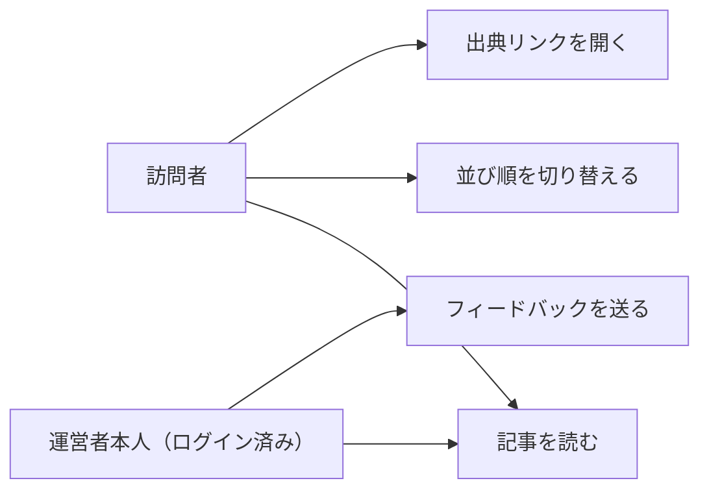

# 要件定義: 記事詳細ページ

> ステータス: 仕様確認中(未実装)

## サマリ
その回の未来予測記事(最大20本)を表示する。各記事には、ジャンル・時間軸・影響度(大・中・小)のバッジ、要約、影響度の根拠、出典リンクを付ける。並び順は「影響度順」と「ジャンル順」(ジャンル1の近未来→ジャンル1の長期未来→ジャンル2の近未来…)を読者が切り替えられる。ログイン中の運営者本人は、記事ごとにフィードバックを残せる。

## 概要
- 機能名: 記事詳細ページ
- 目的: その回の未来予測記事を、影響の大きさが分かる形で表示する。運営者が選定基準を振り返るためのフィードバックも、その場で残せるようにする
- 優先度: 高

## ユーザーストーリー
- 訪問者として、影響の大きい予測から順に読みたい
- 訪問者として、ジャンルごとにまとめて、時間軸の近い順に読むこともしたい
- 訪問者として、気になった予測の元記事を出典リンクから読みたい
- 運営者本人として、ログインした状態で記事を読みながら、選定への意見をその場で残し、あとで基準の見直しに使いたい

## ユースケース図

上記は俯瞰用の図。正となる文章は下記「機能要件」「ビジネスルール・制約」。

## 機能要件

### 記事本文の表示
- [1] その回の記事タイトル・公開日・その回の時間軸2区分を表示する
- [2] その回に採用された記事(最大20本)を、それぞれジャンル・時間軸・影響度のバッジ、見出し、本文、影響度の根拠、出典(情報源名・元URLへのリンク)とセットで表示する
- [3] 候補が見つからなかった枠は、ジャンル・時間軸のバッジとあわせて「候補が見つかりませんでした」と表示する([content-selection/requirements.md#候補が見つからない枠](../content-selection/requirements.md))。影響度順ではこの枠を末尾に、ジャンル順では本来の位置に並べる

### 並び順の切り替え
- [4] 並び順を「影響度順」と「ジャンル順」の2通りから切り替えられるようにする(根拠: /requirementでの決定)
- [5] 影響度順: 影響度の大きい順(大→中→小)に並べる。同じ影響度の中では、下記[6]のジャンル順に並べる
- [6] ジャンル順: [content-selection/requirements.md#ジャンル](../content-selection/requirements.md)の順にジャンルを並べ、同じジャンルの中では時間軸の近い順に並べる(例: ジャンル1の近未来→ジャンル1の長期未来→ジャンル2の近未来→…)
- [7] ページを開いたときの並び順は影響度順とする(根拠: 「影響の大きいものから」読めるようにするという/requirementでの要望に合わせるため)

### 運営者向けフィードバック
- [8] 各記事の下に、フィードバック入力欄(自由記述)を表示する。入力欄は、運営者本人がGoogle OIDCでログインしている場合だけ表示する
- [9] 送信すると、対象の記事(回のID・記事の識別子)と入力内容を紐づけてデータベースに保存し、保存できたことが分かる表示にする
- [10] 入力欄が空、または空白文字だけの場合は送信できない

## ビジネスルール・制約

### 表示分量・著作権への配慮
- [1] 各記事の本文は200〜400字程度とし、元記事の全文は転記しない。出典は必ず表示する([content-generation/requirements.md#著作権への配慮](../content-generation/requirements.md))

### フィードバックの保存・権限
- [2] フィードバックの保存は、trend-digestと同じINSERT専用の最小権限パターン([docs/adr/0001-user-input-database.md](../../../docs/adr/0001-user-input-database.md)、`authenticated`ロール)をとる
- [3] 入力欄の表示・非表示は、既存の運営者判定(`admin_emails`許可リスト、[ADR-0006](../../../docs/adr/0006-admin-screen-oidc-rls.md)、`app/lib/adminAuth.ts`のisAuthorizedAdmin())で出し分ける
- [4] 保存されたフィードバックは、公開画面のどこにも表示しない

## 依存関係
- 表示する記事は[content-selection/requirements.md](../content-selection/requirements.md)で選ばれ、[content-generation/requirements.md](../content-generation/requirements.md)のルールで書かれる
- 読者の付箋は[bookmark/requirements.md](../bookmark/requirements.md)で定める
- フィードバックは[source-review/requirements.md](../source-review/requirements.md)の月次見直しで使われる

## スコープ外
- フィードバックへの返信・公開表示、訪問者向けのコメント欄
- フィードバックの一覧・検索画面(運営者はデータベースを直接確認する)
- 影響度順・ジャンル順以外の並び順、ジャンルや時間軸での絞り込み
