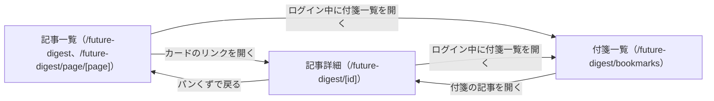

# 設計: 記事一覧ページ

## サマリ
公開済みの回を発行日の新しい順に日付リストで表示し、1ページ20件でページ分けする。各回には公開日・その回の時間軸2区分・見出し最大3件・詳細ページへのリンクを出す。見出しは、その回の予測を影響度順(同じ影響度はジャンル順→時間軸の近い順)に並べた先頭3件とする(「大」が3件以上あれば「大」だけ、「大」が少なければ「中」「小」で補う)。UIはStep0を簡易実施する(trend-digestの一覧のレイアウトを流用し、アクセントカラーのみインディゴ系)。

主要な設計判断:
- 一覧用の見出しは記事データの見出しをそのまま使い、別の要約を作らない(requirements.md#ビジネスルール・制約-1)
- 見出しの並べ方は記事詳細ページの影響度順([article-detail/design.md](../article-detail/design.md)の`sortSlots`)と同じ規則を使い、詳細ページを開いたときの先頭と一致させる
- 図: 「画面遷移図」

## 処理フロー

### 記事一覧をページ分けする処理
- 対象: 全記事(発行日の新しい順)
- 手順:
  1. 全記事を20件ずつに区切り、指定ページの範囲を取り出す(requirements.md#ビジネスルール・制約-2)
  2. 総ページ数(総記事数を20で割って切り上げ)を求める
  3. 記事が1件もない場合は、空の一覧として「まだ記事がありません」の表示に進む(requirements.md#一覧表示-5)
- 関連するビジネスルール: requirements.md#一覧表示-1・5、requirements.md#ビジネスルール・制約-2

### 各回に載せる見出しを選ぶ処理
- 対象: 1回分の記事の予測
- 手順:
  1. 予測を影響度の大きい順に並べ、同じ影響度の中ではジャンル順→時間軸の近い順に並べる(掲載できなかった枠は対象外)
  2. 先頭から最大3件の見出しを選ぶ。「大」が3件以上ある回は「大」の見出しだけが選ばれ、「大」が3件未満の回は「中」「小」の見出しで補われる(requirements.md#一覧表示-3)
  3. 性・恋愛ジャンルの予測も他のジャンルと同じ扱いで選ぶ(requirements.md#一覧表示-4)
  4. 各見出しには影響度(大・中・小)を添えて表示する(「大」以外で補った見出しであることが読者に分かるようにするため)
- 関連するビジネスルール: requirements.md#一覧表示-2〜4、requirements.md#ビジネスルール・制約-1

## エラーハンドリング

- 存在しないページ番号は静的エクスポートで生成されないパスのため、Cloudflare Workers側の404ページに委ねる
- 記事データのスキーマ違反で`getAllArticles()`が例外を投げた場合は、一覧ページのビルドも失敗させる(壊れた記事のまま一覧だけ正常に見える状態を作らない。article-detailと同じ方針)

## 関連するファイル(抜粋)

```
app/future-digest/page.tsx (新規: 一覧1ページ目)
app/future-digest/page/[page]/page.tsx (新規: 2ページ目以降。generateStaticParamsで総ページ数分を列挙)
app/future-digest/layout.tsx (新規: title/description、共通ヘッダー)
app/future-digest/lib/pagination.ts (新規: paginate(articles, page, pageSize = 20))
app/future-digest/lib/selectCardHeadings.ts (新規: 各回に載せる見出し最大3件を選ぶ)
app/future-digest/components/ArticleListView.tsx (新規: 一覧本体。0件時の表示を含む)
app/future-digest/components/ArticleCard.tsx (新規: 1回分のカード)
app/future-digest/components/Pagination.tsx (新規)
app/future-digest/lib/articles.ts (article-detailで新規: getAllArticlesを利用)
app/future-digest/lib/articleTitle.ts (content-generationで新規: buildArticleTitleを利用)
app/future-digest/icon.svg (新規: ファビコン)
app/future-digest/styleguide/page.tsx・styleguide.png (新規: 共通部品の一覧)
app/page.tsx (既存: トップページにツールカードを追加)
app/sitemap.ts (既存: 一覧・詳細・2ページ目以降を追加)
specs/hub-site/requirements.md (既存: メタ情報・ファビコン・sitemap除外の対象に本アプリを追記)
```

## 画面設計

Step0: 簡易実施。trend-digestの一覧ページ(`app/trend-digest/page.tsx`)の配色・レイアウトを流用し、アクセントカラーをインディゴ系にする(article-detailと共通)。最終的な見た目の確認は実装後のlocalhostでの画面レビューで行う。

- 見出し「週刊未来予測」と短い紹介文(requirements.md#メタ情報-6のdescriptionと同じ趣旨)
- 日付リスト(新しい順、1ページ20件)。各行: 公開日・記事タイトル・その回の時間軸2区分のバッジ・見出し最大3件(それぞれ影響度のバッジつき)・詳細ページへのリンク
- 記事が0件の場合:「まだ記事がありません。最初の号は木曜の朝に公開されます。」の案内だけを表示する
- ページ下部にページ送り(前へ/次へ・現在ページ/総ページ数)。1ページだけの場合は表示しない
- ページ下部にログイン状態表示(article-detailと共通の`LoginStatus`。付箋一覧への導線)

### 画面遷移図

上記は俯瞰用の図。正は上記の「画面設計」と[article-detail/design.md](../article-detail/design.md#画面設計)・[bookmark/design.md](../bookmark/design.md#画面設計)の箇条書き。

## コンポーネント設計

| コンポーネント | Props | 役割 |
|---|---|---|
| ArticleListView | `articles: Article[]`, `currentPage: number`, `totalPages: number` | 一覧本体。0件のときは案内文だけを出す |
| ArticleCard | `article: Article` | 1回分の行(日付・タイトル・時間軸・見出し最大3件・リンク) |
| Pagination | `currentPage: number`, `totalPages: number` | 前へ/次へ・現在ページ。`totalPages <= 1`なら何も描画しない |

## セキュリティ

[article-detail/design.md](../article-detail/design.md#セキュリティ)と同じ前提(記事データはリポジトリにコミットされたコンテンツで、訪問者の入力ではない。Reactの標準エスケープで表示する)。本specは入力欄を持たず、追加のリスクはない。

## ログ

一覧は静的に生成したページを返すだけで、実行時に出すログはない。記事データの不正はビルド時の例外としてCIログに出る(article-detailと同じ)。
