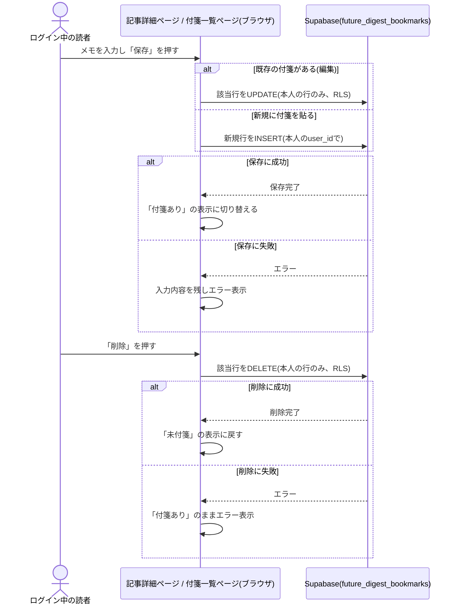
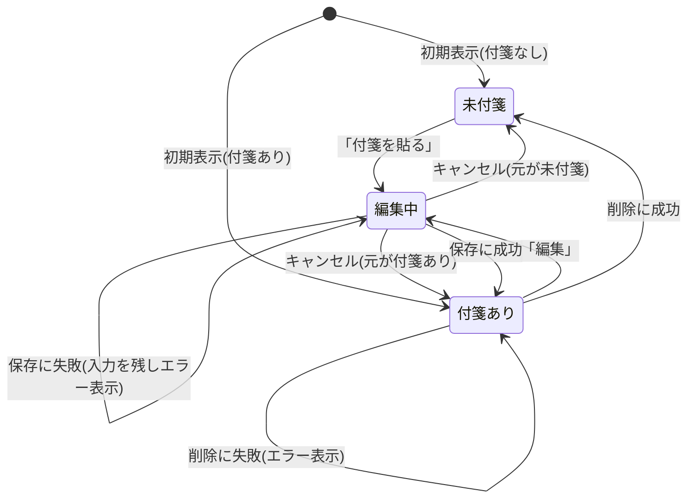
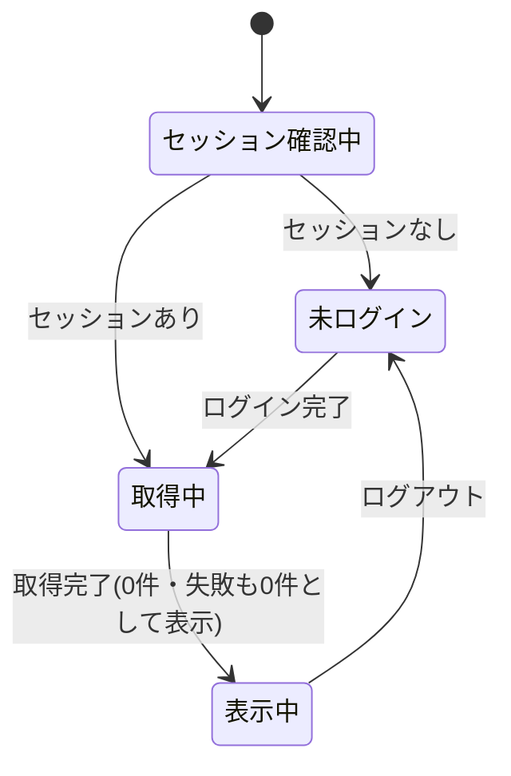

# 設計: 付箋(記事の個人メモ・ブックマーク)

## サマリ
記事詳細ページの予測1本ごとに、ログイン中の読者本人だけが見える付箋(200文字までのメモ)を貼る・編集する・削除する機能と、自分の付箋をまとめて見る付箋一覧ページ(`/future-digest/bookmarks`)を追加する。保存先は新規テーブル`future_digest_bookmarks`で、`auth.uid() = user_id`のRLSで本人の行だけを操作できるようにする。画面部品・処理の流れはnews-digestの付箋機能([news-digest/bookmark/design.md](../../news-digest/bookmark/design.md))と同じ実装を流用し、「トピック」を「予測」、「記事日付」を「記事ID」に読み替える。

主要な設計判断:
- ログインは既存のGoogle OIDC(`app/lib/adminAuth.ts`)を使い、運営者判定(`isAuthorizedAdmin`)は使わない(requirements.md#表示範囲・権限-2)
- 1予測1読者1件・200文字の上限は、画面とデータベース(一意制約・CHECK制約)の両方で守る
- Step0はarticle-detailと同じく簡易実施(news-digestの付箋部品の見た目を流用し、アクセントカラーのみ合わせる)
- 図: 「処理フロー」冒頭のシーケンス図、「状態管理」の状態遷移図2つ

## 処理フロー


上記は俯瞰用の図。正は以下の各処理の手順の文章。

### 記事内の自分の付箋をまとめて取得する処理
- 対象: 記事詳細ページを開いた時点、およびログイン状態が変わった時点
- 手順:
  1. 未ログインなら何も取得せず、付箋の操作も表示しない(requirements.md#記事への付箋-5)
  2. ログイン中なら、その記事IDに対する自分の付箋を1回でまとめて取得し、予測IDで引ける形にする。取得が終わるまでは全予測を「未付箋」として扱う
  3. 取得に失敗した場合は、全予測を「未付箋」として扱う
- 関連するビジネスルール: requirements.md#記事への付箋-1・5、requirements.md#表示範囲・権限-1

### 新規に付箋を貼る処理
- 対象: 「付箋を貼る」を押した予測
- 手順:
  1. その予測の位置にメモの入力欄を開く(別画面・モーダルにしない。requirements.md#記事への付箋-6)
  2. 前後の空白を除いたメモが空、または200文字を超える場合は保存しない(requirements.md#記事への付箋-2〜3)
  3. 記事ID・予測ID・メモを、ログイン中の本人の`user_id`で新規保存する
  4. 成功したら「付箋あり」の表示に切り替え、保存したメモを表示する。失敗したら入力欄を開いたまま失敗を表示する(入力内容は消さない)
- 関連するビジネスルール: requirements.md#記事への付箋-1〜4・6

### 付箋を編集する処理
- 対象: 付箋済みの予測
- 手順:
  1. 「編集」を押すと、保存済みのメモを初期値にして、その場に入力欄を開く
  2. 空・200文字超の場合は保存しない
  3. 既存の1行をメモで上書きし、最後に編集した日時を更新する
  4. 成功したら入力欄を閉じて更新後のメモを表示する。失敗したら入力欄を開いたまま失敗を表示する
- 関連するビジネスルール: requirements.md#記事への付箋-4、requirements.md#付箋の編集・削除-7

### 付箋を削除する処理
- 対象: 付箋済みの予測
- 手順:
  1. 「削除」を押すと、その付箋を削除する
  2. 成功したら「未付箋」の表示に戻す。失敗したら「付箋あり」のまま失敗を表示する
- 関連するビジネスルール: requirements.md#付箋の編集・削除-8

### 付箋一覧を表示する処理
- 対象: 付箋一覧ページを開いた時点、およびログイン状態が変わった時点
- 手順:
  1. 未ログインなら一覧は取得せず、ログインを促す表示とログイン操作だけを出す
  2. ログイン中なら、自分の付箋を最後に編集した日時(未編集なら貼った日時)の新しい順にすべて取得する(requirements.md#付箋の一覧-13〜14)
  3. 各付箋の記事ID・予測IDから、ビルド時に作った「記事ID+予測ID→見出し・ジャンル・時間軸」の索引で表示内容を引く。引けない付箋(記事データから消えたもの)は一覧から除く
  4. 各項目に見出し・ジャンル・時間軸・メモ・編集/削除の操作・元の記事の該当予測へのリンク(`/future-digest/<記事ID>#<予測ID>`)を表示する(requirements.md#付箋の一覧-10〜12)
  5. 取得に失敗した場合は0件として扱う
- 関連するビジネスルール: requirements.md#付箋の一覧-9〜14

### 付箋一覧からの編集・削除
- 対象: 付箋一覧ページの各項目
- 手順: 上記「付箋を編集する処理」「付箋を削除する処理」と同じ処理を一覧の画面内で行う。削除に成功した項目は一覧から消す
- 関連するビジネスルール: requirements.md#付箋の一覧-12

## バリデーション

- メモは前後の空白を除いて空の場合は保存できない(requirements.md#記事への付箋-2)
- メモは200文字まで。入力欄に上限を設け、データベースのCHECK制約でも守る(requirements.md#文字数・件数-3)
- 1予測1読者1件は、画面で「付箋済みなら編集として扱う」ことに加え、データベースの一意制約でも守る(requirements.md#記事への付箋-4)

## エラーハンドリング

- 付箋の取得失敗は画面に伝えず「未付箋」または「0件」として扱い、コンソールにだけ出す(閲覧の邪魔をしないため)
- 保存・編集・削除は読者が明示的に行う操作のため、失敗したら定型の失敗文言を画面に出す(Supabaseのエラーメッセージはそのまま出さない)
- 保存・削除の処理中は同じボタンを無効にし、二重の保存・削除を防ぐ
- 別のタブで既に付箋を貼っていて一意制約に当たった場合も、他の保存失敗と同じ定型の失敗文言にする

## 関連するファイル(抜粋)

```
supabase/migrations/<timestamp>_create_future_digest_bookmarks.sql (新規)
app/future-digest/lib/bookmarks.ts (新規: fetchBookmarksByArticle/fetchAllBookmarks/createBookmark/updateBookmark/deleteBookmark)
app/future-digest/lib/predictionIndex.ts (新規: 全記事から「記事ID:予測ID」→見出し・ジャンル・時間軸の索引を作る)
app/future-digest/components/BookmarkPanel.tsx (新規: news-digestのBookmarkPanel.tsxと同じ実装)
app/future-digest/components/BookmarkListItem.tsx (新規: ジャンル・時間軸の表示を加える)
app/future-digest/components/BookmarkListView.tsx (新規: news-digestのBookmarkListView.tsxと同じ実装)
app/future-digest/components/PredictionCard.tsx (article-detailで新規: BookmarkPanelを配置)
app/future-digest/components/ArticleDetailView.tsx (article-detailで新規: 記事内の付箋の取得を追加)
app/future-digest/components/LoginStatus.tsx (article-detailで新規: 付箋一覧へのリンクを持つ)
app/future-digest/bookmarks/page.tsx (新規: 付箋一覧ページ)
app/lib/adminAuth.ts (既存: getSession/onAuthChange/signInWithGoogle/signOut。isAuthorizedAdminは使わない)
app/lib/supabaseClient.ts (既存)
app/legal/page.tsx (既存: プライバシーポリシーに付箋メモの保存を追記)
specs/legal/requirements.md (既存: プライバシーポリシーの仕様リンクに本specを追加)
```

## データベース設計

### future_digest_bookmarks(新規)
| カラム | 型 | 補足 |
|---|---|---|
| id | uuid, primary key, default gen_random_uuid() | 付箋ID |
| user_id | uuid, not null, references auth.users(id) on delete cascade | 付箋を貼った本人(退会時は付箋も消える) |
| article_id | text, not null | 対象記事の`Article.id` |
| prediction_id | text, not null | 対象予測の`Prediction.id`(記事IDとの組で対象を一意に特定する) |
| memo | text, not null, check (char_length(memo) <= 200) | メモ(200文字まで) |
| created_at | timestamptz, not null, default now() | 付箋を貼った日時 |
| updated_at | timestamptz, not null, default now() | 最後に編集した日時。一覧の並び順に使う |

```sql
create table future_digest_bookmarks (
  id uuid primary key default gen_random_uuid(),
  user_id uuid not null references auth.users(id) on delete cascade,
  article_id text not null,
  prediction_id text not null,
  memo text not null check (char_length(memo) <= 200),
  created_at timestamptz not null default now(),
  updated_at timestamptz not null default now(),
  unique (user_id, article_id, prediction_id)
);
alter table future_digest_bookmarks enable row level security;

grant select, insert, update, delete on future_digest_bookmarks to authenticated;

create policy "user can select own bookmarks" on future_digest_bookmarks
  for select to authenticated using (auth.uid() = user_id);
create policy "user can insert own bookmarks" on future_digest_bookmarks
  for insert to authenticated with check (auth.uid() = user_id);
create policy "user can update own bookmarks" on future_digest_bookmarks
  for update to authenticated using (auth.uid() = user_id) with check (auth.uid() = user_id);
create policy "user can delete own bookmarks" on future_digest_bookmarks
  for delete to authenticated using (auth.uid() = user_id);

-- benriyatool_readonlyはSELECTのみ許可(ADR-0004。data-checkでの集計に使う)
grant select on future_digest_bookmarks to benriyatool_readonly;
create policy "benriyatool_readonly can select" on future_digest_bookmarks
  for select to benriyatool_readonly using (true);
```

マイグレーション適用後、次を実機で確認する(news-digestの付箋と同じ確認項目):
- 本人が自分の付箋だけをSELECT/INSERT/UPDATE/DELETEできること
- 別アカウントでは他人の付箋が見えず、編集・削除もできないこと
- 未ログイン(anon)ではいずれの操作もできないこと
- 同じ予測への2件目の保存が一意制約で拒否されること
- 200文字を超えるメモがCHECK制約で拒否されること

## 画面設計

### 記事詳細ページへの追加(article-detailの画面)
- 予測がある枠の出典の下・フィードバック入力欄(運営者本人のみ)の上に、ログイン中だけ付箋の操作領域を出す
  - 未付箋:「付箋を貼る」だけを出す
  - 付箋あり: 保存済みのメモと「編集」「削除」を出す
  - 「付箋を貼る」「編集」を押すと、その場にメモの入力欄(200文字まで、残り文字数の表示つき)と「保存」「キャンセル」を開く
- 候補なし・生成失敗の枠には付箋の操作を出さない(付箋を貼る対象の予測がないため)
- 各予測カードに`id`属性(予測ID)を付け、付箋一覧からのリンクで該当の予測まで移動できるようにする
- ページ下部のログイン状態表示に、ログイン中だけ「付箋一覧」へのリンクを出す

### 付箋一覧ページ(新規: `/future-digest/bookmarks`)
- パンくず(べんりやつーる › 週刊未来予測 › 付箋一覧)
- 見出し「付箋一覧」
- 確認中・取得中: ローディング表示だけ
- 未ログイン: ログインを促す文言と「ログイン」ボタンだけ
- ログイン中・0件:「まだ付箋がありません」
- ログイン中・1件以上: 最後に編集した日時の新しい順のカード一覧。各カードに見出し(該当の予測へのリンク)・ジャンルと時間軸のバッジ・メモ・「編集」「削除」
- 画面遷移は[article-list/design.md](../article-list/design.md#画面遷移図)の画面遷移図に含める

## コンポーネント設計

| コンポーネント | Props | 役割 |
|---|---|---|
| BookmarkPanel | `articleId: string`, `predictionId: string`, `initialBookmark: { id: string; memo: string } \| null`, `onChange?: (bookmark: { id: string; memo: string } \| null) => void` | 1予測分の付箋の表示・新規作成・編集・削除(記事詳細・付箋一覧で共通) |
| BookmarkListItem | `articleId: string`, `entry: { heading: string; genre: Genre; horizon: Horizon }`, `bookmark: { id: string; predictionId: string; memo: string }`, `onDeleted: () => void` | 付箋一覧の1項目 |
| BookmarkListView | `predictionIndex: Record<string, { heading: string; genre: Genre; horizon: Horizon }>` | 付箋一覧ページの本体 |

## 状態管理

- `BookmarkPanel`は「未付箋」「付箋あり」「編集中」の3状態をコンポーネント内で持つ



- `ArticleDetailView`は、ログインセッションに加えて記事内の自分の付箋(予測IDで引けるMap)を持ち、各カードへ渡す
- `BookmarkListView`は「セッション確認中」「未ログイン」「取得中」「表示中」の4状態を持つ


上記2つの図は俯瞰用。正は「処理フロー」の各処理の文章。

## セキュリティ

- アクセス制御はデータベースのRLS(`auth.uid() = user_id`)で行う。画面の出し分けは案内のためで、突破されても他人の行は返らない(requirements.md#表示範囲・権限-1)
- メモは本人しか読めない行にだけ保存し、Reactの標準の文字列描画で表示する(`dangerouslySetInnerHTML`は使わない)
- 200文字の上限はデータベースのCHECK制約でも守る(読者全員に書き込みを開放するため、巨大な文字列の保存を防ぐ)
- `article_id`・`prediction_id`はブラウザから送られた値を保存する。一覧で索引に見つからない付箋は表示から除くため、存在しないIDが画面に出ることはない
- 付箋一覧ページは個人のメモを扱うため、sitemapに含めず、`robots`のメタ情報で検索エンジンにも登録させない(noindex)
- 個人のメモを新しく保存するため、プライバシーポリシーに付箋メモを保存する旨を追記する(requirements.md#依存関係)

## ログ

- 付箋の取得・保存・編集・削除の失敗は、ブラウザのコンソールにエラーの種類だけを出す(メモの中身は出さない)
- 成功時はログを出さない
