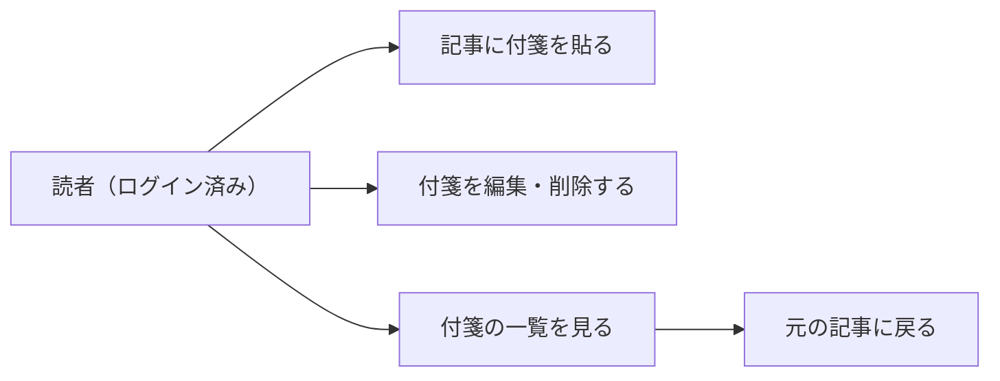

# 要件定義: 付箋(記事の個人メモ・ブックマーク)

> ステータス: 仕様確認中(未実装)

## サマリ
Googleアカウントでログインした読者が、記事詳細ページの気になった予測記事に、メモ(200文字まで)付きの付箋を貼れるようにする。付箋は専用の一覧画面(`/future-digest/bookmarks`)で見返せ、編集・削除もできる。付箋は本人しか見られない(データベース側のRLSで守る)。仕組みはnews-digest・ai-dev-digestの付箋機能と同じにする。

## 概要
- 機能名: 付箋(記事の個人メモ・ブックマーク)
- 目的: 読者が気になった予測にメモ付きの付箋を貼り、あとで一覧から見返せるようにする
- 優先度: 中

## ユーザーストーリー
- 読者として、気になった予測にその場でメモを書いて付箋を貼り、あとで見返したい
- 読者として、付箋を貼った予測を一覧で確認し、そこから元の記事に戻って読み返したい
- 読者として、付箋のメモを書き直したり、要らなくなった付箋を消したりしたい
- 読者として、自分の付箋メモを他の読者に見られたくない

## ユースケース図

上記は俯瞰用の図。正となる文章は下記「機能要件」「ビジネスルール・制約」。

## 機能要件

### 記事への付箋
- [1] ログイン中の読者は、記事詳細ページの各記事(予測1本ごと)に、メモ付きの付箋を貼れる
- [2] メモが空、または空白文字だけの場合は保存できない
- [3] メモは200文字までとする
- [4] 1本の記事に1人の読者が貼れる付箋は1件までとする。付箋済みの記事への操作は、既存の付箋の編集として扱う
- [5] 未ログインの訪問者には、付箋を貼る操作(ボタン等)を表示しない
- [6] 付箋を貼る・編集する操作は、その記事の位置でその場に開く形で行い、別画面・モーダルには移らない

### 付箋の編集・削除
- [7] 付箋済みの記事では、メモを書き直して上書き保存できる
- [8] 付箋済みの記事では、付箋を削除できる。削除すると、未付箋の状態に戻る

### 付箋の一覧
- [9] ログイン中の読者は、自分が付箋を貼った記事の一覧を専用の画面で見られる
- [10] 一覧の各項目には、記事の見出し・ジャンル・時間軸・付箋メモを表示する
- [11] 一覧の各項目から、元の記事詳細ページの該当記事へ移って読み返せる
- [12] 一覧の画面だけで、付箋を編集・削除できる
- [13] 一覧は、付箋を貼った(または最後に編集した)日時の新しい順に並べる
- [14] 自分の付箋だけを表示し、他の読者の付箋は表示・参照できない

## ビジネスルール・制約

### 表示範囲・権限
- [1] 付箋の閲覧・作成・編集・削除は、ログイン中の本人の付箋に限る。アクセス制御はデータベース側(RLS)で行い、画面の出し分けだけに頼らない(根拠: [docs/adr/0001-user-input-database.md](../../../docs/adr/0001-user-input-database.md)の「ログインが必要なアプリ」向けパターン。news-digestの[bookmark/requirements.md](../../news-digest/bookmark/requirements.md)と同じ)
- [2] ログインは、既存と同じGoogle OIDC(`app/lib/adminAuth.ts`)を使う。付箋は読者全員が対象のため、運営者判定は使わない

### 文字数・件数
- [3] メモは200文字まで、1記事につき1読者1件までとする(news-digestと同じ)

## 依存関係
- 付箋の対象となる記事の識別子は[article-detail/requirements.md](../article-detail/requirements.md)の記事データに従う
- 個人のメモを新しく保存するため、[specs/legal/requirements.md](../../legal/requirements.md)のプライバシーポリシーの更新が必要

## スコープ外
- 付箋メモの共有・公開
- 付箋件数の上限
- 一覧での検索・絞り込み・並び替え
- 研究発見アプリ([research-digest](../../research-digest/bookmark/requirements.md))の付箋とまとめて見る画面
