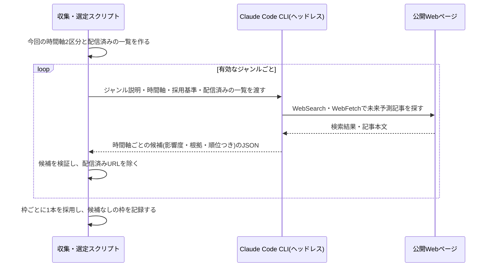

# 設計: ジャンル・時間軸別の未来予測記事の選定

## サマリ
その回の回数から扱う時間軸2区分を決め、有効なジャンルごとにClaude Code CLIのヘッドレス実行(WebSearch)で2時間軸分の候補を集めさせ、影響度の判定と順位付けまでを任せる。配信済みとの重複は、同じURLを決定的なコードで機械的に除き、実質同じ内容の予測は過去に配信した全予測の見出し・元記事タイトルの一覧をプロンプトに渡してClaudeに判定させる。最後に枠ごとの採用(影響度の最も大きい1本)と、候補が見つからなかった枠の記録を決定的なコードで行い、枠ごとの候補件数を実行ログに出す。

主要な設計判断:
- 「記事を探す・時間軸と影響度を判定する・実質的な重複を見分ける」は意味の判断が必要なためClaudeに任せ、「同じURLの除外・枠ごとの採用・候補なしの記録・回数の数え方」は揺れてはいけないため決定的なコードで行う(trend-digestのWebSearchジャンルと同じ役割分担)
- ジャンル・注目テーマは`content/future-digest/genres.json`に置き、運営者が追記するだけで増やせる
- 回数は公開済み記事の`issueNumber`の最大値+1とする(公開をスキップした回は記事ファイルがないため自然に数えない)
- 図: 「ジャンルごとに候補を集める処理」のシーケンス図

## データ設計(ジャンル・注目テーマの設定ファイル)

```jsonc
// content/future-digest/genres.json(記載順=ジャンル順)
[
  {
    "id": "technology-ai",
    "label": "テクノロジー・AI",
    "description": "収集時にClaudeへ渡すジャンルの範囲の説明",
    "active": true
  },
  // ...
  {
    "id": "personal-interest",
    "label": "個人的注目分野",
    "description": "運営者が指定したテーマの中から選ぶ",
    "themes": ["AR・VR", "若返り"], // 個人的注目分野のテーマ。追記で増やせる
    "active": true
  }
]
```

- `description`はrequirements.md#ジャンルの各項目の説明をそのまま書く(性・恋愛ジャンルは扱うテーマを列挙した説明文)
- `active: false`のジャンルは収集の対象にしないが、過去記事の表示用にラベルを残す(ジャンルを廃止しても過去記事のページが壊れないようにするため)
- `genres.json`と`requirements.md#ジャンル`は二重管理になるため、[source-review](../source-review/design.md)の月次見直しでは両方を同じPRで更新する

```ts
// app/future-digest/lib/candidateTypes.ts
export type Candidate = {
  genre: Genre
  horizon: Horizon
  impact: Impact
  impactRank: number // 同じ枠・同じ影響度の中での順位(1が最も影響が大きい)。Claudeが3つの観点で判断した結果
  impactReason: string // 影響度の根拠(1文)
  targetPeriod: string // 予測が対象とする時期(例: "2030年まで")
  sourceTitle: string
  sourceName: string
  sourceUrl: string
  publishedAt: string | null // 元記事の公開日(分かる場合のみ)
}

export type SlotResult =
  | { genre: Genre; horizon: Horizon; status: 'selected'; candidate: Candidate; candidateCount: number }
  | { genre: Genre; horizon: Horizon; status: 'no-candidate'; candidateCount: number }
```

## 処理フロー

### その回の時間軸2区分を決める処理
- 対象: 公開済みの全記事データ
- 手順:
  1. 公開済みの記事のうち最も大きい回数に1を足して、今回の回数とする。記事が1件もない場合は1回目とする
  2. 回数が奇数なら近未来と長期未来、偶数なら中期未来と超長期未来を今回の時間軸とする
- 公開をスキップした回は記事ファイルがないため、回数に数えられない(requirements.md#時間軸の切り替え-2)
- 関連するビジネスルール: requirements.md#時間軸の切り替え-1〜2

### 配信済みの一覧を作る処理
- 対象: 公開済みの全記事データ
- 手順:
  1. 過去に掲載した全予測の元URLを、比較用に正規化した形で集める(スキームとホスト名を小文字にし、末尾のスラッシュ・URL内の`#`以降・計測用のクエリ(`utm_`で始まるもの)を除く)
  2. 過去に掲載した全予測について、ジャンル・時間軸・見出し・元記事タイトルを1行ずつにした一覧を作る(Claudeに実質的な重複を判定させるための材料。年1000行程度でプロンプトに収まる)
- 関連するビジネスルール: requirements.md#配信済みの記事・予測の除外-1〜2

### ジャンルごとに候補を集める処理(エージェントの推論)
- 対象: 有効なジャンル1つと、今回の時間軸2区分
- 手順:
  1. ジャンルの説明(個人的注目分野はテーマ一覧も)、今回の時間軸2区分とその年数の定義、採用基準・影響度の観点、配信済みの一覧をプロンプトに含め、Claude Code CLIをヘッドレス起動する(WebSearch・WebFetchを使わせる)
  2. Claudeは時間軸ごとに、採用基準を満たす未来予測記事を探す。予測の対象時期が明示・推定できない記事、噂・出典不明・根拠のない断定の記事、Claude自身の予測は候補にしない(requirements.md#時間軸-5、requirements.md#採用基準-1〜2)
  3. 同じ内容について新しい予測がある場合は、新しい方だけを候補にする(requirements.md#採用基準-3)
  4. 配信済みの一覧と実質的に同じ内容(同じ技術・同じ出来事について同じ見通しを述べるもの)の記事は候補にしない(requirements.md#配信済みの記事・予測の除外-2)
  5. 各候補に影響度(大・中・小)とその根拠(1文)を付け、同じ時間軸・同じ影響度の中での順位を付ける(requirements.md#影響度-1〜3)
  6. 応答は決められた形のJSON(時間軸ごとの候補の配列。時間軸あたり最大5件)だけを返させる。候補が見つからない時間軸は空の配列にする。聞き返しはさせない(ヘッドレス実行のため)
  7. 応答をJSONとして読み取り、各候補を下記「バリデーション」で検証し、満たさない候補は捨てる
- シーケンス図(俯瞰用。正は上記の手順の文章):


- 関連するビジネスルール: requirements.md#機能要件-4〜5、requirements.md#採用基準-1〜3、requirements.md#影響度-1〜3、requirements.md#データ取得方法-1

### 枠ごとに1本を採用する処理(決定的なコード)
- 対象: 1つの枠(ジャンル×時間軸)に集まった候補
- 手順:
  1. 配信済みの元URLと正規化後に一致する候補を除く(Claudeの判定漏れに対する最終防波堤。requirements.md#配信済みの記事・予測の除外-1)
  2. 同じ回の別の枠で既に採用した元URLと一致する候補も除く(同じ記事が2つの枠に載らないようにするため)
  3. 残った候補を影響度の大きい順に並べ、同じ影響度の中ではClaudeが付けた順位の小さい順に並べて、先頭の1本を採用する(requirements.md#機能要件-4、requirements.md#影響度-3)
  4. 残った候補が1件もない場合は、その枠を「候補が見つからなかった枠」として記録する(requirements.md#候補が見つからない枠-1)
  5. 採用処理はジャンル順・時間軸の近い順に枠を処理する(手順2の重複除外の結果を毎回同じにするため)
- 関連するビジネスルール: requirements.md#機能要件-3〜5、requirements.md#配信済みの記事・予測の除外-1、requirements.md#候補が見つからない枠-1

### 収集状況を記録する処理
- 対象: 全枠の採用結果
- 手順:
  1. 枠ごとに、検証を通った候補の件数と、採用したか候補なしかを実行ログに1行ずつ出す
  2. 候補が見つからなかった枠の一覧を、最後にまとめて出す
  3. 候補なしの枠は記事データの`emptySlots`にも残るため、[source-review](../source-review/design.md)の月次見直しは記事データから集計できる
- 関連するビジネスルール: requirements.md#収集状況の記録-1

## バリデーション

Claudeが返した候補ごとに検証し、満たさない候補はその場で捨てる(実行ログに理由を出す):
- `horizon`が今回の時間軸2区分のどちらかであること
- `impact`が大・中・小のいずれかで、`impactRank`が1以上の整数であること
- `impactReason`・`targetPeriod`・`sourceTitle`・`sourceName`・`sourceUrl`が空でないこと
- `sourceUrl`が`http`/`https`の絶対URLであること
- 文字列の長さの上限(見出し・根拠・情報源名は200字、元記事タイトルは300字)を超えないこと、制御文字を含まないこと(外部の記事から来た文字列を記事データに取り込むため)

## エラーハンドリング

- 1ジャンルの収集が失敗した場合(応答からJSONを取り出せない・Claude CLIが異常終了した)は、そのジャンルを最大2回まで(初回+1回)起動し直す。それでも失敗した場合は、そのジャンルの2枠を「候補が見つからなかった枠」として扱い、他のジャンルの収集を続ける(1ジャンルの失敗で回全体を止めないため)。失敗したことは実行ログに残す
- 応答が利用上限への到達を示す場合は、同じ実行内でやり直しても回復しないため、その時点で収集を打ち切り、スクリプトを失敗として終える([weekly-publish/design.md](../weekly-publish/design.md)「エラーハンドリング」で公開せずに実行を失敗させる)
- 全枠で採用できる候補がなかった場合は、選定結果として「全枠候補なし」を返す(正常な結果。[weekly-publish](../weekly-publish/design.md)が公開をスキップする)
- 記事データの読み込みに失敗した場合(過去記事のJSONが壊れている)は、配信済みの判定ができないため処理を失敗として終える(重複した記事を配信するより、その回を止める方を選ぶ)

## 関連するファイル(抜粋)

```
content/future-digest/genres.json (新規: ジャンル・注目テーマの設定ファイル)
app/future-digest/lib/genres.ts (新規: genres.jsonの読み込み・検証。types.tsのGENRE_ORDER/GENRE_LABELSの元)
app/future-digest/lib/candidateTypes.ts (新規: Candidate/SlotResult)
app/future-digest/lib/issue.ts (新規: 次の回数を求めるnextIssueNumber)
app/future-digest/lib/deliveredIndex.ts (新規: 配信済みURLの正規化と、配信済みの一覧の組み立て)
app/future-digest/lib/candidateValidation.ts (新規: Claudeが返した候補の検証)
app/future-digest/lib/selectSlots.ts (新規: 枠ごとの採用と候補なしの記録)
scripts/future-digest/collect-candidates.ts (新規: ジャンルごとにClaude Code CLIを起動して候補を集めるCLI)
scripts/future-digest/collect-and-select.ts (新規: 回数の決定→収集→採用→結果のJSON出力までをまとめるCLI。weekly-publishから呼ぶ)
app/future-digest/lib/articles.ts (article-detailで新規: getAllArticlesを利用)
```

## セキュリティ

- Claudeが外部の記事から持ち帰った文字列(元記事タイトル・情報源名など)は、上記「バリデーション」で長さ・制御文字・URLのスキームを検証してから記事データに取り込む。画面ではReactのエスケープで表示する
- 収集用のClaude CLIに許可するツールはWebSearch・WebFetchの読み取り系に限り、ファイル編集・シェル実行は許可しない(外部のページに書かれた指示でリポジトリを書き換えられないようにするため)
- 公開ページの閲覧はClaude CLI標準のWebSearch・WebFetchの範囲にとどめ、非公式API・認証の回避は行わない(requirements.md#データ取得方法-1)
- 性・恋愛ジャンルの収集では、未成年が関わる内容・特定の店舗や相手を探す手助けになる情報を候補にしないよう、プロンプトで明示する([content-generation/requirements.md#性恋愛ジャンルの書き方](../content-generation/requirements.md)の[6][7]と同じ制約を収集時点でも守る)

## ログ

- 実行開始時: 今回の回数・時間軸2区分・有効ジャンル数(info)
- ジャンルごと: 収集の成否・やり直しの有無・時間軸ごとの候補件数・検証で捨てた候補の件数と理由(info。失敗時はerror)
- 枠ごと: 採用した元URLと影響度、または候補なし(info)
- 終了時: 候補なしの枠の一覧・採用件数の合計(info)。利用上限への到達で打ち切った場合はその旨(error)
- ログはGitHub Actionsの実行ログ(標準エラー出力)に出す。選定結果のJSONは標準出力に出し、ログと混ぜない
