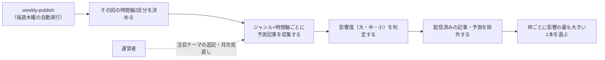

# 要件定義: ジャンル・時間軸別の未来予測記事の選定

> ステータス: 仕様確認中(未実装)

## サマリ
有効なジャンル(現在は10ジャンル)それぞれについて、公開されている未来予測・考察記事(研究機関・シンクタンク・報道・専門家)から、指定の時間軸に当たる記事を1本ずつ選ぶ。時間軸は配信日を基準点に、近未来(1年以上5年以下後)・中期未来(5年超20年以下後)・長期未来(20年超50年以下後)・超長期未来(50年超後)の4区分で、配信回ごとに2区分ずつ交互に扱う(奇数回=近未来+長期未来、偶数回=中期未来+超長期未来)。1回あたりは有効なジャンル数×2枠(現在は20枠)。1年未満の予測・対象時期を既に過ぎた予測は候補にしない。各記事には影響度(大・中・小)を付け、影響の大きいものから選ぶ。過去に配信した記事・予測とは重複させない。詳細は「[ユースケース図](#ユースケース図)」参照。

## 概要
- 機能名: ジャンル・時間軸別の未来予測記事の選定
- 目的: 有効なジャンル(現在は10ジャンル)×その回の2時間軸の枠ごとに、影響が最も大きく、まだ配信していない未来予測記事を1本ずつ選び出す
- 優先度: 高

## ユーザーストーリー
- 読者として、様々なジャンルで「数年後〜数十年後に何が起こると考えられているか」を、時間軸ごとに知りたい
- 読者として、影響の大きい予測から優先して知りたい。また、どれくらい影響が大きいかをひと目で分かるようにしてほしい
- 読者として、以前に読んだ予測と同じものが繰り返し届かないようにしてほしい
- 運営者として、個人的に注目している分野(AR・VR、若返りなど)を、後からテーマを追記するだけで増やせるようにしたい

## ユースケース図

上記は俯瞰用の図。正となる文章は下記「機能要件」「ビジネスルール・制約」。

## 機能要件
- [1] 対象ジャンルは下記「ジャンル」の有効なジャンル(現在は10ジャンル)とする。ジャンルと、個人的注目分野のテーマは、コードではなく設定ファイル(コンテンツデータ)で管理し、運営者がファイルに追記するだけで増やせるようにする
- [2] 時間軸は下記「時間軸」の4区分とし、1回の配信ではそのうち2区分を扱う(下記「時間軸の切り替え」)
- [3] 1回の配信では、有効なジャンルの数×その回の2時間軸(現在は20枠)の枠ごとに、記事を1本ずつ選ぶ
- [4] 枠ごとに、下記「採用基準」を満たす候補を集め、影響度を判定し、配信済みのものを除いたうえで、影響度の最も大きい1本を採用する
- [5] 採用した各記事には、影響度(大・中・小)と、その判定の根拠(1文)を付ける

## ビジネスルール・制約

### ジャンル
- [1] テクノロジー・AI
- [2] 医療・健康
- [3] 環境・エネルギー
- [4] 経済・働き方
- [5] 社会・人口・暮らし
- [6] 宇宙・科学
- [7] 地政学
- [8] 性・恋愛: 自慰の新しいやり方・セルフプレジャーのテクノロジー、恋愛・結婚・性交・性生活に関する動向の変化、出会い系・立ちんぼ・風俗など性産業の動向の変化を扱う(書き方は[content-generation/requirements.md#性・恋愛ジャンルの書き方](../content-generation/requirements.md)に従う)
- [9] 個人的注目分野: 運営者が指定したテーマ(AR・VR、若返り)の中から選ぶ。テーマは設定ファイルへの追記で増やせる(機能要件[1])
- [10] その他: 上記[1]〜[9]のいずれにも入らない、影響の大きい未来予測を扱う

### 時間軸
基準点は配信日(記事を公開する週次実行の実行日)とする。
- [1] 近未来: 配信日から1年以上5年以下後のことを扱う予測
- [2] 中期未来: 配信日から5年超20年以下後のことを扱う予測
- [3] 長期未来: 配信日から20年超50年以下後のことを扱う予測
- [4] 超長期未来: 配信日から50年超後のことを扱う予測
- [5] 記事がどの時間軸に当たるかは、記事が予測の対象とする時期(「2030年までに」「今世紀末には」等)で判定する。対象時期が明示・推定できない記事は候補にしない
- [6] 対象時期が配信日から1年未満の予測、および対象時期を配信日時点で既に過ぎている予測は候補にしない(根拠: /requirementでの決定。目先すぎる・既に外れた予測を「未来予測」として届けないため)

### 時間軸の切り替え
- [1] 配信回を初回から数え、奇数回は「近未来+長期未来」、偶数回は「中期未来+超長期未来」を扱う(根拠: /requirementでの決定。4区分すべてを毎週扱うと1回40本になり多すぎるため、2区分ずつ交互に扱い1回20本に抑える)
- [2] 公開をスキップした回([weekly-publish/requirements.md#掲載件数の保証](../weekly-publish/requirements.md))は回数に数えない(読者から見て時間軸が交互に並び続けるようにするため)

### 採用基準
- [1] 候補は、研究機関・シンクタンク・国際機関・報道機関・専門家などが公開した、未来の見通しについての予測・考察記事とする。Claude自身が独自に予測した内容は候補にしない(根拠: /requirementでの決定。「考えられている」予測を紹介するアプリであり、生成AIの推測を予測として配信しないため)
- [2] 噂・出典の不明な記事や、根拠を示さずに断定するだけの記事は候補にしない
- [3] 記事の公開時期は問わないが、同じ内容について新しい予測が出ている場合は新しい方を優先する

### 影響度
- [1] 影響度は「大」「中」「小」の3段階とする(根拠: /requirementでの決定)
- [2] 影響度は「影響を受ける人の多さ」「生活・社会の変化の深さ」「実現の確からしさ」の3つの観点で総合的に判定する
- [3] 枠内で影響度が同じ候補が複数ある場合は、上記[2]の観点でより影響が大きいと判断されたものを採用する

### 配信済みの記事・予測の除外
- [1] 過去に配信した記事(同じURL)は候補から除外する
- [2] 出典の記事が違っても、過去に配信した予測と実質的に同じ内容の予測(同じ技術・同じ出来事について同じ見通しを述べるもの)は候補から除外する(根拠: /requirementでの決定「今まで配信したものとダブりがないように」)。判定方法の詳細は設計で詰める

### 候補が見つからない枠
- [1] 採用基準を満たし、配信済みでない候補が見つからない枠は、架空の予測や基準を満たさない記事で埋めず、「候補が見つからなかった」ことが分かる記載をその枠に残す(根拠: /requirementでの決定。読者がその枠を見落としたのか、候補がなかったのかを区別できるようにするため)。この「候補なし」は、収集の処理自体は完了し候補が0件だった状態を指し、下記「収集失敗」とは区別する

### 収集失敗
- [1] 情報収集の処理自体が完了しなかった枠(候補なしとは異なり、処理そのものが失敗した状態)は、候補なしと区別して扱う
- [2] 読者向けの表示・記事データには、収集失敗の直接原因を内部のエラー文字列のまま出さず、分類ラベルで示す。分類ラベルは「時間切れ」「応答形式不正」「その他」の3種とする(利用上限への到達は下記[3]により実行全体を打ち切るため、枠ごとの分類ラベルには含めない)【推測】
- [3] 応答が利用上限への到達を示す場合は、その枠だけの収集失敗として扱わず、その時点で実行全体を打ち切り失敗として終える([weekly-publish/requirements.md#掲載件数の保証](../weekly-publish/requirements.md))【推測】
- [4] その回の実行を公開・スキップ・失敗のいずれとして扱うかは[weekly-publish/requirements.md#掲載件数の保証](../weekly-publish/requirements.md)の判定に従う(候補なしの枠だけで採用0件だった場合に限り正常なスキップとし、収集失敗の枠が1つ以上ある場合は実行を失敗とする)【推測】
- [5] 収集失敗した枠は、下記「収集状況の記録」が集計する候補なしの件数には含めない

### データ取得方法
- [1] 情報の取得は、Claude Code CLIのWebSearch・公開ページの閲覧の範囲にとどめ、非公式API・認証の回避・利用規約の想定を超えた高頻度アクセスは行わない(ai-dev-digest・trend-digestと同じ方針)

### 収集状況の記録
- [1] 毎回の実行ログに、枠ごとの候補件数、候補が見つからなかった枠、収集に失敗した枠(分類ラベル別)を出力する。候補なしが続くジャンル・時間軸は[source-review/requirements.md](../source-review/requirements.md)の月次見直しで確認する(収集失敗は候補なしの集計から除く)

## 依存関係
- 選定された記事は[article-detail/requirements.md](../article-detail/requirements.md)で表示される
- 選定された記事の要約は[content-generation/requirements.md](../content-generation/requirements.md)のルールで作られる
- 実行タイミングは[weekly-publish/requirements.md](../weekly-publish/requirements.md)に従う
- ジャンル・採用基準の見直しは[source-review/requirements.md](../source-review/requirements.md)の月次見直しで行う

## スコープ外
- 4区分すべての時間軸を毎回扱うこと
- 1枠に2本以上の記事を載せること
- Claude独自の未来予測の掲載
- ジャンル・注目テーマを画面から追加する機能(設定ファイルへの追記で行う)
