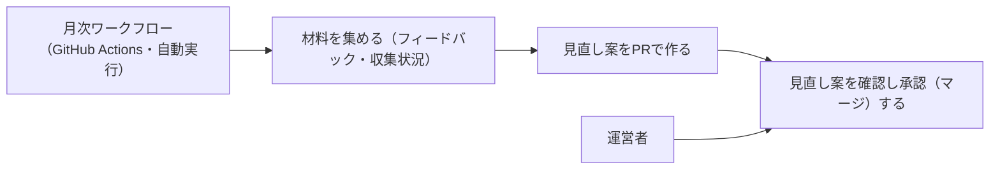

# 要件定義: 月次見直し(ジャンル・採用基準・執筆ルール)

> ステータス: 仕様確認中(未実装)

## サマリ
月に1回、運営者のフィードバックと収集状況(候補が見つからなかった枠)をもとに、ジャンル・注目テーマ・採用基準([content-selection](../content-selection/requirements.md))と執筆ルール([content-generation](../content-generation/requirements.md))の見直し案をPRで出す。反映は運営者が確認して承認(マージ)してから行う。trend-digestのsource-reviewと同じ運用にする。詳細は「[ユースケース図](#ユースケース図)」参照。

## 概要
- 機能名: 月次見直し(ジャンル・採用基準・執筆ルール)
- 目的: フィードバックと収集状況をもとに、選定と執筆の設定を、人の承認を経て月1回更新する
- 優先度: 中

## ユーザーストーリー
- 運営者として、月に1回、これまでの記事とフィードバックを振り返り、採用基準や書きぶりを調整したい
- 運営者として、候補が見つからない枠が続いているジャンル・時間軸に気づき、基準を見直したい
- 運営者として、これらの変更は、自分が内容を確認してから反映したい

## ユースケース図

上記は俯瞰用の図。正となる文章は下記「機能要件」「ビジネスルール・制約」。

## 機能要件

### 見直しの実行
- [1] 月1回、蓄積された運営者フィードバック([article-detail/requirements.md](../article-detail/requirements.md))と、直近1か月の収集状況([content-selection/requirements.md#収集状況の記録](../content-selection/requirements.md))をもとに見直し案を作る
- [2] 見直しの対象は「選定領域」(ジャンル・注目テーマ・採用基準・影響度の判定観点)と「生成領域」(執筆ルール)の2つとする。1つのPRに両方の変更を含めてよい
- [3] フィードバックをそれぞれ「選定領域」「生成領域」「どちらでもない」に振り分ける。どちらでもないもの(画面の不具合など)は見直し案の対象にせず、PR本文の表に「対象外」と記録する
- [4] 「材料」とは、直近1か月の運営者フィードバックが1件以上あること、または候補なしが続いている枠([content-selection/requirements.md#収集状況の記録](../content-selection/requirements.md)。収集失敗の枠はこの集計に含めない)が1つ以上あることを指す。材料が1件でもある月は、具体的な変更案(ファイルの差分)を必ずPRで出す。ただしテスト・lint・build等が通る変更案を作れなかった場合は、その理由を明記したPRを出してよい(具体的な変更案の代わりに理由を残す)。材料が1件もない月だけPRを作らない
- [5] 候補が見つからなかった枠が直近1か月続いているジャンル・時間軸がある場合は、その採用基準を確かめる見直し案を必ず含める

### 承認フロー
- [6] 見直し案のPRは自動マージせず、運営者が確認して承認(マージ)するまで反映しない(根拠: 設定の変更は以後のすべての記事の方向性を左右するため)

## ビジネスルール・制約
- [1] 見直しは月1回とする
- [2] PR本文には、判断材料として「対象のフィードバック・実績」「提案内容」「適用した場合の懸念」の3列の表を含める
- [3] 生成領域の見直し案では、著作権への配慮([content-generation/requirements.md#著作権への配慮](../content-generation/requirements.md))と、性・恋愛ジャンルの書き方の制約([content-generation/requirements.md#性恋愛ジャンルの書き方](../content-generation/requirements.md))を弱める変更を提案しない。そうした要望があった場合は、却下したことと理由をPR本文の表に残す

## 依存関係
- フィードバックの保存形式は[article-detail/requirements.md](../article-detail/requirements.md)に従う
- 見直しの対象そのものは[content-selection/requirements.md](../content-selection/requirements.md)・[content-generation/requirements.md](../content-generation/requirements.md)に定義される

## スコープ外
- 月1回より高い頻度での見直し
- 見直し案の自動マージ
- 画面表示・付箋・LINE配信の見直し
- 配信曜日・時間軸の切り替え方式そのものの変更(/consultで検討する重い判断のため)
