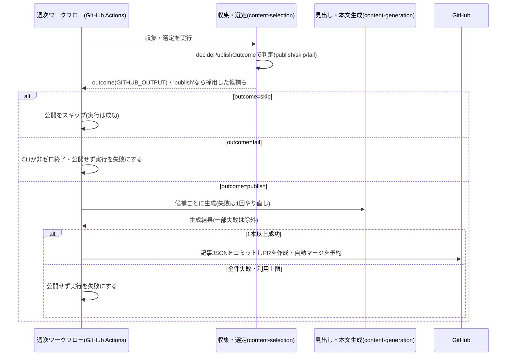

# 設計: 毎週木曜の記事自動生成・公開

## サマリ
GitHub Actionsのスケジュール実行が毎週木曜07:43(日本時間)頃に起動し、[content-selection](../content-selection/design.md)の収集・選定→[content-generation](../content-generation/design.md)の見出し・本文生成→記事データの組み立て→PR作成・自動マージまでを行う。完全自動マージの対象はこの週次記事PR(`future-digest/articles/**`ブランチ)だけで、trend-digestのweekly-publishと同じ例外運用とする。CIが失敗したPRはマージせず、失敗の概要をPRにコメントする。

主要な設計判断:
- 実行基盤・認証・自動マージの仕組みはtrend-digestと同じ構成をそのまま使う(新しい運用パターンを増やさない。architecture.md#2)
- 採用0件の回のうち、空いた枠がすべて候補なしの回だけを「正常なスキップ」(実行は成功)とし、収集失敗の枠が混在する回・全件の生成失敗・利用上限への到達は「失敗」(実行は失敗表示)として区別する【推測】
- 図: [1回分の記事を生成する処理](#1回分の記事を生成する処理)のシーケンス図

## 実行環境の前提

- ワークフロー本体は`.github/workflows/future-digest-weekly.yml`とし、`schedule`の`43 22 * * 3`(水曜22:43 UTC=木曜07:43 JST)で起動する。GitHub Actionsのスケジュール実行は毎時0分に遅れやすいため0分を避ける(trend-digestと同じ)。ai-dev-digestの日次実行(06:43 JST)と1時間ずらす。`workflow_dispatch`でも起動できるようにする(Secrets設定後の動作確認用。requirements.md#スコープ外の「手動での日時指定実行・即時の再実行機能」はこの動作確認用の手動起動を除く)
- GitHubへの書き込み(ブランチ作成・コミット・push・PR作成)には、このリポジトリのみに範囲を限定したfine-grained PAT(Contents・Pull requestsのwrite権限)を`FUTURE_DIGEST_GH_PAT`としてActions Secretsに保存して使う。既定の`GITHUB_TOKEN`で作ったPRでは後続の`ci.yml`が起動しないため使わない(trend-digestと同じ理由)
- 収集・生成はClaude Code CLIのヘッドレス実行で行い、既存の`CLAUDE_CODE_OAUTH_TOKEN`(運営者個人のPro/Maxサブスクリプション。ai-dev-digest・news-digest・trend-digestと共用)をそのまま使う。利用枠は他のdigestと共有する
- 実行指示の根拠は本specと参照先specのrequirements.md/design.mdとし、専用のプロンプトファイルを複製しない

## 処理フロー

### 1回分の記事を生成する処理
- 対象: 実行日(日本時間の日付)
- 手順:
  1. 作業用ブランチ`future-digest/articles/<実行日>`を作る
  2. [content-selection](../content-selection/design.md)の収集・選定CLI(`collect-and-select.ts`)を実行する。このCLIは選定の最後に、今回の回数・採用した候補・候補なしの枠・収集失敗の枠(分類ラベルつき)を選定結果として組み立て、それを本specの純粋関数`decidePublishOutcome(slotResults)`に渡して`'publish'`(採用した候補が1件以上ある)/`'skip'`(採用0件で、空になった枠がすべて候補なし)/`'fail'`(採用0件で、収集失敗の枠が1つ以上混在する。全枠が収集失敗の場合を含む)のいずれかを判定し(requirements.md#掲載件数の保証-3)、判定結果を`GITHUB_OUTPUT`に`outcome=publish|skip|fail`として書き出す。`'fail'`のときはCLIを非ゼロ終了で終える。判定ロジック自体はcontent-selection側には持たせず、本specの`decidePublishOutcome`だけが持つ【推測】
  3. ワークフローは`outcome`を見て分岐する。`'skip'`のときは記事を作らず後述「公開をスキップする処理」に進んでジョブを成功で終える。`'fail'`のときはCLIの非ゼロ終了でジョブが失敗するため追加の分岐は不要で、後述「収集失敗で実行を失敗させる処理」の記録がそのまま当たる。`'publish'`のときだけ選定結果(採用した候補)を使って次に進む
  4. 採用した候補ごとに[content-generation](../content-generation/design.md)の生成を行う。1本の生成が一時的な失敗に終わった場合は、同じ候補を最大2回まで(初回+1回)起動し直し、それでも失敗した候補は「生成に失敗した枠」として除き、次の候補に進む(requirements.md#掲載件数の保証-4)
  5. 生成に1本以上成功した場合は、記事データ(回数・発行日・予測・掲載できなかった枠)を組み立てる。掲載できなかった枠には、候補なしの枠・収集失敗の枠(分類ラベルつき)・生成に失敗した枠の3種を理由つきで入れ、その回に有効な全ジャンル×2時間軸の枠が過不足なく記事に現れるようにする。組み立てた記事を`content/future-digest/articles/<実行日>.json`に書き出す
  6. 全件の生成に失敗した場合、または利用上限への到達で続行できない場合は、記事を書き出さずに、理由を明示して実行を失敗として終える(requirements.md#掲載件数の保証-4)
  7. 記事ファイルをコミットしてブランチをpushする
- シーケンス図(俯瞰用。正は上記の手順の文章):


- 関連するビジネスルール: requirements.md#実行-1〜3、requirements.md#掲載件数の保証-1〜4

### PRを作成しCIの結果を待つ処理
- 対象: 上記で作ったブランチ
- 手順:
  1. `main`向けにPRを作る(タイトル例:「[future-digest] 2026-10-01を公開」。本文に回数・時間軸・採用件数・候補なしの枠の数・収集失敗の枠の数を書く)
  2. 既存の`ci.yml`(lint・test・check:spec-coverage・build)がこのPRにも通常どおり走る。記事データの検証は[article-detail/design.md](../article-detail/design.md)のビルド時検証がここで行う
  3. GitHub標準のauto-merge(`gh pr merge --auto --squash`)を有効にし、CIの成功を待って自動マージされるようにする
- 関連するビジネスルール: requirements.md#公開フロー-4

### PRを自動マージする処理(完全自動マージの例外運用)
- 対象: `future-digest/articles/**`ブランチからのPRのみ
- 手順:
  1. CIが成功すると、人の承認を待たずに`main`へマージされる
  2. 自動マージの対象はこのブランチパターンに限る。[source-review](../source-review/design.md)のPR(`future-digest/source-review/**`)は対象外で、運営者の承認を必須とする(requirements.md#自動マージの範囲-1)
  3. 範囲の限定はGitHub側の強制ではなく、このワークフローが`future-digest/articles/**`という名前のブランチからしかPRを作らないという運用で守る(trend-digestと同じ)
- 関連するビジネスルール: requirements.md#公開フロー-4、requirements.md#自動マージの範囲-1

### CI失敗時に記録する処理
- 対象: CIが失敗した週次記事PR
- 手順:
  1. マージせず、PRをオープンのまま残す
  2. `ci.yml`の完了(`workflow_run`)をきっかけに起動するジョブが、失敗したジョブ・ステップ名をPRにコメントとして追記する(trend-digestの`record-ci-failure`と同じ方法)。追加の通知手段は設けない
  3. 次回の実行はこのPRの状態に関わらず独立して行う
- 関連するビジネスルール: requirements.md#公開フロー-5

### 公開をスキップする処理
- 対象: 採用0件で、空になった枠がすべて候補なしだった回(収集失敗の枠は1つも含まない)
- 手順:
  1. 記事ファイルを作らず、PRも作らない
  2. スキップした旨を実行ログに残し、実行は成功として終える(失敗表示と区別するため)
  3. 記事ファイルがないため、この回は回数に数えられない([content-selection/design.md](../content-selection/design.md)「その回の時間軸2区分を決める処理」)
- 関連するビジネスルール: requirements.md#掲載件数の保証-3

### 収集失敗で実行を失敗させる処理
- 対象: 採用0件で、空になった枠に収集失敗の枠が1つ以上混在する回
- 手順:
  1. 記事ファイルを作らず、PRも作らない
  2. 収集失敗の枠(ジャンル・時間軸・分類ラベル)の一覧を理由として実行ログに残し、実行を失敗として終える(候補なしのみによる正常なスキップとは区別し、GitHub Actionsの失敗表示で気づけるようにするため)【推測】
  3. 記事ファイルがないため、この回は回数に数えられない
- 関連するビジネスルール: requirements.md#掲載件数の保証-2〜3

## エラーハンドリング

- CIの失敗は「CI失敗時に記録する処理」のとおりマージせずPRを残す
- 1本の生成の一時的な失敗は、1回やり直したうえでその1本だけを除く(生成に失敗した枠として記事に残す)。除いた枠(ジャンル・時間軸・理由)は実行ログに残す
- 全件の生成失敗・利用上限への到達は、同じ実行内でやり直しても回復しないため、公開せず理由を明示して実行を失敗として終える。利用上限への到達は検知した時点で残りの生成を打ち切る
- 採用0件の回で収集失敗の枠が1つ以上混在する場合は、「収集失敗で実行を失敗させる処理」のとおり公開せず実行を失敗として終える(候補なしのみのスキップと区別する)【推測】
- 収集・選定のスクリプトが失敗として終えた場合(利用上限・過去記事の読み込み失敗)も、公開せず実行を失敗として終える
- 同じ日付のブランチ・記事ファイルが既にある場合(手動の再実行など)は、上書きせずに実行を失敗として終える(同じ回を二重に公開しないため)
- 1回の実行が失敗・スキップしても、他の回の一覧・詳細ページの表示には影響しない

## 関連するファイル(抜粋)

```
.github/workflows/future-digest-weekly.yml (新規: 木曜に起動するワークフロー本体。publishジョブとrecord-ci-failureジョブ)
scripts/future-digest/collect-and-select.ts (content-selectionで新規: 収集・選定のCLI)
scripts/future-digest/generate-content.ts (content-generationで新規: 見出し・本文生成のCLI)
app/future-digest/lib/decidePublishOutcome.ts (新規: 選定結果から'publish'/'skip'/'fail'を判定する純粋関数。content-selectionの`collect-and-select.ts`から呼ばれる)
app/future-digest/lib/assembleArticle.ts (新規: 選定結果+生成結果から記事データを組み立てる純粋関数)
scripts/future-digest/write-article.ts (新規: assembleArticleの結果をcontent/future-digest/articles/<date>.jsonへ書き出すCLI)
content/future-digest/articles/<date>.json (新規: 生成される記事データ)
.github/workflows/ci.yml (既存: 変更不要)
```

## セキュリティ

- `FUTURE_DIGEST_GH_PAT`はActions Secretsに保存し、このリポジトリのみ・Contents/Pull requestsのwrite権限に限定したfine-grained PATとする。用途はこのワークフローと[source-review](../source-review/design.md)に限る
- `CLAUDE_CODE_OAUTH_TOKEN`は他のdigestと共用の運営者個人の認証情報。期限切れ時は再発行してSecretsを更新する
- CI失敗の記録で失敗ジョブを調べる処理は読み取りだけのため、既定の`GITHUB_TOKEN`を使う
- 自動マージの範囲はブランチ名の運用で守るため、PATの用途を上記に限定し、他のワークフローから使わない
- 記事内容の安全性(分量・出典・スキーマ)はarticle-detailのビルド時検証で担保し、本specは手順のまとめ役に徹する

## ログ

- 実行ごとに、実行日・回数・時間軸2区分・採用件数・候補なしの枠の数・収集失敗の枠の数(分類ラベル別)・生成に失敗した枠の数・PRのURL・結果(公開/スキップ/失敗)をワークフローの実行ログに出す
- 失敗で終える場合は、理由(採用0件で収集失敗が混在/全件の生成失敗/利用上限への到達/収集・選定の失敗/同じ日付が既にある)をエラーとして出す【推測】
