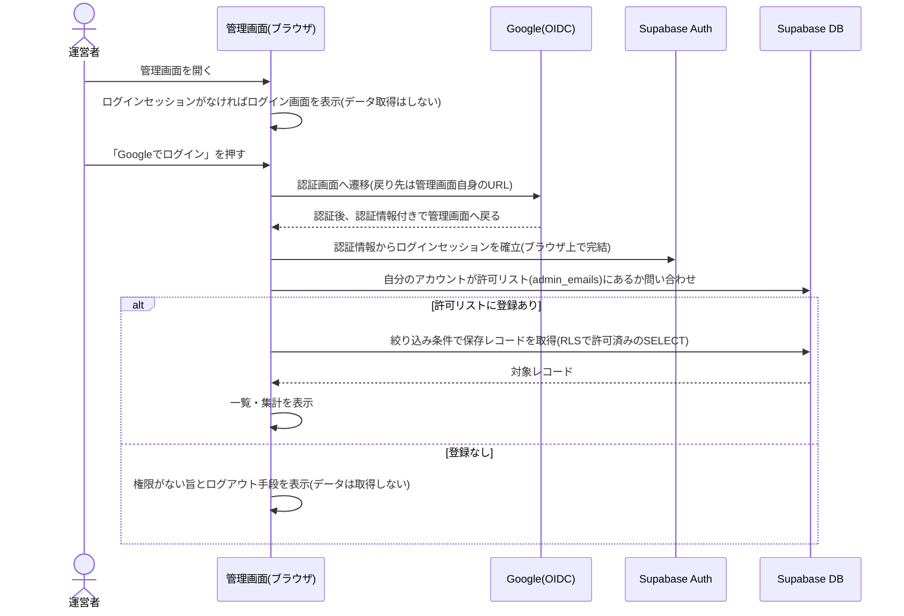
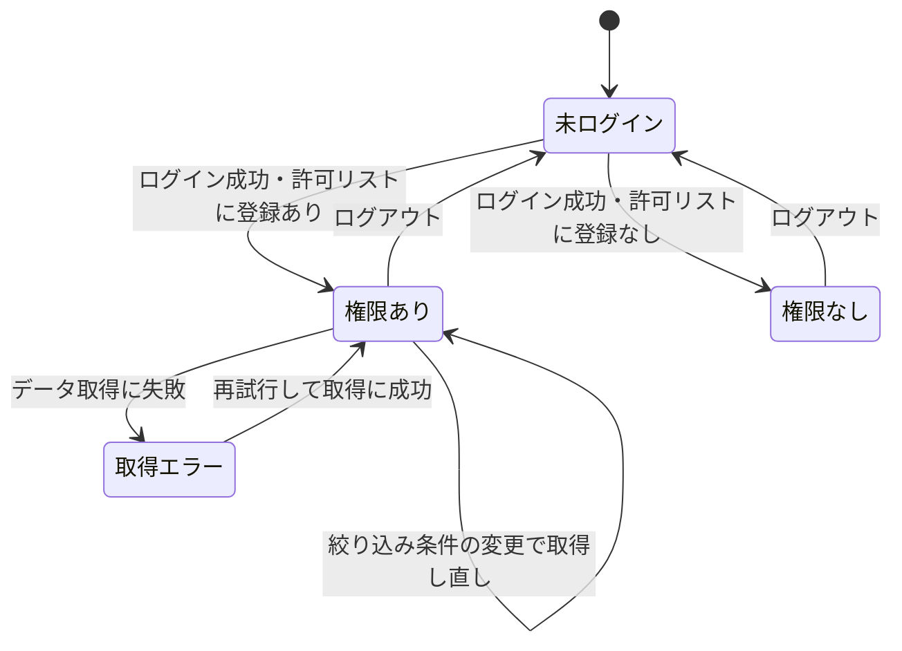

# 設計: 管理画面(保存データの閲覧・集計)

認証とDB読み取りの全体方針は[docs/adr/0006](../../../docs/adr/0006-admin-screen-oidc-rls.md)にあるため、ここでは重複させず、この画面固有の処理フロー・データの見せ方・セキュリティ上の具体策を書く。

## 処理フロー

ログインから閲覧までは、ブラウザ・Google・Supabase Auth・Supabase DBの複数アクターをまたぐ。全体のやり取りの俯瞰は次のシーケンス図のとおり(正は後続の各処理の手順の文章)。



### ログイン状態を判定して画面を出し分ける処理
- 対象: 管理画面を開いた時点のログインセッション
- 手順:
  1. ログインセッションがない場合は、ログインを促す画面(Googleでログインするボタンのみ)を表示し、データの取得は一切行わない
  2. ログインセッションがある場合は、後述「閲覧権限を確認する処理」に進む
- 関連するビジネスルール: requirements.md#ログイン・アクセス制御-1、requirements.md#アクセス制御・権限-1

### Googleでログインする処理
- 対象: ログイン画面の「Googleでログイン」操作
- 手順:
  1. Google OIDCによるログインを開始し、Googleの認証画面へ遷移させる。認証後の戻り先は管理画面自身のURLとする
  2. 戻ってきた際、URLに含まれる認証情報からログインセッションを確立する(サーバーを介さず、ブラウザ上で完結する)
  3. セッション確立後は「ログイン状態を判定して画面を出し分ける処理」を再度通す
- 関連するビジネスルール: requirements.md#ログイン・アクセス制御-2、requirements.md#認証手段とパスキー-2

### 閲覧権限を確認する処理
- 対象: ログイン済みユーザーのアカウント
- 手順:
  1. ログイン中のアカウントが閲覧を許可された運営者かどうかを、DB側の許可リスト(後述「データベース設計」の許可リストテーブル)に自分のアカウントが登録されているかを問い合わせて確認する
  2. 登録されていれば、一覧・集計の表示に進む
  3. 登録されていなければ、データを一切取得せず「閲覧する権限がありません」旨とログアウト手段を表示する
- 補足: この確認は利用者への案内(どの画面を出すか)のためであり、実際のデータ保護はDB側のルール(RLS)が担う。仮にこの画面側の確認を迂回してデータ取得を試みても、許可リストにないアカウントには1件も返らない(方針: [docs/adr/0006](../../../docs/adr/0006-admin-screen-oidc-rls.md))
- 関連するビジネスルール: requirements.md#ログイン・アクセス制御-3、requirements.md#アクセス制御・権限-2

### 保存データを絞り込んで取得する処理
- 対象: `ikukyu_results`テーブルの保存レコード
- 手順:
  1. 現在の絞り込み条件(期間の開始・終了、テストデータを含めるかどうか)を組み立てる
  2. 期間が指定されていれば保存日時がその範囲に入るものだけを対象にする。指定がなければ全期間を対象にする
  3. テストデータを含めない設定なら、テストデータでないものだけを対象にする。含める設定なら区別せず対象にする
  4. 対象レコードを保存日時の新しい順で取得する
  5. 取得に失敗した場合は、一覧・集計を表示せずエラー表示(後述エラーハンドリング)にする
- 関連するビジネスルール: requirements.md#一覧表示-2、requirements.md#絞り込み-1、requirements.md#絞り込み-2、requirements.md#テストデータの扱い、requirements.md#表示の初期値・区切り-1、requirements.md#表示の初期値・区切り-3

### 一覧を組み立てる処理
- 対象: 絞り込んで取得したレコード
- 手順:
  1. 各レコードを、保存日時・モード(ママ/パパ)・月給・出産予定日・育休開始日・育休終了予定日・合計給付額・合計取得日数・テストデータかどうか、の列に整形する
  2. 育休開始日が未設定(ママや未入力)の場合は、空であることが分かる表示にする
  3. 表示している件数を添える
- 関連するビジネスルール: requirements.md#一覧表示-1、requirements.md#一覧表示-3

### 集計を組み立てる処理
- 対象: 絞り込んで取得したレコード(一覧と同じ対象)
- 手順:
  1. 利用件数の合計を数える。あわせて期間内の推移を、選択期間が短いときは日別、長いときは月別の件数として数える。区切りの初期の目安は「指定期間がおおむね2か月以内なら日別、それより長い場合や全期間なら月別」とする(細かい件数を見たい短期間と、傾向を見たい長期間で見せ方を変えるため。運用しながら見直してよい)
  2. モード(ママ/パパ)ごとの件数と、全体に占める比率を出す
  3. 月給の平均を出す。あわせて、20万円未満 / 20万円以上30万円未満 / 30万円以上40万円未満 / 40万円以上50万円未満 / 50万円以上 の5区分ごとの件数を数える
  4. 合計給付額の平均と、合計取得日数の平均を出す
  5. 対象が0件のときは、平均や比率を割り算できないため、件数0・平均は算出対象なしと分かる表示にする
- 関連するビジネスルール: requirements.md#集計表示、requirements.md#表示の初期値・区切り-2、requirements.md#表示の初期値・区切り-3

### ログアウトする処理
- 対象: ログイン中のセッション
- 手順:
  1. ログインセッションを破棄し、ログインを促す画面に戻す
- 関連するビジネスルール: requirements.md#ログイン・アクセス制御-4

## エラーハンドリング

- 画面の状態は「未ログイン」「ログイン済みだが権限なし」「権限あり」「取得エラー」の4つに切り分ける。未ログインはログイン画面、権限なしは権限がない旨、取得エラーは再試行できるエラー表示、をそれぞれ出す
- 保存機能(save-result)は失敗を握りつぶす方針だが、管理画面は運営者自身が結果を見るための画面なので、データ取得の失敗は握りつぶさず画面に伝える(失敗したまま空の一覧を出すと、データが無いのか取得に失敗したのか区別できないため)
- 権限がない場合の「0件」と、権限はあるが条件に一致するデータが無い場合の「0件」は、前段の「閲覧権限を確認する処理」で切り分ける(権限確認を先に行い、権限ありと分かってから取得する)

## 関連するファイル(抜粋)

```
app/ikukyu/admin/page.tsx (新規: 管理画面本体。ログイン状態で表示を出し分けるクライアント画面)
app/ikukyu/admin/lib/auth.ts (新規: ログイン開始・ログアウト・セッション取得・閲覧権限の確認)
app/ikukyu/admin/lib/fetchResults.ts (新規: 絞り込み条件からレコードを取得する)
app/ikukyu/admin/lib/aggregate.ts (新規: 取得レコードから集計値を組み立てる純粋関数)
app/ikukyu/admin/lib/format.ts (新規: 一覧の各列の整形。日付・金額・空値の表示)
app/ikukyu/admin/components/LoginScreen.tsx (新規: ログイン/権限なしの案内画面)
app/ikukyu/admin/components/FilterBar.tsx (新規: 期間・テストデータ切替の操作)
app/ikukyu/admin/components/ResultsTable.tsx (新規: 一覧表)
app/ikukyu/admin/components/SummaryStats.tsx (新規: 集計表示)
app/lib/supabaseClient.ts (既存の共通クライアントを利用。ログイン後は同クライアントの通信に本人のセッションが自動的に付く)
```

## データベース設計

閲覧権限の判定に使う許可リストテーブルを新設する。`ikukyu_results`自体のカラムは変更しない(既存の保存カラムをそのまま読むだけ)。

### admin_emails (新規)
| カラム | 型 | 補足 |
|---|---|---|
| email | text, primary key | 閲覧を許可する運営者のメールアドレス |

- このテーブルの**中身(実際のメールアドレス)はマイグレーションに含めず、Supabaseダッシュボードから手入れで登録する**。理由: 本リポジトリは公開されており、個人のメールアドレスをgit管理下のSQLに書くと公開されるため。行の追加はスキーマ変更ではなくデータ投入なので、[supabase/migrations/README.md](../../../supabase/migrations/README.md)の「手動スキーマ変更をしない」ルールには抵触しない
- 空のまま公開しても安全側に倒れる(誰も`ikukyu_results`を読めない)。運営者が自分のメールを登録して初めて閲覧できるようになる

### マイグレーション(実装より先に単独PRで適用)

`is_test`導入時と同様、スキーマ・ポリシー変更は[docs/adr/0003](../../../docs/adr/0003-db-schema-migration-ci.md)に従い`supabase/migrations/`のSQLとしてコミットし、mainマージ時にCIが自動適用する。実装コードより先に単独PRで適用しておく(ポリシーが無い状態では取得が全拒否になり、実装の動作確認ができないため)。

```sql
-- 1. 閲覧許可リストのテーブル(中身のメールはここに書かず、後からダッシュボードで登録する)
create table admin_emails (email text primary key);
alter table admin_emails enable row level security;

-- 2. テーブルレベルのSELECT権限を authenticated に付与する(GRANT)。
--    行の絞り込みは下記3・4のRLSポリシーが行うため、GRANTを与えても
--    許可リストにないユーザーには1行も返らない。anonには付与しない(ADR-0004と同じく明示する)
grant select on admin_emails to authenticated;
grant select on ikukyu_results to authenticated;

-- 3. ログイン中の本人が「自分が許可リストにいるか」だけを確認できるポリシー
--    (他人のメールの列挙はできない。閲覧権限確認処理が使う)
create policy "authenticated can check own email" on admin_emails
  for select to authenticated using ((auth.jwt() ->> 'email') = email);

-- 4. ikukyu_results を、許可リストに載っているログインユーザーだけが全行SELECTできるポリシー
--    (anonのINSERT専用ポリシー・readonlyロールのSELECTポリシー(ADR-0004)とは別物。追加のみ)
create policy "admin can select all" on ikukyu_results
  for select to authenticated
  using ((auth.jwt() ->> 'email') in (select email from admin_emails));
```

T0(マイグレーション適用)の実機確認として、次を必ず確かめる(ADR-0006の懸念「anonでSELECTできないことを確認してからリリース」に対応):
- 許可リストに登録した本人のログインで`ikukyu_results`が全行SELECTできること
- 許可リストにないアカウントのログインでは0件になること
- 未ログイン(anon)では`ikukyu_results`・`admin_emails`のどちらもSELECTできないこと

## 画面設計

1画面に以下を縦に並べる(PC中心・スマホでも破綻しない範囲でよい: requirements.md#非機能要件-1)。

- 上部: ログイン中のアカウント表示とログアウト操作
- 絞り込み: 期間の開始・終了の指定、テストデータを含めるかの切替
- 集計: 利用件数の合計と推移、ママ/パパの件数と比率、月給の平均と5区分の分布、給付額・取得日数の平均
- 一覧: 保存日時・モード・月給・出産予定日・育休開始日・育休終了予定日・合計給付額・合計取得日数・テストデータかどうか の表と、表示件数

未ログイン時・権限なし時は上記を出さず、案内(ログインボタン/権限がない旨)だけを表示する。

## 状態管理

- ログインセッションと閲覧権限の判定結果、現在の絞り込み条件(期間・テストデータの有無)、取得したレコード、を画面(`page.tsx`)のローカル状態として持つ。複数画面をまたがないためグローバルな状態管理は使わない
- 絞り込み条件の初期値は、**期間=全期間(未指定)**、**テストデータ=含めない(除外)** とする(requirements.md#表示の初期値・区切り-1、requirements.md#テストデータの扱い-1)。この初期値のまま最初の取得・集計を行う
- 絞り込み条件が変わったら、その条件で取得し直し、一覧と集計の両方を更新する

画面の4状態(エラーハンドリング参照)の遷移の俯瞰は次のとおり(正はエラーハンドリング・処理フローの文章):



## セキュリティ

- 実際の閲覧制御はDB側のRLSで担保する(方針は[docs/adr/0006](../../../docs/adr/0006-admin-screen-oidc-rls.md))。画面側の権限確認・出し分けは案内のためのもので、突破されてもデータは返らない
- 運営者のメールアドレスを、gitにもクライアントのJSバンドルにも置かない。DBの`admin_emails`にだけ持つ(公開リポジトリ・公開配信されるJSのどちらからも露出させないため)。画面側は「ログイン中の自分のメールが許可リストにあるか」をDBに問い合わせるだけで、許可メールの値を自分で保持しない
- 管理画面が読むのは`ikukyu_results`の全レコード(月給・出産予定日などの機微な入力を含む)。閲覧できるのは許可リストの本人のみで、URLパラメータ等に機微情報を載せる経路は作らない
- この画面は静的ファイルとして公開配信され、URLは誰でも開ける。守るのは「開けること」ではなく「データが取得できること」である点を、実装でも取り違えない(未ログイン・権限なしでは取得処理を走らせない)

## ログ

- データ取得が想定外の理由で失敗した場合は、ブラウザのコンソールにエラー内容を出す。save-result(エンドユーザー利用でログを収集できないため出さない方針)と異なり、この画面の利用者は運営者自身であり、自分のブラウザの開発者ツールで原因を確認できるため、出力する価値がある
- ログには`ikukyu_results`の中身(月給など)を含めない。失敗の事実と種別(通信エラー/権限拒否など)にとどめる
