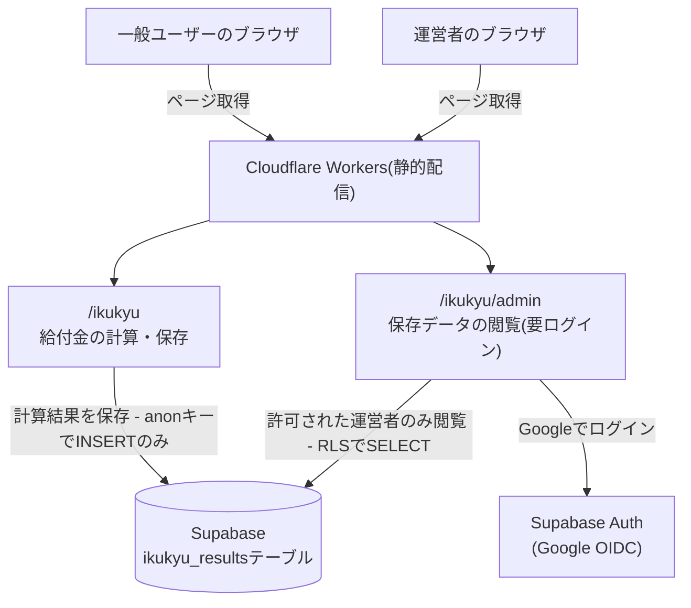
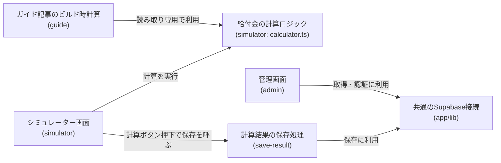
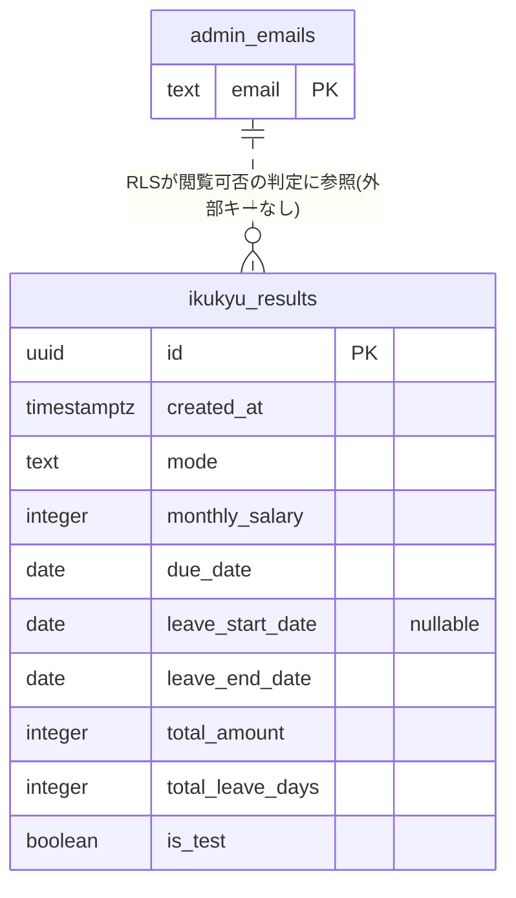

# アーキテクチャ: ikukyu

## 1. 概要
産休・育休中にもらえる給付金の総額と内訳を事前に把握できる、育休給付金シミュレーター。URL: `/ikukyu`

## 2. アーキテクチャの目的
- 給付率・上限額は法改正の影響を受けやすいため、計算ロジックの正確性と検証のしやすさを最優先する
- 個人開発の無料枠運用を継続できる構成にする

## 3. 設計方針
- 給付金の種類(出産手当金・出生時育児休業給付金・育児休業給付金 前期/後期)ごとに計算関数を分離し、単体テストしやすくする([calculator.ts](../../app/ikukyu/lib/calculator.ts))
- 計算結果の保存は分析用途のベストエフォート処理とし、保存の成否が画面上の計算結果表示をブロックしないようにする

## 4. システム構成図

この図の正となる文章は下記「[5. アーキテクチャ概要](#5-アーキテクチャ概要)」と各specの設計書。このアプリから見た構成のみを描いており、プロジェクト共通インフラ(CI・デプロイ経路・無料枠の境界)の詳細は[docs/architecture/](../../docs/architecture/infrastructure.md)を参照。

## 5. アーキテクチャ概要
Next.jsの静的エクスポートをCloudflare Workersで配信しており、サーバー処理は持たない。給付金の計算はブラウザ内(`calculator.ts`)で完結し、入力内容と計算結果はブラウザから直接Supabaseの`ikukyu_results`テーブルにINSERTする。

## 6. 採用技術
| 技術 | 用途 |
|---|---|
| Next.js(静的エクスポート) | `/ikukyu`画面の描画 |
| Supabase | 計算結果の保存(`ikukyu_results`テーブル) |
| Tailwind CSS | スタイリング |

選定理由はプロジェクト横断のため[関連ADR](#11-関連adr)を参照。

## 7. 機能マップ
| spec | 役割 | 依存 |
|---|---|---|
| [simulator](simulator/requirements.md) | 給付金額を計算し画面に表示する | - |
| [save-result](save-result/requirements.md) | simulatorの入力・計算結果をDBに保存する | simulatorの計算結果を受け取る([simulator/requirements.md#機能要件-2](simulator/requirements.md), [#機能要件-3](simulator/requirements.md)) |
| [admin](admin/requirements.md) | 保存データを運営者本人だけがログインして一覧・集計で閲覧する管理画面 | save-resultが保存した内容を表示([save-result/requirements.md#機能要件-1](save-result/requirements.md)) |
| [guide](guide/requirements.md) | 計算エンジンの試算値を核にしたSEO向け解説記事(`/ikukyu/guide/*`) | simulatorの計算関数を読み取り専用で利用(給付率・上限額のルールは[simulator/requirements.md](simulator/requirements.md)を正とする) |

## 8. コンポーネント図
specをまたいで共有されるコンポーネント・libの依存関係。

この図の正となる文章は「[7. 機能マップ](#7-機能マップ)」の依存列と、各specのrequirements.mdの依存関係。

## 9. ディレクトリ構成
CLAUDE.mdの一般規約(`components/`,`lib/`)通りで、逸脱なし。

## 10. 外部サービス
| サービス | 用途 |
|---|---|
| Supabase(`ikukyu_results`テーブル) | 計算結果の保存・分析用データの蓄積 |
| Supabase Auth(Google OIDC) | 管理画面(admin)の運営者ログイン |

このアプリが使うテーブルのアプリ横断ER図。2テーブルに外部キーの関係はなく、`admin_emails`はRLSポリシーが`ikukyu_results`の閲覧可否判定に参照する。

各カラムの正となる文章はspec単位のカラム表([save-result/design.md#データベース設計](save-result/design.md#データベース設計)、[admin/design.md#データベース設計](admin/design.md#データベース設計))。

## 11. 関連ADR
- [0001-user-input-database.md](../../docs/adr/0001-user-input-database.md) — 計算結果保存のDB選定(Supabase採用)
- [0006-admin-screen-oidc-rls.md](../../docs/adr/0006-admin-screen-oidc-rls.md) — 管理画面(admin)の認証(Google OIDC)とDB読み取り(RLS)方針

## 12. セキュリティ
入力される月給・出産予定日などは機微な個人情報になり得るため、URLパラメータに含めずSupabaseへの直接POSTのみで扱う。`anon`キー(一般ユーザー)は`ikukyu_results`へのINSERT専用で、SELECT/UPDATEはできない。閲覧は管理画面(admin)からのみ可能で、Supabase Authでログインした運営者本人だけが、RLSポリシーで許可されて`ikukyu_results`をSELECTできる(認証・RLSの方針は[関連ADR](#11-関連adr)の0006、運営者メールを露出させない設計は[admin/design.md](admin/design.md#セキュリティ))。

## 13. 技術的制約
給付率・賃金日額の上限額は施行時点の雇用保険法・健康保険法に基づく(詳細は[simulator/requirements.md](simulator/requirements.md)のビジネスルール)。法改正があった場合、該当specの計算ルール・上限額の見直しが必要。

## 14. 用語集
| 用語 | 説明 |
|---|---|
| 産後パパ育休 | 出生時育児休業給付金の対象となる、子の出生後8週間以内の休業制度 |
| 賃金日額 | 給付金計算のベースとなる、月給から算出される1日あたりの賃金額 |
| 上限適用 | 賃金日額が制度上の上限額を超えたため、上限額を基準に給付額を計算した状態 |