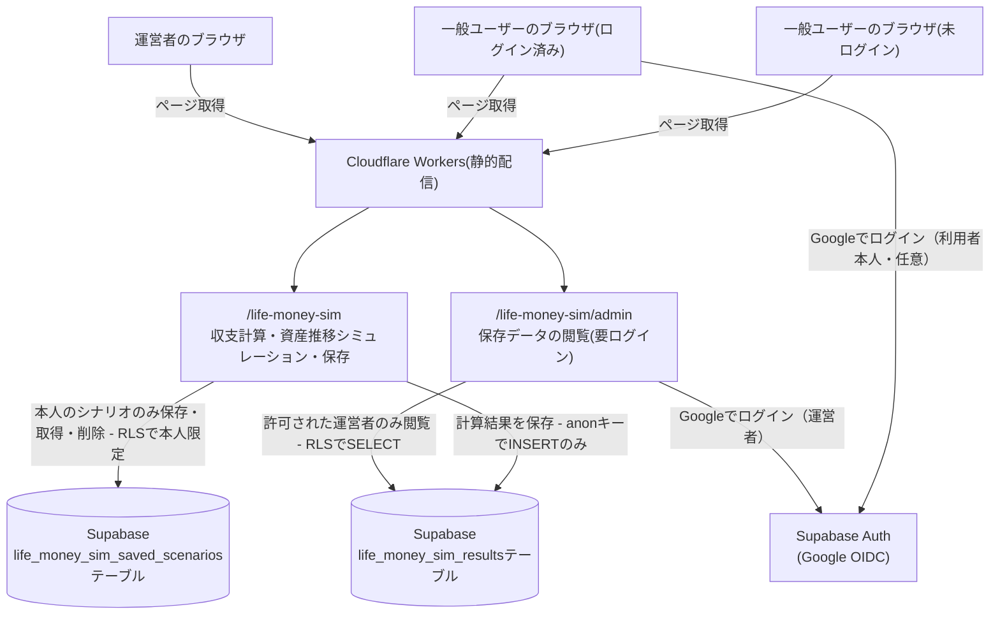
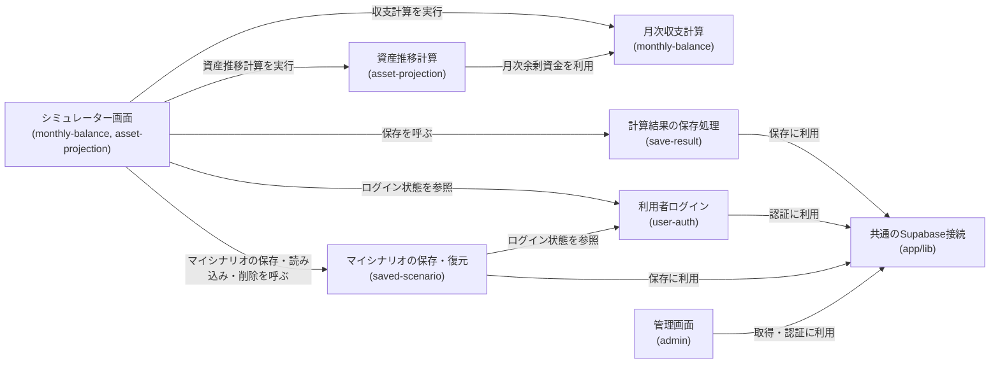
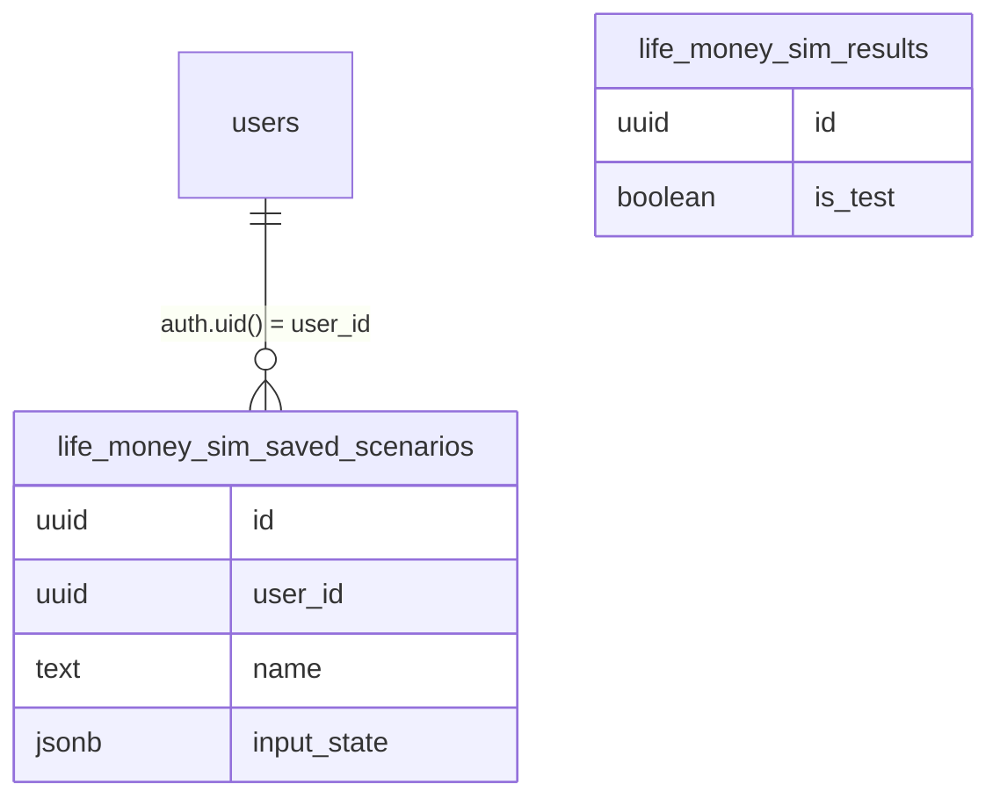

# アーキテクチャ: life-money-sim

## 1. 概要
毎月の収支から余剰資金を算出し、開始資産額に積み上げて将来の資産推移を月単位でシミュレーションするツール。貯蓄のみ/資産運用(複利)の切り替えができる。URL: `/life-money-sim`

## 2. アーキテクチャの目的
- 収支計算(monthly-balance)と資産推移計算(asset-projection)を分離し、それぞれ単体でテストしやすくする
- 保存・管理画面は`ikukyu`アプリで確立済みの構成(anonキーでのINSERT専用+管理者のみRLSでSELECT)をそのまま踏襲し、新たな認証・DB設計のレビューコストをかけない

## 3. 設計方針
- 収支(収入・個人支出・家計支出)の計算関数と、資産推移(月次積み上げ・複利計算)の計算関数を分離する([monthly-balance](monthly-balance/requirements.md), [asset-projection](asset-projection/requirements.md))
- 計算結果の保存は分析用途のベストエフォート処理とし、保存の成否が画面上の計算結果表示をブロックしないようにする(`ikukyu/save-result`と同じ方針)

## 4. システム構成図

この図の正となる文章は下記「[5. アーキテクチャ概要](#5-アーキテクチャ概要)」と各specの設計書。このアプリから見た構成のみを描いており、プロジェクト共通インフラの詳細は[docs/architecture/](../../docs/architecture/infrastructure.md)を参照。

## 5. アーキテクチャ概要
Next.jsの静的エクスポートをCloudflare Workersで配信しており、サーバー処理は持たない。収支計算・資産推移計算はブラウザ内で完結し、入力内容と計算結果はブラウザから直接Supabaseの`life_money_sim_results`テーブルにINSERTする。管理画面は`ikukyu/admin`と同じくGoogle OIDCでログインした運営者のみがRLS経由で閲覧できる。あわせて、一般利用者も任意でGoogle OIDCでログインでき、ログインした本人のシナリオ(`life_money_sim_saved_scenarios`)のみをRLS経由で保存・取得・削除できる(運営者向けの許可リストは適用されない)。

## 6. 採用技術
| 技術 | 用途 |
|---|---|
| Next.js(静的エクスポート) | `/life-money-sim`画面の描画 |
| Supabase | 計算結果の保存(`life_money_sim_results`テーブル) |
| Tailwind CSS | スタイリング |

選定理由はプロジェクト横断のため[関連ADR](#11-関連adr)を参照。

## 7. 機能マップ
| spec | 役割 | 依存 |
|---|---|---|
| [monthly-balance](monthly-balance/requirements.md) | 収入・支出を入力し、月次余剰資金を計算する | - |
| [asset-projection](asset-projection/requirements.md) | 開始資産額と月次余剰資金を積み上げ、資産推移を月単位でシミュレーションする | monthly-balanceの月次余剰資金を受け取る([monthly-balance/requirements.md#余剰資金の計算-1](monthly-balance/requirements.md)) |
| [save-result](save-result/requirements.md) | 入力・計算結果をDBに保存する | monthly-balance・asset-projectionの入力/結果を受け取る([monthly-balance/requirements.md#余剰資金の計算-1](monthly-balance/requirements.md), [asset-projection/requirements.md#前提入力-1](asset-projection/requirements.md)) |
| [admin](admin/requirements.md) | 保存データを運営者本人だけがログインして一覧・集計で閲覧する管理画面 | save-resultが保存した内容を表示([save-result/requirements.md#機能要件-1](save-result/requirements.md)) |
| [user-auth](user-auth/requirements.md) | 一般利用者が任意でGoogleアカウントにログインする | - |
| [saved-scenario](saved-scenario/requirements.md) | ログイン中の利用者が入力値一式に名前を付けて保存・一覧・読み込み・削除する | user-authのログイン状態が前提([user-auth/requirements.md#ログイン・ログアウト](user-auth/requirements.md))。保存対象はmonthly-balance・asset-projectionの入力値([monthly-balance/requirements.md#収入](monthly-balance/requirements.md), [asset-projection/requirements.md#前提入力](asset-projection/requirements.md)) |
| [usage-guide](usage-guide/requirements.md) | 各カードのコンテキストヘルプ(？アイコン)・使い方バナー・用語集を表示する | monthly-balance・asset-projectionの各カードに「？」アイコンを追加する表示専用機能で、機能呼び出しは発生しない([monthly-balance/requirements.md](monthly-balance/requirements.md), [asset-projection/requirements.md](asset-projection/requirements.md))。用語集の「マイシナリオ」はsaved-scenarioの機能を指す文言参照のみ([saved-scenario/requirements.md](saved-scenario/requirements.md)) |

## 8. コンポーネント図

この図の正となる文章は「[7. 機能マップ](#7-機能マップ)」の依存列と、各specのrequirements.mdの依存関係。

## 9. ディレクトリ構成
CLAUDE.mdの一般規約(`components/`,`lib/`)通りで、逸脱なし。

## 10. 外部サービス
| サービス | 用途 |
|---|---|
| Supabase(`life_money_sim_results`テーブル) | 計算結果の保存・分析用データの蓄積 |
| Supabase(`life_money_sim_saved_scenarios`テーブル) | ログイン中の利用者本人のマイシナリオ(入力値一式)の保存 |
| Supabase Auth(Google OIDC) | 管理画面(admin)の運営者ログイン(`ikukyu/admin`と同じアカウントを使用)、および一般利用者の任意ログイン(user-auth。運営者用の許可リストは適用されない別用途) |

閲覧権限の判定に使う許可リスト(`admin_emails`)は新設せず、`ikukyu`アプリで作成済みのテーブルを共用する(管理画面向けの用途のみ。利用者ログインには使わない)。カラム定義は[save-result/design.md#データベース設計](save-result/design.md#データベース設計)・[saved-scenario/design.md#データベース設計](saved-scenario/design.md#データベース設計)を参照。

`life_money_sim_results`は匿名保存(anonキーでINSERTのみ)のため`auth.users`とのリレーションを持たない。`life_money_sim_saved_scenarios`のみ`auth.users`と1対多の関係を持つ(1ユーザーが複数件保存できる)。

## 11. 関連ADR
- [0001-user-input-database.md](../../docs/adr/0001-user-input-database.md) — 計算結果保存のDB選定(Supabase採用)。ログイン機能を持つアプリでの`user_id`紐付け・RLS方針もここに含まれる
- [0006-admin-screen-oidc-rls.md](../../docs/adr/0006-admin-screen-oidc-rls.md) — 管理画面(admin)の認証(Google OIDC)とDB読み取り(RLS)方針。利用者ログイン(user-auth)は同じOIDC基盤を使うが、許可リストによるアクセス制御は適用しない点で異なる

## 12. セキュリティ
入力される収入・支出額・資産額・家族の生年月などは機微な情報になり得るため、URLパラメータに含めずSupabaseへの直接POSTのみで扱う。`anon`キー(一般ユーザー)は`life_money_sim_results`へのINSERT専用で、SELECT/UPDATEはできない。閲覧は管理画面(admin)からのみ可能で、Supabase Authでログインした運営者本人だけが、RLSポリシーで許可されて`life_money_sim_results`をSELECTできる(認証・RLSの方針は[関連ADR](#11-関連adr)の0006)。

`life_money_sim_saved_scenarios`は運営者向けの許可リストとは別の権限モデルを用いる。ログインした利用者本人が、RLSポリシー(`auth.uid() = user_id`)により自分が保存したシナリオのみをSELECT/INSERT/DELETEできる(他人のシナリオは一切参照・変更できない。UPDATEは現時点で使う処理がないため誰にも付与していない)。生年月・内訳名を含む機微な内容を保存するため、この本人限定のRLSが唯一の保護手段となる(詳細は[saved-scenario/design.md#セキュリティ](saved-scenario/design.md#セキュリティ))。

## 13. 技術的制約
特になし(法令・制度に基づく計算ルールはなく、汎用的な収支・資産計算のみを扱う)。

## 14. 用語集
| 用語 | 説明 |
|---|---|
| 差引後余剰 | 月次余剰資金(賞与抜き)に当月の賞与を加え、当月のイベント支出を差し引いた金額。資産推移の月次積み上げ額 |
| 貯蓄のみモード | 運用による増減を考慮せず、元本と余剰資金の積み上げのみで資産推移を計算する表示モード |
| 資産運用モード | 設定した想定利回り(年率)で複利運用した場合の資産推移を計算する表示モード |
| マイシナリオ | ログイン中の利用者が、入力値一式に名前を付けて保存・一覧・読み込み・削除できる機能([saved-scenario](saved-scenario/requirements.md)) |
