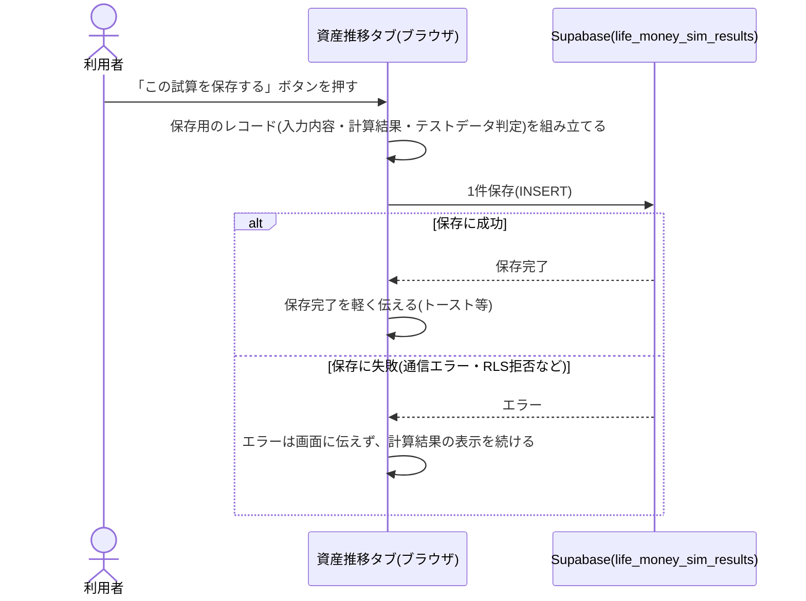

# 設計: 計算結果の保存

## 処理フロー

### テストデータかどうかを判定する処理
- 対象: 保存を実行する時点の実行環境と表示中ページのURL
- 手順:
  1. 開発サーバー(`npm run dev`)で動いているビルドならテストデータと判定する
  2. そうでなければ、表示中ページのURLのクエリに`test=1`が付いているかを見て、付いていればテストデータと判定する
  3. どちらにも該当しなければテストデータではないと判定する
- 関連するビジネスルール: requirements.md#テストデータの判定-1〜3(`ikukyu/save-result/design.md#テストデータかどうかを判定する処理`と同一ロジック)

### 試算結果を保存する処理
- 対象: 「資産推移」タブの入力内容と計算結果
- 手順:
  1. 利用者が「この試算を保存する」ボタンを押したタイミングで保存を実行する(常時自動保存はせず、明示的な操作のみを保存の起点とする)【推測: 保存タイミング】
  2. 入力内容(収入・個人支出/家計支出の内訳合計、配偶者の有無、子どもの人数、開始資産額、運用モードと(資産運用モードの場合の)想定利回りの値、登録されているイベント件数)と、計算結果のうち最終月時点の資産額・月次余剰資金(賞与抜き)・テストデータ判定の結果(`is_test`)を1件のレコードとしてまとめる【推測: 保存項目の粒度。個々の内訳の名称・金額はテキストとして保存せず、集計値のみ保存する(機微な内訳の詳細まで保存しない)】
  3. Supabaseの`life_money_sim_results`テーブルへの保存を試みる
  4. 保存に失敗した場合は、エラーを画面に伝えず処理を終える(計算結果の表示はそのまま続ける)
- 関連するビジネスルール: requirements.md#機能要件-1、requirements.md#機能要件-2、requirements.md#エッジケース・例外処理-1



## エラーハンドリング
- 保存は分析用のベストエフォート処理のため、失敗の種類(通信エラー・RLS拒否・カラム不一致など)を問わずエラーをユーザーに伝えず、計算結果の表示を継続する(`ikukyu/save-result`と同一方針)
- 保存ボタンは連打による重複INSERTを防ぐため、送信中は再度押せないようにする【推測】

## 関連するファイル(抜粋)
```
app/life-money-sim/lib/saveResult.ts (新規: 保存用レコードの組み立て・テストデータ判定・保存処理)
app/life-money-sim/lib/types.ts (既存: 保存対象の型を追加)
app/lib/supabaseClient.ts (既存の共通クライアントを利用)
app/life-money-sim/components/SaveButton.tsx (新規: 「この試算を保存する」ボタンと保存完了/送信中の表示)
```

## データベース設計

### life_money_sim_results (新規)
| カラム | 型 | 補足 |
|---|---|---|
| id | uuid | 共通カラム(`docs/adr/0001`)。DB側で自動採番 |
| created_at | timestamptz | 共通カラム。DB側で自動設定 |
| has_spouse | boolean | 配偶者の有無 |
| children_count | integer | 子どもの人数(0〜3) |
| monthly_salary | integer | 手取り月給 |
| personal_expense_monthly | integer | 個人支出の月合計 |
| household_expense_total | integer, nullable | 家計支出全体の合計。配偶者なしはNULL |
| my_household_share | integer, nullable | 自分の家計負担額。配偶者なしはNULL |
| starting_asset | integer | シミュレーション開始資産額 |
| investment_mode | boolean | 資産運用モードで保存されたかどうか |
| expected_annual_rate | numeric, nullable | 想定利回り(年率)。貯蓄のみモードの場合はNULL |
| event_count | integer | 登録されていたイベント件数 |
| final_month_asset | integer | 表示範囲最終月時点の資産額 |
| monthly_surplus | integer | 月次余剰資金(賞与抜き) |
| is_test | boolean, not null, default false | テスト・動作確認データの判別フラグ(`docs/adr/0001`) |

### マイグレーション(実装より先に単独PRで適用)
`ikukyu_results`導入時と同様、スキーマ変更は`docs/adr/0003`に従い`supabase/migrations/`のSQLファイルとしてコード管理し、mainマージ時にCIが自動適用する。テーブル作成時からRLSを有効化し、`anon`にはINSERT権限のみ付与する(`docs/adr/0001`の共通方針)。

```sql
-- life_money_sim_results テーブルの新設
-- (仕様: specs/life-money-sim/save-result/design.md「データベース設計」、
--  方針: docs/adr/0001-user-input-database.md)

create table life_money_sim_results (
  id uuid primary key default gen_random_uuid(),
  created_at timestamptz not null default now(),
  has_spouse boolean not null,
  children_count integer not null,
  monthly_salary integer not null,
  personal_expense_monthly integer not null,
  household_expense_total integer,
  my_household_share integer,
  starting_asset integer not null,
  investment_mode boolean not null,
  expected_annual_rate numeric,
  event_count integer not null,
  final_month_asset integer not null,
  monthly_surplus integer not null,
  is_test boolean not null default false
);

alter table life_money_sim_results enable row level security;

-- anonはINSERTのみ許可(閲覧・改ざんはできない。docs/adr/0001の共通方針)
grant insert on life_money_sim_results to anon;
create policy "anon can insert" on life_money_sim_results
  for insert to anon with check (true);
```

## セキュリティ
- `anon`キー(一般ユーザー)は`life_money_sim_results`へのINSERT専用で、SELECT/UPDATE/DELETEはできない(`docs/adr/0001`)。閲覧は`admin`からのみ可能
- 保存する項目は収入・支出・資産額の集計値にとどめ、内訳の名称(サウナ、お年玉など自由記述のテキスト)は保存しない。自由記述テキストをそのままDBに保存すると、他の機微情報と組み合わさった際に個人を特定しやすくなるリスクや、想定しない内容が書き込まれるリスクがあるため
- 生年月そのものは保存せず、年齢の分布が推測できる「子どもの人数」のみを保存する(生年月は特に個人を特定しやすい情報のため)【推測】
- `test=1`パラメータの悪用可能性・実データ喪失防止の考え方は`ikukyu/save-result/design.md#セキュリティ`と同一

## ログ
- 保存失敗時もコンソール等へのログ出力は行わない(`ikukyu/save-result`と同一方針。静的配信でサーバーを持たず、ブラウザのコンソールログは運営者が収集できないため)

## 依存関係
- 保存対象の入力・計算結果の内容は`monthly-balance/design.md`および`asset-projection/design.md`の計算結果を参照する
