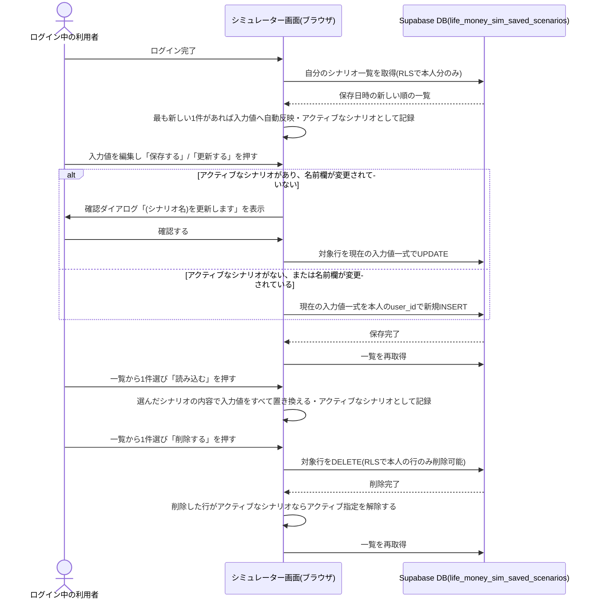
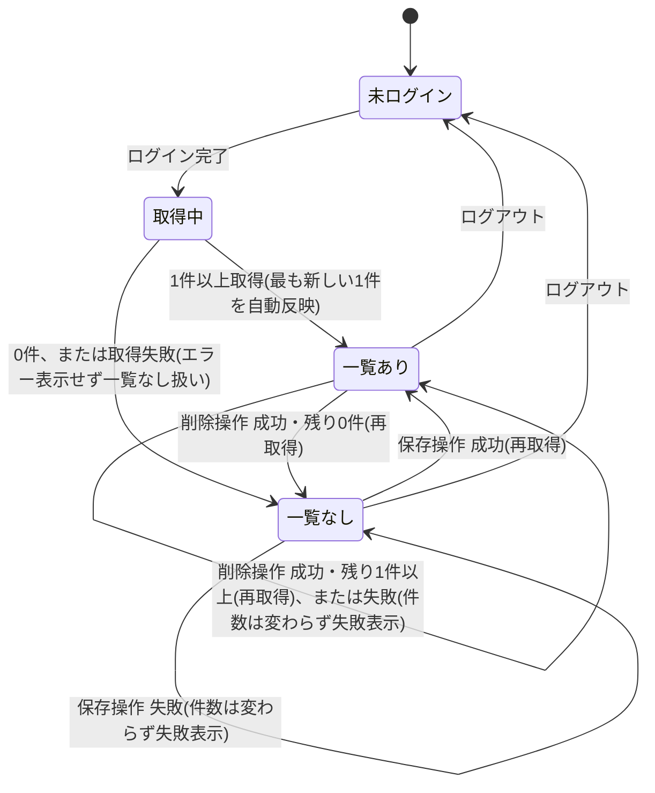

# 設計: マイシナリオ(入力値の名前付き保存・復元)

ログイン状態の判定は[user-auth/design.md](../user-auth/design.md)に従う。ここでは、ログイン中の利用者本人に紐づく入力値一式の保存・一覧・読み込み・削除・自動読み込みの処理フローと、保存先テーブルの設計を書く。

## 処理フロー



### マイシナリオ操作の表示を出し分ける処理
- 対象: ログイン状態([user-auth](../user-auth/design.md)のセッション)
- 手順:
  1. ログイン中でない場合、マイシナリオの操作(名前を付けて保存・保存済み一覧)自体を表示せず、代わりに「この試算を実行する」ボタンの近くにログイン誘導の案内(文言例: 「ログインすると賞与・イベント名目や生年月も含めて全項目を保存・復元できます」+ログインボタン)を表示する
  2. ログイン中の場合、既存の「この試算を実行する」(匿名保存)とは別の部品として、マイシナリオの操作を表示する(ログイン誘導の案内は表示しない)
- 関連するビジネスルール: requirements.md#マイシナリオの表示-1、requirements.md#マイシナリオの表示-2

### ログイン直後に保存済み一覧を取得し自動反映する処理
- 対象: ログインが完了した直後のタイミング
- 手順:
  1. ログイン中の本人が保存したシナリオを、保存日時の新しい順に取得する
  2. 1件以上あれば、最も新しい1件の内容で、画面上のすべての入力値(後述「保存対象の入力値」)を置き換え、そのシナリオをアクティブなシナリオとして記録する(後述「アクティブなシナリオを管理する処理」)
  3. 1件もなければ、何も置き換えず入力欄は現在の値(初期値)のままにする(アクティブなシナリオも指定しない)
  4. 取得に失敗した場合は、自動反映を行わず、入力欄は現在の値のままにする(失敗をエラー表示せず握りつぶす。理由は後述エラーハンドリング)
- 関連するビジネスルール: requirements.md#ログイン時の自動読み込み-8、requirements.md#ログイン時の自動読み込み-9

### アクティブなシナリオを管理する処理
- 対象: 「今の入力値がどの保存済みシナリオに由来するか」を表す状態(シナリオIDを保持。以下「アクティブなシナリオ」)
- 手順:
  1. 自動読み込み(直前の処理)、または一覧からの「読み込む」操作で入力値を置き換えたとき、その読み込んだシナリオのIDをアクティブなシナリオとして記録する
  2. 名前を付けて新規保存した直後は、新しく作成したシナリオのIDをアクティブなシナリオとして記録する(以後の保存はそのシナリオを上書き対象にする)
  3. アクティブなシナリオを削除した場合、アクティブなシナリオの指定を解除する(`null`に戻す)
  4. ログアウトした場合、アクティブなシナリオの指定を解除する
  5. 入力欄を編集しただけ(保存・読み込み・削除以外の操作)ではアクティブなシナリオの指定を変えない(根拠: 「読み込んだシナリオを編集して上書き保存する」という、機能要件[10]〜[12]が想定する主要な流れを成立させるため)
- 関連するビジネスルール: requirements.md#上書き保存-10、requirements.md#上書き保存-15

### 名前を付けて保存する処理
- 対象: マイシナリオの保存操作
- 手順:
  1. 名前が未入力の場合は保存を実行しない(送信操作自体を無効にするか、押しても何も起きない扱いとする)
  2. 名前入力欄は、アクティブなシナリオがあればその名前を初期値として表示し、なければ空欄から始める(requirements.md#上書き保存-11)
  3. 保存操作時、アクティブなシナリオがあり、かつ名前欄がそのシナリオの名前から変更されていなければ「上書き更新」と判定する。それ以外(アクティブなシナリオがない、または名前欄が変更されている)は「新規保存」と判定する
  4. 上書き更新と判定した場合、実行前に対象のシナリオ名を含む確認ダイアログ(文言例:「『{シナリオ名}』を更新します。よろしいですか?」、`window.confirm`で簡易的に実装する)を表示する。利用者が確認した場合のみ、対象行を現在の入力値一式でUPDATEする(名前は変更しない)
  5. 新規保存と判定した場合、確認ダイアログは表示せず、現在の入力値一式を、入力された名前を付けてログイン中の本人のシナリオとして新規保存する。保存後、新しく作成したシナリオをアクティブなシナリオにする(前述「アクティブなシナリオを管理する処理」)
  6. 保存(上書き更新・新規保存とも)に成功したら一覧を再取得し、保存完了が分かる表示をする
  7. 保存に失敗した場合は、失敗が分かる表示をする(この保存は本人が明示的に指示した操作であり、匿名保存(save-result)のようなベストエフォート方針は取らない。理由は後述エラーハンドリング)
- 関連するビジネスルール: requirements.md#保存-3、requirements.md#保存-4、requirements.md#上書き保存-11〜14

### 保存対象の入力値
以下、`app/life-money-sim/lib/types.ts`の各入力型をまとめて1件のシナリオとする(`page.tsx`が保持する状態と1対1に対応する)。
- 収入(`IncomeInput`)、個人支出の内訳(`PersonalExpenseInput`)、家計支出の内訳(`HouseholdExpenseInput`)、家族構成(`FamilyProfileInput`)、開始資産額・開始年月・表示範囲(年数)(`StartingAssetInput`)、賞与の登録内容(`BonusEntry[]`)、イベントの登録内容(`EventEntry[]`)、定期的な収入・支出の登録内容(`RecurringEntry[]`)、貯蓄のみ/資産運用モードと想定利回り(`InvestmentModeInput`)
- 表示単位の切り替え(月次/年次)は入力値ではなく表示設定のため保存対象に含めない
- 関連するビジネスルール: requirements.md#保存-3、requirements.md#保存内容の範囲-1

### 一覧を組み立てる処理
- 対象: 取得したシナリオ一覧
- 手順:
  1. 各シナリオを、名前・保存日時の行に整形し、保存日時の新しい順に並べる
  2. 各行に「読み込む」「削除する」の操作を添える
- 関連するビジネスルール: requirements.md#一覧・読み込み・削除-5

### 読み込む処理
- 対象: 一覧から選んだ1件のシナリオ
- 手順:
  1. 選んだシナリオの入力値一式で、画面上の該当するすべての入力状態を置き換える
- 関連するビジネスルール: requirements.md#一覧・読み込み・削除-6

### 削除する処理
- 対象: 一覧から選んだ1件のシナリオ
- 手順:
  1. 対象のシナリオを削除する(RLSにより本人の行のみ削除できる)
  2. 削除に成功したら一覧を再取得し、削除した行がアクティブなシナリオであればアクティブなシナリオの指定を解除する(前述「アクティブなシナリオを管理する処理」)
  3. 削除に失敗した場合は、失敗が分かる表示をする
- 関連するビジネスルール: requirements.md#一覧・読み込み・削除-7、requirements.md#上書き保存-15

### 匿名保存(save-result)との独立性
- 対象: ログイン中に「この試算を実行する」(匿名保存)を実行する場合
- 手順: マイシナリオの保存とは別処理として、従来どおり`save-result`を実行する。一方の成否をもう一方の処理に反映しない(呼び出し元では両者の結果を合成しない)
- 関連するビジネスルール: requirements.md#匿名保存との関係-2

## エラーハンドリング
- 一覧取得・自動読み込みの失敗は画面に伝えずログのみに留める(前提となる`user-auth`のログイン確認自体は成功しており、単なる一覧取得の失敗で主機能である収支・資産推移の計算画面をブロックしたくないため)
- 「保存する」(新規保存・上書き更新とも)「削除する」は利用者が明示的に指示した操作のため、失敗した場合は失敗が分かる表示をする(`admin`の取得エラー方針と同様、結果が分からないまま放置しない)。表示するのは定型の失敗文言のみとし、Supabaseから返るエラーメッセージをそのまま画面に出さない(詳細は後述「ログ」の方針でコンソール側にのみ出す)
- 保存・削除の処理中に二重に操作されないよう、処理完了までは同じ操作を受け付けない(連続クリックによる二重INSERT・二重UPDATE・的外れなDELETEを避ける)
- 上書き更新の確認ダイアログでキャンセルした場合は、何も送信せず処理を中断する(失敗表示はしない)

## 関連するファイル(抜粋)
```
app/life-money-sim/lib/savedScenario.ts (既存: 一覧取得・新規保存・上書き更新・削除のSupabase呼び出し。updateScenario関数を追加)
app/life-money-sim/components/ScenarioPanel.tsx (既存: マイシナリオの操作・一覧表示。アクティブなシナリオの有無による名前欄初期値・ボタン文言の切り替え、上書き更新時の確認ダイアログを追加)
app/life-money-sim/components/ScenarioLoginPrompt.tsx (既存: 未ログイン時に「この試算を実行する」ボタンの近くへ表示する、ログイン誘導の案内。文言中の参照ボタン名を変更)
app/life-money-sim/page.tsx (既存: アクティブなシナリオIDを保持する状態を追加。読み込み・自動読み込み時にアクティブなシナリオIDを設定し、保存操作時に上書き更新/新規保存を判定して呼び分ける)
app/lib/supabaseClient.ts (既存の共通クライアントを利用)
```

## データベース設計

### life_money_sim_saved_scenarios (新規)
| カラム | 型 | 補足 |
|---|---|---|
| id | uuid, primary key, default gen_random_uuid() | シナリオID |
| user_id | uuid, not null, references auth.users(id) | 保存した本人 |
| name | text, not null | シナリオ名 |
| input_state | jsonb, not null | 保存対象の入力値一式(上記「保存対象の入力値」をそのままJSONとして保持) |
| created_at | timestamptz, not null, default now() | 保存日時。一覧の並び順・自動読み込みの「最も新しい1件」判定に使う |

- 保存対象の入力値は8種類の型を持つ複合構造であり、正規化した個別カラムに割ると型ごとの列が大量に増え、読み込み時も全カラムを組み立て直す必要が生じる。これは「本人がそのまま復元するための保存」であり`admin`のような横断集計の対象ではないため、`jsonb`1カラムにまとめて保存し読み込み時にそのまま入力状態へ復元する
- 将来`app/life-money-sim/lib/types.ts`の入力型にフィールドが追加された場合、過去に保存された`input_state`にはそのフィールドが存在しない。読み込み時にフィールドが欠けていた場合は、そのフィールドだけ現在の初期値を補って復元する(シナリオ全体を読み込み不可にはしない)

### マイグレーション(実装より先に単独PRで適用)
```sql
-- life_money_sim_saved_scenarios: ログイン中の利用者本人のマイシナリオ保存
-- (仕様: specs/life-money-sim/saved-scenario/design.md「データベース設計」、
--  方針: docs/adr/0001-user-input-database.md の「ログインが必要なアプリ」の想定パターン)

create table life_money_sim_saved_scenarios (
  id uuid primary key default gen_random_uuid(),
  user_id uuid not null references auth.users(id),
  name text not null,
  input_state jsonb not null,
  created_at timestamptz not null default now()
);
alter table life_money_sim_saved_scenarios enable row level security;

-- 現時点の機能(保存=新規INSERT・一覧SELECT・DELETE)にUPDATEは含まないため、
-- 最小権限の原則に沿ってGRANT/ポリシーもSELECT/INSERT/DELETEのみ付与する
-- (仕様変更で上書き保存・リネーム等を追加する際にUPDATEを追加する)
grant select, insert, delete on life_money_sim_saved_scenarios to authenticated;

create policy "user can select own scenarios" on life_money_sim_saved_scenarios
  for select to authenticated using (auth.uid() = user_id);

create policy "user can insert own scenarios" on life_money_sim_saved_scenarios
  for insert to authenticated with check (auth.uid() = user_id);

create policy "user can delete own scenarios" on life_money_sim_saved_scenarios
  for delete to authenticated using (auth.uid() = user_id);
```

T0(マイグレーション適用)の実機確認として、次を必ず確かめる(`admin`のT0確認事項と同様の考え方):
- ログイン中の本人が、自分で保存したシナリオのみSELECT/INSERT/DELETEできること
- 別アカウントでログインした場合、他人のシナリオが一切見えない・削除できないこと
- 未ログイン(anon)ではSELECT/INSERT/DELETEのいずれもできないこと(UPDATEは誰にも付与していないため確認不要)

### マイグレーション追加分: 上書き保存のためのUPDATE権限(実装より先に単独PRで適用)
上書き保存(requirements.md#上書き保存-12)には、テーブル作成時点では付与していなかったUPDATE権限が必要(既存のマイグレーションSQL内コメントで想定済み)。既存のテーブル作成マイグレーションは変更せず、追加のマイグレーションファイルでGRANT・ポリシーを追加する(`docs/adr/0003`の方針どおり、適用済みマイグレーションは変更しない)。

```sql
-- life_money_sim_saved_scenarios: 上書き保存のためのUPDATE権限を追加
-- (仕様: specs/life-money-sim/saved-scenario/design.md「マイグレーション追加分」、
--  方針: docs/adr/0001-user-input-database.md)

grant update on life_money_sim_saved_scenarios to authenticated;

create policy "user can update own scenarios" on life_money_sim_saved_scenarios
  for update to authenticated using (auth.uid() = user_id) with check (auth.uid() = user_id);
```

T0追加分の実機確認として、次を必ず確かめる:
- ログイン中の本人が、自分で保存したシナリオのみUPDATEできること
- 別アカウントでログインした場合、他人のシナリオをUPDATEできないこと
- 未ログイン(anon)ではUPDATEできないこと

## 画面設計
- 「マイシナリオ」パネルを、既存の「この試算を実行する」ボタンとは別の部品として配置する(ヒアリングで確定した「別パーツ」案)
- ログイン中のみ表示。未ログインでは表示自体をしない
- パネルの内容:
  - シナリオ名の入力欄と保存ボタン。アクティブなシナリオがあり名前欄がそのシナリオの名前のままの場合はボタン文言を「更新する」、それ以外は「保存する」と表示する
  - 「更新する」を押すと、対象のシナリオ名を含む確認ダイアログを表示してから上書き更新する(design.md#名前を付けて保存する処理)
  - 保存済みシナリオの一覧(名前・保存日時)。各行に「読み込む」「削除する」操作
  - 一覧内でアクティブなシナリオの行は、枠線・背景色と「編集中」バッジで他の行と区別する(requirements.md#上書き保存-16)
  - 保存済みが0件の場合は、その旨が分かる表示にする

## 状態管理
- ログイン中の本人のシナリオ一覧を画面(`page.tsx`または`ScenarioPanel`)のローカル状態として持つ
- アクティブなシナリオID(`string | null`)を`page.tsx`のローカル状態として持つ(design.md#アクティブなシナリオを管理する処理)
- ログイン完了イベント(`user-auth`のセッション確立)をトリガーに一覧取得・自動読み込みを行う
- 保存(新規保存・上書き更新とも)・削除の成功後は一覧を再取得して状態を更新する

状態遷移の俯瞰は次のとおり(正は上記の状態管理・処理フロー・エラーハンドリングの文章):



## セキュリティ
- 実際のアクセス制御はDB側のRLS(`auth.uid() = user_id`)で担保する。画面側の表示出し分けは案内のためのもので、突破されても他人の行は返らない(方針は[docs/adr/0001](../../../docs/adr/0001-user-input-database.md))
- `input_state`には生年月・内訳項目名・イベント名目など機微な内容を含む。これは本人しかSELECTできない行にのみ保存され、`admin`(運営者向け集計画面)からは一切参照できない別テーブルとする(`admin`が扱うのは匿名集計用の`life_money_sim_results`のみ)
- シナリオ名(自由テキスト)・`input_state`内の文字列項目は、画面表示時にHTMLとして解釈されない形で描画する(Reactの標準的な文字列描画に任せ、`dangerouslySetInnerHTML`等は使わない)

## ログ
- 一覧取得・自動読み込みの失敗は、ブラウザのコンソールにエラー内容を出す(画面には伝えないが原因究明はできるようにする)。`input_state`の中身はログに含めず、失敗の事実のみ出す
- 保存・削除の失敗も同様にコンソールへ出す(画面のエラー表示と重複するが、詳細な原因はコンソール側にのみ出す)

## 依存関係
- ログイン状態の判定は[user-auth/design.md](../user-auth/design.md)に従う
- 保存対象の入力値の型は`app/life-money-sim/lib/types.ts`の`IncomeInput`・`PersonalExpenseInput`・`HouseholdExpenseInput`・`FamilyProfileInput`・`StartingAssetInput`・`BonusEntry`・`EventEntry`・`RecurringEntry`・`InvestmentModeInput`にそのまま従う
