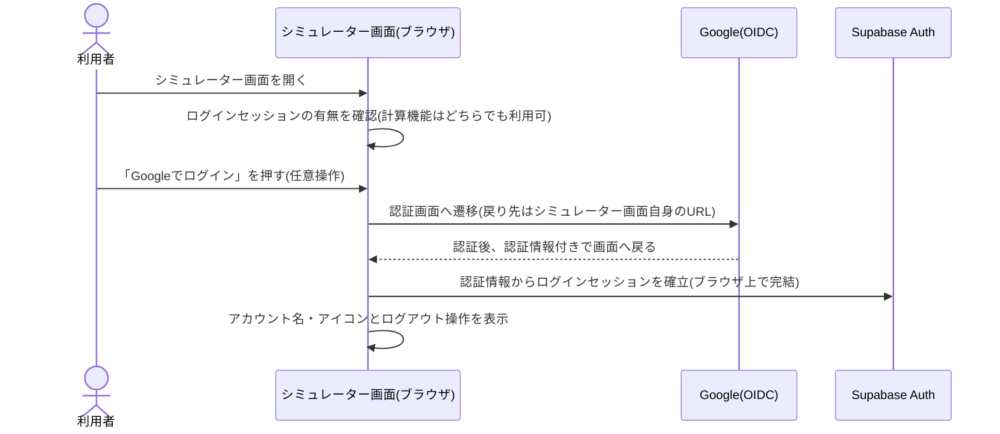

# 設計: 利用者ログイン(任意)

認証基盤(Google OIDC・Supabase Auth)の全体方針は[docs/adr/0006](../../../docs/adr/0006-admin-screen-oidc-rls.md)を踏襲するため重複させない。この画面固有なのは「ログインは任意」「許可リストによる権限確認を行わない」の2点で、`life-money-sim/admin`・`ikukyu/admin`のログイン処理からその2点だけを外した薄い形になる。

## 処理フロー



### ログイン状態を判定して表示を出し分ける処理
- 対象: シミュレーター画面を開いた時点、およびログイン状態が変化した時点のセッション
- 手順:
  1. ログインセッションがない場合は、「Googleでログイン」の操作のみを表示する。収支・資産推移の計算、匿名分析用保存(`save-result`)の利用は制限しない
  2. ログインセッションがある場合は、アカウント名・アイコン等ログイン中であることが分かる表示とログアウト操作を表示する
- 関連するビジネスルール: requirements.md#ログイン・ログアウト-1、requirements.md#ログイン・ログアウト-3、requirements.md#認証方式-2

### Googleでログインする処理
- 対象: 「Googleでログイン」操作
- 手順:
  1. Google OIDCによるログインを開始し、Googleの認証画面へ遷移させる。認証後の戻り先はシミュレーター画面自身のURLとする
  2. 戻ってきた際、URLに含まれる認証情報からログインセッションを確立する(サーバーを介さず、ブラウザ上で完結する)
  3. セッション確立後は「ログイン状態を判定して表示を出し分ける処理」を再度通す
- 補足: `admin`と異なり、ログイン後に許可リストを確認する処理は行わない(Googleアカウントを持つ人であれば誰でもログイン状態になる)
- 関連するビジネスルール: requirements.md#ログイン・ログアウト-2、requirements.md#認証方式-1

### ログアウトする処理
- 対象: ログイン中のセッション
- 手順:
  1. ログインセッションを破棄し、「Googleでログイン」操作のみの表示に戻す
- 補足: ログアウトしても収支・資産推移の計算機能は変わらず利用できる(元々ログイン不要な機能のため)
- 関連するビジネスルール: requirements.md#ログイン・ログアウト-4

## エラーハンドリング
- ログイン処理自体(Google認証・セッション確立)が失敗した場合も、収支・資産推移の計算画面は変わらず表示し続ける(ログインは任意機能であり、失敗によって主機能を止めない方針: requirements.md#認証方式-2)
- ログイン失敗時にエラー内容を画面に大きく表示することはしない(未ログイン状態のまま「Googleでログイン」操作を表示し続けるだけで足りる。再度ログインを試せる)

## 関連するファイル(抜粋)
```
app/lib/adminAuth.ts (既存: getSession/onAuthChange/signInWithGoogle/signOutをそのまま利用。admin_emails確認(isAuthorizedAdmin)のみ利用者ログインでは使わない)
app/life-money-sim/components/LoginStatus.tsx (新規: 未ログイン時「Googleでログイン」操作、ログイン中はアカウント名・アイコンとログアウト操作を出し分ける表示)
app/lib/supabaseClient.ts (既存の共通クライアントを利用)
```

## 状態管理
- ログインセッション(`Session | null`)を画面(`page.tsx`)のローカル状態として持ち、`LoginStatus`と、ログイン状態を必要とする`saved-scenario`側の表示に渡す
- 状態は「未ログイン」「ログイン中」の2つのみで、遷移も単純(ログイン成功/ログアウトの2エッジ)なため状態遷移図は省略する

## セキュリティ
- 許可リスト(`admin_emails`)による権限確認を行わない。Googleアカウントを持つ人であれば誰でもログイン状態になれるが、ログイン状態そのものは収支・資産推移の計算結果や匿名保存(`save-result`)へのアクセス範囲を一切広げない(それらは元々誰でも使える機能のため)。ログイン状態が意味を持つのは`saved-scenario`(本人のシナリオのRLS判定)のみ
- ログインセッションのトークンはSupabase Authの標準機構(ブラウザのlocalStorage)に任せ、独自の保存・受け渡しは行わない
- この機能自体は`auth.users`のセッション確立のみを扱い、機微な入力値(生年月・内訳名等)を保存しない。それらの保存・RLSは`saved-scenario/design.md#セキュリティ`が担う

## ログ
- ログイン・ログアウト自体の成功/失敗はコンソールログに出さない(利用者自身の操作結果は画面表示(ログイン中表示の有無)で十分分かるため、ログ出力の追加価値がない)
- Google認証コールバックで想定外の例外が発生した場合のみ、ブラウザのコンソールにエラー内容を出す(原因究明用。アカウント情報は含めない)

## 依存関係
- 認証処理(`signInWithGoogle`/`signOut`/`getSession`/`onAuthChange`)は`life-money-sim/admin/design.md#関連するファイル抜粋`と同じ`app/lib/adminAuth.ts`を共用する
- ログイン状態は`saved-scenario/design.md`のマイシナリオ機能の前提となる
