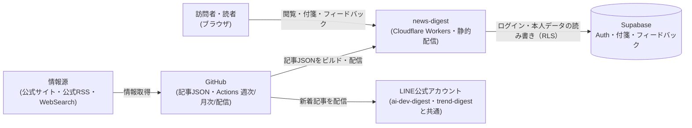
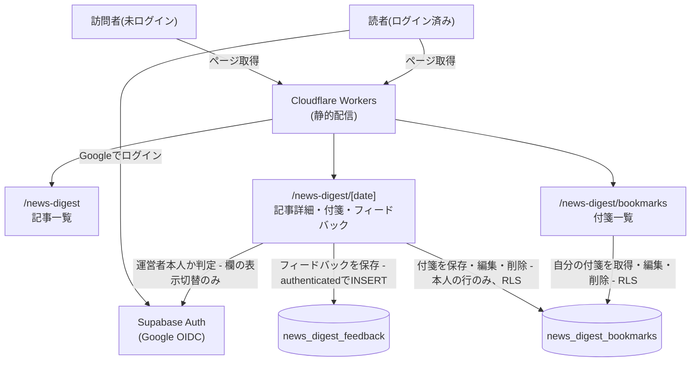
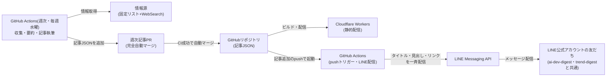
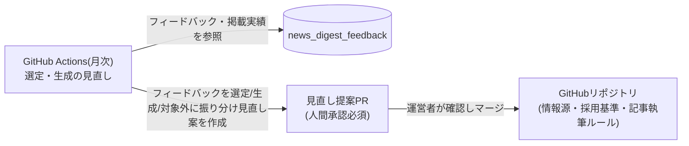
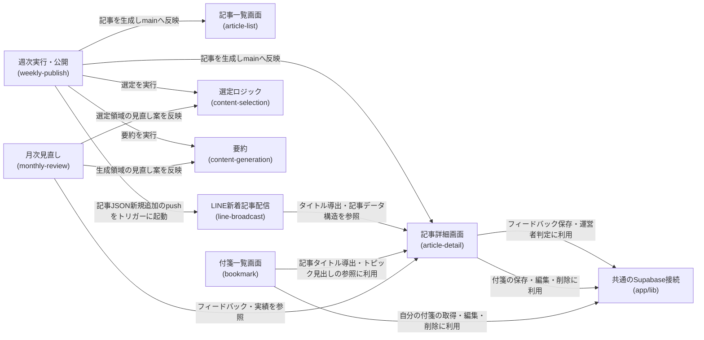
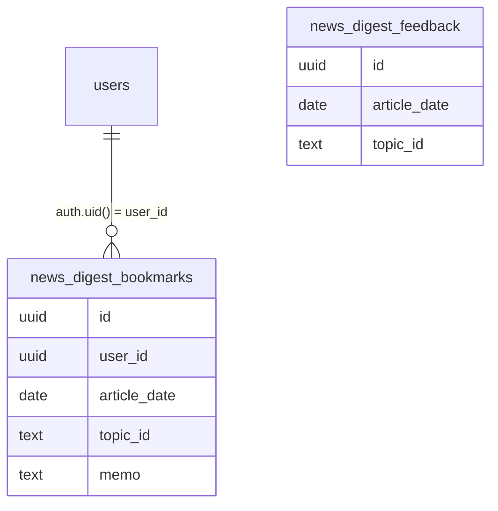

# アーキテクチャ: news-digest

## サマリ
総合(国内外の政治・社会・国際)・経済/ビジネス・神奈川ローカル・育児の4カテゴリの重要ニュースを週1回自動で収集・要約し、週次のダイジェスト記事として公開するアプリ。8つのspec(選定・生成・週次公開・LINE配信・月次見直し・記事一覧・記事詳細・付箋)からなり、記事の閲覧、読者のログイン付箋、LINE配信までを一通り備える。詳細は下記[コンテキスト図](#4-コンテキスト図)・[システム構成図](#5-システム構成図)を参照。

## 1. 概要
総合(国内外の政治・社会・国際)・経済/ビジネス・神奈川ローカル・育児の4カテゴリの重要ニュースを週1回(毎週水曜)自動で収集・要約し、週次のダイジェスト記事として公開するアプリ。URL: `/news-digest`

## 2. アーキテクチャの目的
- コンテンツの収集・選定([content-selection](content-selection/requirements.md))と要約([content-generation](content-generation/requirements.md))を分離し、それぞれの基準を独立して調整できるようにする(月次見直し([monthly-review](monthly-review/requirements.md))は選定・生成の両方を対象にするが、変更対象のファイル・基準は領域ごとに分かれたまま扱う)
- サーバーを持たない静的サイトの構成を維持したまま、GitHub Actionsによる週次の記事生成・PR作成、月次の見直し提案・PR作成という運用パターンを、姉妹アプリ[ai-dev-digest](../ai-dev-digest/architecture.md)から踏襲する
- 通常はPRレビューが必須のこのプロジェクトの運用に対し、週次記事の完全自動マージという例外を[weekly-publish](weekly-publish/requirements.md)に明確に限定し、情報源・採用基準の変更等の影響が大きい変更([monthly-review](monthly-review/requirements.md))には人間承認を残す
- 総合・経済/ビジネスは「複数の主要メディアの同時報道」という定量基準で客観性を担保する一方、神奈川ローカル・育児は運営者にとって直接影響のあるカテゴリのため、専用枠として基準未達でも毎週最低1件を優先的に拾う([content-selection](content-selection/requirements.md))という、ai-dev-digestにはない二層構造の採用基準を持つ

## 3. 設計方針
- 記事本文はDBに保存せず、ビルド時に取り込まれる静的コンテンツ(JSON)として管理する([ai-dev-digest](../ai-dev-digest/architecture.md)と同じ設計方針。[ADR-0001](../../docs/adr/0001-user-input-database.md)が前提とする「サーバー機能を持たない」構成を保つ)
- 運営者フィードバックの保存は既存の[ADR-0001](../../docs/adr/0001-user-input-database.md)パターン(INSERT専用、`authenticated`ロール)を踏襲し、新しい認証・DB設計を増やさない
- 読者本人のデータ(付箋)は[ADR-0001](../../docs/adr/0001-user-input-database.md)が予告する「ログインが必要なアプリ」パターン(`user_id`紐付け+RLSで本人行のみ操作可)を、[ai-dev-digest/bookmark](../ai-dev-digest/bookmark/design.md)に続く事例として踏襲する
- 情報源・採用基準の変更([monthly-review](monthly-review/requirements.md))は、週次記事公開([weekly-publish](weekly-publish/requirements.md))と異なる自動マージポリシーを適用する(週次記事は完全自動マージ、見直し案は人間承認必須)
- LINE配信は新規アカウントを開設せず、[ai-dev-digest](../ai-dev-digest/line-broadcast/requirements.md)・[trend-digest](../trend-digest/line-broadcast/requirements.md)と共通の既存LINE公式アカウントに相乗りする

## 4. コンテキスト図

この図の正となる文章は「[6. アーキテクチャ概要](#6-アーキテクチャ概要)」と各specの設計書。

## 5. システム構成図

### 5.1 閲覧・読者フロー


### 5.2 週次記事の生成・公開・LINE配信フロー


### 5.3 月次の見直し(選定・生成)フロー


これらの図の正となる文章は下記「[6. アーキテクチャ概要](#6-アーキテクチャ概要)」と各specの設計書。このアプリから見た構成のみを描いており、プロジェクト共通インフラの詳細は[docs/architecture/](../../docs/architecture/infrastructure.md)を参照。

## 6. アーキテクチャ概要
Next.jsの静的エクスポートをCloudflare Workersで配信する構成は他アプリと同じ。記事本文はDBではなくJSONのコンテンツファイルとしてリポジトリ内(`content/news-digest/`)に置き、ビルド時に取り込む。週次(毎週水曜)のGitHub Actionsワークフローが情報源(総合・経済/ビジネスは固定リストの複数情報源による同時報道判定、神奈川ローカル・育児は固定リストの専用枠+WebSearchによる見落とし補完)から候補を収集し、選定基準([content-selection](content-selection/requirements.md))に沿ってトピックを選び、Claude Code CLIのヘッドレス実行による要約([content-generation](content-generation/requirements.md))を経て記事を生成、PRを作成しCI成功後に自動マージする([weekly-publish](weekly-publish/requirements.md))。このマージ(記事JSONの新規追加)をトリガーに、独立したGitHub Actionsワークフローが記事タイトル・トピック見出し一覧・記事リンクを、ai-dev-digest・trend-digestと共通のLINE公式アカウントのブロードキャスト機能で友だち全員へ配信する([line-broadcast](line-broadcast/requirements.md))。訪問者は記事一覧・詳細ページ([article-list](article-list/requirements.md)、[article-detail](article-detail/requirements.md))を未ログインでも閲覧できる。

記事詳細ページはGoogle OIDCログインを読者全員に開放しており、ログイン中の読者はトピックに自由記述メモ付きの付箋を貼り([bookmark](bookmark/requirements.md))、専用の一覧画面(`/news-digest/bookmarks`)から自分の付箋を振り返れる(付箋データは本人の行のみRLSで操作可能な`news_digest_bookmarks`テーブルに保存)。運営者向けフィードバック欄は、運営者本人がログイン中の場合のみ記事詳細ページの各トピック下に表示される。月次のGitHub Actionsワークフローがフィードバックと掲載実績を読み、ヘッドレス起動したClaude Code経由で、各フィードバックを選定領域(情報源・採用基準・専用枠の運用)・生成領域(要約・記事執筆ルール)・対象外に振り分けたうえで見直し案をPRとして提案し、運営者の承認を経てからマージされる([monthly-review](monthly-review/requirements.md))。

## 7. 採用技術
| 技術 | 用途 |
|---|---|
| Next.js(静的エクスポート) | 記事一覧・詳細・付箋一覧ページの描画 |
| Supabase | 運営者フィードバックの保存(`news_digest_feedback`テーブル)、読者の付箋の保存(`news_digest_bookmarks`テーブル) |
| Supabase Auth(Google OIDC) | 記事詳細ページ・付箋一覧ページのログイン(読者全員が対象)。フィードバック入力欄の表示切り替え(運営者判定)にも利用 |
| GitHub Actions | 週次の記事生成・月次の選定/生成の見直し(スケジュール実行)・LINE新着記事配信(pushトリガー)の実行基盤 |
| Claude Code(ヘッドレス実行) | 月次見直し案の検討・複数ファイルの編集(monthly-review内でGitHub Actionsから起動) |
| LINE Messaging API | 新着記事のLINE公式アカウント(ai-dev-digest・trend-digestと共通)からの一斉配信(line-broadcast内でGitHub Actionsから呼び出し) |
| Tailwind CSS | スタイリング |

選定理由はプロジェクト横断のため[関連ADR](#12-関連adr)、および[ai-dev-digest/architecture.md](../ai-dev-digest/architecture.md)を参照(同じ技術選定を踏襲)。

## 8. 機能マップ
| spec | 役割 | 状態 | 依存 |
|---|---|---|---|
| [content-selection](content-selection/requirements.md) | カテゴリ・情報源(固定リスト)を定義し、週次のトピックを選び出す。神奈川ローカル・育児は専用枠として基準未達でも拾う | 仕様のみ(未実装) | 週次の実行タイミングは[weekly-publish/requirements.md](weekly-publish/requirements.md)に従う |
| [content-generation](content-generation/requirements.md) | 選定されたトピックの要約・記事執筆のルールを定める | 仕様のみ(未実装) | content-selectionの選定結果を受け取る |
| [weekly-publish](weekly-publish/requirements.md) | 収集・要約・記事公開を週1回(毎週水曜)自動実行し、完全自動マージする | 仕様のみ(未実装) | content-selection・content-generationの結果を公開する |
| [line-broadcast](line-broadcast/requirements.md) | weekly-publishの週次記事PRがmainへ自動マージされた直後に、新着記事をLINE公式アカウント(ai-dev-digest・trend-digestと共通)の友だち全員へ自動配信する | 仕様のみ(未実装) | weekly-publishのマージタイミング、article-detailの記事データ構造に従う |
| [monthly-review](monthly-review/requirements.md) | 月次で情報源・採用基準・専用枠の運用(選定領域)と要約・記事執筆ルール(生成領域)の見直し案を作成し、人間承認を経て反映する | 仕様のみ(未実装) | article-detailのフィードバック、content-selectionの掲載実績を参照 |
| [article-list](article-list/requirements.md) | 週ごとのダイジェスト記事をカード一覧で表示する | 実装中 | article-detailの記事構造を参照 |
| [article-detail](article-detail/requirements.md) | 記事本文(トピックごとの見出し・要約・出典)と、運営者本人向けフィードバック入力欄を表示する | リリース済み | content-selectionの選定結果、content-generationの生成ルールに従う |
| [bookmark](bookmark/requirements.md) | ログイン中の読者がトピックへ自由記述メモ付きの付箋を貼り、一覧から振り返れるようにする | 仕様のみ(未実装) | article-detailのトピック識別子・記事データ構造に従う |

## 9. コンポーネント図


この図の正となる文章は「[8. 機能マップ](#8-機能マップ)」の依存列と、各specのrequirements.mdの依存関係。

## 10. ディレクトリ構成
CLAUDE.mdの一般規約(`components/`,`lib/`)通りで、逸脱なし。ただし記事本文・情報源リスト・採用基準はコード資産(`app/`)ではなくコンテンツデータとして`content/news-digest/`配下に別途管理する([ai-dev-digest](../ai-dev-digest/architecture.md)と同じ設計方針)。

```
content/news-digest/articles/<date>.json  # 週1件のダイジェスト記事データ(weekly-publishが追加)
content/news-digest/watchlist.json        # カテゴリ別情報源の固定リスト(monthly-reviewが変更)
content/news-digest/criteria.json         # 採用基準の数値(monthly-reviewが変更)
```

収集・選定・記事組み立てのスクリプトはNext.jsアプリの一部ではないため`scripts/news-digest/`配下に置く(`scripts/ai-dev-digest/`と同じ置き場所の考え方)。DB読み取りを伴うスクリプト(monthly-reviewが使う実績収集スクリプト)は、依存関係を本体`package.json`から隔離した独立パッケージにする(`scripts/ai-dev-digest/`の隔離パターンを踏襲)。LINE配信のスクリプトも同様に`scripts/news-digest/`配下に置く。

## 11. 外部サービス
| サービス | 用途 |
|---|---|
| Supabase(`news_digest_feedback`テーブル) | 運営者フィードバックの保存 |
| Supabase(`news_digest_bookmarks`テーブル) | ログイン中の読者本人の付箋(自由記述メモ)の保存 |
| Supabase Auth(Google OIDC) | 記事詳細ページ・付箋一覧ページのログイン(読者全員が対象)。フィードバック入力欄の表示切り替え(運営者判定)にも利用 |
| NHK NEWS WEB・共同通信・時事通信・日本経済新聞・Reuters Japan・東洋経済オンライン・神奈川県公式サイト・神奈川新聞・こども家庭庁・厚生労働省 | 各カテゴリの固定情報源データの取得([content-selection/requirements.md#情報源(固定リスト)](content-selection/requirements.md)) |
| WebSearch(Claude Code CLI) | 重要度判定・見落とし補完のための探索的収集(基本無料方針のため、有料の検索APIは利用しない) |
| GitHub Actions | 記事生成([weekly-publish](weekly-publish/requirements.md))・見直し提案([monthly-review](monthly-review/requirements.md))・LINE配信([line-broadcast](line-broadcast/requirements.md))の実行基盤(スケジュール実行・pushトリガーいずれも含む) |
| Claude Code CLI(運営者個人のPro/Maxサブスクリプション認証) | weekly-publishの要約生成、monthly-reviewの見直し案検討に、いずれもヘッドレス起動で使用 |
| LINE Messaging API | 新着記事のLINE公式アカウント(ai-dev-digest・trend-digestと共通)からの一斉配信([line-broadcast](line-broadcast/requirements.md)) |

`news_digest_bookmarks`は本人の行のみRLSで操作可能なため`auth.users`と1対多の関係を持つ。`news_digest_feedback`は`authenticated`ロールのINSERT専用で`auth.users`とのリレーションを持たない。2つのテーブル間に直接のリレーションはない(`article_date`・`topic_id`はアプリ側のみで解決する参照で、外部キー制約は持たない)。



## 12. 関連ADR
- [0001-user-input-database.md](../../docs/adr/0001-user-input-database.md) — 運営者フィードバック保存のDB選定・RLSパターン(INSERT専用、`authenticated`ロール)を踏襲。読者本人の付箋(`news_digest_bookmarks`)は同ADRが予告する「ログインが必要なアプリ」パターン(`user_id`紐付け+RLSで本人行のみSELECT/INSERT/UPDATE/DELETE)を、[ai-dev-digest/bookmark](../ai-dev-digest/bookmark/design.md)に続く事例として踏襲する
- [0006-admin-screen-oidc-rls.md](../../docs/adr/0006-admin-screen-oidc-rls.md) — フィードバック入力欄の表示切り替えに使うGoogle OIDCログイン判定の基盤(`app/lib/adminAuth.ts`)を流用

## 13. セキュリティ
運営者フィードバックの保存は`authenticated`ロールによるINSERT専用とし、SELECT/UPDATE/DELETEは許可しない(他人の投稿内容を読む・改ざんする経路を作らない)。この入力欄は運営者本人がログイン中の場合のみ画面に表示されるため、実際のリクエストは常に`authenticated`ロールで行われる。保存される内容は選定基準への自由記述コメントのみで、氏名・連絡先等の個人情報は扱わない。フィードバック入力欄の表示・非表示はログイン状態+運営者判定(`isAuthorizedAdmin()`)による画面側の出し分けであり、DB側のアクセス制御ではない点に注意する。

読者の付箋(`news_digest_bookmarks`)は本人の行のみRLS(`auth.uid() = user_id`)でSELECT/INSERT/UPDATE/DELETEでき、他の読者・運営者(自作画面経由)は閲覧経路を持たない。保存される内容(自由記述メモ)は本人以外に見られたくないという要件([bookmark/requirements.md](bookmark/requirements.md))に基づく。

## 14. 技術的制約
他社が報じたニュースを要約して掲載するため、著作権法上のリスク(翻案権侵害の可能性)を伴う。一般ニュース(特に全国紙・通信社の報道)は技術ブログよりも著作権への配慮がより重要になりうるため、要約分量の制限・出典明記・利用規約への条項追記([content-generation/requirements.md#利用規約への反映](content-generation/requirements.md))によってリスクを低減する運用とする。各情報源の取得は公式サイト・公式RSSフィード・公開ページの閲覧の範囲にとどめ、非公式APIや利用規約を超えたアクセスは行わない([content-selection/requirements.md#データ取得方法](content-selection/requirements.md))。SNS(X・Instagram・Threads・TikTok)からの直接収集は公式APIが有料のため行わない。

## 15. 用語集
| 用語 | 説明 |
|---|---|
| 専用枠 | 神奈川ローカル・育児カテゴリに適用される、[content-selection](content-selection/requirements.md)の採用基準([4])を満たさなくても毎週最低1件を優先的に採用する仕組み。運営者にとって直接影響のあるカテゴリを見逃さないための措置 |
| 基準未達掲載 | 専用枠により、総合・経済/ビジネスの採用基準([4]、複数メディアの同時報道)を満たさない候補を、神奈川ローカル・育児で掲載する措置。掲載する各トピックには基準未達である旨を示す。[monthly-review](monthly-review/requirements.md)で見直しの判断材料になる |
| 付箋 | ログイン中の読者がトピックに添える自由記述メモ(200文字まで)。本人のみ閲覧・編集・削除でき、一覧画面(`/news-digest/bookmarks`)から振り返れる。[bookmark](bookmark/requirements.md)で定義 |
| GitHub Actions | スケジュール実行・pushトリガー実行のワークフロー基盤。週次の記事生成([weekly-publish](weekly-publish/requirements.md))・月次の見直し提案([monthly-review](monthly-review/requirements.md))・LINE新着記事配信([line-broadcast](line-broadcast/requirements.md))の実行主体 |
