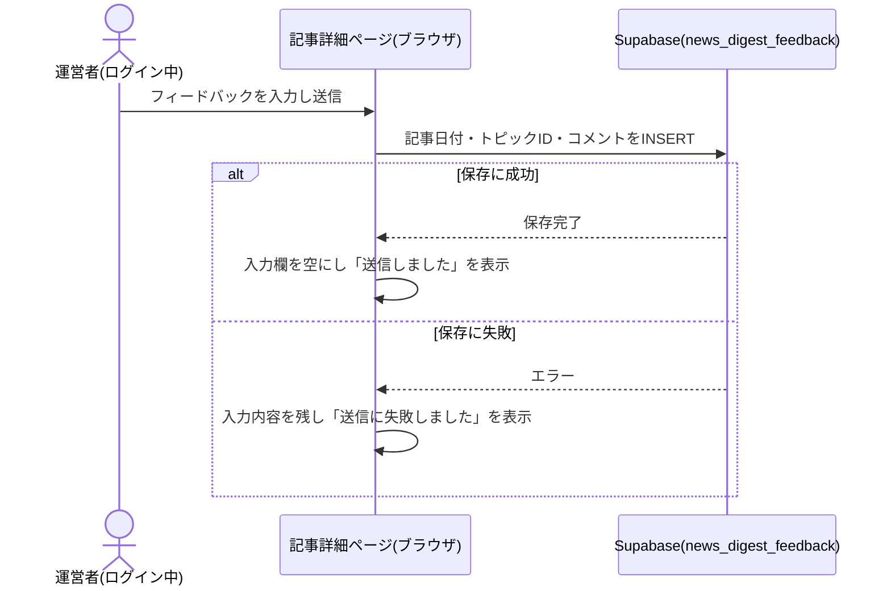

# 設計: 記事詳細ページ

## サマリ
その週の記事本文(トピックごとの見出し・要約・カテゴリ・重要度・出典)と、運営者本人限定のフィードバック入力欄を表示する。記事データの型・置き場所(`content/news-digest/articles/<date>.json`)は本specで定義し、他specはこれに従う。**Step0(UIデザイン確定)は実施しない**: /consultでの決定により、ai-dev-digestの実装済みビジュアルデザイン(テールカラー基調・`rounded-2xl`の白カード・アンバー系の専用枠バッジ等)をそのまま流用するため、新規のStitch生成は行わない。具体的なトークン・レイアウトは`app/ai-dev-digest/components/TopicSection.tsx`・`ArticleDetailView.tsx`を参照する(下記「画面設計」に転記)。

## 前提: 記事データの形式(この機能が定義する共有スキーマ)

記事本文はDBではなく、ビルド時に取り込む静的コンテンツファイルとして管理する(`architecture.md#3-設計方針`)。この記事データの型・置き場所は本specで定義し、[article-list](../article-list/requirements.md)・[content-selection](../content-selection/requirements.md)・[content-generation](../content-generation/requirements.md)・[weekly-publish](../weekly-publish/requirements.md)・[monthly-review](../monthly-review/requirements.md)は共通してこの形式に従う。

- 格納場所: `content/news-digest/articles/<date>.json`(`<date>`は`YYYY-MM-DD`。URLの`[date]`と一致させる)
- 1ファイル=1週分の記事。週次のGitHub Actionsワークフロー([weekly-publish](../weekly-publish/requirements.md))がこのファイルを新規追加する
- ai-dev-digestと異なりLegacyTopic/CurrentTopicのユニオン型は不要(新規アプリのため旧形式データが存在しない)

```ts
// app/news-digest/lib/types.ts
export type Category = 'general' | 'business' | 'kanagawa' | 'childcare'

export type SummaryPerspective = {
  heading: string // 結論・要点を含む見出し(テーマ名にしない。requirements.md#要約-6)
  teaser: string // 常時表示する導入文。40〜140字(目安60〜120字)
  detail: string // 「詳細を見る」操作で展開表示する詳細文
}

// 固定4観点。この4キー・この順序で固定(requirements.md#要約-4)
export type TopicSummary = {
  whatHappened: SummaryPerspective // 何が起きたか
  whyItMatters: SummaryPerspective // なぜ重要か(影響)
  background: SummaryPerspective // 背景
  outlook: SummaryPerspective // 今後の見通し
}

export type Importance = 1 | 2 | 3 | 4 | 5 // 重要度(requirements.md#重要度-8〜9)

export type Topic = {
  id: string // 記事内で一意。フィードバック・付箋の紐付けに使う(例: "topic-1")。表示順=配列順
  heading: string
  category: Category
  summary: TopicSummary
  importance: Importance
  sourceName: string // 発信者名(例: "NHK NEWS WEB"、"神奈川新聞")
  sourceUrl: string // 出典の元URL
  sourcePublishedAt?: string // 元記事のISO 8601形式の公開日時。content-selectionが収集した値をそのまま引き継ぐ
  belowCriteria: boolean // 専用枠での基準未達掲載(content-selection/requirements.md#採用基準-5)
  belowCriteriaReason?: string // belowCriteriaがtrueの場合のみ必須。基準からの乖離内容(例: "裏付けメディアが1社のみ")
}

export type Article = {
  date: string // YYYY-MM-DD。ファイル名と一致
  topics: Topic[] // 1〜7件(content-selection/requirements.md#1週あたりの掲載件数-6〜7)
}
```

要約を単一の`summary: string`ではなく構造化フィールドにする理由・記事タイトルをJSONに保存せず`date`から`buildArticleTitle(date)`で導出する理由は、いずれもai-dev-digest/article-detail/design.md「前提: 記事データの形式」と同じ設計判断のため踏襲する。

## 処理フロー

### 記事データを読み込む処理
- 対象: `content/news-digest/articles/`配下のJSONファイル
- 手順:
  1. 指定された日付のファイル(`<date>.json`)を読み込む
  2. JSONとしてパースできない、またはスキーマ(下記バリデーション参照)を満たさない場合は例外を投げる
  3. 該当日のファイルが存在しない場合は「記事なし」を表す`null`を返す
- 関連するビジネスルール: requirements.md#記事本文表示-1〜2

### その週の記事本文を表示する処理
- 対象: 読み込んだ記事データ
- 手順:
  1. `buildArticleTitle(date)`で導出した記事タイトル・公開日(`date`)を見出しとして表示する
  2. `topics`配列の順に、各トピックの見出し・出典(発信者名・元URLへのリンク)を表示する。`sourcePublishedAt`が存在する場合のみ`YYYY年M月D日`形式で併記する
  3. 見出しの近くに重要度(`importance`、★1〜★5)とカテゴリバッジを表示する(requirements.md#記事本文表示-5・7)
  4. `summary`の`whatHappened`→`whyItMatters`→`background`→`outlook`の順(この順序で固定)に、各観点の見出し(`h3`相当)と導入文(`teaser`)を常時表示する
  5. 各観点の導入文の下に、HTML標準の`<details><summary>詳細を見る</summary>…</details>`要素を配置し、`<summary>`を操作すると詳細文(`detail`)が展開表示されるようにする(ai-dev-digestと同じ実装方式。ブラウザ標準機能のため開閉状態を自前で管理する必要がない)
  6. `belowCriteria`が`true`のトピックには「専用枠(基準未達)」バッジと`belowCriteriaReason`の内容を小さく添える。1件以上該当がある記事では、記事冒頭にも「神奈川ローカル・育児は、全国規模の基準を満たさない場合も優先的に掲載しています」という注記を1回だけ表示する(requirements.md#記事本文表示-6)
- 関連するビジネスルール: requirements.md#記事本文表示-1〜7

### ログイン状態に応じてフィードバック入力欄の表示を切り替える処理
- 対象: Supabase Authのログインセッション
- 手順: ai-dev-digest/article-detail/design.md「ログイン状態に応じてフィードバック入力欄の表示を切り替える処理」と同一の処理を行う(`getSession`→`isAuthorizedAdmin()`による運営者判定→フィードバック入力欄の表示切り替え。確認中・失敗時は「未許可」として扱う)。**DBの読み取り(SELECT)は`admin_emails`に対してのみ行う**。`news_digest_feedback`自体へのSELECTポリシーは追加しない
- 関連するビジネスルール: requirements.md#運営者向けフィードバック-9、requirements.md#フィードバックの保存・権限-4

### フィードバックを送信する処理
- 対象: フィードバック入力欄に入力された自由記述コメント
- 手順:
  1. 入力内容をトリムした結果が空文字の場合、送信ボタンを無効化する(requirements.md#運営者向けフィードバック-12)
  2. 送信ボタン押下時、対象トピックの記事日付(`date`)とトピック識別子(`topic.id`)、入力内容を1件のレコードとしてまとめる
  3. `news_digest_feedback`テーブルへの保存を試みる(ログイン中のセッションによる`authenticated`ロールでのINSERT)
  4. 保存に成功した場合、入力欄を空にし「送信しました」という完了表示を数秒間出す
  5. 保存に失敗した場合、入力内容は消さずに残し、「送信に失敗しました。もう一度お試しください」と表示する
- シーケンス図(俯瞰用。正は上記の手順の文章):


- 関連するビジネスルール: requirements.md#運営者向けフィードバック-10〜12、requirements.md#フィードバックの保存・権限-3・5

## バリデーション

記事データ(JSONファイル)のスキーマ検証:
- `date`: `YYYY-MM-DD`形式で、ファイル名と一致すること
- `topics`: 配列長が1件以上7件以下であること(content-selection/requirements.md#1週あたりの掲載件数-6〜7)
- 各`topic`: `id`が記事内で重複しないこと、`heading`/`sourceName`/`sourceUrl`が空文字でないこと、`sourceUrl`が`http`または`https`で始まる絶対URLであること、`category`が定義済みカテゴリのいずれかであること、`belowCriteria`が`true`の場合は`belowCriteriaReason`が必須
- `summary`: `whatHappened`/`whyItMatters`/`background`/`outlook`の4キーをすべて持つこと。各観点の`heading`/`teaser`/`detail`が空文字でないこと。各観点の`teaser`が40〜140字の範囲であること。4観点の`detail`を連結した文字数が800〜1700字の範囲であること
- `importance`が1〜5の整数であること
- 上記を満たさない場合は例外を投げる。フィードバック送信の入力内容自体は長さ・文字種の制限を設けないが、空文字または空白文字のみの場合は送信できない

## エラーハンドリング

- 記事データのスキーマ違反は**ビルド時(`next build`)に例外として検知させ、ビルドを失敗させる**。これにより[weekly-publish](../weekly-publish/requirements.md)のCIチェック(`npm run build`を含む)が壊れたデータのPRを弾く
- フィードバック送信の失敗(通信エラー・RLS拒否等)は上記処理フロー4.のとおり画面に失敗を表示する

## 関連するファイル(抜粋)

```
app/news-digest/lib/types.ts (新規: Article/Topic/Categoryの型定義)
app/news-digest/lib/articleTitle.ts (新規: content-generation/design.mdで定義するbuildArticleTitle。article-listからも参照される)
app/news-digest/lib/articleSchema.ts (新規: JSONのバリデーション・パース処理。article-listのページネーションからも参照される)
app/news-digest/lib/articles.ts (新規: content/news-digest/articles/ を読み込むgetAllArticles/getArticleByDate。article-listと共有)
app/news-digest/lib/saveFeedback.ts (新規: フィードバック保存処理)
app/news-digest/[date]/page.tsx (新規: 記事詳細ページ、generateStaticParamsで全日付を列挙)
app/news-digest/components/TopicSection.tsx (新規: 1トピック分の表示。ai-dev-digestのTopicSection.tsxと同じ構造(SourceBadge相当をCategoryBadgeに置き換え、YoutubeEmbedは持たない))
app/news-digest/components/ImportanceStars.tsx (新規: ai-dev-digestのImportanceStars.tsxと同一の実装)
app/news-digest/components/CategoryBadge.tsx (新規: ai-dev-digestのSourceBadge.tsxと同じパターンでカテゴリラベルをバッジ表示)
app/news-digest/components/FeedbackForm.tsx (新規: ai-dev-digestのFeedbackForm.tsxと同一の実装。プレースホルダ文言のみ「採用基準へのフィードバックを入力」に変更)
app/lib/adminAuth.ts (既存: getSession/onAuthChange/signInWithGoogle/signOut/isAuthorizedAdminを利用)
app/lib/supabaseClient.ts (既存の共通クライアントを利用)
content/news-digest/articles/*.json (新規: 記事本文データ)
```

## データベース設計

### news_digest_feedback(新規テーブル)
| カラム | 型 | 補足 |
|---|---|---|
| id | uuid | 共通カラム(docs/adr/0001)。DB側で自動採番 |
| created_at | timestamptz | 共通カラム。DB側で自動設定 |
| is_test | boolean, not null, default false | 共通カラム(docs/adr/0001) |
| article_date | date, not null | 対象記事の日付(`content/news-digest/articles/<date>.json`の`date`と一致) |
| topic_id | text, not null | 対象トピックの`Topic.id` |
| comment | text, not null | 自由記述のフィードバック内容 |

RLSはINSERT専用の最小権限パターン(docs/adr/0001)を踏襲し、この入力欄はログイン中のみ表示されるため対象ロールは`authenticated`とする(ai-dev-digestが2026-08-05に修正した内容を最初から適用する):
- `authenticated`: INSERTのみ許可
- `benriyatool_readonly`: SELECTのみ許可(docs/adr/0004)。[monthly-review](../monthly-review/requirements.md)の月次見直しがこのロールでフィードバックを読む
- 運営者専用SELECTポリシー(docs/adr/0006のテンプレート)は追加しない(ai-dev-digestと同じ理由。表示切り替えは画面側のログイン状態判定のみで行う)

```sql
create table news_digest_feedback (
  id uuid primary key default gen_random_uuid(),
  created_at timestamptz not null default now(),
  is_test boolean not null default false,
  article_date date not null,
  topic_id text not null,
  comment text not null
);

alter table news_digest_feedback enable row level security;

grant insert on news_digest_feedback to authenticated;
create policy "authenticated can insert" on news_digest_feedback
  for insert to authenticated with check (true);

grant select on news_digest_feedback to benriyatool_readonly;
create policy "benriyatool_readonly can select" on news_digest_feedback
  for select to benriyatool_readonly using (true);
```

実際のマイグレーションファイル作成・適用は本specのtasks.mdで行う(記事の読み書きより先にテーブルが必要なため)。

## 画面設計

Step0の決定(/consult)により、ai-dev-digestの実装済みビジュアルデザインをそのまま流用する。具体的な参照元とトークン:

- 背景: `bg-gradient-to-b from-emerald-50 via-teal-50/40 to-white`(ai-dev-digestの`ArticleDetailView.tsx`と同一)
- カード: `rounded-2xl bg-white p-4 shadow-sm sm:p-5`
- アクセントカラー: `teal-600`(見出しリンク・ボタン)
- 専用枠バッジ: `rounded-full bg-orange-100 px-2 py-0.5 text-[10px] font-semibold text-orange-600`(ai-dev-digestの「採用基準未達」バッジと同一スタイル。文言のみ「専用枠(基準未達)」に変更)
- カテゴリバッジ: `rounded-full bg-teal-50 px-2 py-0.5 text-xs font-extrabold text-teal-600`(ai-dev-digestのSourceBadgeと同一スタイル)

画面構成(ai-dev-digestと同一のレイアウト):
- パンくず(べんりやつーる › 重要ニュースダイジェスト › 記事タイトル)
- デスクトップ幅(md以上)では本文の右側に目次(各トピック見出しへのアンカーリンク)を表示する。モバイル幅では非表示
- 記事タイトル・公開日
- トピックごとのカード: カテゴリバッジ、重要度(★1〜★5)、見出し、要約(固定4観点をこの順に常時表示、「詳細を見る」で展開)、出典(発信者名・元URLへのリンク、新規タブで開く。該当時は投稿日時を併記)、(該当時)「専用枠(基準未達)」バッジ+理由の小さな注記
- 専用枠の基準未達トピックが1件以上ある場合、記事冒頭に注記文を1回表示
- 各トピックの下: 運営者本人がログイン中の場合のみフィードバック入力欄(テキストエリア+送信ボタン)を表示する
- ページ下部: ログイン状態表示(未ログイン時は「ログイン」ボタン、ログイン中はメールアドレス+付箋一覧リンク+ログアウトボタン)

## コンポーネント設計

| コンポーネント | Props | 役割 |
|---|---|---|
| TopicSection | `topic: Topic`, `session: Session \| null`, `isAdmin: boolean`, `articleDate: string`, `bookmark: { id: string; memo: string } \| null` | 1トピック分の表示+配下にFeedbackFormを`isAdmin`で条件付き表示。BookmarkPanelを`session`で条件付き表示([bookmark/design.md](../bookmark/design.md)「コンポーネント設計」参照) |
| ImportanceStars | `importance: Importance` | 重要度(★1〜★5)をアイコン表示する |
| CategoryBadge | `category: Category` | カテゴリを日本語ラベルのバッジで表示 |
| FeedbackForm | `articleDate: string`, `topicId: string` | 自由記述の入力欄・送信・送信結果表示 |

## 状態管理

- ログインセッション(`Session \| null`): ページのトップレベルコンポーネントで`useState`保持し、`TopicSection`にpropsで渡す
- 各`FeedbackForm`の送信状態(`idle`/`sending`/`sent`/`failed`)はコンポーネント内の`useState`で完結させる(トピックをまたいで共有しない)

## セキュリティ

- フィードバックの`comment`はエスケープせずそのままDBに保存する(表示・一覧化を一切行わないため、XSS等の表示起因のリスクは発生しない)
- `article_date`・`topic_id`はブラウザから送信される値をそのまま信頼する(authenticatedロールでもINSERTのみで他データへの影響がないため)
- 記事データ(JSONファイル)は開発者・エージェントが作成しリポジトリにコミットされるコンテンツであり、訪問者からの入力ではないため、XSS対策としてのサニタイズは不要。ただし`sourceUrl`は`http`/`https`のみを許可する

## ログ

- フィードバックの保存成功・失敗はコンソール等へのログ出力を行わない(静的配信でサーバーを持たずコンソールログを運営者が収集できないため)
- `isAuthorizedAdmin()`の確認自体が失敗した場合は、ブラウザのコンソールにエラー内容を出す
- 記事データのスキーマ違反はビルド時に例外としてCIのログに出力される
