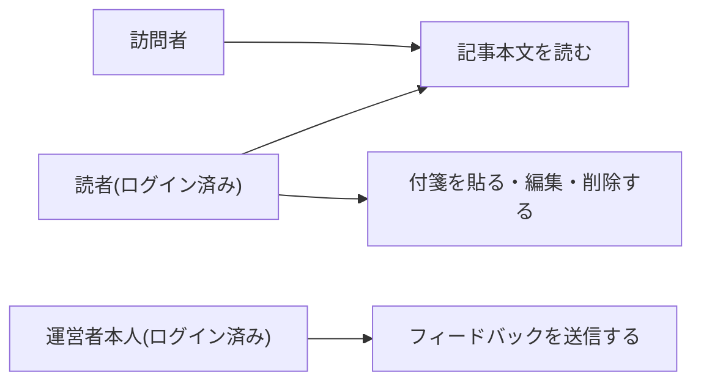

# 要件定義: 記事詳細ページ

## サマリ
その週のダイジェスト記事本文を、トピックごとの見出し・要約(固定4観点)・カテゴリ・重要度・出典リンクとともに表示する。神奈川ローカル・育児の専用枠で基準未達掲載されたトピックにはその旨を明示する。あわせて、運営者本人がGoogle OIDCでログイン中のみ表示されるフィードバック入力欄を設け、採用基準の振り返りに使う。スコープ外: フィードバックへの返信・公開表示。

## 概要
- 機能名: 記事詳細ページ
- 目的: その週のダイジェスト記事本文を、トピックごとの見出し・要約・出典リンクとともに表示する。あわせて、運営者が採用基準を振り返るためのフィードバックをその場で残せるようにする
- 優先度: 高

## ユーザーストーリー
- 訪問者として、その週の重要ニュースを、分かりやすい日本語でまとめて読みたい
- 訪問者として、興味を持ったニュースの元記事に出典リンクからアクセスしたい
- 運営者本人として、ログインした状態で記事を読みながら「この選定はもう不要」等のフィードバックをその場で残し、後から採用基準の見直しに活かしたい

## ユースケース図

ユーザーストーリー・機能要件が正、図は俯瞰用の補助。付箋の詳細は[bookmark/requirements.md](../bookmark/requirements.md)を参照。

## 機能要件

### 記事本文表示
- [1] その週の記事タイトル・公開日を表示する
- [2] その週に採用された1〜7件のトピックを、それぞれ見出し・要約(固定4観点の構成)・カテゴリ・出典情報(発信者名・タイトル・元URLへのリンク)とセットで表示する
- [3] 要約の各観点(何が起きたか・なぜ重要か(影響)・背景・今後の見通しの4つ、この順序で固定)は、観点の見出しと導入文を常時表示する([content-generation/requirements.md#要約](../content-generation/requirements.md))
- [4] 各観点には詳細文を展開表示する操作(「詳細を見る」等)を用意する。操作前は導入文のみが見え、操作後にその観点の詳細文が表示される
- [5] 各トピックのカテゴリ(総合/経済・ビジネス/神奈川ローカル/育児)が分かるように表示する
- [6] 神奈川ローカル・育児カテゴリの専用枠により、採用基準未達で掲載されたトピックには、その旨を分かりやすく示す([content-selection/requirements.md#採用基準(カテゴリごとの定量判定)-5](../content-selection/requirements.md))
- [7] 各トピックの重要度(★1〜★5)を見出しの近くに表示する([content-generation/requirements.md#重要度](../content-generation/requirements.md))

### 運営者向けフィードバック
- [8] 各トピックの下に、フィードバック入力欄(自由記述のテキスト)を表示する
- [9] フィードバック入力欄は、運営者本人がGoogle OIDCでログインしている場合のみ表示される。未ログインの訪問者、および運営者以外のログイン済み読者には表示されない
- [10] 送信すると、対象のトピック(記事の日付・トピック識別子)と入力内容が自動的に紐づいた状態でデータベースに保存される
- [11] 送信後、内容が保存されたことが分かる表示にする
- [12] フィードバック入力欄が空文字、または空白文字のみの場合は送信できない(送信ボタンを無効化する、または送信時にエラーを示す)

## ビジネスルール・制約

### 表示分量・著作権配慮
- [1] 各トピックの要約は、固定4観点それぞれについて導入文(観点あたり60〜120字程度)と詳細文(4観点合計1000〜1500字程度)の二段構成とし、原文の全文転記は行わない(根拠: [content-generation/requirements.md#著作権への配慮(根拠)](../content-generation/requirements.md)参照)
- [2] 出典(発信者名・タイトル・元URLへのリンク)を必ず表示する(根拠: 著作権配慮としての最低限の措置)

### フィードバックの保存・権限
- [3] フィードバックの保存は、INSERT専用の最小権限パターン([docs/adr/0001-user-input-database.md](../../../docs/adr/0001-user-input-database.md))を踏襲する。この入力欄はログイン中のみ表示されるため、INSERTは`anon`ではなく`authenticated`ロールへ許可する。保存されるのは自由記述コメントのみで、他人に読まれる・改ざんされる実害がある機微情報ではないため、`news_digest_feedback`テーブル自体へのadmin_emails等を用いた追加のRLS設計は導入しない
- [4] 入力欄の表示・非表示は、ログイン状態に加え運営者本人かどうかの判定による画面側の出し分けで行う(フィードバック保存先テーブル自体のアクセス制御ではなく表示制御である点に注意する。運営者判定は既存の[ADR-0006](../../../docs/adr/0006-admin-screen-oidc-rls.md)の仕組み(`isAuthorizedAdmin()`、`admin_emails`許可リストへの問い合わせ)を利用する)
- [5] 保存されたフィードバックは、公開画面のどこにも表示・一覧化しない

## 依存関係
- 表示するトピックの選定結果は[content-selection/requirements.md](../content-selection/requirements.md)の採用基準に従って決まる
- 要約の生成ルールは[content-generation/requirements.md](../content-generation/requirements.md)に従う
- ログイン状態・運営者判定は既存の管理画面と同じGoogle OIDC + `admin_emails`許可リスト([docs/adr/0006-admin-screen-oidc-rls.md](../../../docs/adr/0006-admin-screen-oidc-rls.md)、`app/lib/adminAuth.ts`のisAuthorizedAdmin())を利用する。`admin_emails`テーブル・そのRLSポリシーは複数アプリ共有の既存資産であり、本specのための新しいテーブル・マイグレーションは不要
- 付箋機能([bookmark/requirements.md](../bookmark/requirements.md))により、記事詳細ページのログインはサイトの読者全員が行う
- 蓄積されたフィードバックは[monthly-review/requirements.md](../monthly-review/requirements.md)の月次見直しで参照される

## スコープ外
- フィードバックへの返信・公開表示
- フィードバック以外の一般コメント欄(訪問者向けの感想投稿など)
- フィードバックの一覧・検索画面(運営者はデータベースを直接確認する運用とする)
