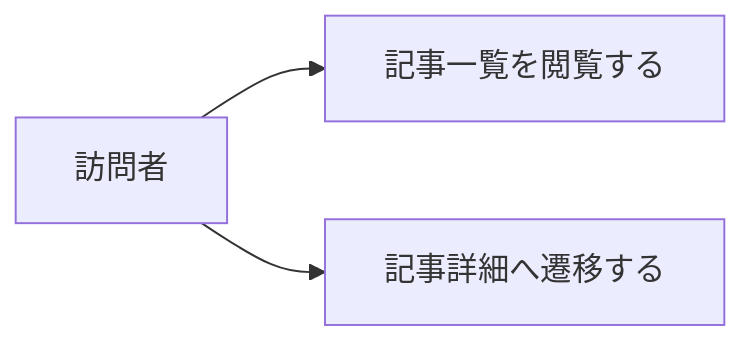

# 要件定義: 記事一覧ページ

> ステータス: 仕様確認中(未実装)

## サマリ
週次で公開される重要ニュースダイジェスト記事を新しい順にカード一覧表示し、訪問者を読みたい週の記事へ誘導する。各カードには記事タイトル・公開日・トピック見出し数件・カテゴリを表示し、詳細ページを開かなくても読む価値が判断できるようにする。スコープ外: キーワード検索・タグ絞り込み、RSS配信。

## 概要
- 機能名: 記事一覧ページ
- 目的: 週次で公開される重要ニュースダイジェスト記事を新しい順に一覧表示し、訪問者を読みたい週の記事へ誘導する
- 優先度: 高

## ユーザーストーリー
- 訪問者として、過去のダイジェスト記事を週(公開日)順の一覧で見て、興味のある週の記事を選んで読みたい
- 訪問者として、一覧の時点でその週どんなニュースが取り上げられたかをざっと把握したい
- 訪問者として、一覧の時点で各トピックが自分にとって読む価値があるかを短時間で判断したい

## ユースケース図

ユーザーストーリー・機能要件が正、図は俯瞰用の補助。詳細は下記「機能要件」を参照。

## 機能要件

### 一覧表示
- [1] 週ごとに1件公開されるダイジェスト記事を、カード形式で新しい順に表示する
- [2] 各カードには、その週の記事タイトル・公開日・その週に含まれるトピックの見出しを数件・詳細ページへのリンクを表示する
- [3] 記事が1件も存在しない場合(運用開始直後など)は、その旨を伝える表示にする
- [4] カードに表示する各トピックの見出しの下に、そのトピックの「何が起きたか」観点の導入文(短い一文)を添える(詳細ページを開かなくても、そのトピックを読む価値が一覧の時点で分かるようにするため)
- [5] 各トピックのカテゴリ(総合/経済・ビジネス/神奈川ローカル/育児)が分かるように表示する

### メタ情報
- [1] `/news-digest`のメタ情報(title/description)を設定する: title「重要ニュースダイジェスト｜総合・経済・神奈川・育児を毎週自動収集」、description「総合・経済/ビジネス・神奈川ローカル・育児関連の重要ニュースを週1回自動収集し、日本語でわかりやすく要約してお届け。複数の主要メディアが報じた信頼性の高いニュースだけを厳選します。」

## ビジネスルール・制約
- [1] カードに表示するトピック見出し・「何が起きたか」観点の導入文は、記事本文(詳細ページ)のものをそのまま用い、一覧専用の別の要約は作らない(根拠: 同じ内容の要約を二重に管理しないため)
- [2] 一覧は新しい順に20件ずつページ分割して表示する(具体的な件数・UIは設計で確定する)

## 依存関係
- 表示するデータの構造(記事本文・トピック見出し・出典など)は[article-detail/requirements.md](../article-detail/requirements.md)の機能要件に従う
- 記事データの生成・保存タイミングは[weekly-publish/requirements.md](../weekly-publish/requirements.md)に従う

## スコープ外
- キーワード検索・タグ絞り込み
- RSS配信
