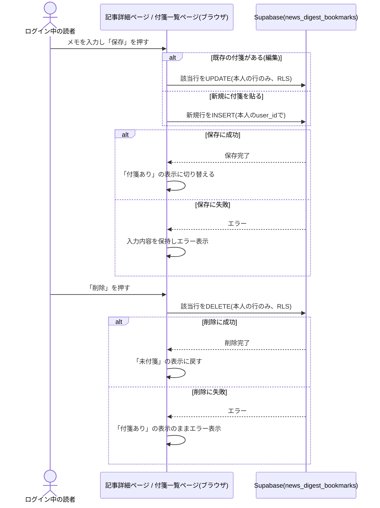
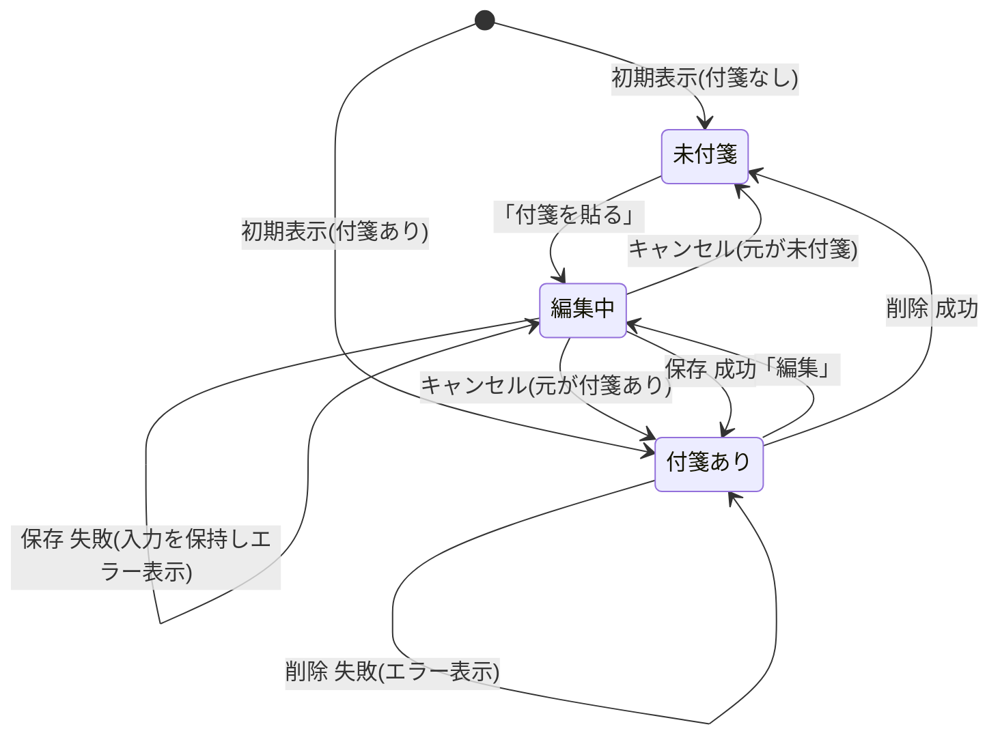
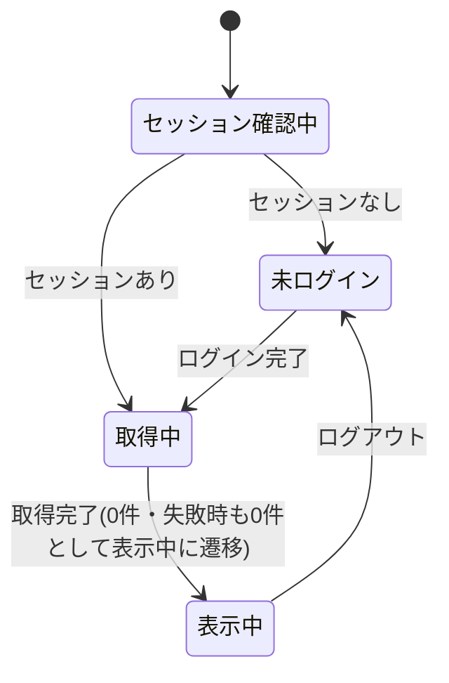

# 設計: 付箋(記事トピックの個人メモ・ブックマーク)

## サマリ
記事詳細ページの各トピックに、ログイン中の読者本人だけが見える「付箋」(200文字までの自由記述メモ)を貼る・編集する・削除する機能と、自分の付箋をまとめて見る付箋一覧ページ(`/news-digest/bookmarks`)を追加する。保存先は新規テーブル`news_digest_bookmarks`で、`auth.uid() = user_id`のRLSにより本人の行のみ操作可能にする。全体の流れは下記「処理フロー」のシーケンス図、コンポーネントの状態遷移は「状態管理」の2つのstateDiagramを参照。

主要な設計判断:
- ログイン状態の判定・認証基盤は[docs/adr/0006](../../../docs/adr/0006-admin-screen-oidc-rls.md)のGoogle OIDCをそのまま使うが、許可リスト(`admin_emails`)による権限確認は行わない(読者全員が対象のため)
- ログイン中の本人に紐づくデータの保存・一覧・編集・削除は[life-money-sim/saved-scenario/design.md](../../life-money-sim/saved-scenario/design.md)・[ai-dev-digest/bookmark/design.md](../../ai-dev-digest/bookmark/design.md)と同じRLSパターン(`auth.uid() = user_id`)を踏襲する
- **Step0は実施しない**(/consultの決定によりai-dev-digestの実装済みビジュアルデザインをそのまま流用する)

## 処理フロー



### 記事内の自分の付箋の有無をまとめて取得する処理
- 対象: 記事詳細ページを開いた時点、およびログイン状態が変化した時点
- 手順:
  1. ログインセッションがない場合は何も取得しない(requirements.md#トピックへの付箋-5)
  2. ログインセッションがある場合、その記事の日付に対する自分の付箋を1回のまとめ取得で取得する。取得完了までは一律「未付箋」として扱う
  3. 取得が完了したら、トピックIDごとに引き当てられる状態にする
  4. 取得に失敗した場合は、すべてのトピックを「未付箋」として扱う
- 関連するビジネスルール: requirements.md#トピックへの付箋-1、requirements.md#表示範囲・権限-1

### 新規に付箋を貼る処理
- 対象: 「付箋を貼る」操作を行ったトピック(記事詳細ページ、または後述の付箋一覧ページ)
- 手順:
  1. 操作すると、そのトピックの表示位置にその場でメモの入力欄が展開する(requirements.md#トピックへの付箋-6)
  2. 入力を確認した結果、トリムした文字列が空文字、または200文字を超える場合は保存を実行しない(requirements.md#トピックへの付箋-2〜3)
  3. 対象記事の日付・トピックID・トリムしたメモ内容を、ログイン中の本人のuser_idで新規保存する
  4. 保存に成功したら、そのトピックの表示を「付箋あり」の状態に切り替え、保存したメモ内容を表示する
  5. 保存に失敗したら、入力欄を開いたまま失敗が分かる表示をする(入力内容は消さない)
- 関連するビジネスルール: requirements.md#トピックへの付箋-1〜4、requirements.md#文字数・件数の制約-3〜4

### 付箋を編集する処理
- 対象: 既に付箋を貼ったトピック
- 手順:
  1. 「編集」操作を行うと、保存済みのメモ内容を初期値として、その場に入力欄が展開する(requirements.md#付箋の編集・削除-7)
  2. 入力を確認した結果、トリムした文字列が空文字、または200文字を超える場合は保存を実行しない
  3. 対象の付箋(既存の1行)を、トリムしたメモ内容で上書き保存する
  4. 保存に成功したら、入力欄を閉じ、更新後のメモ内容を表示する
  5. 保存に失敗したら、入力欄を開いたまま失敗が分かる表示をする
- 関連するビジネスルール: requirements.md#付箋の編集・削除-7

### 付箋を削除する処理
- 対象: 既に付箋を貼ったトピック
- 手順:
  1. 「削除」操作を行うと、対象の付箋を削除する
  2. 削除に成功したら、そのトピックの表示を「未付箋」の状態に戻す
  3. 削除に失敗したら、「付箋あり」の表示のまま失敗が分かる表示をする
- 関連するビジネスルール: requirements.md#付箋の編集・削除-8〜9

### 付箋一覧を取得して表示する処理
- 対象: 付箋一覧ページを開いた時点、およびログイン状態が変化した時点
- 手順:
  1. ログインセッションがない場合、一覧は取得・表示せず、ログインを促す表示のみを行う(requirements.md#付箋した記事一覧-10、requirements.md#表示範囲・権限-1)
  2. ログインセッションがある場合、自分の付箋を、保存日時または最後に編集した日時の新しい順にすべて取得する(requirements.md#付箋した記事一覧-14)
  3. 各付箋の対象記事日付・トピックIDから、トピック見出しを引き当てる。引き当てられない場合はその項目を一覧から除外する
  4. 各項目に、トピック見出し・付箋メモの内容と、編集・削除の操作、対象トピックへのリンクを表示する
  5. 取得に失敗した場合は、0件として扱う
- 関連するビジネスルール: requirements.md#付箋した記事一覧-10〜15

### 付箋一覧からの編集・削除
- 対象: 付箋一覧ページの各項目
- 手順: 上記「付箋を編集する処理」「付箋を削除する処理」と同じ処理をその場(一覧画面内)で行う
- 関連するビジネスルール: requirements.md#付箋した記事一覧-13

## バリデーション
- メモは、トリムした文字列が空文字の場合は保存できない(requirements.md#トピックへの付箋-2)
- メモは200文字までとする。入力欄自体に200文字の上限を設ける。加えてデータベース設計でもCHECK制約として担保する
- 1トピックにつき1読者1件の制約は、アプリ側で「既存の付箋があれば編集として扱う」ことに加え、データベース設計でも一意制約として担保する

## エラーハンドリング
- 記事内の付箋有無の取得、および付箋一覧の取得の失敗は、画面にエラーを伝えず「未付箋」または「0件」として扱う(コンソールにのみ出力)
- 保存(新規・編集)・削除は利用者が明示的に指示した操作のため、失敗した場合は画面に失敗が分かる表示をする(定型の失敗文言のみとし、Supabaseのエラーメッセージをそのまま画面に出さない)
- 保存・削除の処理中は同じ操作ボタンを無効化し、連続クリックによる二重保存・二重削除を防ぐ
- 新規保存時にごく稀な競合が起きた場合も、他の保存失敗と同じ定型の失敗表示にする

## 関連するファイル(抜粋)
```
app/news-digest/lib/bookmarks.ts (新規: fetchBookmarksByArticleDate/fetchAllBookmarks/createBookmark/updateBookmark/deleteBookmark)
app/news-digest/lib/topicIndex.ts (新規: 全記事から「記事日付:トピックID」→トピック見出しの索引を作るbuildTopicIndex)
app/news-digest/components/BookmarkPanel.tsx (新規: ai-dev-digestのBookmarkPanel.tsxと同一の実装)
app/news-digest/components/BookmarkListItem.tsx (新規: ai-dev-digestのBookmarkListItem.tsxと同一の実装)
app/news-digest/components/BookmarkListView.tsx (新規: ai-dev-digestのBookmarkListView.tsxと同一の実装)
app/news-digest/components/TopicSection.tsx (既存: BookmarkPanelを条件付きで表示する配線を追加)
app/news-digest/components/ArticleDetailView.tsx (既存: 記事内の自分の付箋一覧取得を追加し、TopicSectionへpropsで渡す)
app/news-digest/components/LoginStatus.tsx (新規: ai-dev-digestのLoginStatus.tsxと同一の実装。リンク先を/news-digest/bookmarksに変更)
app/news-digest/bookmarks/page.tsx (新規: 付箋一覧ページ。getAllArticles()からトピック索引を組み立て、BookmarkListViewへpropsで渡す)
app/news-digest/lib/articles.ts (既存: article-detailのgetAllArticlesを利用)
app/lib/adminAuth.ts (既存: getSession/onAuthChange/signInWithGoogle/signOutを利用。isAuthorizedAdminは使わない)
app/lib/supabaseClient.ts (既存の共通クライアントを利用)
app/legal/page.tsx (既存: プライバシーポリシーに付箋メモの保存について追記)
```

## データベース設計

### news_digest_bookmarks(新規)
| カラム | 型 | 補足 |
|---|---|---|
| id | uuid, primary key, default gen_random_uuid() | 付箋ID |
| user_id | uuid, not null, references auth.users(id) | 付箋を貼った本人 |
| article_date | date, not null | 対象記事の日付([article-detail](../article-detail/design.md)の`Article.date`と一致) |
| topic_id | text, not null | 対象トピックの`Topic.id`(記事内で一意。記事日付との組で全体の対象を一意に特定する) |
| memo | text, not null, check (char_length(memo) <= 200) | 自由記述のメモ(200文字まで) |
| created_at | timestamptz, not null, default now() | 付箋を貼った日時 |
| updated_at | timestamptz, not null, default now() | 最後に編集した日時。一覧の並び順に使う |

- `(user_id, article_date, topic_id)`の一意制約により、1トピックにつき1読者1件までをデータベース側でも担保する(requirements.md#文字数・件数の制約-4)

```sql
create table news_digest_bookmarks (
  id uuid primary key default gen_random_uuid(),
  user_id uuid not null references auth.users(id),
  article_date date not null,
  topic_id text not null,
  memo text not null check (char_length(memo) <= 200),
  created_at timestamptz not null default now(),
  updated_at timestamptz not null default now(),
  unique (user_id, article_date, topic_id)
);
alter table news_digest_bookmarks enable row level security;

grant select, insert, update, delete on news_digest_bookmarks to authenticated;

create policy "user can select own bookmarks" on news_digest_bookmarks
  for select to authenticated using (auth.uid() = user_id);

create policy "user can insert own bookmarks" on news_digest_bookmarks
  for insert to authenticated with check (auth.uid() = user_id);

create policy "user can update own bookmarks" on news_digest_bookmarks
  for update to authenticated using (auth.uid() = user_id) with check (auth.uid() = user_id);

create policy "user can delete own bookmarks" on news_digest_bookmarks
  for delete to authenticated using (auth.uid() = user_id);

-- benriyatool_readonlyはSELECTのみ許可(docs/adr/0004。data-checkでの集計に使う)
grant select on news_digest_bookmarks to benriyatool_readonly;

create policy "benriyatool_readonly can select" on news_digest_bookmarks
  for select to benriyatool_readonly using (true);
```

実際のマイグレーションファイル作成・適用はtasks.mdで行う。

T0(マイグレーション適用)の実機確認として、次を必ず確かめる(ai-dev-digest/bookmark/design.mdのT0確認事項と同様):
- ログイン中の本人が、自分で貼った付箋のみSELECT/INSERT/UPDATE/DELETEできること
- 別アカウントでログインした場合、他人の付箋が一切見えない・編集・削除できないこと
- 未ログイン(anon)ではSELECT/INSERT/UPDATE/DELETEのいずれもできないこと
- 同じトピックへ2件目を保存しようとすると一意制約により拒否されること
- `memo`が200文字を超える行を保存しようとするとCHECK制約により拒否されること

## 画面設計

### 記事詳細ページへの追加(既存画面)
- 各トピックの出典表示の下・フィードバック入力欄(運営者本人のみ表示)より上に、ログイン中のみ付箋の操作領域を表示する(ai-dev-digestと同じ配置)
  - 未付箋: 「付箋を貼る」操作のみを表示する
  - 付箋あり: 保存済みのメモ内容と、「編集」「削除」操作を表示する
  - 「付箋を貼る」「編集」操作を行うと、その場にメモ入力欄(200文字まで)と「保存」「キャンセル」操作が展開する
- ページ下部のログイン導線: ログインボタンの文言は「ログイン」。ログイン中は、ログイン状態表示(メールアドレス表示)の左隣に「付箋一覧」というリンクテキストで付箋一覧ページへのリンクを追加する(requirements.md#付箋した記事一覧-10)

### 付箋一覧ページ(新規: `/news-digest/bookmarks`)
- パンくず(べんりやつーる › 重要ニュースダイジェスト › 付箋一覧)
- 見出し「付箋一覧」
- セッション確認中・取得中の場合: ローディング表示のみを行う
- 未ログインの場合: 一覧は表示せず、ログインを促す表示とログイン操作のみを表示する
- ログイン中、付箋が0件の場合: 「まだ付箋がありません」の案内を表示する
- ログイン中、1件以上の場合: 保存/編集日時の新しい順のカード一覧。各カードにトピック見出し(対象トピックへのリンク)・付箋メモの内容・「編集」「削除」操作を表示する

## コンポーネント設計

| コンポーネント | Props | 役割 |
|---|---|---|
| TopicSection | (既存コンポーネント。本specで追加する分のみ記載)`bookmark: { id: string; memo: string } \| null` | `session`がある場合のみBookmarkPanelを表示し、`bookmark`をその`initialBookmark`propへそのまま渡す |
| BookmarkPanel | `articleDate: string`, `topicId: string`, `initialBookmark: { id: string; memo: string } \| null`, `onChange?: (bookmark: { id: string; memo: string } \| null) => void` | 1トピック分の付箋の表示・新規作成・編集・削除(記事詳細ページ・付箋一覧ページ共通) |
| BookmarkListItem | `articleDate: string`, `topicHeading: string`, `bookmark: { id: string; topicId: string; memo: string }` | 付箋一覧の1項目 |
| BookmarkListView | `topicIndex: Record<string, string>`(「記事日付:トピックID」→トピック見出し) | 付箋一覧ページの本体 |

## 状態管理

- `BookmarkPanel`は1トピックにつき「未付箋」「付箋あり」「編集中」の3状態をコンポーネント内の`useState`で持つ(トピックをまたいで共有しない)



- `ArticleDetailView`は、既存のログインセッションに加え、その記事内の自分の付箋一覧(トピックIDで引き当てるMap)をローカル状態として持ち、`TopicSection`へpropsで渡す
- `BookmarkListView`はセッション確認中・未ログイン・取得中・表示中の4状態を持つ



## セキュリティ

- 実際のアクセス制御はDB側のRLS(`auth.uid() = user_id`)で担保する。画面側の表示出し分けは案内のためのもので、突破されても他人の行は返らない
- メモ内容は本人しかSELECTできない行にのみ保存され、他の読者・運営者(自作画面経由)から参照できない
- メモ(自由テキスト)は、画面表示時にHTMLとして解釈されない形で描画する(Reactの標準的な文字列描画に任せ、`dangerouslySetInnerHTML`は使わない)
- 200文字の上限はクライアント側(入力欄の`maxLength`+トリム検証)に加え、DB側にも`check (char_length(memo) <= 200)`のCHECK制約を設ける(ai-dev-digest/bookmark/design.md#セキュリティと同じ理由: Googleアカウントを持つ読者全員に付箋の操作を開放するため、悪意ある・不注意な読者による大量件数・巨大な文字列のINSERTを防ぐ)
- `article_date`・`topic_id`はブラウザから送信される値をそのまま信頼する。付箋一覧の表示時、対象トピックが記事データから見つからない場合はその項目を一覧から除外する

## ログ

- 記事内の付箋有無・付箋一覧の取得失敗は、ブラウザのコンソールにエラー内容を出す(画面には伝えないが原因究明はできるようにする)。メモの中身はログに含めず、失敗の事実のみ出す
- 保存(新規・編集)・削除の失敗も同様にコンソールへ出す
- 保存・削除の成功時はログを出力しない

## 依存関係
- 付箋対象となるトピックの識別子(`Topic.id`)・記事日付は[article-detail/design.md](../article-detail/design.md)にそのまま従う
- ログイン基盤(`app/lib/adminAuth.ts`)は[docs/adr/0006](../../../docs/adr/0006-admin-screen-oidc-rls.md)を踏襲するが、許可リストによる権限確認(`isAuthorizedAdmin`)は利用しない
- RLSパターンは[life-money-sim/saved-scenario/design.md](../../life-money-sim/saved-scenario/design.md)を踏襲する
- 記事詳細ページのフィードバック入力欄の表示条件変更([article-detail/design.md](../article-detail/design.md)の該当箇所)は、本specの追加によりログインが読者全員に開放されることに伴う対応であり、本specと同じPRで行う
