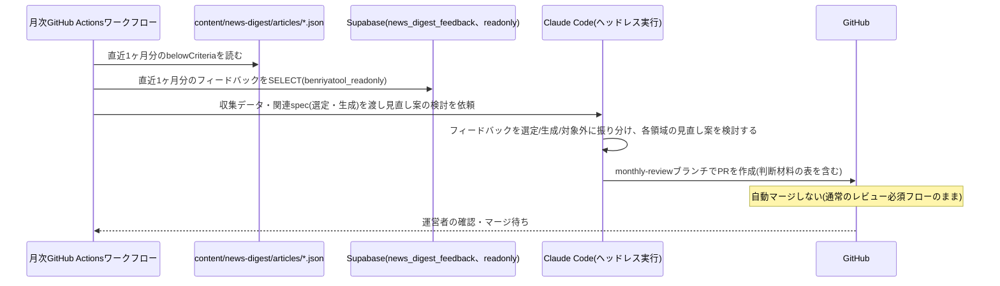

# 設計: 月次見直し(選定・生成)

## サマリ
月1回、直近1ヶ月分の専用枠の基準未達記録と運営者フィードバックを集計し、Claude Code CLIのヘッドレス実行で選定領域(情報源・採用基準・専用枠の運用)・生成領域(要約・記事執筆ルール)の見直し案をPRとして提案する。ai-dev-digestのwatchlist-reviewと同じ構成・承認フロー(自動マージしない)を踏襲する。DB接続は共有プロジェクトの`benriyatool_readonly`ロールを再利用する。

## 実行環境の前提

実行主体はGitHub Actionsとする。DB接続情報(`SUPABASE_READONLY_DB_URL`)は、ai-dev-digestのwatchlist-reviewが既に利用している`benriyatool_readonly`ロール(SELECT専用・プロジェクト共有の接続情報)をそのまま再利用する(新しい接続情報・Secretsは追加しない。根拠は[0004-agent-readonly-db-access.md](../../../docs/adr/0004-agent-readonly-db-access.md)参照)。Claude Code CLIの認証も[weekly-publish/design.md](../weekly-publish/design.md)「実行環境の前提」と同じくai-dev-digestと共用の`CLAUDE_CODE_OAUTH_TOKEN`を使う。

- ワークフロー本体は`.github/workflows/news-digest-monthly.yml`として月1回起動する
- 「見直し案を作成する処理」はエージェントの推論を要するため、GitHub Actionsのワークフロー内でClaude Code CLIをヘッドレス(非対話)モードで起動し、ファイル読み書き・テスト実行(`bash`)ツールを持つエージェントセッションとして実行する(ai-dev-digestのwatchlist-reviewと同じ理由: 複数ファイル(選定領域: requirements.md・watchlist.json・criteria.json / 生成領域: content-generation/requirements.md・design.md)を横断して整合の取れた編集を行うタスクのため)
- GitHubへの書き込みには、[weekly-publish](../weekly-publish/design.md)と同じ`NEWS_DIGEST_GH_PAT`を再利用する(本specは自動マージしないため、weekly-publishで懸念した「同一PATによる自動マージ範囲の混同」は生じない)
- ワークフローへの実行指示は、この`monthly-review`のrequirements.md/design.mdと、参照先の`content-selection`・`content-generation`のrequirements.md/design.mdをそのまま参照する形にする
- 運用開始前に、`NEWS_DIGEST_GH_PAT`・`CLAUDE_CODE_OAUTH_TOKEN`・`SUPABASE_READONLY_DB_URL`が実際にリポジトリのActions Secretsに設定されていることを確認する(いずれもai-dev-digestが既に設定済みのため、`NEWS_DIGEST_GH_PAT`のみ新規発行が必要)

## 処理フロー

### 見直しの材料を集める処理
- 対象: 直近1ヶ月分のデータ
- 手順:
  1. `content/news-digest/articles/*.json`のうち、実行日から過去1ヶ月分のファイルを読み込み、`belowCriteria: true`のトピックを抽出する(発生週・カテゴリ・`belowCriteriaReason`)。これがcontent-selection/requirements.md#採用基準-5の専用枠の基準未達記録にあたる
  2. `news_digest_feedback`テーブルから、直近1ヶ月分・`is_test = false`のレコードを`benriyatool_readonly`ロールで読み取る(領域で絞り込まず全件取得する)
  3. 上記2種類のデータをまとめ、見直し案の根拠として使えるようにする
- 関連するビジネスルール: requirements.md#見直しの実行-1、requirements.md#見直しの実行-3

### 見直し案を作成する処理(エージェントの推論)
- 対象: 収集した基準未達記録・フィードバック
- 手順:
  1. 各運営者フィードバックを内容から「選定領域」「生成領域」「いずれにも該当しない」に振り分ける(requirements.md#見直しの実行-3)。判断の目安:
     - 選定領域: 「どの話題を載せるか」への指摘(情報源の偏り・専用枠の運用実態(基準未達が慢性的か)・カテゴリの過不足など)
     - 生成領域: 「載せた話題をどう書くか」への指摘(分かりやすさ、要約の分量、重要度★の付け方など)
     - いずれにも該当しない: 画面表示の不具合、付箋など他機能への要望
  2. 選定領域(基準未達記録 + 選定領域に振り分けたフィードバック)の見直し案を検討する:
     - 専用枠(神奈川ローカル・育児)の基準未達が特定の情報源で慢性的に続いている場合、その情報源の見直しを検討する
     - 総合・経済/ビジネスの候補が慢性的に0件のカテゴリがあれば、情報源の追加や採用基準(`minCorroboratingSources`)の見直しを検討する
     - フィードバックが既存の採用基準では表現できない観点を指摘している場合、新しい採用基準・フィルター観点の追加を具体的な変更案として検討する(requirements.md#選定領域の見直し案の粒度・提示方法-6)
  3. 生成領域(生成領域に振り分けたフィードバック)の見直し案を検討する:
     - フィードバックが指摘する分かりやすさ・情報の取捨選択・重要度の付け方の問題に対し、`content-generation/requirements.md`の機能要件・ビジネスルールと`content-generation/design.md`の該当処理の文言を、具体的な変更案として検討する(requirements.md#生成領域の見直し案の粒度・提示方法-9)
     - 著作権リスク低減の前提(独自の再構成・数値結論の網羅的な転記の回避・出典の明記)を弱める変更は提案しない(requirements.md#ビジネスルール・制約-3)
  4. 見直し案には、どのフィードバック・どの実績データに基づく変更かを明記する(requirements.md#ビジネスルール・制約-2)
  5. 選定領域・生成領域それぞれについて、振り分けた材料が1件でもある場合は、必ず具体的な変更案(実際のファイル差分)を作成してPRとして提示する。両領域とも材料が0件の月のみ、PRを作成しない(requirements.md#選定領域の見直し案の粒度・提示方法-7)
  6. 選定領域で、既存の選定ロジック(`app/news-digest/lib/selection.ts`等)ではまだ判定できない新しい種類の採用基準・フィルター観点を追加する場合、その判定ロジックの実装(TDDのテストを含む)も同じPRに含める。実装後は`npm test`・`npm run lint`・`npm run build`・`npm run check:spec-coverage`を実行し、いずれも成功することを確認してからコミットする(requirements.md#選定領域の見直し案の粒度・提示方法-8)
  7. 手順6の実装がどうしても完了できない場合のみ、`npm run check:spec-coverage`が❌にならないよう`scripts/spec-coverage-skip.json`に理由を添えて登録した上で、PR本文の判断材料の表に実装が未完了である旨を明記する(例外的な扱い)
  8. 生成領域では、`content-generation/requirements.md`・`design.md`の変更は記事生成CLI(`scripts/news-digest/generate-content.ts`)が実行時に両ファイルを読み込むため次回の週次生成に自動で反映される(requirements.md#生成領域の見直し案の粒度・提示方法-10)。変更が同CLI内に転記されているルール文に及ぶ場合は、その転記箇所の更新も同じPRに含める
- 変更対象ファイル:
  - 選定領域: `specs/news-digest/content-selection/requirements.md`と`content/news-digest/watchlist.json`・`content/news-digest/criteria.json`。新しい判定ロジックが必要な場合は`app/news-digest/lib/`配下の関連ファイル・対応テスト
  - 生成領域: `specs/news-digest/content-generation/requirements.md`・`design.md`。変更が転記箇所に及ぶ場合は`scripts/news-digest/generate-content.ts`
  - `scripts/spec-coverage-skip.json`(選定領域の実装まで完了できなかった場合のみ)
- 関連するビジネスルール: requirements.md#見直しの実行-1〜4、requirements.md#ビジネスルール・制約-2〜3、requirements.md#選定領域の見直し案の粒度・提示方法-6〜8、requirements.md#生成領域の見直し案の粒度・提示方法-9〜10

### 見直し案をPRとして提案する処理
- 対象: 上記で作成した変更内容
- 手順:
  1. 作業用ブランチ`news-digest/monthly-review/<year-month>`(例: `news-digest/monthly-review/2026-10`)を作成する
  2. 変更内容をコミットし、`main`向けにPRを作成する。PR本文には判断材料として「対象フィードバック・実績」「提案内容」「適用した場合の懸念」の3列からなる表を含める(requirements.md#ビジネスルール・制約-2)。振り分けの結果いずれの領域にも該当しなかったフィードバックも、内容と「対象外」である旨を表の行として残す。Claude Code CLIには、この表をMarkdown形式で`/tmp/news-digest-monthly-review-pr-body.md`に書き出すよう指示し、PR作成時に`gh pr create --body-file`でこれを読み込む
  3. **このPRは自動マージしない。** [weekly-publish](../weekly-publish/design.md)の自動マージ対象は`news-digest/articles/**`ブランチのみであり、`news-digest/monthly-review/**`は対象外
- シーケンス図(俯瞰用。正は上記の手順の文章):


- 関連するビジネスルール: requirements.md#承認フロー-5

## エラーハンドリング

- `news_digest_feedback`への接続に失敗した場合、フィードバックなしの状態(基準未達記録のみ)で見直し案を検討する。DB接続の可否によって月次実行自体を失敗させない
- 選定領域の見直し案がrequirements.mdとJSONデータ(watchlist.json・criteria.json)の片方しか更新できていない状態でPRを作らない
- Claude Codeが判断材料の表を書き出せなかった場合、PR作成自体は妨げず、その旨を明記した簡潔な代替本文でPRを作成する

## 関連するファイル(抜粋)

```
.github/workflows/news-digest-monthly.yml (月1回起動するワークフロー本体)
scripts/news-digest/collect-review-data/ (独立したpackage.json。ai-dev-digestのcollect-review-dataと同じ依存隔離パターン)
scripts/news-digest/collect-review-data/collectReviewData.ts (基準未達記録の集計+フィードバックのSELECT)
content/news-digest/articles/*.json (既存: 基準未達記録の参照元)
supabase/migrations/<timestamp>_create_news_digest_feedback.sql (既存: article-detailで作成するbenriyatool_readonly向けSELECTポリシーを利用)
specs/news-digest/content-selection/requirements.md、content/news-digest/watchlist.json・criteria.json (既存: 選定領域の見直し案の変更対象)
specs/news-digest/content-generation/requirements.md・design.md (既存: 生成領域の見直し案の変更対象)
```

## データベース設計

新規テーブルはない。[article-detail/design.md](../article-detail/design.md)で作成する`news_digest_feedback`テーブルの`benriyatool_readonly`向けSELECTポリシー(docs/adr/0004)をそのまま利用する。

## セキュリティ

- `SUPABASE_READONLY_DB_URL`はai-dev-digestが既に保存済みのActions Secretsをそのまま参照する(`benriyatool_readonly`ロールに限りGitHub Actions Secretsへの保持を許容するdocs/adr/0004の対象範囲は、プロジェクト共有のロールであり本specも対象に含まれる)
- `CLAUDE_CODE_OAUTH_TOKEN`は運営者個人のClaude Code Pro/Maxサブスクリプションに紐づく認証情報である点は[weekly-publish/design.md](../weekly-publish/design.md)「セキュリティ」と同様
- フィードバックのSELECTは集計・見直し検討の目的に限定し、特定の投稿者を特定・追跡する用途には使わない(docs/adr/0004の既存方針を踏襲。本アプリのフィードバックには投稿者を特定する情報自体が含まれない)
- 見直し案のPRは通常のレビュー必須フローに乗るため、内容の妥当性は運営者のレビューで最終確認される(自動マージしないこと自体が主要な安全策)

## ログ

- 月次実行ごとに、集計対象期間・基準未達件数・フィードバック件数・PR作成の有無(変更なしの場合はその旨)をGitHub Actionsのワークフロー実行ログに記録する
