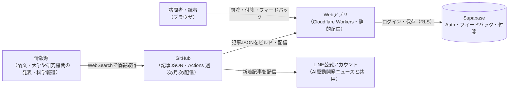

# アーキテクチャ: research-digest

## 1. 概要
10ジャンルから、世の中に影響を与える研究の発見・論文を、日々の生活への影響度(大・中・小)の大きい順に1ジャンル1本ずつ選び、要約して毎週月曜に公開するアプリ。 URL: `/research-digest`

## 2. アーキテクチャの目的
- 既存のdigestアプリが配信していない月曜を埋め、trend-digestと同じ運用パターン(GitHub Actionsによる週次の自動生成・完全自動マージ、LINE配信、月次の人の承認込み見直し)をそのまま使い、新しい運用パターンを増やさない
- 発表時期を問わず、過去に配信した研究とは重複させずに、生活への影響が大きい研究から順に届ける

## 3. 設計方針
- 記事本文はDBに保存せず、ビルド時に取り込む静的コンテンツ(JSON)として管理する(ai-dev-digest・trend-digestと同じ)
- ジャンルは設定ファイル(コンテンツデータ)で管理し、追記だけで増やせるようにする
- 運営者フィードバックは[ADR-0001](../../docs/adr/0001-user-input-database.md)の`authenticated`ロールINSERT専用パターン、運営者判定は既存の`isAuthorizedAdmin()`([ADR-0006](../../docs/adr/0006-admin-screen-oidc-rls.md))を再利用する
- 読者の付箋はnews-digest・ai-dev-digestと同じ、本人だけが読み書きできるRLSパターンをとる
- LINE配信は既存の「AI駆動開発ニュース」のLINE公式アカウントに相乗りし、見出しに「【週刊研究発見】」を付けて区別する

## 4. システム構成図

この図の正となる文章は「[5. アーキテクチャ概要](#5-アーキテクチャ概要)」と各specの要件定義。

## 5. アーキテクチャ概要
Next.jsの静的エクスポートをCloudflare Workersで配信する構成は他アプリと同じ。記事本文は`content/research-digest/`配下のJSONとして管理する。対象は10ジャンルで、ジャンルごとに生活への影響度の最も大きい未配信の研究を1本選ぶ。毎週月曜の朝にGitHub Actionsが起動し、Claude Code CLIのヘッドレス実行でWebSearchによる収集・影響度の判定・配信済みとの重複除外・要約を行い([content-selection](content-selection/requirements.md)・[content-generation](content-generation/requirements.md))、記事JSONを追加するPRを作ってCI成功後に自動マージする([weekly-publish](weekly-publish/requirements.md))。このマージをきっかけに別のワークフローが起動し、記事ページが本番で開けることを確認してからLINEで配信する([line-broadcast](line-broadcast/requirements.md))。訪問者は一覧・詳細ページ([article-list](article-list/requirements.md)・[article-detail](article-detail/requirements.md))を未ログインで閲覧でき、詳細ページでは影響度順・ジャンル順を切り替えられる。ログインした読者は記事ごとに付箋を貼れ([bookmark](bookmark/requirements.md))、運営者本人はフィードバックを残せる。月次のワークフローがフィードバックと収集状況から見直し案をPRで出し、運営者の承認を経て反映する([source-review](source-review/requirements.md))。

## 6. 採用技術
| 技術 | 用途 |
|---|---|
| Next.js(静的エクスポート) | 記事一覧・詳細・付箋一覧ページの描画 |
| Supabase | 運営者フィードバック・読者の付箋の保存 |
| Supabase Auth(Google OIDC) | 読者のログイン(付箋)、運営者判定(フィードバック欄の表示切り替え) |
| GitHub Actions | 週次の記事生成・月次見直し・LINE配信の実行基盤 |
| Claude Code(ヘッドレス実行) | WebSearchによる収集、影響度の判定、重複の判定、要約・記事執筆、月次見直し案の検討 |
| LINE Messaging API | 既存LINE公式アカウントからの新着記事の配信 |
| Tailwind CSS | スタイリング |

## 7. 機能マップ
| spec | 役割 | 依存 | 状態 |
|---|---|---|---|
| [content-selection](content-selection/requirements.md) | 10ジャンルごとに、生活への影響度が最も大きく未配信の研究・論文を1本選ぶ | weekly-publishの実行タイミングに従う | 仕様のみ(未実装) |
| [content-generation](content-generation/requirements.md) | 選ばれた記事の要約・影響度の根拠の執筆ルール(著作権への配慮を含む)を定める | content-selectionの選定結果を受け取る | 仕様のみ(未実装) |
| [weekly-publish](weekly-publish/requirements.md) | 毎週月曜の収集・選定・要約・公開を自動で行い、完全自動マージする | content-selection・content-generationの結果を公開する | 仕様のみ(未実装) |
| [line-broadcast](line-broadcast/requirements.md) | 記事ページの公開を確認してから、既存LINE公式アカウントで新着記事を配信する | weekly-publishのマージタイミング、article-detailの記事データに従う | 仕様のみ(未実装) |
| [article-list](article-list/requirements.md) | 記事を日付リストで一覧表示し、影響度「大」の見出しを最大3件添える | article-detailの記事データを参照 | 仕様のみ(未実装) |
| [article-detail](article-detail/requirements.md) | 記事を影響度順・ジャンル順で切り替えて表示し、運営者フィードバック欄を出す | content-selection・content-generationの結果に従う | 仕様のみ(未実装) |
| [bookmark](bookmark/requirements.md) | ログインした読者が記事ごとにメモ付きの付箋を貼り、一覧で見返す | article-detailの記事識別子に従う | 仕様のみ(未実装) |
| [source-review](source-review/requirements.md) | 月次でジャンル・採用基準・執筆ルールの見直し案を作り、人の承認を経て反映する | article-detailのフィードバック、content-selectionの収集状況を参照 | 仕様のみ(未実装) |

## 8. ディレクトリ構成
CLAUDE.mdの一般規約(`components/`,`lib/`)どおり。trend-digestと同じ考え方で、次のように置く(各ファイルの役割は各specのdesign.md「関連するファイル」参照)。
- `content/research-digest/genres.json` — ジャンル設定(運営者が追記して増やす)
- `content/research-digest/articles/<発行日>.json` — 1回分の記事データ(型は[article-detail/design.md](article-detail/design.md)で定義)
- `app/research-digest/` — 一覧・詳細・付箋一覧のページと`components/`・`lib/`
- `scripts/research-digest/` — 収集・選定、生成、記事の書き出し、LINE配信、月次見直しの材料収集のCLI
- `.github/workflows/research-digest-weekly.yml`・`research-digest-line-broadcast.yml`・`research-digest-monthly.yml` — 週次公開・配信・月次見直し
- Supabaseのテーブルは`research_digest_feedback`(運営者フィードバック)と`research_digest_bookmarks`(読者の付箋)の2つ

## 9. 関連ADR
- [0001-user-input-database.md](../../docs/adr/0001-user-input-database.md) — フィードバック(INSERT専用)・付箋(本人のみRLS)の保存パターン
- [0006-admin-screen-oidc-rls.md](../../docs/adr/0006-admin-screen-oidc-rls.md) — ログイン・運営者判定の基盤

## 10. 技術的制約
他者の記事・論文を要約して載せるため、著作権(翻案権)のリスクがある。ai-dev-digest・trend-digestと同じく、要約の分量を抑え、独自に書き直し、出典を明記し、利用規約に条項を追記してリスクを下げる([content-generation](content-generation/requirements.md))。研究結果を誇張せず、健康に関わる研究では個別の治療判断を勧めない([content-generation](content-generation/requirements.md))。
