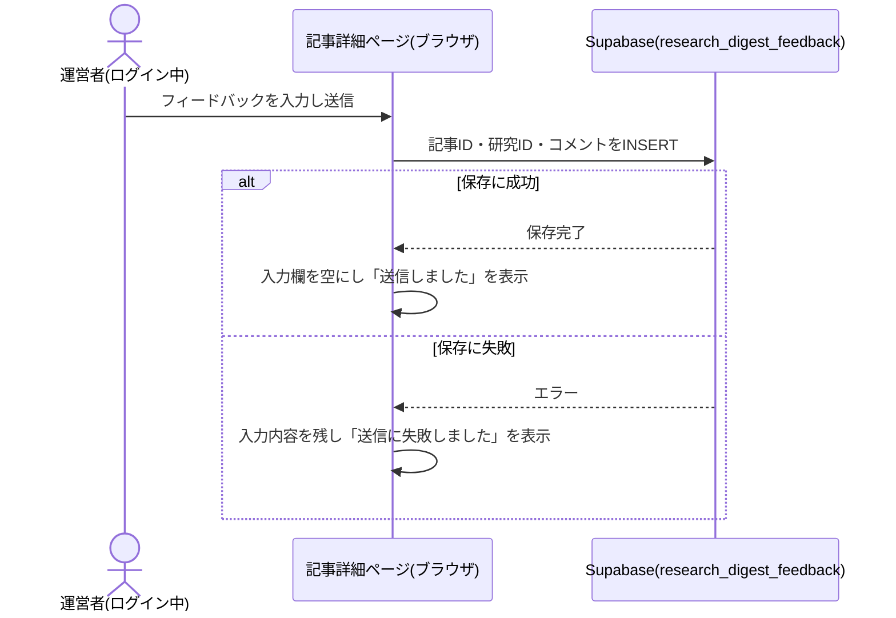
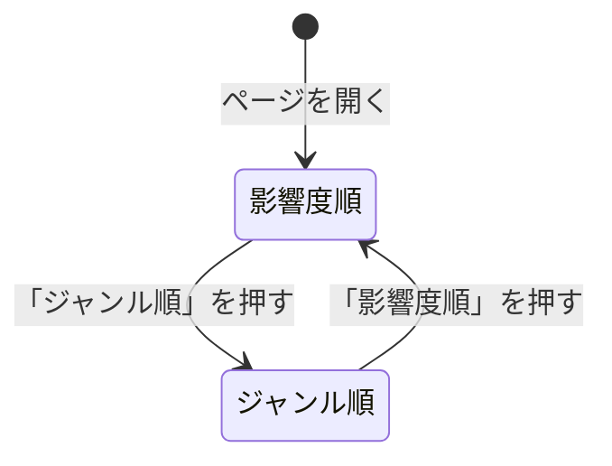

# 設計: 記事詳細ページ

## サマリ
その回の研究発見の記事(ジャンルごとに1本、有効なジャンルの数だけ。現在は10ジャンル)を、初期表示は影響度順、切り替えでジャンル順に並べて表示する。候補が見つからなかったジャンルも「候補が見つかりませんでした」として必ず表示し、全ジャンルが画面に現れる状態を保つ。査読前の論文には「査読前」のバッジを付ける。運営者本人がログイン中の場合のみ、各研究の下にフィードバック入力欄を出し、`research_digest_feedback`テーブルへINSERT専用で保存する。記事データの型・置き場所は本specが定義し、他specが共通して従う(下記「前提: 記事データの形式」)。

主要な設計判断:
- 記事データは`content/research-digest/articles/<date>.json`の静的JSON。ジャンルは設定ファイル`content/research-digest/genres.json`から読み、追記だけで増やせるようにする
- 並び順の切り替えはfuture-digestの記事詳細ページと同じ作り(画面内の状態で切り替え、並べ替えは決定的な純粋関数)
- 査読前かどうかは記事データのフラグで持ち、バッジは画面側で決定的に出す(本文の書きぶりだけに頼らない)
- UIはStep0を実施しない(週刊トレンドの確定済みデザインを流用し配色のみ変更するため)。trend-digestの実装済みレイアウトを流用し、アクセントカラーのみティール系に変える(下記「画面設計」)
- 図: [フィードバックを送信する処理](#フィードバックを送信する処理)のシーケンス図、[状態管理](#状態管理)の状態遷移図

## 前提: 記事データの形式(この機能が定義する共有スキーマ)

記事本文はDBではなく、ビルド時に取り込む静的コンテンツファイルとして管理する(architecture.md#3-設計方針)。この形式は[article-list](../article-list/design.md)・[content-selection](../content-selection/design.md)・[content-generation](../content-generation/design.md)・[weekly-publish](../weekly-publish/design.md)・[line-broadcast](../line-broadcast/design.md)・[bookmark](../bookmark/design.md)・[source-review](../source-review/design.md)が共通して従う。

- 格納場所: `content/research-digest/articles/<id>.json`(`<id>`は発行日`YYYY-MM-DD`。URLの`[id]`と一致させる)
- 1ファイル=1回分の記事。週次のワークフロー([weekly-publish](../weekly-publish/design.md))が新規追加する。公開をスキップした回はファイルを作らない

```ts
// app/research-digest/lib/types.ts

// ジャンルはコードに固定せず、設定ファイル content/research-digest/genres.json から読み込む
// (content-selection/requirements.md#機能要件-1。ファイルの形式は content-selection/design.md「データ設計」)
export type Genre = string // genres.jsonのid(例: "medical-health")

// ジャンル順(genres.jsonの記載順。廃止したジャンルも過去記事の表示用に含む)
export const GENRE_ORDER: Genre[]
export const GENRE_LABELS: Record<Genre, string> // 例: { "medical-health": "医療・健康", ... }

// 影響度(content-selection/requirements.md#影響度-1)。配列順=影響度の大きい順
export type Impact = 'high' | 'medium' | 'low'
export const IMPACT_ORDER: Impact[] = ['high', 'medium', 'low']
export const IMPACT_LABELS: Record<Impact, string> = { high: '大', medium: '中', low: '小' }

export type Finding = {
  id: string // 記事内で一意。ジャンルのidと同じ(1ジャンル1本のため)。フィードバック・付箋の紐付けに使う
  genre: Genre
  heading: string // content-generationが生成する見出し
  body: string // content-generationが生成する本文(160〜480字、目安200〜400字)
  impact: Impact
  impactReason: string // 影響度の根拠(1文)
  sourceTitle: string // 論文名(公式発表の場合は発表のタイトル)。画面では出典リンクの文言として使う
  sourceName: string // 掲載誌名または発表元(大学・研究機関)
  sourceUrl: string // 論文・公式発表のURL
  doi: string | null // 論文のDOI(ある場合のみ。配信済み判定の突合に使う)
  publishedYear: number | null // 論文・発表の年(分かる場合のみ。画面で出典の横に出す)
  isPreprint: boolean // 査読前の論文(プレプリント)か
}

// 掲載できなかったジャンル。reasonで表示文言を出し分ける
export type EmptyGenre = {
  genre: Genre
  reason: 'no-candidate' | 'collection-failed' | 'generation-failed' // 候補が見つからなかった / 収集の処理自体が失敗した / 候補はあったが要約の生成に失敗した
  collectionFailureReason?: 'timeout' | 'invalid-format' | 'other' // reasonが'collection-failed'の場合の分類ラベル(requirements.md#収集失敗-2)。利用上限への到達は実行全体を打ち切るため値に含まない(requirements.md#収集失敗-3)【推測】
}

export type Article = {
  id: string // ファイル名と一致(= date)
  date: string // YYYY-MM-DD。発行日
  findings: Finding[]
  emptyGenres: EmptyGenre[]
}
```

- 記事タイトルはJSONに保存せず、`date`から`buildArticleTitle(date)`([content-generation/design.md](../content-generation/design.md))で導出する
- `emptyGenres`の`reason`は、候補が見つからなかったジャンル(requirements.md#記事本文の表示-3)・収集の処理自体が失敗したジャンル(requirements.md#記事本文の表示-4。分類ラベルは[content-selection/requirements.md#収集失敗](../content-selection/requirements.md)で定義)・生成に失敗して除いたジャンル([weekly-publish/requirements.md#掲載件数の保証](../weekly-publish/requirements.md))の3つを区別するために持つ。表示文言もこの3つで異なる(requirements.md#記事本文の表示-3〜6、future-digestと同じ扱い)

## 処理フロー

### 記事データを読み込む処理
- 対象: `content/research-digest/articles/`配下のJSONファイル
- 手順:
  1. 指定されたIDのファイルを読み込む。存在しない場合は「記事なし」として扱う
  2. JSONとしてパースできない、または下記「バリデーション」を満たさない場合は例外を投げる
  3. 全記事を読み込む場合は、発行日の新しい順に並べて返す
- 関連するビジネスルール: requirements.md#記事本文の表示-1〜2

### 表示するジャンルの一覧を組み立てる処理
- 対象: 1回分の記事
- 手順:
  1. 掲載した研究と掲載できなかったジャンルを、1つの「ジャンル枠」の一覧にまとめる
  2. 影響度順の場合は、研究があるジャンルを影響度の大きい順に並べ、同じ影響度の中ではジャンル順に並べる。掲載できなかったジャンルは、その後ろにジャンル順で並べる(requirements.md#記事本文の表示-3、requirements.md#並び順の切り替え-8)
  3. ジャンル順の場合は、ジャンルの定義順に並べ、掲載できなかったジャンルも本来の位置に置く(requirements.md#並び順の切り替え-9)
- 関連するビジネスルール: requirements.md#記事本文の表示-3、requirements.md#並び順の切り替え-8〜9

### その回の記事本文を表示する処理
- 対象: 組み立てたジャンル枠の一覧
- 手順:
  1. 記事タイトル・公開日を見出しとして表示する(requirements.md#記事本文の表示-1)
  2. ページを開いた時点では影響度順で表示する(requirements.md#並び順の切り替え-10)
  3. 研究があるジャンルは、ジャンル・影響度のバッジ(査読前の論文は「査読前」のバッジも)、見出し、本文、影響度の根拠、出典(論文名または発表元・掲載誌名/発表元・年・元URLへのリンク。新規タブで開く)を表示する(requirements.md#記事本文の表示-2)
  4. 候補が見つからなかったジャンルは、ジャンルのバッジと「候補が見つかりませんでした」を表示する(requirements.md#記事本文の表示-3)。収集の処理自体が失敗したジャンルは、同じバッジと分類ラベルを含む「情報収集に失敗しました」を表示する(requirements.md#記事本文の表示-4)。生成に失敗したジャンルは、同じバッジと「今回は記事を用意できませんでした」を表示する(requirements.md#記事本文の表示-5)
  5. 並び順の切り替え操作が行われたら、同じ記事データから一覧を組み立て直して表示し直す(requirements.md#並び順の切り替え-7)
- 関連するビジネスルール: requirements.md#記事本文の表示-1〜3、requirements.md#並び順の切り替え-7〜10、requirements.md#表示分量・著作権への配慮-1

### ログイン状態に応じてフィードバック入力欄の表示を切り替える処理
- 対象: Supabase Authのログインセッション
- 手順:
  1. ページ表示時に現在のログインセッションを取得する(`app/lib/adminAuth.ts`の`getSession`)
  2. ログイン中の場合、`isAuthorizedAdmin()`で運営者本人かを確認し、許可対象と判定された場合のみ、研究がある各ジャンルの下にフィードバック入力欄を表示する(requirements.md#運営者向けフィードバック-11、requirements.md#フィードバックの保存・権限-3)
  3. 確認中・確認に失敗した場合は「未許可」として扱い、入力欄を出さない。失敗はブラウザのコンソールにだけ出す
  4. ログイン状態の変化を購読し、変化のたびに1〜3をやり直す
- 関連するビジネスルール: requirements.md#運営者向けフィードバック-11、requirements.md#フィードバックの保存・権限-3〜4

### フィードバックを送信する処理
- 対象: フィードバック入力欄に入力された自由記述
- 手順:
  1. 入力欄に`maxLength={1000}`を設定し、前後の空白を除いた結果が空、または1000字を超える場合は送信ボタンを押せないようにする(requirements.md#運営者向けフィードバック-13)。入力欄の下に残り字数(例:「120/1000字」)を表示する【推測】
  2. 送信時、記事ID・研究ID・入力内容を1件のレコードとして`research_digest_feedback`に保存する(`authenticated`ロールでのINSERT)
  3. 成功した場合は入力欄を空にし「送信しました」を数秒表示する(requirements.md#運営者向けフィードバック-12)
  4. 失敗した場合は入力内容を残したまま「送信に失敗しました。もう一度お試しください」を表示する
- シーケンス図(俯瞰用。正は上記の手順の文章):


- 関連するビジネスルール: requirements.md#運営者向けフィードバック-12〜13、requirements.md#フィードバックの保存・権限-2

## バリデーション

記事データ(JSONファイル)のスキーマ検証(`parseArticle`):
- `id`がファイル名と一致し、`date`と同じ`YYYY-MM-DD`形式であること
- 各研究: `genre`が`genres.json`に存在するジャンル(廃止済みを含む)であること、`id`が`genre`と一致すること、`impact`が定義済みの値であること、`heading`・`body`・`impactReason`・`sourceTitle`・`sourceName`・`sourceUrl`が空でないこと、`sourceUrl`が`http`/`https`の絶対URLであること、`doi`が`null`または`10.`で始まる文字列であること、`publishedYear`が`null`または1900以上で発行日の年以下の整数であること、`isPreprint`が真偽値であること、`body`が160〜480字であること
- 各掲載できなかったジャンル: `genre`が`genres.json`に存在し、`reason`が定義済みの値であること
- 研究と掲載できなかったジャンルを合わせて、同じジャンルが2回現れないこと(1ジャンル1本。content-selection/requirements.md#機能要件-2)。その回に有効だった全ジャンルが揃っていることは[weekly-publish/design.md](../weekly-publish/design.md)の`assembleArticle`が保証する(ジャンルの追加・廃止で過去記事の検証が壊れないよう、ビルド時の検証は記事の中での整合に限る)
- 研究が1件以上あること(全ジャンルで採用できなかった回は公開しない。weekly-publish/requirements.md#掲載件数の保証-3)
- 各掲載できなかったジャンル: `reason`が`'collection-failed'`の場合は`collectionFailureReason`が`timeout`/`invalid-format`/`other`のいずれかであること(必須)。`reason`がそれ以外(`'no-candidate'`・`'generation-failed'`)の場合は`collectionFailureReason`を持たないこと(いずれの条件を満たさない記事データは例外にする)【推測】
- フィードバックの入力内容は、前後の空白を除いて空でないこと、1000字以内であることを確認する(文字種の制限は設けない)

## エラーハンドリング

- 記事データのスキーマ違反はビルド時(`next build`)に例外として検知させ、ビルドを失敗させる(週次記事PRのCIで弾く)
- フィードバック送信の失敗は、原因を区別せず定型の失敗文言を表示する(Supabaseのエラーメッセージはそのまま出さない)
- 送信中は送信ボタンを無効にし、二重送信を防ぐ

## 関連するファイル(抜粋)

```
app/research-digest/lib/types.ts (新規: Genre/Impact/Finding/EmptyGenre/Article、各種ラベル・順序。GENRE_ORDER/GENRE_LABELSはgenres.jsonから組み立てる)
content/research-digest/genres.json (content-selectionで新規: ジャンルの設定ファイル)
app/research-digest/lib/articleSchema.ts (新規: parseArticle)
app/research-digest/lib/articles.ts (新規: getAllArticles/getArticleById)
app/research-digest/lib/sortGenres.ts (新規: ジャンル枠の一覧の組み立てと影響度順・ジャンル順の並べ替え)
app/research-digest/lib/saveFeedback.ts (新規)
app/research-digest/[id]/page.tsx (新規: 記事詳細ページ。generateStaticParamsで全IDを列挙。記事が1件もない運用開始直後はダミーIDを1件返しnotFound()に倒す。trend-digestと同じNext.js固有の挙動差分対応(app/trend-digest/[id]/page.tsx:8-19、.claude/skills/implementation/references/nextjs-notes.md参照))
app/research-digest/components/ArticleDetailView.tsx (新規)
app/research-digest/components/SortToggle.tsx (新規)
app/research-digest/components/FindingCard.tsx (新規: 1ジャンル分の表示)
app/research-digest/components/FindingBadges.tsx (新規: ジャンル・影響度・査読前のバッジ)
app/research-digest/components/FeedbackForm.tsx (新規)
app/research-digest/components/LoginStatus.tsx (新規)
app/lib/adminAuth.ts (既存: getSession/onAuthChange/signInWithGoogle/signOut/isAuthorizedAdmin)
app/lib/supabaseClient.ts (既存)
supabase/migrations/<timestamp>_create_research_digest_feedback.sql (新規)
content/research-digest/articles/*.json (新規: 記事本文データ)
```

## データベース設計

### research_digest_feedback(新規テーブル)
| カラム | 型 | 補足 |
|---|---|---|
| id | uuid | 共通カラム(docs/adr/0001)。DB側で自動採番 |
| created_at | timestamptz | 共通カラム。DB側で自動設定 |
| is_test | boolean, not null, default false | 共通カラム。開発環境またはURLに`?test=1`が付いている場合にtrue |
| article_id | text, not null | 対象記事の`Article.id` |
| finding_id | text, not null | 対象研究の`Finding.id` |
| comment | text, not null | 自由記述のフィードバック |

RLSはtrend-digestの`trend_digest_feedback`のINSERT専用パターンを踏襲するが、INSERTは運営者本人(`admin_emails`)に限定する(画面側の表示切り替えだけに頼らず、DB側でも本人以外からの書き込みを拒否するため。前例: [supabase/migrations/20260807160000_create_board_game_rules_games.sql](../../../supabase/migrations/20260807160000_create_board_game_rules_games.sql))。`comment`には長さのCHECK制約を付ける。

```sql
create table research_digest_feedback (
  id uuid primary key default gen_random_uuid(),
  created_at timestamptz not null default now(),
  is_test boolean not null default false,
  article_id text not null,
  finding_id text not null,
  comment text not null check (char_length(comment) between 1 and 1000) -- 1000字は【推測】
);

alter table research_digest_feedback enable row level security;

-- authenticatedは運営者本人(admin_emails)のみINSERT可(入力欄もログイン中の運営者本人にのみ表示される)
grant insert on research_digest_feedback to authenticated;
create policy "admin can insert feedback" on research_digest_feedback
  for insert to authenticated
  with check ((auth.jwt() ->> 'email') in (select email from admin_emails));

-- benriyatool_readonlyはSELECTのみ許可(ADR-0004。source-reviewの月次見直しが読む)
grant select on research_digest_feedback to benriyatool_readonly;
create policy "benriyatool_readonly can select" on research_digest_feedback
  for select to benriyatool_readonly using (true);
```

## 画面設計

Step0: 実施しない(週刊トレンドの確定済みデザインを流用し配色のみ変更するため)。trend-digestの記事詳細ページの配色・レイアウトパターンを流用し、アクセントカラーのみティール系(研究・自然科学を表す落ち着いた寒色。future-digestのインディゴ系と見分けられる色)に変える。最終的な見た目の確認は実装後のlocalhostでの画面レビューで行う。

- パンくず(べんりやつーる › 週刊研究発見 › 記事タイトル)
- 記事タイトル・公開日
- 並び順の切り替え(「影響度順」「ジャンル順」。初期は影響度順)
- ジャンル枠のカード一覧(ジャンル数分。現在は10件):
  - 研究があるジャンル: ジャンル・影響度のバッジ(大・中・小を文字でも表示)、査読前の論文は「査読前」のバッジ、見出し、本文、「影響度の根拠: 〜」、出典(「詳しくは元の論文・発表を読む」の文言を添えた、論文名・掲載誌名または発表元・年、元URLへのリンク。新規タブで開く。requirements.md#著作権への配慮-1、content-generation/requirements.md#著作権への配慮-1)
  - 候補が見つからなかったジャンル: ジャンルのバッジと「候補が見つかりませんでした」(淡い配色)
  - 収集の処理自体が失敗したジャンル: 同じバッジと分類ラベルを含む「情報収集に失敗しました」
  - 生成に失敗したジャンル: 同じバッジと「今回は記事を用意できませんでした」
- 研究があるジャンルの下: 付箋の操作領域([bookmark/design.md](../bookmark/design.md))、運営者本人のみフィードバック入力欄
- ページ下部: ログイン状態表示(未ログインは「ログイン」、ログイン中はメールアドレス・付箋一覧リンク・ログアウト)

画面間の遷移は[article-list/design.md](../article-list/design.md#画面遷移図)の図で扱い、画面内の並び順の切り替えは下記「状態管理」の状態遷移図で表す。

## コンポーネント設計

| コンポーネント | Props | 役割 |
|---|---|---|
| ArticleDetailView | `article: Article` | ログインセッション・運営者判定・並び順の状態を持ち、カード一覧を描画する |
| SortToggle | `order: 'impact' \| 'genre'`, `onChange: (order) => void` | 並び順の切り替えボタン |
| FindingCard | `entry: GenreEntry`, `articleId: string`, `isAdmin: boolean`, `session: Session \| null`, `bookmark` | 1ジャンル分の表示。研究がないジャンルは理由の文言だけを出す |
| FindingBadges | `genre: Genre`, `impact?: Impact`, `isPreprint?: boolean` | ジャンル・影響度・査読前のバッジ |
| FeedbackForm | `articleId: string`, `findingId: string` | フィードバックの入力・送信・結果表示 |

## 状態管理

- `ArticleDetailView`が並び順(`'impact' | 'genre'`、初期値`'impact'`)を`useState`で持つ。URLには出さない
- ログインセッション・運営者判定も`ArticleDetailView`で持ち、各カードへpropsで渡す
- 各`FeedbackForm`の送信状態はコンポーネント内で完結させる


上記は俯瞰用の図。正は「その回の記事本文を表示する処理」の文章。

## セキュリティ

- フィードバックの`comment`は公開画面のどこにも表示しない(requirements.md#フィードバックの保存・権限-4)
- `article_id`・`finding_id`はブラウザから送信される値をそのまま保存する。INSERT専用のため他データへの影響はない
- 記事データはリポジトリにコミットされるコンテンツで、訪問者入力ではない。Reactの標準エスケープで表示し、`sourceUrl`は`http`/`https`だけを許可する。外部リンクには`rel="noopener noreferrer"`を付ける
- `isAuthorizedAdmin()`は`admin_emails`のRLS(ADR-0006)により、誰が呼んでも他人のメールアドレスは漏れない
- 健康に関わる研究の誤用のリスクは、執筆ルール([content-generation/design.md](../content-generation/design.md)。誇張しない・個別の治療や服薬の判断を勧めない)で下げる

## ログ

- `isAuthorizedAdmin()`の確認失敗は、ブラウザのコンソールにエラーを出す(画面には出さない)
- フィードバックの送信失敗は、ブラウザのコンソールにエラーの種類だけを出す(コメント本文は含めない)。成功時はログを出さない
- 記事データのスキーマ違反は、ファイル名と項目名を含む例外としてビルド時にCIログに出る
