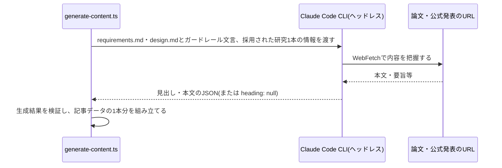

# 設計: 研究発見の要約・記事執筆のルール

## サマリ
[content-selection](../content-selection/design.md)で採用された研究1本ごとに、Claude Code CLIのヘッドレス実行で元の論文・公式発表をWebFetchで読み、見出し・本文(200〜400字程度)を書かせる。本文には「何が分かったか」「どう調べたか」「暮らしにどう関わるか」「注意点」を含め、誇張せず、健康に関わる研究では個別の治療・服薬の判断を勧めない。影響度・根拠・出典・査読前かどうかは選定時の値をそのまま使い、書き換えさせない。本文の分量の検証と記事タイトルの導出は決定的なコードで行う。

主要な設計判断:
- 「本文を書く」ことだけをClaudeに任せ、分量・タイトル・値の引き継ぎは決定的なコードで扱う(future-digest・trend-digestと同じ役割分担)
- 執筆ルールの正はこのrequirements.md/design.mdとし、生成CLIは実行時に両ファイルを読み込んでプロンプトに含める
- 査読前の論文は、本文の注意点で触れさせることに加え、画面のバッジ([article-detail/design.md](../article-detail/design.md))でも必ず示す
- 図: [見出し・本文を書く処理](#見出し本文を書く処理エージェントの推論)のシーケンス図

## 処理フロー

### 見出し・本文を書く処理(エージェントの推論)
- 対象: 採用された研究1本(ジャンル・影響度・影響度の根拠・論文名・発表元・URL・DOI・発表年・査読前か)
- 手順:
  1. 論文・公式発表のURLの内容をWebFetchで把握する(有料で全文を読めない場合は、要旨・公式発表など公開されている範囲で把握する)
  2. 見出しは、何が分かったかが一目で分かる1文にする
  3. 本文には、何が分かったか、どう調べたか(研究の方法・規模)、暮らしにどう関わるか、注意点(研究の限界など)を書く。査読前の論文の場合は、査読前であることを注意点に必ず書く(requirements.md#要約-2、content-selection/requirements.md#採用基準-3)。分量は200〜400字程度にする(requirements.md#要約-3)
  4. 元の論文・記事の構成・表現をなぞらず独自に書き直し、数値・全文を網羅的に転記しない(requirements.md#要約-4)
  5. 研究結果を実際より確かなもの・効果の大きいものとして書かない。健康に関わる研究では、個別の治療・服薬の判断を勧める書き方をしない(requirements.md#要約-5)
  6. 元の論文・発表に書かれている範囲にとどめ、書かれていない内容を推測で断定しない(requirements.md#内容の逸脱防止-3)
  7. 影響度・その根拠・出典・査読前かどうかは渡された値を事実として扱い、本文でそれと食い違うことを書かない
  8. 応答は`{ "heading": "...", "body": "..." }`のJSONだけを返させる。元の論文を読めなかった場合は、渡された情報の範囲で書けるところまで書き、それも難しい場合は`heading`を`null`にして返させる(聞き返しはさせない)
- シーケンス図(俯瞰用。正は上記の手順の文章):


- プロンプトに必ず含めるガードレール文言(requirements.md#要約-4〜5、requirements.md#内容の逸脱防止-3の具体化):
  > この記事で扱ってよいのは、渡された論文・公式発表に書かれている研究結果だけである。元の構成・表現の順序をなぞらず独自に書き直し、数値・全文を網羅的に転記しない。研究結果を実際より確かなもの・効果の大きいものとして書かず、研究の限界を注意点に書く。健康に関わる研究では、読者に個別の治療・服薬の開始・中止・変更を勧めない。元にない内容を推測で断定しない。渡された影響度・その根拠・査読前かどうかは事実として扱い、それと異なることを書かない。査読前の論文であれば、そのことを注意点に必ず書く。
- 関連するビジネスルール: requirements.md#要約-1〜5、requirements.md#記事の構成-6、requirements.md#著作権への配慮-1、requirements.md#内容の逸脱防止-3

### 生成結果を検証する処理(決定的なコード)
- 対象: Claudeが返した見出し・本文
- 手順:
  1. 見出し・本文が`null`または空の場合は不正とする
  2. 本文が160字未満、または480字を超える場合は不正とする(「程度」を目安の約±20%と解釈する。future-digest・trend-digestと同じ)
  3. 見出しが100字を超える場合は不正とする
  4. 査読前の論文なのに本文に「査読」という語が含まれない場合は不正とする(査読前であることの明記を機械的に最低限確かめるため)
  5. 不正な場合は、その1本の生成失敗として[weekly-publish/design.md](../weekly-publish/design.md)のやり直し・除外の流れに乗せる
- 関連するビジネスルール: requirements.md#要約-2〜3、content-selection/requirements.md#採用基準-3

### 記事データの1本分を組み立てる処理(決定的なコード)
- 対象: 検証を通った見出し・本文と、選定時の値
- 手順:
  1. ジャンル・影響度・根拠・論文名・発表元・URL・DOI・発表年・査読前かどうかは選定時の値をそのまま使い、見出し・本文だけを生成結果から取る(requirements.md#記事の構成-6)
  2. 研究IDはジャンルのidとする([article-detail/design.md](../article-detail/design.md)「前提: 記事データの形式」)
- 関連するビジネスルール: requirements.md#記事の構成-6

### 記事タイトルを導出する処理(決定的なコード)
- 対象: 発行日
- 手順:
  1. 「週刊研究発見 YYYY年M月D日号」の形にする(月・日はゼロ埋めしない。例:「週刊研究発見 2026年10月5日号」)(requirements.md#記事の構成-7)
  2. タイトルは記事データに保存せず、発行日から常に導出する(Claudeには作らせない)
- 関連するビジネスルール: requirements.md#記事の構成-7

## エラーハンドリング

- 検証に通らない・JSONを取り出せない・生成が拒否された場合は、いずれもその1本の生成失敗とする。やり直し回数・除外・利用上限との区別は[weekly-publish/design.md](../weekly-publish/design.md)で定める
- 本文の意味的な正しさ(誇張していないか・元をなぞっていないか)はコードで検証できないため、ガードレール文言と月次見直しでの運営者の確認に委ねる(限界として明記する)
- 記事データとして書き出した後の分量違反は、[article-detail/design.md](../article-detail/design.md)のビルド時検証でCIが失敗する

## 関連するファイル(抜粋)

```
scripts/research-digest/generate-content.ts (新規: 採用された研究ごとにClaude Code CLIを起動して見出し・本文を生成するCLI)
app/research-digest/lib/bodyValidation.ts (新規: isValidBodyLength・isValidHeading・mentionsPreprint)
app/research-digest/lib/articleTitle.ts (新規: buildArticleTitle(date))
app/research-digest/lib/buildFinding.ts (新規: 選定時の値+生成結果からFindingを組み立てる)
app/research-digest/lib/articleSchema.ts (article-detailで新規: 分量検証を組み込む)
specs/legal/requirements.md (既存: 知的財産の条項の仕様リンクに本specを追加)
app/legal/page.tsx (既存: 「4. 知的財産」の条項に週刊研究発見を加える)
```

## セキュリティ

- 生成された見出し・本文はReactの標準エスケープで表示する
- 生成用のClaude CLIに許可するツールはWebFetchに限る
- 著作権リスクへの対応は、分量の上限(コード)・独自の書き直し(ガードレール文言)・出典の明記(スキーマで必須)・利用規約への条項追記の4点で構成する(requirements.md#著作権への配慮-1、requirements.md#利用規約への反映-2)
- 健康に関わる研究の誤用を防ぐ制約(誇張しない・個別の治療判断を勧めない)は、ガードレール文言と、月次見直しでこの制約を弱める提案をしないルール([source-review/requirements.md](../source-review/requirements.md)ビジネスルール[3])で守る

## ログ

- 1本ごとに、生成の成否・本文の文字数・失敗時の理由を実行ログに出す(本文そのものは出さない)
- 記事データの分量違反は、ビルド時の例外としてCIログに出る

## 利用規約への反映

requirements.md#利用規約への反映-2に従い、`app/legal/page.tsx`の「4. 知的財産」の条項を、週刊トレンド・週刊未来予測・週刊研究発見の3つを対象とする1つの文面にまとめる(文面は[future-digest/content-generation/design.md](../../future-digest/content-generation/design.md#利用規約への反映)と共有し、変更は1回で行う)。`specs/legal/requirements.md`の知的財産の仕様リンクに本specを追加する。
