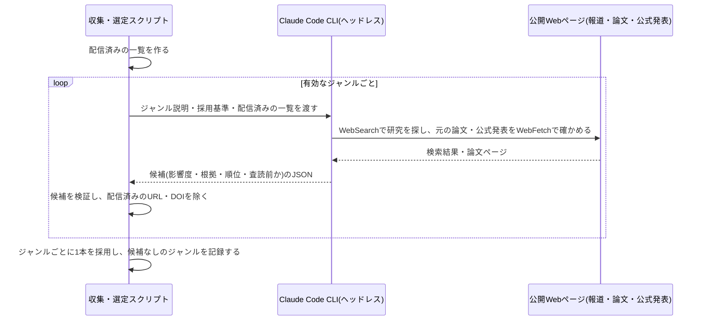

# 設計: ジャンル別の研究発見・論文の選定

## サマリ
有効なジャンルごとに、Claude Code CLIのヘッドレス実行(WebSearch)で採用基準を満たす研究・論文の候補を集めさせ、生活への影響度の判定と順位付けまでを任せる。配信済みとの重複は、同じURL・同じDOIを決定的なコードで機械的に除き、同じ研究を扱う別の報道などの実質的な重複は、過去に配信した全研究の見出し・論文名の一覧をプロンプトに渡してClaudeに判定させる。最後にジャンルごとの採用(影響度の最も大きい1本)と、候補が見つからなかったジャンルの記録を決定的なコードで行い、ジャンルごとの候補件数を実行ログに出す。future-digestのcontent-selectionと同じ作りで、時間軸がない点・DOIで突合する点・査読前かどうかを判定させる点が異なる。

主要な設計判断:
- 「論文を探す・元の論文や公式発表を確かめる・影響度を判定する・実質的な重複を見分ける」はClaudeに任せ、「同じURL/DOIの除外・ジャンルごとの採用・候補なしの記録」は決定的なコードで行う
- ジャンルは`content/research-digest/genres.json`に置き、追記だけで増やせる
- 図: [ジャンルごとに候補を集める処理](#ジャンルごとに候補を集める処理エージェントの推論)のシーケンス図

## データ設計(ジャンルの設定ファイル)

```jsonc
// content/research-digest/genres.json(記載順=ジャンル順)
[
  { "id": "medical-health", "label": "医療・健康", "description": "収集時にClaudeへ渡すジャンルの範囲の説明", "active": true },
  { "id": "nutrition-food", "label": "栄養・食", "description": "...", "active": true },
  // psychology-brain(心理・脳科学)/ sleep-exercise(睡眠・運動)/ environment-climate(環境・気候)/ ai-it(AI・情報技術)/
  // economics-behavioral(経済・行動科学)/ space-physics(宇宙・物理)/ materials-energy(材料・エネルギー)/ education-parenting(教育・子育て)
]
```

- `active: false`のジャンルは収集しないが、過去記事の表示用にラベルを残す
- `genres.json`と`requirements.md#ジャンル`は二重管理になるため、[source-review](../source-review/design.md)の月次見直しでは両方を同じPRで更新する

```ts
// app/research-digest/lib/candidateTypes.ts
export type Candidate = {
  genre: Genre
  impact: Impact
  impactRank: number // 同じジャンル・同じ影響度の中での順位(1が最も影響が大きい)
  impactReason: string // 影響度の根拠(1文)
  sourceTitle: string // 論文名(公式発表の場合は発表のタイトル)
  sourceName: string // 掲載誌名または発表元
  sourceUrl: string // 論文・公式発表のURL(報道記事のURLではない)
  doi: string | null
  publishedYear: number | null
  isPreprint: boolean
}

export type CollectionFailureReason = 'timeout' | 'invalid-format' | 'other' // 収集失敗の分類ラベル(requirements.md#収集失敗-2)。利用上限への到達は実行全体を打ち切るため候補に含まない(requirements.md#収集失敗-3)【推測】

export type GenreResult =
  | { genre: Genre; status: 'selected'; candidate: Candidate; candidateCount: number }
  | { genre: Genre; status: 'no-candidate'; candidateCount: number }
  | { genre: Genre; status: 'collection-failed'; reason: CollectionFailureReason }
```

## 処理フロー

### 配信済みの一覧を作る処理
- 対象: 公開済みの全記事データ
- 手順:
  1. 過去に掲載した全研究の元URLを比較用に正規化した形で集める(スキームとホスト名を小文字にし、末尾のスラッシュ・`#`以降・`utm_`で始まるクエリを除く)
  2. 過去に掲載した全研究のDOIを、比較用に正規化した形で集める(小文字にし、先頭の`https://doi.org/`・`doi:`を除く)
  3. 過去に掲載した全研究について、ジャンル・見出し・論文名を1行ずつにした一覧を作る(Claudeに実質的な重複を判定させる材料)
- 検討事項: 一覧は運用年数に応じて増え続ける。プロンプトに収まらなくなった場合(数年分を超えて肥大化した場合)は、直近N年分に絞る・要約する等の対策が必要になる。現時点では対策を実装せず、増加の様子を見て必要になった時点で/fixで対応する【推測】
- 関連するビジネスルール: requirements.md#配信済みの研究の除外-1

### ジャンルごとに候補を集める処理(エージェントの推論)
- 対象: 有効なジャンル1つ
- 手順:
  1. `requirements.md`を実行時に読み込み、その内容(採用基準・影響度の観点)をプロンプトに含める(content-generationと同じく、別ファイルにルール文を複製・転記しない)。あわせてジャンルの説明、配信済みの一覧もプロンプトに含め、Claude Code CLIをヘッドレス起動する(WebSearch・WebFetchを使わせる)
  2. Claudeは、学術誌に掲載された論文、または大学・研究機関が公式に発表した研究成果を探す。科学系の報道をきっかけにしてよいが、元の論文・公式発表を開いて確かめられたものだけを候補にし、出典にはその論文・公式発表のURLを使う(requirements.md#採用基準-1)
  3. 発表の時期は問わない(requirements.md#採用基準-2)
  4. 出典を確かめられない話題、健康食品などの宣伝を目的とした発表は候補にしない(requirements.md#採用基準-4)
  5. 査読前の論文(プレプリント)かどうかを判定して印を付ける(requirements.md#採用基準-3)
  6. 配信済みの一覧と同じ研究(同じ論文・同じ研究成果、それを扱う別の報道を含む)は候補にしない(requirements.md#配信済みの研究の除外-1)
  7. 各候補に、日々の生活への影響を重視した影響度(大・中・小)とその根拠(1文)を付け、同じ影響度の中での順位を付ける(requirements.md#影響度-1〜3)
  8. 応答は決められた形のJSON(候補の配列、最大5件)だけを返させる。候補が見つからない場合は空の配列にする。聞き返しはさせない
  9. 応答をJSONとして読み取り、各候補を下記「バリデーション」で検証し、満たさない候補は捨てる
- シーケンス図(俯瞰用。正は上記の手順の文章):


- 関連するビジネスルール: requirements.md#機能要件-3〜4、requirements.md#採用基準-1〜4、requirements.md#影響度-1〜3、requirements.md#データ取得方法-1

### ジャンルごとに1本を採用する処理(決定的なコード)
- 対象: 収集に成功したジャンル(下記「エラーハンドリング」で収集失敗と確定したジャンルは対象外。それらは`collection-failed`のまま`GenreResult`に直接入る)に集まった候補
- 手順:
  1. 配信済みの元URL・DOIと正規化後に一致する候補を除く(Claudeの判定漏れに対する最終防波堤。requirements.md#配信済みの研究の除外-1)
  2. 同じ回の別のジャンルで既に採用したURL・DOIと一致する候補も除く(同じ研究が2つのジャンルに載らないようにするため)
  3. 残った候補を影響度の大きい順、同じ影響度では順位の小さい順に並べ、先頭の1本を採用する(requirements.md#機能要件-3、requirements.md#影響度-3)
  4. 残った候補がない場合は、そのジャンルを「候補が見つからなかったジャンル」として記録する(requirements.md#候補が見つからないジャンル-1)
  5. ジャンル順に処理する(手順2の結果を毎回同じにするため)
- 関連するビジネスルール: requirements.md#機能要件-2〜4、requirements.md#配信済みの研究の除外-1、requirements.md#候補が見つからないジャンル-1

### 収集状況を記録する処理
- 対象: 全ジャンルの採用結果(収集失敗のジャンルを含む)
- 手順:
  1. ジャンルごとに、検証を通った候補の件数と、採用したか候補なしか収集失敗(分類ラベル)かを実行ログに1行ずつ出す
  2. 候補が見つからなかったジャンルの一覧と、収集に失敗したジャンルの一覧(分類ラベル別の件数つき)を、最後にまとめて出す
  3. 候補なしのジャンル・収集失敗のジャンルは記事データの`emptyGenres`にも`reason`つきで残るため、月次見直しは記事データから集計できる(収集失敗は候補なしの集計から除く。requirements.md#収集失敗-5)
- 関連するビジネスルール: requirements.md#収集状況の記録-1

## バリデーション

Claudeが返した候補ごとに検証し、満たさない候補は捨てる(実行ログに理由を出す):
- `impact`が大・中・小のいずれかで、`impactRank`が1以上の整数であること
- `impactReason`・`sourceTitle`・`sourceName`・`sourceUrl`が空でないこと
- `sourceUrl`が`http`/`https`の絶対URLであること
- `doi`が`null`または`10.`で始まる文字列であること(`https://doi.org/`付きで返ってきた場合は正規化してから確かめる)
- `publishedYear`が`null`または1900以上で実行日の年以下の整数であること、`isPreprint`が真偽値であること
- 文字列の長さの上限(根拠・発表元は200字、論文名は300字)を超えないこと、制御文字を含まないこと

## エラーハンドリング

- 1ジャンルの収集が失敗した場合(JSONを取り出せない・Claude CLIの異常終了・Claude CLI呼び出しが設定したタイムアウト値を超えた)は、最大2回まで(初回+1回)起動し直す。それでも失敗した場合は、そのジャンルを`status: 'collection-failed'`として扱い(候補なしとは区別する。requirements.md#収集失敗-1)、他のジャンルの収集を続ける。失敗したことは実行ログに残す【推測】
  - 失敗原因は次のとおり分類ラベルに変換する(requirements.md#収集失敗-2)。原因のエラー文字列はログにのみ残し、分類ラベルだけを記事データ・読者向け表示に渡す【推測】
    - `timeout`: Claude CLI呼び出しがタイムアウト値を超えて中断された場合(タイムアウト値は環境変数等で調整可能な定数とする)
    - `invalid-format`: Claude CLIは正常終了したが応答からJSONを取り出せなかった・スキーマを満たさなかった場合
    - `other`: 上記のいずれにも当たらない異常終了・例外の場合
- 応答が利用上限への到達を示す場合は、そのジャンルの収集失敗として`collection-failed`にはせず、その時点で収集を打ち切り、スクリプトを失敗として終える(requirements.md#収集失敗-3。[weekly-publish/design.md](../weekly-publish/design.md)で公開せずに実行を失敗させる)
- その回で1本も採用できなかった場合、空になったジャンルがすべて`no-candidate`であれば選定結果として「全ジャンル候補なし」を返す(正常な結果。weekly-publishが公開をスキップする)。`collection-failed`のジャンルが1つでも混在する場合は、選定結果に収集失敗のジャンルが含まれる旨を持たせて返し、weekly-publishがその回の実行を失敗として終える(requirements.md#収集失敗-4)【推測】
- 過去記事の読み込みに失敗した場合は、配信済みの判定ができないため処理を失敗として終える

## 関連するファイル(抜粋)

```
content/research-digest/genres.json (新規: ジャンルの設定ファイル)
app/research-digest/lib/genres.ts (新規: genres.jsonの読み込み・検証)
app/research-digest/lib/candidateTypes.ts (新規: Candidate/GenreResult)
app/research-digest/lib/deliveredIndex.ts (新規: URL・DOIの正規化と、配信済みの一覧の組み立て)
app/research-digest/lib/candidateValidation.ts (新規: Claudeが返した候補の検証)
app/research-digest/lib/selectGenres.ts (新規: ジャンルごとの採用と候補なしの記録)
scripts/research-digest/collect-candidates.ts (新規: ジャンルごとにClaude Code CLIを起動して候補を集めるCLI)
scripts/research-digest/collect-and-select.ts (新規: 収集→採用→結果のJSON出力までをまとめるCLI。weekly-publishから呼ぶ)
app/research-digest/lib/articles.ts (article-detailで新規: getAllArticlesを利用)
```

## セキュリティ

- Claudeが外部から持ち帰った文字列(論文名・発表元など)は、上記「バリデーション」で長さ・制御文字・URLのスキームを検証してから記事データに取り込む
- 収集用のClaude CLIに許可するツールはWebSearch・WebFetchに限り、ファイル編集・シェル実行は許可しない(外部のページに書かれた指示でリポジトリを書き換えられないようにするため)
- 公開ページの閲覧はClaude CLI標準の範囲にとどめ、有料の論文データベースAPI・認証の回避は行わない(requirements.md#データ取得方法-1、requirements.md#スコープ外)。有料購読が必要な論文でも、要旨・公式発表など公開されている範囲で確かめる

## ログ

- 実行開始時: 有効ジャンル数(info)
- ジャンルごと: 収集の成否・やり直しの有無・候補件数・検証で捨てた候補の件数と理由(info。失敗時はerror)。2回とも失敗した場合は分類ラベル(`timeout`/`invalid-format`/`other`)を添えてerrorで出す【推測】
- ジャンルごと: 採用した元URL・DOI・影響度・査読前か、または候補なし、または収集失敗(分類ラベル)(info)
- 終了時: 候補なしのジャンルの一覧・収集失敗のジャンルの一覧(分類ラベル別の件数)・採用件数の合計(info)。利用上限への到達で打ち切った場合はその旨(error)【推測】
- ログは標準エラー出力(GitHub Actionsの実行ログ)に出し、選定結果のJSONは標準出力に出す
