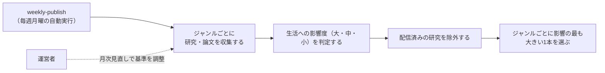

# 要件定義: ジャンル別の研究発見・論文の選定

> ステータス: 仕様確認中(未実装)

## サマリ
10ジャンルそれぞれから、世の中に影響を与える研究の発見・論文を毎回1本ずつ選ぶ。選ぶ順番は、日々の生活への影響の大きさ(大・中・小)が大きいものを優先する。発表の時期は問わない(過去の重要な研究も対象)。過去に配信した研究とは重複させない。詳細は「[ユースケース図](#ユースケース図)」参照。

## 概要
- 機能名: ジャンル別の研究発見・論文の選定
- 目的: 10ジャンルごとに、日々の生活への影響が最も大きく、まだ配信していない研究を1本ずつ選び出す
- 優先度: 高

## ユーザーストーリー
- 読者として、暮らしに関わる研究の発見を、ジャンルごとに毎週1本ずつ知りたい
- 読者として、日々の生活への影響が大きい研究から優先して知りたい。どのくらい影響が大きいかもひと目で分かるようにしてほしい
- 読者として、以前に読んだ研究と同じものが繰り返し届かないようにしてほしい

## ユースケース図

上記は俯瞰用の図。正となる文章は下記「機能要件」「ビジネスルール・制約」。

## 機能要件
- [1] 対象ジャンルは下記「ジャンル」の10ジャンルとする。ジャンルはコードではなく設定ファイル(コンテンツデータ)で管理し、追記で増やせるようにする
- [2] 1回の配信では、ジャンルごとに研究を1本ずつ、最大10本選ぶ(根拠: /requirementでの決定)
- [3] ジャンルごとに、下記「採用基準」を満たす候補を集め、生活への影響度を判定し、配信済みのものを除いたうえで、影響度の最も大きい1本を採用する
- [4] 採用した各研究には、影響度(大・中・小)と、その判定の根拠(1文)を付ける

## ビジネスルール・制約

### ジャンル
- [1] 医療・健康
- [2] 栄養・食
- [3] 心理・脳科学
- [4] 睡眠・運動
- [5] 環境・気候
- [6] AI・情報技術
- [7] 経済・行動科学
- [8] 宇宙・物理
- [9] 材料・エネルギー
- [10] 教育・子育て

### 採用基準
- [1] 候補は、学術誌に掲載された論文、または大学・研究機関が公式に発表した研究成果とする。見つけるきっかけは科学系の報道でもよいが、元になった論文・公式発表を出典として確かめられるものに限る
- [2] 発表の時期は問わない(根拠: /requirementでの決定。過去の重要な研究も含め、生活への影響が大きいものから届けるため)
- [3] 査読前の論文(プレプリント)を採用する場合は、査読前であることを記事に明記する
- [4] 出典を確かめられない話題、健康食品などの宣伝を目的とした発表は候補にしない

### 影響度
- [1] 影響度は「大」「中」「小」の3段階とする(根拠: /requirementでの決定)
- [2] 影響度は、日々の生活への影響を重視し、「影響を受ける人の多さ」「生活の変化の深さ」「研究結果の確からしさ(再現されているか・規模は十分か)」の3つの観点で総合的に判定する(根拠: /requirementでの決定「日々の生活に影響の大きいものから優先」)
- [3] ジャンル内で影響度が同じ候補が複数ある場合は、上記[2]の観点でより影響が大きいと判断されたものを採用する

### 配信済みの研究の除外
- [1] 過去に配信した研究(同じ論文・同じ研究成果)は候補から除外する(根拠: /requirementでの決定)。同じ研究を扱う別の報道も同じ研究として扱う。判定方法の詳細は設計で詰める

### 候補が見つからないジャンル
- [1] 採用基準を満たし、配信済みでない候補が見つからないジャンルは、その回は掲載せず、基準を満たさない研究で埋めない

### データ取得方法
- [1] 情報の取得は、Claude Code CLIのWebSearch・公開ページの閲覧の範囲にとどめ、非公式API・認証の回避・利用規約の想定を超えた高頻度アクセスは行わない(ai-dev-digest・trend-digestと同じ方針)

### 収集状況の記録
- [1] 毎回の実行ログに、ジャンルごとの候補件数と、掲載を見送ったジャンルを出力する。見送りが続くジャンルは[source-review/requirements.md](../source-review/requirements.md)の月次見直しで確認する

## 依存関係
- 選定された研究は[article-detail/requirements.md](../article-detail/requirements.md)で表示される
- 選定された研究の要約は[content-generation/requirements.md](../content-generation/requirements.md)のルールで作られる
- 実行タイミングは[weekly-publish/requirements.md](../weekly-publish/requirements.md)に従う
- ジャンル・採用基準の見直しは[source-review/requirements.md](../source-review/requirements.md)の月次見直しで行う

## スコープ外
- 1ジャンルに2本以上の研究を載せること
- 論文データベースの有料API連携
- ジャンルを画面から追加する機能(設定ファイルへの追記で行う)
