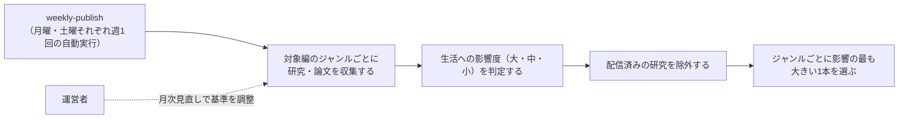

# 要件定義: ジャンル別の研究発見・論文の選定

> ステータス: 仕様確認中(2編対応の新規項目は未実装)

## サマリ
有効なジャンル(現在は10ジャンル)を「からだ・くらし編」(月曜配信)・「科学・社会編」(土曜配信)の2編に5ジャンルずつ分け、編ごとに独立して候補収集・選定を実行する(根拠: 1回あたりの掲載件数〈現在10本〉を減らしたいという運営者の要望。future-digest・trend-digestの編成分割と同じ考え方)。〔合意〕各編は、対象ジャンルそれぞれから、世の中に影響を与える研究の発見・論文を1本ずつ選ぶ。選ぶ順番は、日々の生活への影響の大きさ(大・中・小)が大きいものを優先する。発表の時期は問わない(過去の重要な研究も対象)。過去に配信した研究とは重複させない。詳細は「[ユースケース図](#ユースケース図)」参照。

## 概要
- 機能名: ジャンル別の研究発見・論文の選定
- 目的: 対象編の5ジャンルごとに、日々の生活への影響が最も大きく、まだ配信していない研究を1本ずつ選び出す
- 優先度: 高

## ユーザーストーリー
- 読者として、暮らしに関わる研究の発見を、ジャンルごとに毎週1本ずつ知りたい
- 読者として、日々の生活への影響が大きい研究から優先して知りたい。どのくらい影響が大きいかもひと目で分かるようにしてほしい
- 読者として、以前に読んだ研究と同じものが繰り返し届かないようにしてほしい
- 運営者として、1回あたりの掲載件数を減らし、月曜・土曜の2回に分けて読みやすくしたい〔合意〕

## ユースケース図

```mermaid
flowchart LR
    operator["運営者"]
    weeklyPublish["weekly-publish<br>（月曜・土曜それぞれ週1回の自動実行）"]
    collect["対象編のジャンルごとに<br>研究・論文を収集する"]
    rateImpact["生活への影響度（大・中・小）を判定する"]
    excludeDup["配信済みの研究を除外する"]
    pickTop["ジャンルごとに影響の最も大きい1本を選ぶ"]

    weeklyPublish --> collect
    collect --> rateImpact
    rateImpact --> excludeDup
    excludeDup --> pickTop
    operator -.->|月次見直しで基準を調整| collect
```
上記は俯瞰用の図。正となる文章は下記「機能要件」「ビジネスルール・制約」。

## 機能要件

対象編の5ジャンルごとに、影響度の最も大きい研究を1本選ぶ。編成(どのジャンルがどちらの編に属するか)は下記「編成とジャンルの割り当て」で固定する。〔提案〕

詳細を開く

- [1] 対象ジャンルは下記「ジャンル」の有効なジャンル(現在は10ジャンル)とする。ジャンルはコードではなく設定ファイル(コンテンツデータ)で管理し、追記で増やせるようにする
- [2] 1回の配信では、対象編の5ジャンルごとに研究を1本ずつ選ぶ(現在は最大5本。根拠: /requirementでの決定〈元は「現在は最大10本」だったが、編成分割により対象編あたり5ジャンルへ変更〉)
- [3] ジャンルごとに、下記「採用基準」を満たす候補を集め、生活への影響度を判定し、配信済みのものを除いたうえで、影響度の最も大きい1本を採用する
- [4] 採用した各研究には、影響度(大・中・小)と、その判定の根拠(1文)を付ける
- [5] 各ジャンルは下記「編成とジャンルの割り当て」のとおり、どちらか一方の編に固定で属する。ジャンルを新しく追加する際は、設定ファイルでどちらの編に属するかも指定する
- [6] 「からだ・くらし編」は毎週月曜、「科学・社会編」は毎週土曜に、それぞれ独立して候補収集・選定を実行する(実行タイミングは[weekly-publish/requirements.md](../weekly-publish/requirements.md)に従う)

## ビジネスルール・制約

### 編成とジャンルの割り当て

5ジャンルずつ2編に分ける。〔提案〕分け方は、からだ・暮らしに身近な領域か、より広い科学・社会寄りの領域かで分けた(採用理由は下記)。

詳細を開く

- [1] からだ・くらし編(月曜配信・5ジャンル): 医療・健康、栄養・食、睡眠・運動、心理・脳科学、教育・子育て(根拠: 【推測】日々のからだ・暮らしに身近な研究をまとめた。自信度は中: 分け方自体に唯一の正解はなく、承認者の確認が必要)
- [2] 科学・社会編(土曜配信・5ジャンル): 環境・気候、AI・情報技術、経済・行動科学、宇宙・物理、材料・エネルギー(根拠: 【推測】上記[1]に当てはまらない、より広い科学・社会寄りの研究をまとめた)
- [3] 各編の配信日は、既存digestアプリが配信していない曜日(土・日)のうち、future-digestのくらし・社会編(日曜)と重ならない土曜を科学・社会編に割り当てた(根拠: 【推測】曜日は月・土・日の3つしか空いておらず、future-digestが日曜を使うため、research-digestの新しい編は土曜に固定で決まる)

### ジャンル

全10ジャンルの一覧。各ジャンルがどちらの編に属するかを括弧書きで添える。〔提案〕

詳細を開く

- [1] 医療・健康(からだ・くらし編)
- [2] 栄養・食(からだ・くらし編)
- [3] 睡眠・運動(からだ・くらし編)
- [4] 心理・脳科学(からだ・くらし編)
- [5] 教育・子育て(からだ・くらし編)
- [6] 環境・気候(科学・社会編)
- [7] AI・情報技術(科学・社会編)
- [8] 経済・行動科学(科学・社会編)
- [9] 宇宙・物理(科学・社会編)
- [10] 材料・エネルギー(科学・社会編)

### 採用基準
- [1] 候補は、学術誌に掲載された論文、または大学・研究機関が公式に発表した研究成果とする。見つけるきっかけは科学系の報道でもよいが、元になった論文・公式発表を出典として確かめられるものに限る
- [2] 発表の時期は問わない(根拠: /requirementでの決定。過去の重要な研究も含め、生活への影響が大きいものから届けるため)
- [3] 査読前の論文(プレプリント)を採用する場合は、査読前であることを記事に明記する
- [4] 出典を確かめられない話題、健康食品などの宣伝を目的とした発表は候補にしない

### 影響度
- [1] 影響度は「大」「中」「小」の3段階とする(根拠: /requirementでの決定)
- [2] 影響度は、日々の生活への影響を重視し、「影響を受ける人の多さ」「生活の変化の深さ」「研究結果の確からしさ(再現されているか・規模は十分か)」の3つの観点で総合的に判定する(根拠: /requirementでの決定「日々の生活に影響の大きいものから優先」)
- [3] ジャンル内で影響度が同じ候補が複数ある場合は、上記[2]の観点でより影響が大きいと判断されたものを採用する

### 配信済みの研究の除外

配信済み判定は編をまたいで全記事を対象に行う。〔提案〕

詳細を開く

- [1] 過去に配信した研究(同じ論文・同じ研究成果)は候補から除外する(根拠: /requirementでの決定)。対象は編を問わず全記事とする(根拠: 【推測】編が違っても同じ研究の重複は避けたいため)。同じ研究を扱う別の報道も同じ研究として扱う。判定方法の詳細は設計で詰める

### 候補が見つからないジャンル
- [1] 採用基準を満たし、配信済みでない候補が見つからないジャンルは、基準を満たさない研究で埋めず、「候補が見つからなかった」ことが分かる記載をそのジャンルに残す(根拠: /requirementでの決定。読者がそのジャンルを見落としたのか、候補がなかったのかを区別できるようにするため)。この「候補なし」は、収集の処理自体は完了し候補が0件だった状態を指し、下記「収集失敗」とは区別する

### 収集失敗
- [1] 情報収集の処理自体が完了しなかったジャンル(候補なしとは異なり、処理そのものが失敗した状態)は、候補なしと区別して扱う
- [2] 読者向けの表示・記事データには、収集失敗の直接原因を内部のエラー文字列のまま出さず、分類ラベルで示す。分類ラベルは3種とし、読者には「調査が時間内に終わりませんでした」(時間切れ)・「調査結果を正しく読み取れませんでした」(応答形式不正)・「調査中にエラーが発生しました」(その他)のように読者に分かる言葉で表示する(内部のコード値との対応は設計で定める)。利用上限への到達は下記[3]により実行全体を打ち切るため、ジャンルごとの分類ラベルには含めない
- [3] 応答が利用上限への到達を示す場合は、そのジャンルだけの収集失敗として扱わず、その時点で実行全体を打ち切る。打ち切った回は公開せず、[weekly-publish/requirements.md#利用上限への到達時の再実行](../weekly-publish/requirements.md)により再実行cron(最大3回)で再試行する
- [4] 採用0件でも、その回の公開はスキップしない([weekly-publish/requirements.md#掲載件数の保証](../weekly-publish/requirements.md))。全ジャンルが収集失敗だった場合に限り、公開はしたうえで運営者への警告が必要かどうかを判定する
- [5] 収集失敗したジャンルは、下記「収集状況の記録」が集計する候補なしの件数には含めない

### データ取得方法
- [1] 情報の取得は、Claude Code CLIのWebSearch・公開ページの閲覧の範囲にとどめ、非公式API・認証の回避・利用規約の想定を超えた高頻度アクセスは行わない(ai-dev-digest・trend-digestと同じ方針)

### 収集状況の記録
- [1] 毎回の実行ログに、ジャンルごとの候補件数、候補が見つからなかったジャンル、収集に失敗したジャンル(分類ラベル別)を出力する。候補なしが続くジャンルは[source-review/requirements.md](../source-review/requirements.md)の月次見直しで確認する(収集失敗は候補なしの集計から除く)

## 依存関係
- 選定された研究は[article-detail/requirements.md](../article-detail/requirements.md)で表示される
- 選定された研究の要約は[content-generation/requirements.md](../content-generation/requirements.md)のルールで作られる
- 実行タイミングは[weekly-publish/requirements.md](../weekly-publish/requirements.md)に従う
- ジャンル・採用基準の見直しは[source-review/requirements.md](../source-review/requirements.md)の月次見直しで行う

## スコープ外
- 1ジャンルに2本以上の研究を載せること
- 論文データベースの有料API連携
- ジャンルを画面から追加する機能(設定ファイルへの追記で行う)
- ジャンルを編の間で動的に移す機能(編の割り当ては設定ファイルの固定値とする)〔提案〕
