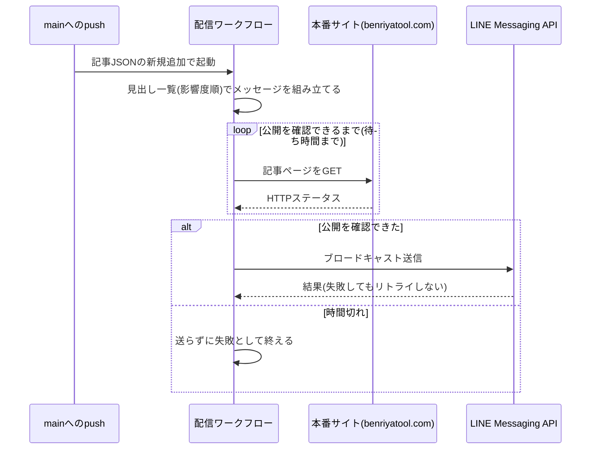

# 設計: LINE公式アカウントでの新着記事の自動配信

## サマリ
[weekly-publish](../weekly-publish/design.md)の週次記事PRがmainへ自動マージされると、`main`へのpush(記事JSONの新規追加)をきっかけに独立したワークフローが起動する。記事ページが本番で開けることを確認してから、既存の「AI駆動開発ニュース」のLINE公式アカウントで友だち全員にブロードキャスト配信する。本文は「【週刊研究発見】」+日付・その回の研究の見出し全件(影響度順、掲載した研究がないジャンル〈候補なし・収集失敗・生成失敗〉は除く)・記事ページへのリンク1本で組み立てる。

主要な設計判断:
- 配信の仕組み(pushトリガー・新規追加ファイルだけを対象・公開待ち・リトライしない)はtrend-digest・future-digestと同じ構成で、共有モジュール`app/lib/waitForPageAvailable.ts`をそのまま使う
- 1ジャンル1本のため、未来予測のような「ジャンルの代表を選ぶ」処理はなく、掲載した研究をすべて載せる
- 図: [配信する処理](#配信する処理)のシーケンス図

## 実行環境の前提

- ワークフローは`.github/workflows/research-digest-line-broadcast.yml`として、週次ワークフローとは別ファイルにする(trend-digestと同じ理由)
- 起動条件は`main`へのpushのうち`content/research-digest/articles/*.json`を含むものと、`workflow_dispatch`(記事ID指定)とする
- チャネルアクセストークンは既存の`LINE_CHANNEL_ACCESS_TOKEN`をそのまま使う(requirements.md#アカウント・配信主体-1)
- GitHubへの書き込みはしないため、既定の`GITHUB_TOKEN`(読み取り)で足りる

## 処理フロー

### 配信対象の記事を決める処理
- 対象: `main`へのpush、または運営者による`workflow_dispatch`(記事ID指定)
- 手順:
  1. `main`へのpushで起動した場合は、**新規追加された**`content/research-digest/articles/*.json`だけを対象にする。既存ファイルの修正では配信しない(requirements.md#配信タイミング・方式-8)。新規追加がなければ何もせず終える
  2. `workflow_dispatch`(記事ID指定)で起動した場合は、新規追加ファイルの判定は行わず、入力された記事IDをそのまま対象にする。運営者が自動配信の失敗に気づいて手動で起動する運用のため、指定された記事データが存在しない場合は失敗として終える(requirements.md#配信タイミング・方式-9)【推測】
  3. ファイル名(またはworkflow_dispatchの入力)から記事IDを取り出し、以降の処理に渡す
  4. 「1回まで」は、ワークフロー側で送信回数を記録・検証する仕組みは設けず、運営者が手動起動する際に守る運用上のルールとする(自動配信は`main`へのpushでしか起きず、再送は運営者の意図的な操作に限られるため。requirements.md#配信タイミング・方式-9)【推測】
- 関連するビジネスルール: requirements.md#配信タイミング・方式-6・8〜9

### 配信メッセージを組み立てる処理
- 対象: 1回分の記事データ
- 手順:
  1. 1行目を「【週刊研究発見】YYYY年M月D日号」にする(requirements.md#配信内容-2)
  2. 掲載した研究を影響度の大きい順、同じ影響度の中ではジャンル順に並べ、「・【影響度 大/ジャンル名】見出し」の形で1行ずつ並べる。候補なし・収集失敗・生成失敗のジャンルは載せない(requirements.md#配信内容-3〜4)
  3. 末尾に「記事を読む」と記事詳細ページのURL(`https://benriyatool.com/research-digest/<id>`)を1本だけ付ける。研究ごとの出典URLは含めない(requirements.md#配信内容-5)
  4. 書式の例:
     ```
     【週刊研究発見】2026年10月5日号

     ・【影響度 大/医療・健康】<見出し>
     ・【影響度 大/睡眠・運動】<見出し>
     ・【影響度 中/教育・子育て】<見出し>

     記事を読む
     https://benriyatool.com/research-digest/2026-10-05
     ```
  5. 見出しは有効なジャンルの数だけ(現在は最大10件)で短いため、LINEのテキストメッセージの文字数上限(5000字)を超えない見込み。切り詰め処理は設けず、万一超えた場合はAPIのエラーとして扱う
- 関連するビジネスルール: requirements.md#配信内容-1〜5

### 配信する処理
- 対象: 組み立てたメッセージ
- 手順:
  1. 記事詳細ページのURLが本番で開けるまで待つ(`app/lib/waitForPageAvailable.ts`。待ち方・待ち時間は既存のdigestと共通)。待ち時間のうちに開けなければ、LINEには送らず失敗として終える(requirements.md#配信タイミング・方式-6〜7)
  2. LINE Messaging APIのブロードキャスト送信(`POST https://api.line.me/v2/bot/message/broadcast`)で、テキストメッセージ1件を友だち全員に送る(requirements.md#配信タイミング・方式-8)
  3. 失敗した場合はリトライせず、失敗として終える(requirements.md#無料枠と配信失敗時の扱い-4)
- シーケンス図(俯瞰用。正は上記の手順の文章):


- 関連するビジネスルール: requirements.md#配信タイミング・方式-6〜8、requirements.md#無料枠と配信失敗時の扱い-2〜4

## エラーハンドリング

- 公開を待ち時間のうちに確認できない場合は送らず、最後に観測したHTTPステータスと経過時間を実行ログに残す
- 記事データの読み込み・検証に失敗した場合は送らずに失敗として終える
- LINE APIの失敗はリトライせず、失敗したステップ・HTTPステータス・エラー概要を実行ログに残し、ワークフローを失敗表示にする。記事の公開には影響しない(requirements.md#無料枠と配信失敗時の扱い-4)

## 関連するファイル(抜粋)

```
.github/workflows/research-digest-line-broadcast.yml (新規)
app/research-digest/lib/buildBroadcastMessage.ts (新規: buildBroadcastTitle・buildBroadcastMessage)
app/research-digest/lib/articleUrl.ts (新規: 記事詳細ページのURLの導出。配信本文と公開待ちで共有する)
scripts/research-digest/broadcast-line.ts (新規: 記事を読み込み、公開待ち→LINEへ送信するCLI)
app/lib/waitForPageAvailable.ts (既存: 公開待ちの共有モジュール)
app/lib/site.ts (既存: SITE_URL)
app/research-digest/lib/articleSchema.ts (article-detailで新規: parseArticleを利用)
```

## セキュリティ

- `LINE_CHANNEL_ACCESS_TOKEN`は既存のSecretを参照する。既存のdigestと共有のため、再発行するとそれらの配信にも影響する
- `Authorization`ヘッダーはどのログにも出さない。公開待ちのGETには認証情報を付けない
- メッセージはリポジトリにコミットされた記事データだけから組み立て、訪問者の入力を含まない
- 友だち全員へのブロードキャストのみで、個々のユーザーIDは扱わない

## ログ

- 実行ごとに、記事ID・見出しの件数・公開待ちの試行ごとの経過秒数とHTTPステータス・LINE APIの結果を実行ログに出す
- 失敗時は、失敗の理由(時間切れ/記事データ不正/LINE APIのエラー概要)をエラーとして出す
