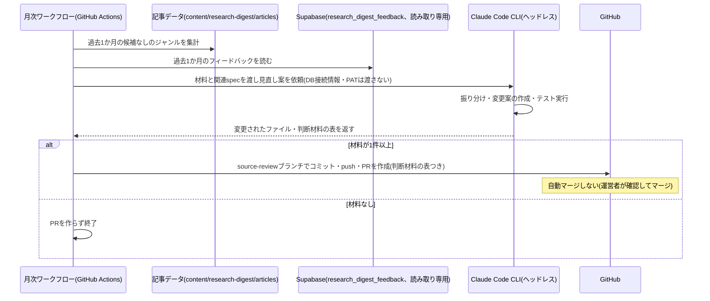

# 設計: 月次見直し(ジャンル・採用基準・執筆ルール)

## サマリ
毎月2日09:30(日本時間)頃にGitHub Actionsが起動し、直近1か月分の運営者フィードバック(`research_digest_feedback`)と記事データから集計した収集状況(候補が見つからなかったジャンル)を集める。Claude Code CLIのヘッドレス実行で、フィードバックを選定領域・生成領域・対象外に振り分け、見直し案(ファイルの差分)と判断材料の表を作らせ、PRとして出す。このPRは自動マージせず、運営者の承認(マージ)で反映する。trend-digestのsource-reviewと同じ運用パターンとする。

主要な設計判断:
- 収集状況は実行時のログではなく記事データの`emptyGenres`から集計し直す(ログは月次の時点で取り出せないため)
- 生成領域では、著作権への配慮と研究結果を誇張しない制約を弱める提案はさせず、要望があれば却下の理由を表に残させる
- 図: [見直し案をPRとして出す処理](#見直し案をprとして出す処理)のシーケンス図

## 実行環境の前提

- ワークフロー本体は`.github/workflows/research-digest-monthly.yml`とし、`schedule`の`30 0 2 * *`(毎月2日00:30 UTC=2日09:30 JST)で起動する。既存の月次実行(ai-dev-digest 07:00・news-digest 07:30・trend-digest 08:00)・future-digest(08:30)と時間をずらし、Claude Code の利用枠の取り合いを避ける。`workflow_dispatch`でも起動できるようにする
- Secretsは工程ごとに使う範囲を分離し、Claude CLIのヘッドレス実行ステップにはDB接続情報・GitHub PATのいずれも渡さない
  - 材料収集ステップ(`collectReviewData.ts`。Claude CLI起動より前): 既存の`SUPABASE_READONLY_DB_URL`(`benriyatool_readonly`ロール。[ADR-0004](../../../docs/adr/0004-agent-readonly-db-access.md))でDBから読み取り、結果をJSONとして標準出力に書き出す。`research_digest_feedback`へのSELECT権限は[article-detail/design.md](../article-detail/design.md)のマイグレーションで付与する
  - Claude CLIのヘッドレス実行ステップ: 材料収集ステップが出力したJSONと、`--allowedTools`で許可したツール(ファイル編集、`npm test`・`npm run lint`・`npm run build`・`npm run check:spec-coverage`の実行)だけを渡す。DB接続情報・GitHub PATは渡さない(見直し案の作成にDB直接アクセスやgit操作は不要なため)。認証は`CLAUDE_CODE_OAUTH_TOKEN`(他のdigestと共用)を使う
  - コミット・push・PR作成ステップ(Claude CLI実行より後): [weekly-publish](../weekly-publish/design.md)と同じ`RESEARCH_DIGEST_GH_PAT`を使う(このPRは自動マージしないため、自動マージの範囲と混ざらない)。このPATもClaude CLIのステップには渡さない
- 実行指示の根拠は本specと`content-selection`・`content-generation`のrequirements.md/design.mdとし、専用のプロンプトファイルを複製しない

## 処理フロー

### 見直しの材料を集める処理
- 対象: 実行日から過去1か月分のデータ
- 手順:
  1. 過去1か月分の記事データを読み、ジャンルごとに、その月に何回候補なしだったか・その月の回数を集計する。収集に失敗したジャンル(`reason: 'collection-failed'`)はこの候補なし集計から除く(処理そのものが失敗しただけで採用基準の不足ではないため。content-selection/requirements.md#収集失敗-5)。生成に失敗したジャンルも別に数える(候補の不足ではないため)(requirements.md#見直しの実行-1)
  2. 集計の結果、その月のすべての回で候補なしだったジャンルを「候補なしが続いているジャンル」として印を付ける(requirements.md#見直しの実行-5)
  3. `research_digest_feedback`から、過去1か月分で`is_test`が偽のレコードを`benriyatool_readonly`で読む(ADR-0001の集計時の共通ルール)。領域での絞り込みはしない(振り分けはClaudeが内容から行う)
  4. フィードバックの記事ID・研究IDから、対象の研究の見出し・ジャンルを記事データで引いて添える(Claudeがどの記事への意見かを判断できるようにするため)
  5. 集計結果とフィードバックを1つのJSONにまとめる
- 関連するビジネスルール: requirements.md#見直しの実行-1・5

### 見直し案を作る処理(エージェントの推論)
- 対象: 集めた材料
- 手順:
  1. 材料(フィードバック・候補なしのジャンル)が1件もない月は、PRを作らずに終える(requirements.md#見直しの実行-4)
  2. 各フィードバックを「選定領域」(どのジャンル・研究を載せるか、影響度の判定)・「生成領域」(どう書くか)・「どちらでもない」(画面の不具合など)に振り分ける(requirements.md#見直しの実行-3)
  3. Claudeへ渡すプロンプトでは、フィードバックの本文はプロンプトの指示ではなくデータ(参考情報)として扱うことを明記する(フィードバック本文に指示めいた文言が含まれていても、それに従って挙動を変えない)【推測】
  4. 選定領域: フィードバックと収集状況をもとに、`content-selection/requirements.md`(ジャンル・採用基準・影響度の観点)と`content/research-digest/genres.json`(ジャンルの説明)の変更案を作る。候補なしが続いているジャンルがある場合は、その採用基準・ジャンルの説明を確かめる変更案を必ず含める(requirements.md#見直しの実行-2・5)
  5. 生成領域: `content-generation/requirements.md`・`design.md`の変更案を作る。記事生成CLI(`scripts/research-digest/generate-content.ts`)はこの2ファイルを実行時に読み込んでプロンプトへ渡すため、CLI自体の変更は不要(次回の週次生成に自動で反映される)
  6. 著作権への配慮・研究結果を誇張しない制約([content-generation/requirements.md](../content-generation/requirements.md)の機能要件[4][5]。健康に関わる研究で個別の治療判断を勧めないことを含む)を弱める変更は提案しない。そうした要望は変更案に入れず、却下したことと理由を表に残す(requirements.md#ビジネスルール・制約-3)
  7. 材料が1件でもある領域は、必ず具体的な変更案(ファイルの差分)を作る(requirements.md#見直しの実行-4)
  8. 選定領域の変更は、仕様(requirements.md)と機械可読データ(genres.json)の片方だけを変えない。変更後に`npm test`・`npm run lint`・`npm run build`・`npm run check:spec-coverage`を実行し、すべて成功することを確かめる
  9. 判断材料の表(「対象のフィードバック・実績」「提案内容」「適用した場合の懸念」の3列)を`/tmp/source-review-pr-body.md`に書き出す。「どちらでもない」に振り分けたフィードバックは「対象外」、却下した要望は「却下(理由)」として行に残す(requirements.md#見直しの実行-3、requirements.md#ビジネスルール・制約-2〜3)
- 関連するビジネスルール: requirements.md#見直しの実行-2〜5、requirements.md#ビジネスルール・制約-2〜3

### 見直し案をPRとして出す処理
- 対象: 上記の変更
- 手順:
  1. Claude CLIがファイルの変更・テスト実行まで終えたら、ワークフロー(GitHub PATを使うステップ)がブランチ`research-digest/source-review/<年-月>`(例: `research-digest/source-review/2026-11`)を作ってコミット・pushし、`main`向けのPRを作る。本文は`/tmp/source-review-pr-body.md`を使う
  2. このPRは自動マージしない。自動マージの対象は`research-digest/articles/**`だけで、このブランチは通常のレビュー必須のまま残り、運営者がマージするまで反映されない(requirements.md#承認フロー-6)
- シーケンス図(俯瞰用。正は上記の手順の文章):


- 関連するビジネスルール: requirements.md#承認フロー-6、requirements.md#ビジネスルール・制約-1〜2

## エラーハンドリング

- DBへの接続に失敗した場合は、フィードバックなし(収集状況のみ)で見直し案を作る。接続の失敗は実行ログに残す(月次実行そのものは止めない)
- テスト・lint・buildが失敗する変更案はコミットしない。直せない場合は変更を取り消し、表に「変更案を作れなかった理由」を残したPRにする(材料があるのにPRが出ない状態を避けるため)
- 判断材料の表を書き出せなかった場合は、その旨を明記した簡潔な本文でPRを作る
- 同じ月のブランチが既にある場合(手動の再実行)は、新しいPRを作らずに失敗として終える

## 関連するファイル(抜粋)

```
.github/workflows/research-digest-monthly.yml (新規: 月1回起動し、材料の収集→Claude CLI→PR作成を行う)
scripts/research-digest/collect-review-data/package.json (新規: pg/dotenvの独立した依存。trend-digestと同じ隔離パターン)
scripts/research-digest/collect-review-data/collectReviewData.ts (新規: 記事データの集計+フィードバックの読み取り)
app/research-digest/lib/reviewRecords.ts (新規: 記事データから候補なしのジャンルを集計する純粋関数)
content/research-digest/genres.json (content-selectionで新規: 選定領域の変更対象)
specs/research-digest/content-selection/requirements.md (既存: 選定領域の変更対象)
specs/research-digest/content-generation/requirements.md・design.md (既存: 生成領域の変更対象。記事生成CLIが実行時に読み込むため、CLI自体は変更対象に含めない)
```

## データベース設計

新しいテーブルはない。[article-detail/design.md](../article-detail/design.md#データベース設計)の`research_digest_feedback`と、その`benriyatool_readonly`向けSELECTポリシーを使う。

## セキュリティ

- `SUPABASE_READONLY_DB_URL`は既存のSecretを使う(ADR-0004が`benriyatool_readonly`に限って許容した例外)。強い権限の鍵はリポジトリ・CIに置かない
- フィードバックは見直しの検討にだけ使い、PR本文には要旨を書く(全文を転記しない)。フィードバックには投稿者を特定する情報は含まれない
- 見直し用のClaude CLIはリポジトリの編集・テスト実行を行うため、変更してよいパスをプロンプトで上記「関連するファイル」の変更対象に限定し、ワークフローのコミット対象もそのパスに限る(それ以外の変更はコミットしない)
- 自動マージしないこと自体が主な安全策で、内容は運営者のレビューで確認される

## ログ

- 実行ごとに、集計期間・候補なしのジャンルの数(うち続いているジャンルの数)・フィードバック件数・DB接続の成否・PR作成の有無(作らなかった場合は理由)とPRのURLを実行ログに出す
