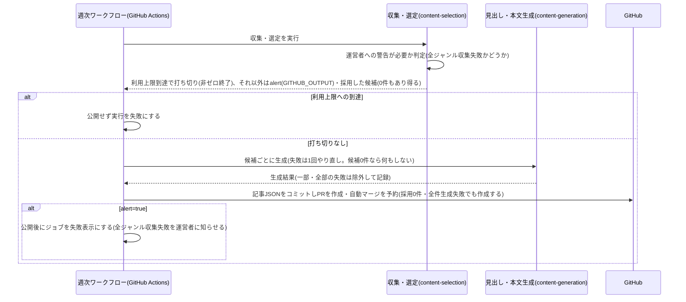
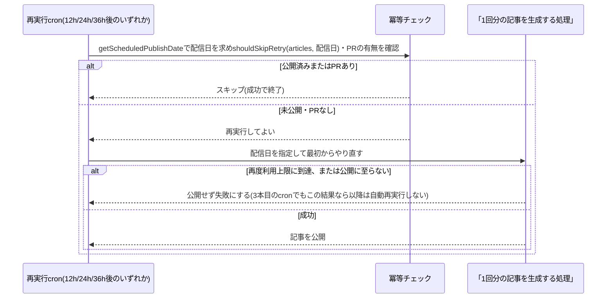

# 設計: 毎週月曜の記事自動生成・公開

## サマリ
GitHub Actionsのスケジュール実行が毎週月曜07:43(日本時間)頃に起動し、[content-selection](../content-selection/design.md)の収集・選定→[content-generation](../content-generation/design.md)の見出し・本文生成→記事データの組み立て→PR作成・自動マージまでを行う。完全自動マージの対象はこの週次記事PR(`research-digest/articles/**`ブランチ)だけで、trend-digest・future-digestのweekly-publishと同じ例外運用とする。CIが失敗したPRはマージせず、失敗の概要をPRにコメントする。

主要な設計判断:
- 実行基盤・認証・自動マージの仕組みはtrend-digest・future-digestと同じ構成をそのまま使う(architecture.md#2)
- 採用0件の回・生成が全件失敗した回も、公開をスキップせず候補なし・収集失敗・生成失敗の記載で記事を作成・公開する(根拠: /requirementでの決定)。公開するかどうかの分岐はなくなり、「その回の実行を運営者への警告付きにするか」だけを判定する。全ジャンルが収集失敗だった回は、公開はしたうえで実行を失敗表示にする(収集の仕組み自体の異常に運営者が気づけるようにするため)【推測】
- 利用上限への到達は記事を作る材料が得られないため、その回はいったん打ち切るが、本番の12時間後・24時間後・36時間後の最大3回、自動的に再試行する(根拠: /requirementでの決定「12時間×3回くらいはリトライしてほしい」)。エラーメッセージから解除時刻を読み取って待つ方式は表示形式に依存し不安定なため採用しない【推測】
- 再実行が翌日にまたがるため、記事の`date`は実行日ではなく「本来の配信日(その週の月曜)」から求める。これを純粋関数`getScheduledPublishDate(nowUtc)`(UTCの時点を受け取り、関数の内側でJSTに変換してから直近の月曜を求める。呼び出し側でJST変換はしない【推測】)で算出し、本番cron・再実行cron・手動`workflow_dispatch`のすべてで共通に使う
- 図: [1回分の記事を生成する処理](#1回分の記事を生成する処理)・[利用上限への到達時に再実行する処理](#利用上限への到達時に再実行する処理)のシーケンス図

## 実行環境の前提

- ワークフロー本体は`.github/workflows/research-digest-weekly.yml`とし、`schedule`の`43 22 * * 0`(日曜22:43 UTC=月曜07:43 JST。本番cron)で起動する。0分を避け、ai-dev-digestの日次実行(06:43 JST)と1時間ずらす
- 利用上限への到達時の再実行用に、同じワークフローに`schedule`を3本追加する(いずれもUTC表記。JSTは括弧内)。GitHub Actionsの1ワークフローに複数の`schedule`を並べる形でよい【推測】
  - 1回目(本番の12時間後): `43 10 * * 1`(月曜10:43 UTC=月曜19:43 JST)
  - 2回目(本番の24時間後): `43 22 * * 1`(月曜22:43 UTC=火曜07:43 JST)
  - 3回目(本番の36時間後): `43 10 * * 2`(火曜10:43 UTC=火曜19:43 JST)
  これら3本のcronで起動した実行は、いずれも「利用上限への到達時に再実行する処理」の冪等チェックを最初に行う(requirements.md#利用上限への到達時の再実行-1〜2)。3本を区別する回数管理は行わず、3本目のcronのぶんまで走って公開に至らなければ、それ以上自動で再試行する仕組み自体がないというだけで足りる(requirements.md#利用上限への到達時の再実行-3)
- `workflow_dispatch`でも起動できるようにする。用途は(a) Secrets設定後の動作確認、(b) 上記3回の自動再実行でも公開できなかった回の復旧、の2つ(requirements.md#スコープ外の「手動での日時指定実行・即時の再実行機能」はこの2つを除く)。入力`scheduled_publish_date`(省略可、`YYYY-MM-DD`)で本来の配信日を指定できる。省略時は実行日時から`getScheduledPublishDate`で求める(下記「配信日を求める処理」)。入力がある場合は純粋関数`validateScheduledPublishDate(value)`で`^\d{4}-\d{2}-\d{2}$`の形かつ実在する月曜日(JST)であることを検証し、満たさなければワークフローを失敗させる(下記「セキュリティ」)【推測】
- GitHubへの書き込みには、このリポジトリのみに範囲を限定したfine-grained PAT(Contents・Pull requestsのwrite権限)を`RESEARCH_DIGEST_GH_PAT`としてActions Secretsに保存して使う。既定の`GITHUB_TOKEN`は使わない(後続の`ci.yml`が起動しないため)
- 収集・生成はClaude Code CLIのヘッドレス実行で行い、既存の`CLAUDE_CODE_OAUTH_TOKEN`(他のdigestと共用)をそのまま使う
- 実行指示の根拠は本specと参照先specのrequirements.md/design.mdとし、専用のプロンプトファイルを複製しない

### 配信日を求める処理(決定的なコード)
- 対象: 実行日時(JST)
- 手順:
  1. 純粋関数`getScheduledPublishDate(nowUtc)`(実行日時をUTCの`Date`で受け取り、関数の内側でJSTに変換する)で、実行日時と同じかそれより前で直近の月曜日(JST)の日付を返す(本番cronの実行日はそのまま月曜のため、この関数を通しても同じ値になる)【推測】
  2. 記事データの`date`の算出は、この配信日を基準にする。本番cron・3本の再実行cron・手動`workflow_dispatch`のすべてでこの関数を通す(requirements.md#利用上限への到達時の再実行-5)
- 関連するビジネスルール: requirements.md#利用上限への到達時の再実行-5

## 処理フロー

### 1回分の記事を生成する処理
- 対象: 配信日(`getScheduledPublishDate`で求めた、本来の配信日。本番cronの実行日は常にこの配信日と一致する)
- 手順:
  1. 作業用ブランチ`research-digest/articles/<配信日>`を作る
  2. [content-selection](../content-selection/design.md)の収集・選定CLI(`collect-and-select.ts`)を実行する。このCLIは選定の最後に、採用した候補・候補なしのジャンル・収集失敗のジャンル(分類ラベルつき)を選定結果として組み立て、それを本specの純粋関数`shouldAlertOperator(genreResults)`に渡して、全ジャンルが収集失敗かどうか(運営者への警告が必要か)を判定し(requirements.md#掲載件数の保証-3)、判定結果を`GITHUB_OUTPUT`に`alert=true|false`として書き出す。利用上限への到達を検知した場合はこの判定より前にCLIが非ゼロ終了で終わり、記事を作らない。この回は打ち切り、次の再実行cronに委ねる(requirements.md#掲載件数の保証-4、requirements.md#利用上限への到達時の再実行-1。下記「利用上限への到達時に再実行する処理」)。判定ロジック自体はcontent-selection側には持たせず、本specの`shouldAlertOperator`だけが持つ【推測】
  3. ワークフローは採用件数にかかわらず(0件でも)常に次の生成ステップへ進む。公開をスキップする分岐はない
  4. 採用した候補ごとに[content-generation](../content-generation/design.md)の生成を行う。一時的な失敗は同じ候補を最大2回まで(初回+1回)起動し直し、それでも失敗した候補は「生成に失敗したジャンル」として除き、次に進む(requirements.md#掲載件数の保証-4)。採用した候補が0件の場合はこのステップを何も行わずに次へ進む。生成中に利用上限への到達を検知した場合は`generate-content.ts`が非ゼロ終了し、後続の`write-article.ts`(公開)には進まない。この回は打ち切り、次の再実行cronに委ねる(下記「利用上限への到達時に再実行する処理」)
  5. 記事データ(発行日・研究・掲載できなかったジャンル)を、生成の成否にかかわらず常に組み立てる。`date`は配信日をそのまま使う(requirements.md#利用上限への到達時の再実行-5)。掲載できなかったジャンルには、候補なしのジャンル・収集失敗のジャンル(分類ラベルつき)・生成に失敗したジャンルの3種を理由つきで入れ、その回に有効な全ジャンルが過不足なく記事に現れるようにする(研究が0件でもよい)。`content/research-digest/articles/<配信日>.json`に書き出す(requirements.md#掲載件数の保証-3・4)
  6. 記事ファイルをコミットしてブランチをpushする
- シーケンス図(俯瞰用。正は上記の手順の文章):


- 関連するビジネスルール: requirements.md#実行-1〜3、requirements.md#掲載件数の保証-1〜4

### 利用上限への到達時に再実行する処理
- 対象: 3本ある再実行cron(`43 10 * * 1`〈12時間後〉・`43 22 * * 1`〈24時間後〉・`43 10 * * 2`〈36時間後〉)のいずれかによる起動。この処理はどのcronで起動されても同じ手順で、何回目の再実行かを区別しない(3本のcronがそれぞれ独立に同じ判定を行うだけで、回数管理のコードは持たない)
- 手順:
  1. 起動直後に、純粋関数`getScheduledPublishDate(nowUtc)`で配信日を求める(本番cronと同じ月曜の日付になる)。この配信日の記事ファイルが既に存在するかを純粋関数`shouldSkipRetry(articles, scheduledPublishDate)`で確認する(requirements.md#利用上限への到達時の再実行-2)
  2. 記事ファイルが存在しない場合でも、その配信日のブランチ(`research-digest/articles/<配信日>`)からのPRが既にあるかを`gh pr list`(オープン・マージ済み・クローズ済みのすべてを対象)で確認する(前回の実行がCLIの非ゼロ終了より後まで進んでいた場合に備える。マージ済みPRなら記事ファイルの存在確認〈手順1〉でも検出できるため、この確認は主にオープン・クローズ済みPRの検出用。TDD対象外の運用チェック)【推測】
  3. いずれかが見つかった場合(公開済み、またはPRが存在する)は、何もせずジョブを成功として終える(requirements.md#利用上限への到達時の再実行-2)。打ち切りの理由が利用上限かどうかは問わない(利用上限以外の失敗でも同様に再実行される)
  4. いずれも見つからない場合は、「1回分の記事を生成する処理」を配信日を指定して最初からやり直す(前回の途中結果は使わない。requirements.md#利用上限への到達時の再実行-4)
  5. この再実行でも利用上限に到達した場合、または他の理由で公開に至らなかった場合は、公開せずに実行を失敗として終える。3本目(36時間後)の再実行cronでの失敗を最後に、それ以降は自動再実行するcron自体が存在しない(requirements.md#利用上限への到達時の再実行-3)
- シーケンス図(俯瞰用。正は上記の手順の文章):


- 関連するビジネスルール: requirements.md#利用上限への到達時の再実行-1〜5

### PRを作成しCIの結果を待つ処理
- 対象: 上記で作ったブランチ
- 手順:
  1. `main`向けにPRを作る(タイトル例:「[research-digest] 2026-10-05を公開」。本文に採用件数・候補なしのジャンルの数・収集失敗のジャンルの数・査読前の論文の数を書く)
  2. 既存の`ci.yml`がこのPRにも通常どおり走り、[article-detail/design.md](../article-detail/design.md)のビルド時検証で記事データを確かめる
  3. GitHub標準のauto-merge(`gh pr merge --auto --squash`)を有効にする
- 関連するビジネスルール: requirements.md#公開フロー-4

### PRを自動マージする処理(完全自動マージの例外運用)
- 対象: `research-digest/articles/**`ブランチからのPRのみ
- 手順:
  1. CIが成功すると、人の承認を待たずに`main`へマージされる
  2. 自動マージの対象はこのブランチパターンに限る。[source-review](../source-review/design.md)のPR(`research-digest/source-review/**`)は運営者の承認を必須とする(requirements.md#自動マージの範囲-1)
  3. 範囲の限定は、このワークフローが`research-digest/articles/**`のブランチからしかPRを作らないという運用で守る
- 関連するビジネスルール: requirements.md#公開フロー-4、requirements.md#自動マージの範囲-1

### CI失敗時に記録する処理
- 対象: CIが失敗した週次記事PR
- 手順:
  1. マージせず、PRをオープンのまま残す
  2. `ci.yml`の完了(`workflow_run`)をきっかけに起動するジョブが、失敗したジョブ・ステップ名をPRにコメントする(trend-digestと同じ方法)
  3. 次回の実行はこのPRの状態に関わらず独立して行う
- 関連するビジネスルール: requirements.md#公開フロー-5

### 収集失敗を運営者に警告する処理
- 対象: 全ジャンルが収集失敗だった回(記事は他の回と同じく作成・公開済み)
- 手順:
  1. 記事の作成・コミット・push・PR作成・自動マージの予約は他の回と同じどおり行う(公開はスキップしない)
  2. `shouldAlertOperator`が`true`を返した場合は、PR作成後にワークフロー内で非ゼロ終了するステップを実行し、ジョブを失敗表示にする(収集の仕組み自体に問題が起きている可能性を運営者が気づけるようにするため)【推測】
  3. 収集失敗のジャンル(ジャンル・分類ラベル)の一覧を理由として実行ログに残す
- 関連するビジネスルール: requirements.md#掲載件数の保証-3

## エラーハンドリング

- CIの失敗は「CI失敗時に記録する処理」のとおりマージせずPRを残す
- 1本の生成の一時的な失敗は、1回やり直したうえでその1本だけを除く(生成に失敗したジャンルとして記事に残す)。除いたジャンルと理由は実行ログに残す
- 採用した候補すべての生成に失敗した場合も、公開をスキップせず、全ジャンルが生成失敗の記載で記事を作成・公開する(requirements.md#掲載件数の保証-4)。利用上限への到達は、同じ実行内でやり直しても回復せず記事を作る材料が得られないため、公開せず理由を明示してその回を打ち切る。検知した時点で残りを打ち切り、「利用上限への到達時に再実行する処理」のとおり次の再実行cronに委ねる
- 全ジャンルが収集失敗だった回は、「収集失敗を運営者に警告する処理」のとおり記事は公開したうえで実行を失敗表示にする【推測】
- 収集・選定のスクリプトが利用上限への到達で終えた場合は、公開せずその回を打ち切り、再実行cronに委ねる。過去記事の読み込み失敗で終えた場合は、再実行しても回復しない可能性が高いため、公開せず実行を失敗として終える
- 同じ配信日のブランチ・記事ファイルが既にある場合は、上書きせずに実行を失敗として終える
- CIが失敗して運営者がPRをクローズし手動で復旧する場合、クローズしただけではブランチ`research-digest/articles/<配信日>`は残るため、そのまま`workflow_dispatch`で復旧を試みると上記の「同じ配信日のブランチが既にある」で失敗する。復旧手順としてまずこの残存ブランチを削除してから`workflow_dispatch`を起動する【推測】
- 1回の実行が失敗表示になっても、他の回の表示には影響しない

## 関連するファイル(抜粋)

```
.github/workflows/research-digest-weekly.yml (新規: 月曜の本番cronと、月曜19:43・火曜07:43・火曜19:43(JST)の3本の再実行cronで起動するワークフロー本体。publishジョブとrecord-ci-failureジョブ)
scripts/research-digest/collect-and-select.ts (content-selectionで新規)
scripts/research-digest/generate-content.ts (content-generationで新規)
app/research-digest/lib/shouldAlertOperator.ts (新規: 選定結果から全ジャンル収集失敗かどうか〈運営者への警告が必要か〉を判定する純粋関数。content-selectionの`collect-and-select.ts`から呼ばれる)
app/research-digest/lib/scheduledPublishDate.ts (新規: 実行日時〈UTC〉から本来の配信日〈直近の月曜、JST〉を求める純粋関数`getScheduledPublishDate`。内部でJSTに変換する。手動入力`scheduled_publish_date`を検証する純粋関数`validateScheduledPublishDate`も同じモジュールに置く)
app/research-digest/lib/shouldSkipRetry.ts (新規: 再実行cronの冪等チェック。配信日の記事が既に存在するかを判定する純粋関数)
app/research-digest/lib/assembleArticle.ts (新規: 選定結果+生成結果から記事データを組み立てる純粋関数)
scripts/research-digest/write-article.ts (新規: assembleArticleの結果をcontent/research-digest/articles/<date>.jsonへ書き出すCLI)
content/research-digest/articles/<date>.json (新規: 生成される記事データ)
.github/workflows/ci.yml (既存: 変更不要)
```

## セキュリティ

- `RESEARCH_DIGEST_GH_PAT`はActions Secretsに保存し、このリポジトリのみ・Contents/Pull requestsのwriteに限定したfine-grained PATとする。用途はこのワークフローと[source-review](../source-review/design.md)に限る
- `CLAUDE_CODE_OAUTH_TOKEN`は他のdigestと共用の運営者個人の認証情報。期限切れ時は再発行してSecretsを更新する
- CI失敗の記録で失敗ジョブを調べる処理は読み取りだけのため、既定の`GITHUB_TOKEN`を使う
- 記事内容の安全性はarticle-detailのビルド時検証で担保する
- `workflow_dispatch`の入力`scheduled_publish_date`はワークフローファイルの`run:`に直接埋め込まず(シェルインジェクションを避けるため)、`env:`経由でステップに渡す。渡した値は`getScheduledPublishDate`ではなく純粋関数`validateScheduledPublishDate(value)`(`scheduledPublishDate.ts`と同じモジュール)で検証し、`^\d{4}-\d{2}-\d{2}$`の形かつ実在する月曜日(JST)でなければワークフローを非ゼロ終了で失敗させる【推測】

## ログ

- 実行ごとに、実行日・配信日・採用件数・候補なしのジャンルの数・収集失敗のジャンルの数(分類ラベル別)・生成に失敗したジャンルの数・査読前の論文の数・PRのURL・結果(公開/公開〈警告あり〉/失敗/再実行に委ねてスキップ)を実行ログに出す
- 失敗で終える場合は、理由(利用上限への到達〈次の再実行cronに委ねる旨を含む〉/過去記事の読み込み失敗/同じ配信日が既にある/3本目の再実行でも公開に至らなかった)をエラーとして出す。全ジャンル収集失敗による警告は、公開後の警告として理由(全ジャンル収集失敗)とともに出す【推測】
