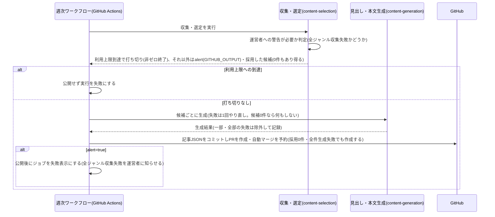

# 設計: 毎週月曜の記事自動生成・公開

## サマリ
GitHub Actionsのスケジュール実行が毎週月曜07:43(日本時間)頃に起動し、[content-selection](../content-selection/design.md)の収集・選定→[content-generation](../content-generation/design.md)の見出し・本文生成→記事データの組み立て→PR作成・自動マージまでを行う。完全自動マージの対象はこの週次記事PR(`research-digest/articles/**`ブランチ)だけで、trend-digest・future-digestのweekly-publishと同じ例外運用とする。CIが失敗したPRはマージせず、失敗の概要をPRにコメントする。

主要な設計判断:
- 実行基盤・認証・自動マージの仕組みはtrend-digest・future-digestと同じ構成をそのまま使う(architecture.md#2)
- 採用0件の回・生成が全件失敗した回も、公開をスキップせず候補なし・収集失敗・生成失敗の記載で記事を作成・公開する(根拠: /requirementでの決定)。公開するかどうかの分岐はなくなり、「その回の実行を運営者への警告付きにするか」だけを判定する。全ジャンルが収集失敗だった回は、公開はしたうえで実行を失敗表示にする(収集の仕組み自体の異常に運営者が気づけるようにするため)【推測】。利用上限への到達は記事を作る材料が得られないため、従来どおり実行全体を打ち切り失敗とする(変更なし)
- 図: [1回分の記事を生成する処理](#1回分の記事を生成する処理)のシーケンス図

## 実行環境の前提

- ワークフロー本体は`.github/workflows/research-digest-weekly.yml`とし、`schedule`の`43 22 * * 0`(日曜22:43 UTC=月曜07:43 JST)で起動する。0分を避け、ai-dev-digestの日次実行(06:43 JST)と1時間ずらす。`workflow_dispatch`でも起動できるようにする(Secrets設定後の動作確認用。requirements.md#スコープ外の「手動での日時指定実行・即時の再実行機能」はこの動作確認用の手動起動を除く)
- GitHubへの書き込みには、このリポジトリのみに範囲を限定したfine-grained PAT(Contents・Pull requestsのwrite権限)を`RESEARCH_DIGEST_GH_PAT`としてActions Secretsに保存して使う。既定の`GITHUB_TOKEN`は使わない(後続の`ci.yml`が起動しないため)
- 収集・生成はClaude Code CLIのヘッドレス実行で行い、既存の`CLAUDE_CODE_OAUTH_TOKEN`(他のdigestと共用)をそのまま使う
- 実行指示の根拠は本specと参照先specのrequirements.md/design.mdとし、専用のプロンプトファイルを複製しない

## 処理フロー

### 1回分の記事を生成する処理
- 対象: 実行日(日本時間の日付)
- 手順:
  1. 作業用ブランチ`research-digest/articles/<実行日>`を作る
  2. [content-selection](../content-selection/design.md)の収集・選定CLI(`collect-and-select.ts`)を実行する。このCLIは選定の最後に、採用した候補・候補なしのジャンル・収集失敗のジャンル(分類ラベルつき)を選定結果として組み立て、それを本specの純粋関数`shouldAlertOperator(genreResults)`に渡して、全ジャンルが収集失敗かどうか(運営者への警告が必要か)を判定し(requirements.md#掲載件数の保証-3)、判定結果を`GITHUB_OUTPUT`に`alert=true|false`として書き出す。利用上限への到達を検知した場合はこの判定より前にCLIが非ゼロ終了で終わり、記事を作らない(requirements.md#掲載件数の保証-4)。判定ロジック自体はcontent-selection側には持たせず、本specの`shouldAlertOperator`だけが持つ【推測】
  3. ワークフローは採用件数にかかわらず(0件でも)常に次の生成ステップへ進む。公開をスキップする分岐はない
  4. 採用した候補ごとに[content-generation](../content-generation/design.md)の生成を行う。一時的な失敗は同じ候補を最大2回まで(初回+1回)起動し直し、それでも失敗した候補は「生成に失敗したジャンル」として除き、次に進む(requirements.md#掲載件数の保証-4)。採用した候補が0件の場合はこのステップを何も行わずに次へ進む
  5. 記事データ(発行日・研究・掲載できなかったジャンル)を、生成の成否にかかわらず常に組み立てる。掲載できなかったジャンルには、候補なしのジャンル・収集失敗のジャンル(分類ラベルつき)・生成に失敗したジャンルの3種を理由つきで入れ、その回に有効な全ジャンルが過不足なく記事に現れるようにする(研究が0件でもよい)。`content/research-digest/articles/<実行日>.json`に書き出す(requirements.md#掲載件数の保証-3・4)
  6. 記事ファイルをコミットしてブランチをpushする
- シーケンス図(俯瞰用。正は上記の手順の文章):


- 関連するビジネスルール: requirements.md#実行-1〜3、requirements.md#掲載件数の保証-1〜4

### PRを作成しCIの結果を待つ処理
- 対象: 上記で作ったブランチ
- 手順:
  1. `main`向けにPRを作る(タイトル例:「[research-digest] 2026-10-05を公開」。本文に採用件数・候補なしのジャンルの数・収集失敗のジャンルの数・査読前の論文の数を書く)
  2. 既存の`ci.yml`がこのPRにも通常どおり走り、[article-detail/design.md](../article-detail/design.md)のビルド時検証で記事データを確かめる
  3. GitHub標準のauto-merge(`gh pr merge --auto --squash`)を有効にする
- 関連するビジネスルール: requirements.md#公開フロー-4

### PRを自動マージする処理(完全自動マージの例外運用)
- 対象: `research-digest/articles/**`ブランチからのPRのみ
- 手順:
  1. CIが成功すると、人の承認を待たずに`main`へマージされる
  2. 自動マージの対象はこのブランチパターンに限る。[source-review](../source-review/design.md)のPR(`research-digest/source-review/**`)は運営者の承認を必須とする(requirements.md#自動マージの範囲-1)
  3. 範囲の限定は、このワークフローが`research-digest/articles/**`のブランチからしかPRを作らないという運用で守る
- 関連するビジネスルール: requirements.md#公開フロー-4、requirements.md#自動マージの範囲-1

### CI失敗時に記録する処理
- 対象: CIが失敗した週次記事PR
- 手順:
  1. マージせず、PRをオープンのまま残す
  2. `ci.yml`の完了(`workflow_run`)をきっかけに起動するジョブが、失敗したジョブ・ステップ名をPRにコメントする(trend-digestと同じ方法)
  3. 次回の実行はこのPRの状態に関わらず独立して行う
- 関連するビジネスルール: requirements.md#公開フロー-5

### 収集失敗を運営者に警告する処理
- 対象: 全ジャンルが収集失敗だった回(記事は他の回と同じく作成・公開済み)
- 手順:
  1. 記事の作成・コミット・push・PR作成・自動マージの予約は他の回と同じどおり行う(公開はスキップしない)
  2. `shouldAlertOperator`が`true`を返した場合は、PR作成後にワークフロー内で非ゼロ終了するステップ、または`::warning::`のログ注釈を出すステップを実行し、ジョブを失敗表示または警告表示にする(収集の仕組み自体に問題が起きている可能性を運営者が気づけるようにするため)【推測】
  3. 収集失敗のジャンル(ジャンル・分類ラベル)の一覧を理由として実行ログに残す
- 関連するビジネスルール: requirements.md#掲載件数の保証-3

## エラーハンドリング

- CIの失敗は「CI失敗時に記録する処理」のとおりマージせずPRを残す
- 1本の生成の一時的な失敗は、1回やり直したうえでその1本だけを除く(生成に失敗したジャンルとして記事に残す)。除いたジャンルと理由は実行ログに残す
- 採用した候補すべての生成に失敗した場合も、公開をスキップせず、全ジャンルが生成失敗の記載で記事を作成・公開する(requirements.md#掲載件数の保証-4)。利用上限への到達・収集・選定の失敗は、記事を作る材料が得られないため、公開せず理由を明示して実行を失敗として終える。利用上限への到達は検知した時点で残りを打ち切る(ここは変更しない)
- 全ジャンルが収集失敗だった回は、「収集失敗を運営者に警告する処理」のとおり記事は公開したうえで実行を失敗・警告表示にする【推測】
- 同じ日付のブランチ・記事ファイルが既にある場合は、上書きせずに実行を失敗として終える
- 1回の実行が失敗・警告表示になっても、他の回の表示には影響しない

## 関連するファイル(抜粋)

```
.github/workflows/research-digest-weekly.yml (新規: 月曜に起動するワークフロー本体。publishジョブとrecord-ci-failureジョブ)
scripts/research-digest/collect-and-select.ts (content-selectionで新規)
scripts/research-digest/generate-content.ts (content-generationで新規)
app/research-digest/lib/shouldAlertOperator.ts (新規: 選定結果から全ジャンル収集失敗かどうか〈運営者への警告が必要か〉を判定する純粋関数。content-selectionの`collect-and-select.ts`から呼ばれる)
app/research-digest/lib/assembleArticle.ts (新規: 選定結果+生成結果から記事データを組み立てる純粋関数)
scripts/research-digest/write-article.ts (新規: assembleArticleの結果をcontent/research-digest/articles/<date>.jsonへ書き出すCLI)
content/research-digest/articles/<date>.json (新規: 生成される記事データ)
.github/workflows/ci.yml (既存: 変更不要)
```

## セキュリティ

- `RESEARCH_DIGEST_GH_PAT`はActions Secretsに保存し、このリポジトリのみ・Contents/Pull requestsのwriteに限定したfine-grained PATとする。用途はこのワークフローと[source-review](../source-review/design.md)に限る
- `CLAUDE_CODE_OAUTH_TOKEN`は他のdigestと共用の運営者個人の認証情報。期限切れ時は再発行してSecretsを更新する
- CI失敗の記録で失敗ジョブを調べる処理は読み取りだけのため、既定の`GITHUB_TOKEN`を使う
- 記事内容の安全性はarticle-detailのビルド時検証で担保する

## ログ

- 実行ごとに、実行日・採用件数・候補なしのジャンルの数・収集失敗のジャンルの数(分類ラベル別)・生成に失敗したジャンルの数・査読前の論文の数・PRのURL・結果(公開/公開〈警告あり〉/失敗)を実行ログに出す
- 失敗で終える場合は、理由(利用上限への到達/収集・選定の失敗/同じ日付が既にある)をエラーとして出す。全ジャンル収集失敗による警告は、公開後の警告として理由(全ジャンル収集失敗)とともに出す【推測】
