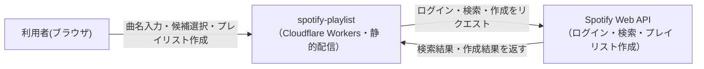
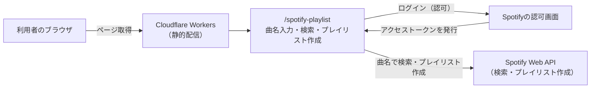

# アーキテクチャ: spotify-playlist

## サマリ
曲名を入力するだけで、利用者自身のSpotifyアカウントにプレイリストを作成できるツール。現時点でspecは[playlist-create](playlist-create/requirements.md)の1つのみ。詳細は下記[コンテキスト図](#4-コンテキスト図)・[システム構成図](#5-システム構成図)を参照。

## 1. 概要
曲名をいくつか入力するだけで、利用者自身のSpotifyアカウントに新しいプレイリストを作成できるツール。URL: `/spotify-playlist`

## 2. アーキテクチャの目的
- 曲を1曲ずつSpotifyアプリ内で検索してプレイリストに追加する手間をなくす
- 他アプリと同じくランタイムのサーバー機能を持たない静的配信のみで完結させ、追加のインフラコストを発生させない

## 3. 設計方針
- 本サイトの共通方針(Cloudflare Workersでの静的配信、ランタイムのサーバー機能を持たない)を踏襲し、Spotify連携もクライアントシークレットを必要としない認可方式でブラウザ内のみで完結させる(具体的な認可フローは[playlist-create/design.md](playlist-create/design.md)で決定する)
- 他アプリで使っているSupabase Auth(Google OIDC)は使わず、Spotify自身の認可機能でログインする(プレイリストの作成先が利用者本人のSpotifyアカウントであるため)
- 作成履歴や検索結果をDBに保存せず、ブラウザ内の一時的な状態のみで完結させる(スコープ外: 作成履歴の保存・一覧表示)

## 4. コンテキスト図

この図の正となる文章は[playlist-create/requirements.md](playlist-create/requirements.md)。

## 5. システム構成図

この図の正となる文章は[6. アーキテクチャ概要](#6-アーキテクチャ概要)と[playlist-create/requirements.md](playlist-create/requirements.md)。プロジェクト共通インフラの詳細は[docs/architecture/](../../docs/architecture/infrastructure.md)を参照。

## 6. アーキテクチャ概要
Next.jsの静的エクスポートをCloudflare Workersで配信しており、サーバー処理は持たない。利用者はブラウザから直接Spotifyの認可画面でログインし、発行されたアクセストークンを使ってブラウザから直接Spotify Web APIを呼び出し、曲の検索とプレイリスト作成を行う。DBへの保存は行わない。

## 7. 採用技術
| 技術 | 用途 |
|---|---|
| Next.js(静的エクスポート) | `/spotify-playlist`画面の描画 |
| Tailwind CSS | スタイリング |
| Spotify Web API | ログイン(認可)・曲検索・プレイリスト作成 |

## 8. 機能一覧表(機能マップ)
| spec | 機能(利用者から見て) | 役割 | 依存 | 状態 |
|---|---|---|---|---|
| [playlist-create](playlist-create/requirements.md) | 曲名を入力してSpotifyにプレイリストを作成する | Spotifyへのログイン・曲検索・プレイリスト作成を行う | - | 仕様のみ(未実装) |

## 9. ディレクトリ構成
CLAUDE.mdの一般規約(`components/`,`lib/`)通りで、逸脱なし。

## 10. 外部サービス
| サービス | 用途 |
|---|---|
| Spotify Web API | ログイン(認可)・曲検索・プレイリスト作成 |

DBは使用しないため、ER図はなし。

## 11. 関連ADR

全アプリ横断のADR(`docs/adr/`):
- [0007-runtime-llm-server-and-writable-admin.md](../../docs/adr/0007-runtime-llm-server-and-writable-admin.md) — ランタイムLLMサーバー機能を持たない方針の背景(本アプリもこの方針を踏襲し、Spotify連携をブラウザ内で完結させる)

## 12. セキュリティ
アクセストークンはSpotifyから直接ブラウザへ発行され、サーバーを経由しない。トークンをDBやサーバーに保存せず、ブラウザ内のみで扱う(具体的な保持方法は[playlist-create/design.md](playlist-create/design.md)で決定する)。

## 13. 技術的制約
- 実装前提として、Spotify Developer Dashboardでのアプリ登録(Client ID発行、`benriyatool.com`のredirect URI登録)が必要([playlist-create/requirements.md#非機能要件依存関係制約条件](playlist-create/requirements.md#非機能要件依存関係制約条件))
- 本サイトはランタイムのサーバー機能を持たないため、クライアントシークレットが必須の認可方式は採用できない
