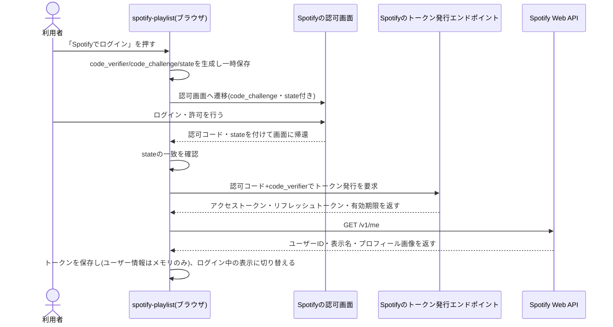
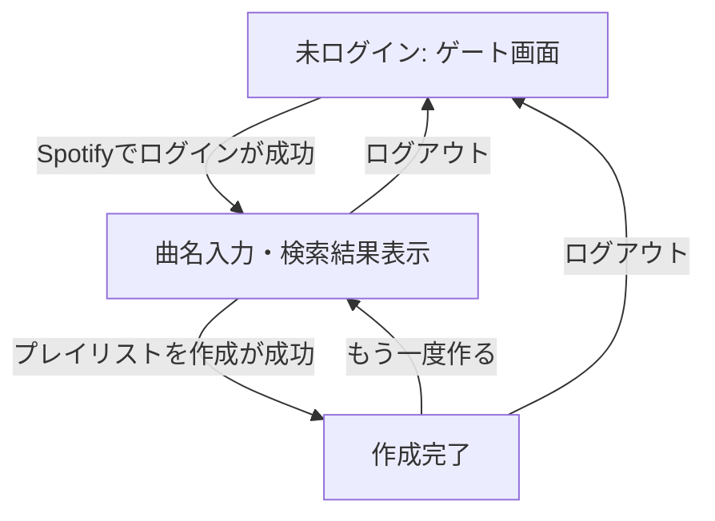
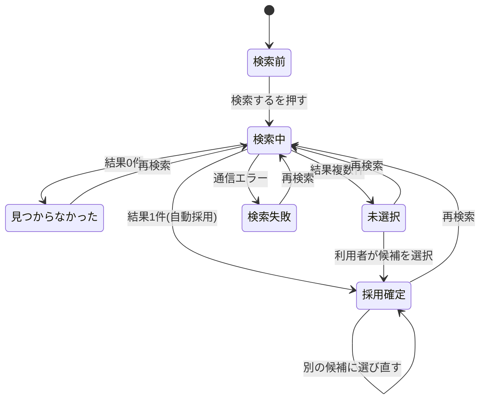

## サマリ
利用者がSpotifyでログイン(認可)した後、複数曲名を一括検索し、候補を選んで自分のSpotifyアカウントに非公開プレイリストを作成する。単一URL(`/spotify-playlist`)の中で「未ログイン→曲名入力・検索結果表示→作成完了」の3状態を切り替える(画面遷移なし)。認可はクライアントシークレットを使わないAuthorization Code with PKCEフローをブラウザ内で完結させ、リフレッシュトークンをブラウザに保存して次回訪問時も自動ログインする。主要な設計判断は、(1) 認可・トークン管理はPKCE+ブラウザ保存、(2) 検索結果は曲ごとに上位5件まで表示し「もっと見る」で追加取得、(3) 採用候補が0件では作成不可、の3点。詳細は[ログインする処理のシーケンス図](#spotifyでログインする処理)、[画面遷移図](#画面遷移図)、[状態遷移図](#状態管理)を参照。

## 処理フロー

### Spotifyでログインする処理
- 対象: 「Spotifyでログイン」操作
- 手順:
  1. PKCE用のcode_verifier(ランダム文字列)と、そこから導出したcode_challengeを生成する。あわせてCSRF対策用のランダムなstate値を生成する
  2. code_verifierとstateをsessionStorageに一時保存する(認可の往復でしか使わずタブを閉じれば消えてよいため、リフレッシュトークンの保存先であるlocalStorageとは分ける)
  3. Spotifyの認可画面へ遷移させる。要求スコープは「非公開プレイリストの作成」権限のみとする(requirements.md#プレイリストの公開範囲)
  4. 利用者がSpotify側で許可すると、認可コードとstateを付けて元の画面(`/spotify-playlist/`)に戻ってくる
  5. 戻ってきたstateが手順2で保存したものと一致することを確認する(一致しない場合は不正なリダイレクトとみなし、ログインを中断して未ログイン表示に戻す)
  6. 認可コードとcode_verifierを使ってSpotifyのトークン発行エンドポイントにアクセスし、アクセストークン・リフレッシュトークン・有効期限を取得する(クライアントシークレットは使わない)
  7. 取得したアクセストークンで自ユーザー情報(`GET /v1/me`)を取得し、ユーザーID・表示名・プロフィール画像を得る
  8. 取得したトークン一式をブラウザに保存し、URLから認可コード・stateのクエリパラメータを取り除き(ブラウザ履歴に認可コードを残さないため)、手順2で一時保存したcode_verifier・stateも削除する。ユーザーID・表示名・プロフィール画像は画面表示用に保持するが、ブラウザには保存しない(design.md#セキュリティ)
  9. ログイン中の表示(表示名・プロフィール画像・ログアウト導線)に切り替える
  10. 利用者がSpotify側で認可を拒否した場合(認可コードの代わりに`error`パラメータを付けて画面に帰還した場合)、ログインを中断し未ログイン表示に戻す(通常のキャンセル操作として扱い、エラー表示はしない)
- シーケンス図:

- 関連するビジネスルール: requirements.md#機能要件-1、requirements.md#プレイリストの公開範囲

### ログイン状態を復元する処理(次回訪問時)
- 対象: 画面を開いた時点(URLに認可コードが付いている場合は、保存済みリフレッシュトークンの有無に関わらず「Spotifyでログインする処理」の手順4以降を優先する。ここでの対象はそれ以外の通常のアクセス)
- 手順:
  1. ブラウザに保存済みのリフレッシュトークンがあれば、それを使ってアクセストークンを再発行する
  2. 再発行に成功すれば、そのアクセストークンで自ユーザー情報(`GET /v1/me`)を取得し(手順は「Spotifyでログインする処理」手順7-8と同じ)、ログイン中の表示にする。失敗した場合(リフレッシュトークンが失効・取り消し済みなど)は保存内容を破棄し、未ログインの表示にする
  3. 保存済みのリフレッシュトークンがなければ、そのまま未ログインの表示にする
- 関連するビジネスルール: requirements.md#機能要件-1

### アクセストークンを自動更新する処理
- 対象: Spotify Web APIを呼び出す直前
- 手順: アクセストークンの有効期限が切れている(または間もなく切れる)場合、呼び出し前にリフレッシュトークンで再発行してから使う。曲名の一括検索(design.md#曲名を一括検索する処理)のようにバッチ単位で複数のAPI呼び出しが同時に走る場合、複数の呼び出しが同時に期限切れを検知しても、リフレッシュリクエストは1回だけ発行し(進行中のリフレッシュがあればその結果を待って使い回す)、Spotify側への重複リクエストを避ける。再発行に失敗した場合は「ログイン状態を復元する処理」と同様に保存内容を破棄し、未ログイン表示に戻した上で、呼び出そうとしていた操作は中断する。未ログイン表示に戻ると入力済みの曲名一覧・検索結果・採用候補・保持中の作成済みプレイリストID(design.md#プレイリストを作成する処理)はすべて失われるため、切り替え直前に一時的な通知(例:「セッションの有効期限が切れました。お手数ですが再度ログインしてください」)を表示する。この経路でプレイリストを作成済みかつ曲追加は未完了のまま状態が失われた場合、Spotify側に空または一部曲だけのプレイリストが残る可能性があるが、リフレッシュトークンの取り消し等まれなケースでの残存リスクとして許容する(再ログイン後は曲名入力からやり直しになる)

### ログアウトする処理
- 対象: 「ログアウト」操作
- 手順: 保存しているアクセストークン・リフレッシュトークンをブラウザから削除し、未ログインの表示に戻す(Spotify側のセッションには影響しない、このアプリ内の保存情報のみを破棄する)。このとき曲名入力・検索結果・採用候補・保持中の作成済みプレイリストID・完了表示もすべて破棄する(再ログイン後は曲名入力からやり直しになる)
- 関連するビジネスルール: requirements.md#機能要件-10

### 曲名を一括検索する処理
- 対象: 曲名入力欄の内容、「検索する」操作
- 手順:
  1. 入力欄の内容を改行で分割し、各行の前後の空白を除いたうえで空(元から空行、または空白のみの行)になるものを除いた曲名の一覧を作る(重複除去はしない、requirements.md#曲名の入力-3)。100件を超える場合は上位100件のみを対象とし、101件目以降は無視する(requirements.md#曲名の入力-2)。無視した曲名がある場合は、その旨(101件目以降が検索対象外であること)を画面に表示する
  2. その時点の検索結果・採用候補をいったんすべて破棄し、新しい曲名一覧で検索をやり直す(誤字修正など、入力を直してから再検索したい場合はこの「検索する」の再実行だけで対応できる。専用の編集UIは設けない)(requirements.md#曲名の入力-4)
  3. 曲名ごとにSpotifyの検索エンドポイントへ問い合わせる(上位5件を取得)
  4. 検索結果が1件のみの曲は、その1件を自動的に採用候補にする(requirements.md#候補の確定方法-1)
  5. 検索結果が複数件の曲は、候補未確定のまま上位5件を一覧表示する(requirements.md#候補の確定方法-2)。6件目以降がある場合は「もっと見る」を表示し、押されるたびに次の5件を追加取得してその曲の一覧に追加する
  6. 検索結果が0件の曲は「見つかりませんでした」と表示する(requirements.md#機能要件-6)
  7. 個々の曲の検索リクエストが通信エラーで失敗した場合、その曲だけ「検索に失敗しました」(未ヒットとは別の表示)とし、他の曲の検索・表示は継続する
- 関連するビジネスルール: requirements.md#機能要件-3, 4, 6、requirements.md#候補の確定方法-1, 2

### 候補を選択する処理
- 対象: 検索結果が複数件ある曲の一覧
- 手順: 利用者が選んだ1件をその曲の採用候補として確定する(requirements.md#候補の確定方法-2)。既に採用確定している曲についても、同じ一覧から別の候補を選び直すと新しく選んだ候補で上書きする(requirements.md#候補の確定方法-5)

### プレイリストを作成する処理
- 対象: 「プレイリストを作成」操作
- 手順:
  1. 採用候補が1曲も確定していない場合、またはプレイリスト名が未入力の場合、この操作自体を無効化しておき実行できないようにする(requirements.md#候補の確定方法-4、requirements.md#プレイリスト名-1)
  2. 採用候補が確定している曲(自動確定+選択済み)だけを対象とし、確定していない曲(複数候補のまま未選択の曲)・未ヒットの曲は作成対象から除外する(requirements.md#候補の確定方法-3、requirements.md#未ヒット曲の扱い-1)
  3. ログイン時に取得済みのユーザーID(design.md#spotifyでログインする処理)をメモリから参照する(再取得しない)
  4. まだプレイリストを作成していない場合のみ、そのユーザーIDに対して非公開のプレイリストを新規作成し、作成したプレイリストIDを保持する(requirements.md#プレイリストの公開範囲-1)。既に作成済み(手順7により曲の追加だけが失敗して再実行された場合)はこの手順をスキップし、保持しているプレイリストIDをそのまま使う(Spotifyのプレイリストはアプリから削除できないため、再実行のたびに新規作成すると空のプレイリストが利用者のアカウントに残留・蓄積してしまう。それを防ぐための設計)
  5. 保持しているプレイリストIDに対し、対象の曲を入力順に追加する(対象曲は最大100件(requirements.md#曲名の入力-2)のため、Spotifyの曲追加APIの1リクエストあたりの上限内に収まり、分割呼び出しは不要)
  6. 作成が完了したら、作成したプレイリストへのリンクを表示する完了状態に切り替える(requirements.md#機能要件-9)
  7. 途中の手順(プレイリスト作成・曲の追加)のいずれかが失敗した場合、完了状態にはせず、エラーを表示して利用者が再度「プレイリストを作成」をやり直せるようにする(自動リトライはしない)。手順4でプレイリストが作成済みの状態で失敗した場合は、そのプレイリストIDを保持したままにし、再実行時は手順5(曲の追加)からやり直す
- 関連するビジネスルール: requirements.md#機能要件-7, 8, 9、requirements.md#候補の確定方法-3, 4、requirements.md#プレイリスト名-1、requirements.md#プレイリストの公開範囲-1

### 作成後にもう一度作る処理
- 対象: 完了状態の「もう一度作る」操作
- 手順: 曲名入力欄・検索結果・採用候補・プレイリスト名をすべて空の状態に戻し、曲名入力の状態に戻す(ログイン状態は維持する)
- 関連するビジネスルール: requirements.md#機能要件-11

## バリデーション
- 曲名入力欄がすべて空行(検索対象の曲名が1件もない)の場合、「検索する」操作を無効化する(requirements.md#曲名の入力-1)
- プレイリスト名は前後の空白を除いて1文字以上あることを必須とする(requirements.md#プレイリスト名-1)

## エラーハンドリング
- Spotify Web APIの呼び出しが通信エラー・想定外のステータスで失敗した場合、画面には日本語の定型メッセージ(例:「通信エラーが発生しました。時間をおいて再度お試しください。」)のみを表示し、ステータスコード・レスポンス内容などの技術的詳細はconsole.errorに出力する(生のエラーを画面に出さない)
- アクセストークンのリフレッシュが失敗した場合(401など)、保存済みトークンを破棄し未ログイン表示に戻す。処理の続行は求めず、利用者に再ログインを促す
- Spotify APIのレート制限(429)を受けた場合、レスポンスの待機時間(Retry-After)をconsole.errorに記録した上で、該当する曲(検索時)または操作全体(作成時)を失敗として扱い、利用者が任意のタイミングで再実行できるようにする(自動での待機・リトライはしない)
- 個々の曲の検索失敗は他の曲の検索・表示をブロックしない(該当曲だけ「検索に失敗しました」と表示する)

## 関連するファイル(抜粋)
```
app/spotify-playlist/page.tsx (新規: 画面本体。ログイン状態・曲リスト・作成状態を保持する)
app/spotify-playlist/lib/pkce.ts (新規: code_verifier/code_challenge/stateの生成)
app/spotify-playlist/lib/spotifyAuth.ts (新規: 認可開始・コールバック処理・トークン保存/復元/リフレッシュ・ログアウト。pkce.tsを利用)
app/spotify-playlist/lib/spotifyApi.ts (新規: 曲検索・自ユーザー情報取得・プレイリスト作成・曲追加のAPIラッパー)
app/spotify-playlist/components/SongResultCard.tsx (新規: 曲名ごとの検索結果・候補選択・もっと見るを表示するカード)
app/spotify-playlist/components/CreateBar.tsx (新規: 画面下部固定の採用曲数・プレイリスト名入力・作成ボタン)
app/spotify-playlist/styleguide/page.tsx (新規: 本アプリ共通部品の一覧確認用ページ)
app/spotify-playlist/styleguide/styleguide.png (新規: 上記のキャプチャ)
```

## 画面設計
Step0でStitch(プロジェクトID: `1479666718251802919`、デザインシステム: `assets/10786980959609336836`、Spotify公式ライクなダーク基調+緑アクセント)により、シングルスクロール・ワークスペース型の代表2画面を確定した。
- ログイン後・検索結果表示: `projects/1479666718251802919/screens/1ab0849c407a431da585e717a4fb9f61`
- 未ログイン時のゲート画面: `projects/1479666718251802919/screens/a9b1e744af5e4b6fb1b358d031d469bf`

### 未ログイン(ゲート)
- ヘッダー(ロゴのみ、ログイン状態表示なし)+中央に説明文と「Spotifyでログイン」ボタンのみを表示する
- 他の入力欄・結果は一切表示しない(requirements.md#機能要件-1)

### 曲名入力・検索結果表示(ログイン中)
- ヘッダーにログイン中の表示(表示名・プロフィール画像・「ログアウト」・「共有端末では利用後にログアウトしてください」の注記)(design.md#セキュリティ)
- 曲名を1行1曲で入力する複数行テキストエリアと「検索する」ボタン(検索中はボタンをローディング表示にして無効化し、連打による二重検索を防ぐ)。100件を超える曲名が入力され101件目以降が検索対象外になった場合は、テキストエリアの下に「101件目以降は検索対象外です」等の注記を表示する(requirements.md#曲名の入力-2)
- 曲名ごとの検索結果セクション(検索後に出現): 見出しに曲名、その下に候補行(アルバムアート・曲名・アーティスト・アルバム・再生時間)。複数候補は上位5件+「もっと見る」、単一候補は選択操作なしで自動採用表示、0件は中立トーンで「見つかりませんでした」、検索失敗はそれと区別して「検索に失敗しました」。検索中の曲はスケルトン表示にする
- 画面下部固定バー: 採用候補の曲数、プレイリスト名入力欄、「プレイリストを作成」ボタン(採用候補0件またはプレイリスト名未入力で無効化、作成中はローディング表示にしてさらに無効化する)

### 作成完了
- 固定バーの位置に、作成したプレイリストへのリンク(実リンク)と「もう一度作る」ボタンを表示する。曲名入力・検索結果はそのまま残し、振り返れるようにする(requirements.md#機能要件-9, 11)。ただしテキストエリア・「検索する」ボタン・候補選択は操作不可(閲覧のみ)にし、再度編集・検索したい場合は「もう一度作る」を押してから行う
- ヘッダーの表示名・プロフィール画像・「ログアウト」は他の状態と同様に表示し続け、完了状態でもログアウトを操作できる。ログアウトすると未ログイン表示に戻り、曲名入力・検索結果・完了表示もすべて破棄される(design.md#ログアウトする処理)

### 画面遷移図

正となる文章は上記の各処理フロー・画面設計の箇条書き。

## 状態管理
- ログイン状態(未ログイン/ログイン中)・保存トークンは`app/spotify-playlist/lib/spotifyAuth.ts`が提供し、`page.tsx`がフック経由で参照する(画面をまたぐ共有はこの1画面のみのため、グローバルな状態管理ライブラリは使わない)
- 曲ごとの状態(曲名、検索前/検索中/見つからなかった/検索失敗/複数候補未選択/採用確定、候補一覧、採用候補)は`page.tsx`が配列で保持する
- プレイリスト作成の状態(未作成/作成中/完了/失敗)も`page.tsx`が保持する。作成済みのプレイリストID(曲追加が失敗した場合の再実行に使う、design.md#プレイリストを作成する処理)もあわせて保持し、「もう一度作る」実行時にリセットする
- 状態遷移図(曲1件あたり):

正となる文章は上記の各処理フロー。

## セキュリティ
- クライアントシークレットを使わないAuthorization Code with PKCEを採用し、静的サイト(サーバー機能なし)の制約内で安全にトークンを取得する。Client ID自体は公開情報(`NEXT_PUBLIC_SPOTIFY_CLIENT_ID`としてビルドに埋め込む)であり秘匿しない
- 認可の往復にはstateパラメータを用いてCSRFを防ぐ(「Spotifyでログインする処理」手順5)
- 要求スコープは`playlist-modify-private`1つに絞り、利用者のライブラリ閲覧・アカウント設定変更など不要な権限は要求しない。ただしこのスコープは、本アプリが新規作成するプレイリストに限らず、利用者が既に持っている非公開プレイリスト全般への書き込み(曲の追加・削除・並べ替え・詳細変更等)も許可する、Spotify側の粒度が粗いスコープである(より狭いスコープはSpotify側に用意されていないため、プラットフォームの制約として許容する)
- リフレッシュトークンをブラウザのlocalStorageに保存する(サーバーを持たないためhttpOnly Cookie等のより安全な保存先が使えない、静的配信という本アプリの制約上の許容リスクとする)。影響範囲はスコープを`playlist-modify-private`に絞ることで、漏洩時も他人のアカウント設定の変更・ライブラリの閲覧はできないようにする。ただし上記の通りこのスコープは利用者の既存の非公開プレイリスト全般への書き込みも含むため、漏洩時は本アプリが作成したプレイリストに限らず、利用者の他の非公開プレイリストの中身も改ざん・削除されうる残存リスクがある
- 表示名・プロフィール画像は、ログイン成功時・ログイン状態復元時に都度`GET /v1/me`で取得し、画面表示用にメモリ内(`page.tsx`の状態)にのみ保持する。localStorage等へは永続化しない(再訪問時は都度取得し直す)ため、これらの個人情報がブラウザに残り続けることはない
- リフレッシュトークンの保存により次回訪問時も自動ログインするため、共有端末で利用後に明示的にログアウトしなかった場合、次に同じ端末を使う利用者が前の利用者のSpotifyアカウントとして操作できてしまう。この残存リスクを軽減するため、ログイン中のヘッダー付近に「共有端末では利用後にログアウトしてください」の注記を表示する
- 認可コードを含むURLクエリパラメータは、トークン交換の完了後に`history.replaceState`等でURLから除去し、ブラウザ履歴に残さない
- アクセストークン・リフレッシュトークン自体はログ(console)に出力しない。エラー時に出力するのはステータスコード等の技術情報にとどめる
- `dangerouslySetInnerHTML`等の危険なDOM挿入は用いない。利用者が入力する曲名・プレイリスト名は常にテキストノードとして表示し、HTMLとして解釈しない

## パフォーマンス
- 曲名の一括検索は、曲数が多い場合にSpotify APIのレート制限(429)を招きやすいため、同時実行数を絞って(小さなバッチ単位で)呼び出す

## ログ
- ログイン成功・失敗、トークンリフレッシュ成功・失敗、ログアウトをconsole.logに出力する(サーバーを持たないためブラウザconsoleのみ)
- 検索の開始(曲数)・各曲の結果件数・検索失敗をconsole.log/console.errorに出力する
- プレイリスト作成の開始・成功(作成したプレイリストID)・失敗(失敗した手順・ステータスコード)をconsole.log/console.errorに出力する
