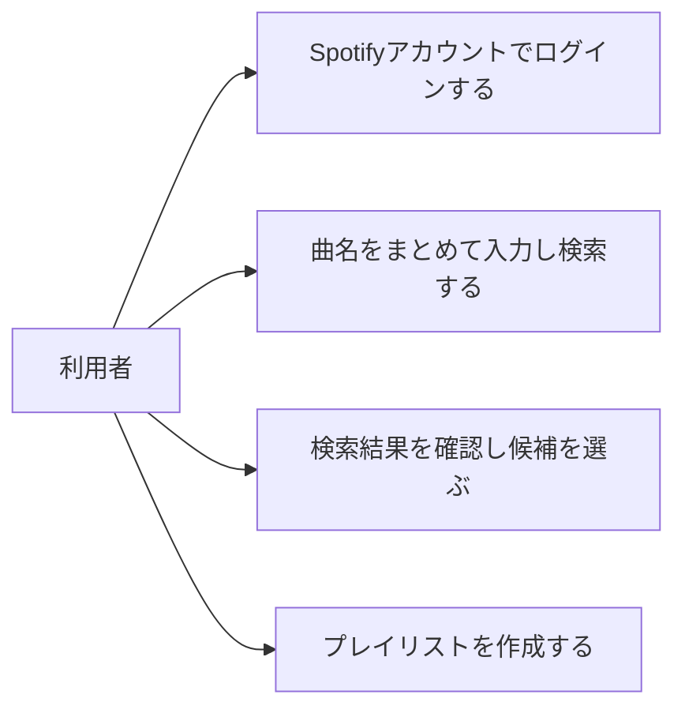

# 曲名からのプレイリスト作成

> ステータス: 仕様確認中(未実装)

## サマリ
サイト訪問者が、聴きたい曲の曲名を複数まとめて入力するだけで、自分のSpotifyアカウントに新しいプレイリストを作成できる機能。曲名ごとにSpotify上の候補から曲を選び、見つからなかった曲は除外して作成を続行できる。既存プレイリストへの追加や作成履歴の管理は対象外。詳細は[ユースケース図](#ユースケース図)を参照。

## 概要
- 機能名: playlist-create
- 目的: 曲を1曲ずつSpotifyアプリ内で検索してプレイリストに追加する手間をなくし、曲名を入力するだけでプレイリストを完成させられるようにする
- URL: `/spotify-playlist`

## ユーザーストーリー
- 利用者として、聴きたい曲の曲名をいくつか入力するだけで、自分のSpotifyアカウントにその曲を集めたプレイリストを作りたい

## ユースケース図

アクター「利用者」ができることの詳細は[機能要件](#機能要件)を参照。

## 機能要件
- [1] Spotifyアカウントでのログイン: 利用者は自分のSpotifyアカウントでログイン(認可)する。ログインするまで、曲の検索・プレイリスト作成のいずれも行えない
- [2] 曲名の一括入力: 複数行のテキストエリアに、1行1曲として曲名を入力できる
- [3] 一括検索: 入力した曲名それぞれについて、Spotify上で曲を検索する
- [4] 検索結果の一覧表示: 曲名ごとに検索結果を一覧表示する
- [5] 候補の選択: 検索結果が複数件ある曲は、利用者が一覧から選んだ1件がその曲の採用候補になる
- [6] 未ヒット曲の表示: 検索してヒットしなかった曲は「見つかりませんでした」と表示する
- [7] プレイリスト名の入力: プレイリスト名を入力する欄を設け、利用者が入力する
- [8] プレイリストの作成: 採用済みの曲(候補が1件のみの曲、および複数候補から選択済みの曲)を集めて、利用者自身のSpotifyアカウントに新規プレイリストとして作成する
- [9] 作成結果の表示: 作成が完了したら、作成したプレイリストへのリンクを表示する
- [10] ログアウト: ログイン中の利用者は明示的にログアウトでき、ログアウトすると未ログイン状態に戻る
- [11] 作成後の再作成: プレイリスト作成が完了した後、同じ画面で曲名入力からやり直し、続けて別のプレイリストを作成できる

## ビジネスルール・制約

### 候補の確定方法
- [1] 検索結果が1件のみの曲は、その1件を自動的に採用候補とする
- [2] 検索結果が複数件ある曲は、自動で候補を確定せず、利用者が一覧から選ぶまで採用候補は確定しない
- [3] プレイリスト作成時に採用候補が確定していない曲(複数候補のまま未選択の曲)は作成対象に含めない
- [4] 採用候補が1曲も確定していない場合、プレイリストの作成はできない

### 未ヒット曲の扱い
- [1] 検索してヒットしなかった曲があっても、他の曲(採用候補が確定している曲)だけでプレイリスト作成に進める。未ヒットの曲のために作成をブロックしない

### プレイリスト名
- [1] プレイリスト名は利用者が必ず入力する。未入力の場合は作成できない

### プレイリストの公開範囲
- [1] 作成するプレイリストは非公開で作成する。公開に変更したい場合は、利用者がSpotify側の操作で行う(本アプリの機能としては提供しない)

## 非機能要件・依存関係・制約条件
- 本サイトはCloudflare Workers上の静的配信で、ランタイムのサーバー機能(APIルート等)を持たない([board-game-rules/architecture.md](../../board-game-rules/architecture.md)と同じ方針)。Spotify連携もこの制約の範囲内(ブラウザ内で完結する認可方式)で実現する
- 実装の前提として、Spotify Developer Dashboardでのアプリ登録(Client IDの発行、`benriyatool.com`のredirect URIとしての登録)が必要。2026-09-05時点で未登録のため、実装フェーズまでに運営者が用意する
- 利用者はSpotifyアカウントを持っている前提とする。アカウントを持たない利用者への案内は本specのスコープ外とする

## スコープ外
- 既存プレイリストへの曲の追加(本specは新規プレイリストの作成のみを対象とする)
- 作成後のプレイリストの曲の並び替え・削除
- 作成履歴の保存・一覧表示
- 複数プレイリストの一括作成
