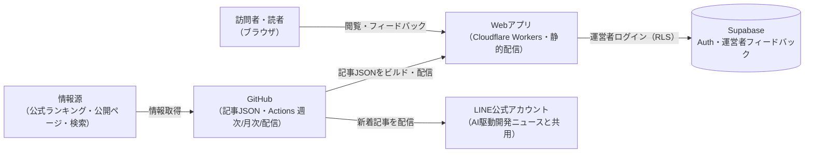
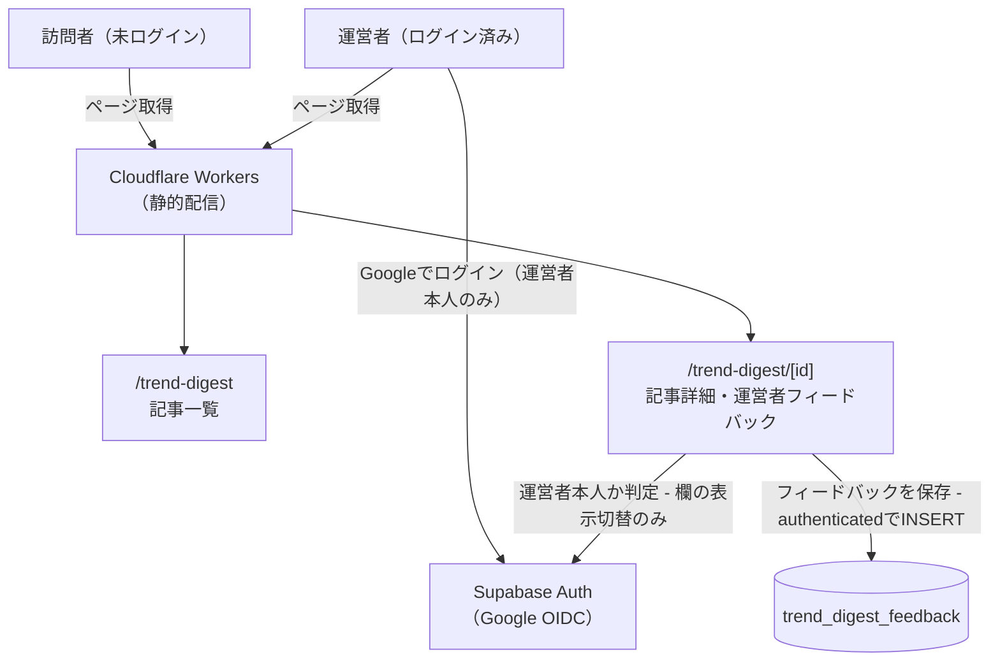
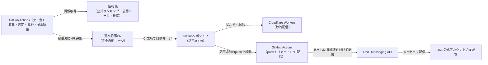
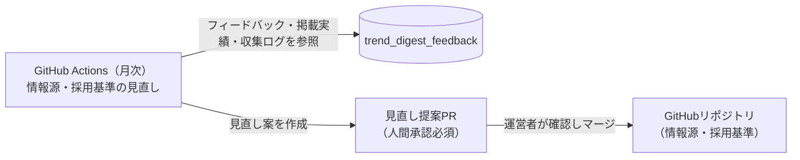
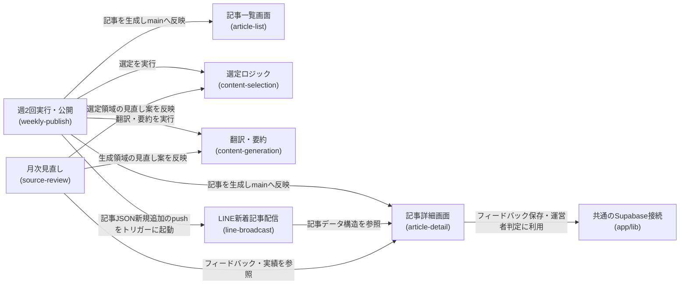

# アーキテクチャ: trend-digest

## 1. 概要
音楽・映像・グルメ・ファッションなど様々なジャンルの「最近の流行」を週2回自動で収集・要約し、ダイジェスト記事として公開するアプリ。ai-dev-digestと同じ運用パターン(GitHub Actionsによる自動収集・記事生成・LINE配信)を踏襲する。URL: `/trend-digest`

## 2. アーキテクチャの目的
- 対象ジャンルが18種類と多く、ジャンルごとに情報源の性質(公式ランキング・チャートの有無)が大きく異なるため、情報源・採用基準を1つの設計に押し込めず、ジャンルの性質に応じて2つの選定方式を使い分ける([content-selection](content-selection/requirements.md)「選定方式」参照)
- 1回の配信であらゆるジャンルを無理に埋めるのではなく、その週に実際に動きがあったジャンルだけを掲載し、ジャンル数の多さが「薄い内容の水増し」につながらないようにする
- 18ジャンルを1回にまとめず「エンタメ編」「カルチャー・ライフスタイル編」の2グループに分けて週2回配信することで、1回あたりの掲載量を読める分量に抑える
- ai-dev-digestの[daily-publish](../ai-dev-digest/daily-publish/requirements.md)・[line-broadcast](../ai-dev-digest/line-broadcast/requirements.md)・[watchlist-review](../ai-dev-digest/watchlist-review/requirements.md)と同じ運用パターン(GitHub Actionsによる自動実行・完全自動マージ、月次の人間承認込み見直し)を踏襲し、新しい運用パターンを増やさない

## 3. 設計方針
- 記事本文はDBに保存せず、ai-dev-digestと同様にビルド時に取り込まれる静的コンテンツ(JSON)として管理する
- 運営者フィードバックの保存は、ai-dev-digestが確立した[ADR-0001](../../docs/adr/0001-user-input-database.md)パターン(`authenticated`ロールのINSERT専用)をそのまま踏襲し、新しい認証・DB設計を増やさない。フィードバック欄の表示条件(ログイン中かつ運営者本人)の判定も、ai-dev-digestが使う`isAuthorizedAdmin()`(`admin_emails`テーブル、[ADR-0006](../../docs/adr/0006-admin-screen-oidc-rls.md))を再利用する
- LINE配信は新しい公式アカウントを作らず、既存の「AI駆動開発ニュース」と同じLINE公式アカウントに相乗りする(無料メッセージ枠に余裕があることを確認済み)。配信メッセージの見出しに「週刊トレンド エンタメ編」「週刊トレンド カルチャー編」の接頭辞を付け、日次のAI駆動開発ニュースと区別する
- ai-dev-digestにある「読者の付箋(bookmark)」に相当する機能は、trend-digestの初期スコープには含めない(必要になれば/fixで後から追加する)

## 4. システム構成図

### 4.1 全体俯瞰


### 4.2 閲覧・読者フロー


### 4.3 週2回の記事生成・公開・LINE配信フロー


### 4.4 月次の見直し(source-review)フロー


これらの図の正となる文章は「[5. アーキテクチャ概要](#5-アーキテクチャ概要)」と各specの設計書。

## 5. アーキテクチャ概要
Next.jsの静的エクスポートをCloudflare Workersで配信する構成は他アプリと同じ。記事本文はDBではなくJSONのコンテンツファイル(`content/trend-digest/`)として管理する。

対象ジャンルは18種類あり、[content-selection](content-selection/requirements.md)で「エンタメ編」(音楽・日本映画・海外映画・日本ドラマ・海外ドラマ・アニメ・バラエティ・サブスク動画・書籍/漫画の9ジャンル)と「カルチャー・ライフスタイル編」(SNSバズり・流行語・グルメ・趣味・ファッション・ガジェット/家電・ゲーム・旅行/観光・経済/お金の9ジャンル)の2グループに分ける。エンタメ編は毎週火曜、カルチャー・ライフスタイル編は毎週金曜にGitHub Actionsが実行され、ジャンルごとの情報源から候補を収集し、選定基準に沿ってその回に「動きがあった」ジャンルのトピックを選ぶ。選定方式はジャンルによって2通りある: 公式ランキング・チャートを持つジャンルは固定リストからの定量的コード判定、決まった集計元がないジャンルはClaude Code CLIのヘッドレス実行によるWebSearchベースの判定(LLM判定)を行う。選定後はClaude Code CLIが翻訳・要約([content-generation](content-generation/requirements.md))を行い記事を生成、PRを作成しCI成功後に自動マージする([weekly-publish](weekly-publish/requirements.md))。このマージをトリガーに、独立したGitHub Actionsワークフローが記事タイトル・トピック見出し一覧・記事リンクを、既存の「AI駆動開発ニュース」と同じLINE公式アカウントから配信する。配信メッセージの見出しには「週刊トレンド エンタメ編」「週刊トレンド カルチャー編」の接頭辞を付け、日次のAI駆動開発ニュースと区別する([line-broadcast](line-broadcast/requirements.md))。訪問者は記事一覧・詳細ページ([article-list](article-list/requirements.md)、[article-detail](article-detail/requirements.md))を未ログインでも閲覧できる。ログイン中の運営者本人は記事詳細ページの各トピック下にフィードバックを残せる(ai-dev-digestと同じ`authenticated`ロールのINSERT専用パターン)。月次のGitHub Actionsワークフローがフィードバックと掲載実績・収集ログを読み、情報源・採用基準の見直し案をPRとして提案し、運営者の承認を経てからマージされる([source-review](source-review/requirements.md))。

## 6. 採用技術
| 技術 | 用途 |
|---|---|
| Next.js(静的エクスポート) | 記事一覧・詳細ページの描画 |
| Supabase | 運営者フィードバックの保存(`trend_digest_feedback`テーブル) |
| Supabase Auth(Google OIDC) | 記事詳細ページのフィードバック入力欄の表示切り替え(運営者判定。既存の`admin_emails`・`isAuthorizedAdmin()`を再利用) |
| GitHub Actions | 週2回(火・金)の記事生成・月次の情報源見直し(スケジュール実行)・LINE新着記事配信(pushトリガー)の実行基盤 |
| Claude Code(ヘッドレス実行) | 決まった集計元がないジャンルの候補収集・「動きがあったか」の判定(WebSearch)、翻訳・要約・記事執筆、月次見直し案の検討 |
| LINE Messaging API | 新着記事のLINE公式アカウント(AI駆動開発ニュースと共用)からの配信 |
| Tailwind CSS | スタイリング |

選定理由はプロジェクト横断のため[関連ADR](#11-関連adr)を参照。

## 7. 機能マップ
| spec | 役割 | 依存 | 状態 |
|---|---|---|---|
| [content-selection](content-selection/requirements.md) | 18ジャンルを2グループ(エンタメ編・カルチャー編)に分け、ジャンルごとの情報源・採用基準に沿って各回「動きがあった」トピックを選び出す | weekly-publishの実行タイミングに従う([weekly-publish/requirements.md](weekly-publish/requirements.md)) | 実装中 |
| [content-generation](content-generation/requirements.md) | 選定されたトピックの翻訳・要約・記事執筆のルール(著作権配慮を含む)を定める | content-selectionの選定結果を受け取る([content-selection/requirements.md](content-selection/requirements.md)) | 実装中 |
| [weekly-publish](weekly-publish/requirements.md) | 週2回(火・金)の収集・選定・要約・記事公開を自動実行し、完全自動マージする | content-selection・content-generationの結果を公開する | 実装中 |
| [line-broadcast](line-broadcast/requirements.md) | weekly-publishの記事PRがmainへ自動マージされた直後に、既存LINE公式アカウントで新着記事を配信する | weekly-publishのマージタイミング([weekly-publish/requirements.md](weekly-publish/requirements.md))、article-detailの記事データ構造([article-detail/design.md](article-detail/design.md))に従う | 実装中 |
| [article-list](article-list/requirements.md) | エンタメ編・カルチャー編の記事を時系列1本のフィードでバッジ表示する | article-detailの記事構造を参照([article-detail/requirements.md](article-detail/requirements.md)) | 実装中 |
| [article-detail](article-detail/requirements.md) | 記事本文(ジャンル見出しごとのトピック・要約・出典)と、運営者本人向けフィードバック入力欄を表示する | content-selectionの選定結果、content-generationの生成ルールに従う | 実装中 |
| [source-review](source-review/requirements.md) | 月次で情報源・採用基準の見直し案を作成し、人間承認を経て反映する | article-detailのフィードバック、content-selectionの掲載実績・収集ログを参照する | 実装中 |

## 8. コンポーネント図


この図の正となる文章は「[7. 機能マップ](#7-機能マップ)」の依存列と、各specのrequirements.mdの依存関係。

## 9. ディレクトリ構成
CLAUDE.mdの一般規約(`components/`,`lib/`)通りで、逸脱なし。ただし記事本文・ジャンル情報源・採用基準はコード資産(`app/`)ではなくコンテンツデータとして`content/trend-digest/`配下に別途管理する(ai-dev-digestと同じ設計思想)。

```
content/trend-digest/articles/<id>.json    # 1回1ファイルの記事データ(weekly-publishが追加)
content/trend-digest/watchlist.json        # ジャンル別の情報源(source-reviewが変更)
content/trend-digest/criteria.json         # 採用基準の数値(source-reviewが変更)
```

収集・選定・記事組み立てのスクリプトは`scripts/trend-digest/`配下に置く(ai-dev-digestと同じ置き場所の考え方)。LINE配信のスクリプトも同様に`scripts/trend-digest/`配下に置く。

## 10. 外部サービス
| サービス | 用途 |
|---|---|
| Supabase(`trend_digest_feedback`テーブル) | 運営者フィードバックの保存 |
| Supabase Auth(Google OIDC) | 記事詳細ページのフィードバック入力欄の表示切り替え(運営者判定。既存の`admin_emails`・`isAuthorizedAdmin()`を再利用) |
| Oricon・Billboard JAPAN・Netflix公式Top10(top10.netflix.com)・トーハン週間ベストセラー・Googleトレンド急上昇ワード・Yahoo!検索急上昇ワード・WWD JAPAN・ZOZOTOWN・価格.com・Engadget日本版・Steam・ファミ通.com・じゃらんnet/るるぶ&more! | 固定リストジャンルの情報源データ取得([content-selection/requirements.md](content-selection/requirements.md)) |
| Web検索(Claude Code CLIのWebSearch) | 決まった集計元がないジャンルの候補収集([content-selection/requirements.md](content-selection/requirements.md)) |
| GitHub Actions | 記事生成([weekly-publish](weekly-publish/requirements.md))・見直し提案([source-review](source-review/requirements.md))・LINE配信([line-broadcast](line-broadcast/requirements.md))の実行基盤 |
| Claude Code CLI(運営者個人のPro/Maxサブスクリプション認証) | weekly-publishの候補収集・翻訳・要約生成、source-reviewの見直し案検討に、いずれもヘッドレス起動で使用 |
| LINE Messaging API | 新着記事のLINE公式アカウント(AI駆動開発ニュースと共用)からの配信([line-broadcast](line-broadcast/requirements.md)) |

## 11. 関連ADR
- [0001-user-input-database.md](../../docs/adr/0001-user-input-database.md) — 運営者フィードバック保存のDB選定・RLSパターン(INSERT専用、`authenticated`ロール)を踏襲
- [0006-admin-screen-oidc-rls.md](../../docs/adr/0006-admin-screen-oidc-rls.md) — フィードバック入力欄の表示切り替えに使うGoogle OIDCログイン判定の基盤(`app/lib/adminAuth.ts`・`admin_emails`)を流用

## 12. セキュリティ
運営者フィードバックの保存は`authenticated`ロールによるINSERT専用とし、SELECT/UPDATE/DELETEは許可しない(ai-dev-digestと同じ方針)。この入力欄は運営者本人がログイン中の場合のみ画面に表示され、実際のリクエストは常に`authenticated`ロールで行われる。保存される内容は選定基準への自由記述コメントのみで、氏名・連絡先等の個人情報は扱わない。

## 13. 技術的制約
他者の著作物(公式ランキング・チャート・ニュース記事)を要約して掲載するため、著作権法上のリスク(翻訳権・翻案権侵害の可能性)を伴う。ai-dev-digestと同じ方針(要約分量の制限・出典明記・利用規約への条項追記)によってリスクを低減する([content-generation/requirements.md](content-generation/requirements.md))。各情報源の取得は公式サイト・公開ページの閲覧の範囲にとどめ、非公式APIや利用規約を超えたアクセスは行わない。食べログ・Rettyのような有料API制約があるサービスは直接使わず、話題を報じる二次情報源(ニュースメディア記事)経由で収集する。

## 14. 用語集
| 用語 | 説明 |
|---|---|
| エンタメ編 | 火曜配信の9ジャンル(音楽・日本映画・海外映画・日本ドラマ・海外ドラマ・アニメ・バラエティ・サブスク動画・書籍/漫画)をまとめた回。[content-selection](content-selection/requirements.md)で定義 |
| カルチャー・ライフスタイル編 | 金曜配信の9ジャンル(SNSバズり・流行語・グルメ・趣味・ファッション・ガジェット/家電・ゲーム・旅行/観光・経済/お金)をまとめた回。[content-selection](content-selection/requirements.md)で定義 |
| 固定リストジャンル | 公式ランキング・チャート等の決まった情報源を持ち、定量的なコード判定で採用可否を決めるジャンル。[content-selection](content-selection/requirements.md)で定義 |
| WebSearchジャンル | 決まった集計元がなく、Claude Code CLIのWebSearchによる探索的収集とLLM判定で「動きがあったか」を決めるジャンル。[content-selection](content-selection/requirements.md)で定義 |
| GitHub Actions | スケジュール実行・pushトリガー実行のワークフロー基盤。週2回の記事生成([weekly-publish](weekly-publish/requirements.md))・月次の見直し提案([source-review](source-review/requirements.md))・LINE新着記事配信([line-broadcast](line-broadcast/requirements.md))の実行主体 |
