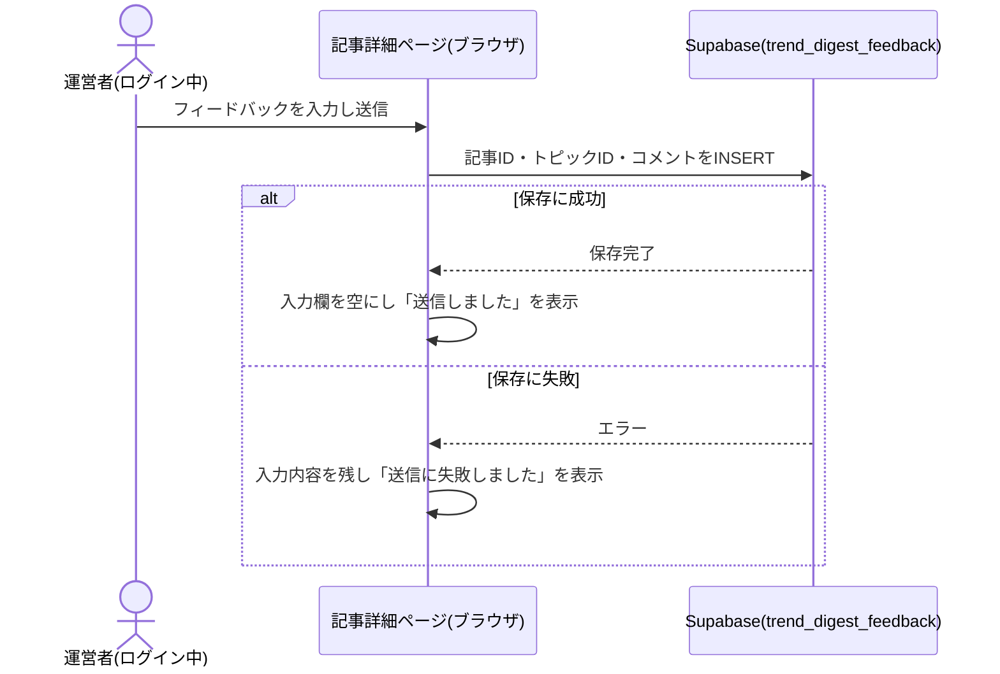

# 設計: 記事詳細ページ

## サマリ
その回の記事本文を、対象ジャンル(エンタメ編9ジャンル・カルチャー編10ジャンル)すべてを見出しとして、各ジャンル1件のトピック・本文・出典・継続度ラベルと注目度ラベルのバッジ・継続期間・報告回数・地域をジャンル見出しの下に表示する。情報源から話題を取得できなかったジャンルは、見出しの下にその旨を表示する。運営者本人がログイン中の場合のみ、各トピック下にフィードバック入力欄を表示し、`trend_digest_feedback`テーブルへINSERT専用で保存する(ai-dev-digestと同じ`authenticated`ロールのINSERT専用パターン)。記事データの型・置き場所は本specが定義し、他specが共通して従う(下記「前提: 記事データの形式」)。UI方針は「画面設計」参照(Step0は簡易実施)。

## 前提: 記事データの形式(この機能が定義する共有スキーマ)

記事本文はDBではなく、ビルド時に取り込む静的コンテンツファイルとして管理する(architecture.md#3-設計方針)。この記事データの型・置き場所は本specで定義し、[article-list](../article-list/requirements.md)・[content-selection](../content-selection/requirements.md)・[content-generation](../content-generation/requirements.md)・[weekly-publish](../weekly-publish/requirements.md)・[line-broadcast](../line-broadcast/requirements.md)・[source-review](../source-review/requirements.md)は共通してこの形式に従う。

- 格納場所: `content/trend-digest/articles/<id>.json`(`<id>`は`<date>-<edition>`。例: `2026-09-15-entertainment`、`2026-09-18-culture-lifestyle`。`<date>`は発行日`YYYY-MM-DD`。URLの`[id]`と一致させる)
- 1ファイル=1回分の記事(エンタメ編・カルチャー編それぞれ週1ファイル、合計週2ファイル)。週次のGitHub Actionsワークフロー([weekly-publish](../weekly-publish/requirements.md))がこのファイルを新規追加する
- なぜMarkdownでなくJSONか: ジャンルごとのトピック(見出し・本文・出典・原題)を構造化フィールドとして持つ必要があり、本文全体が地の文であるMarkdownより、フィールド単位で機械検証(バリデーション)しやすいJSONの方が、エージェントが生成する入力形式として事故が少ないと判断した(要件に形式指定はないため設計判断。ai-dev-digestと同じ考え方)

```ts
// app/trend-digest/lib/types.ts
import type { DurationLabel, HeatLabel } from './historyTypes' // trend-history/design.mdが定義する継続度ラベル・注目度ラベル

export type Edition = 'entertainment' | 'culture-lifestyle'

export type Genre =
  | 'music' | 'japanese-movie' | 'foreign-movie' | 'japanese-drama' | 'foreign-drama'
  | 'anime' | 'variety' | 'streaming-video' | 'books-comics'
  | 'sns-buzz' | 'buzzwords' | 'gourmet' | 'hobby' | 'fashion'
  | 'gadgets' | 'games' | 'travel' | 'economy-money' | 'dev-trends'

// ジャンルの表示順(edition内の見出し表示順として使う。requirements.md#グループとジャンル)
export const GENRE_ORDER: Record<Edition, Genre[]> = {
  entertainment: ['music', 'japanese-movie', 'foreign-movie', 'japanese-drama', 'foreign-drama', 'anime', 'variety', 'streaming-video', 'books-comics'],
  'culture-lifestyle': ['sns-buzz', 'buzzwords', 'gourmet', 'hobby', 'fashion', 'gadgets', 'games', 'travel', 'economy-money', 'dev-trends'],
}

// ジャンル見出しに表示する日本語ラベル(GenreSectionが使う。requirements.md#グループとジャンルの表記をそのまま使う)
export const GENRE_LABELS: Record<Genre, string> = {
  music: '音楽',
  'japanese-movie': '日本映画',
  'foreign-movie': '海外映画',
  'japanese-drama': '日本ドラマ',
  'foreign-drama': '海外ドラマ',
  anime: 'アニメ',
  variety: 'バラエティ',
  'streaming-video': 'サブスク動画',
  'books-comics': '書籍・漫画',
  'sns-buzz': 'SNSバズり',
  buzzwords: '流行りの言葉',
  gourmet: 'グルメ',
  hobby: '流行りの趣味',
  fashion: 'ファッション',
  gadgets: 'ガジェット・家電',
  games: 'ゲーム',
  travel: '旅行・観光',
  'economy-money': '経済・お金',
  'dev-trends': '開発手法・開発サービス',
}

// 継続度ラベルのバッジに表示する日本語ラベル(requirements.md#継続度・注目度の表示-13。
// 訪問者は英語の識別子の意味を知らないため、画面には必ずこのラベルを出す)
export const DURATION_LABELS: Record<DurationLabel, string> = {
  'pre-trend': '流行前',
  emerging: '注目され始め',
  talked: '話題',
  'highly-talked': '非常に話題',
}

// 注目度ラベルのバッジに表示する日本語ラベル(同上)
export const HEAT_LABELS: Record<HeatLabel, string> = {
  high: '注目度 高い',
  normal: '注目度 普通',
  low: '注目度 低い',
}

// トピックに添える継続度・注目度の情報(trend-historyの判定結果を公開時点の値として保存したもの)。
// 画面側で再計算はしない(requirements.md#継続度・注目度の表示の扱い-6)
export type TopicTrend = {
  durationLabel: DurationLabel // どれだけ続いているか([trend-history/requirements.md#継続度ラベル](../trend-history/requirements.md))。「流行前」も掲載されうる
  heatLabel: HeatLabel // 今どれくらい強いか([trend-history/requirements.md#注目度ラベル](../trend-history/requirements.md))
  continuationDays: number // 途切れずに検知され続けている日数([trend-history/design.md](../trend-history/design.md)「途切れずに続いている期間を求める処理」の定義をそのまま持つ。公開時点までの日数ではない)
  continuationStartDate: string // YYYY-MM-DD。途切れずに検知され続けている期間の開始日
  reportCount: number // 通算何回目の報告か。初掲載は1
  originRegion: string | null // 発祥地域。不明はnull(表示しない)
  currentRegions: string[] // 現在の主な流行地域。不明は空配列(表示しない)
}

export type Topic = {
  id: string // 記事内で一意。フィードバックの紐付けに使う(例: "topic-1")
  genre: Genre
  heading: string // content-generationが生成する見出し
  body: string // content-generationが生成する本文(160〜480字、目安200〜400字)
  sourceTitle: string // 対象作品・話題の原題(content-selectionのCandidate.titleをそのまま引き継ぐ。掲載実績・履歴の突合キーとして使う。表示はしない)
  sourceName: string // 出典の情報源名
  sourceUrl: string // 出典の元URL
  trend?: TopicTrend // 継続度・注目度の情報。この機能より前に公開した記事は持たないため任意(requirements.md#継続度・注目度の表示-18)
}

export type Article = {
  id: string // ファイル名と一致
  edition: Edition
  date: string // YYYY-MM-DD。発行日
  topics: Topic[] // ジャンルの定義順(GENRE_ORDER)に並ぶ。各ジャンル1件
  // 情報源から話題を1件も取得できなかったジャンル(requirements.md#継続度・注目度の表示-17)。
  // 見出しは出したうえで取得できなかった旨を表示するため、topicsに入らないジャンルをここで持つ。
  // この機能より前に公開した記事は持たないため任意
  unavailableGenres?: Genre[]
}
```

記事タイトルはJSONに保存せず、`edition`・`date`から常に`buildArticleTitle(edition, date)`(content-generation/design.md参照)で導出する(タイトルをエージェントに毎回生成させると表現が揺れたり誇張表現に流れたりするリスクがあるため。content-generation/requirements.md#記事の構成-6・#エージェントの逸脱防止-5と対になる設計判断)。

## 処理フロー

### 記事データを読み込む処理
- 対象: `content/trend-digest/articles/`配下のJSONファイル
- 手順:
  1. 指定されたIDのファイル(`<id>.json`)を読み込む
  2. JSONとしてパースできない、またはスキーマ(下記バリデーション参照)を満たさない場合は例外を投げる
  3. 該当IDのファイルが存在しない場合は「記事なし」を表す`null`を返す(例外にしない)
- 関連するビジネスルール: requirements.md#記事本文表示-1〜2

### その回の記事本文を表示する処理
- 対象: 読み込んだ記事データ
- 手順:
  1. `buildArticleTitle(edition, date)`で導出した記事タイトル・公開日(`date`)を見出しとして表示する
  2. `GENRE_ORDER[edition]`の順に、その編の全ジャンルを見出しとして表示する(requirements.md#記事本文表示-2)。見出しの文言は`Genre`から`GENRE_LABELS`を引いた日本語ラベルを使う
  3. 各ジャンル見出しの下に、そのジャンルの`topics`(1件)を、見出し・本文・出典(情報源名・元URLへのリンク、新規タブで開く)とセットで表示する(requirements.md#記事本文表示-3)
  4. `unavailableGenres`に含まれるジャンルは、見出しの下にトピックの代わりとして「今回は情報源から話題を取得できませんでした」と表示する。見出しだけが残る状態にはしない(requirements.md#継続度・注目度の表示-17)
  5. 各トピックに`trend`がある場合は、見出しの隣に継続度ラベルのバッジと注目度ラベルのバッジを(いずれも日本語ラベル付きで)並べ、本文の上にトレンド情報の行を表示する。トレンド情報の行に出すのは、継続期間(継続の開始日と継続日数を組み合わせた読みやすい表記)・報告回数(2回目以降のみ)・発祥地域(判定できている場合のみ)・現在の主な流行地域(判定できている場合のみ)で、値が不明な項目は項目ごと表示しない(requirements.md#継続度・注目度の表示-10、同-12、同-14、同-15、同-16)
  6. `trend`を持たないトピックは、バッジ・トレンド情報の行をいずれも表示しない(requirements.md#継続度・注目度の表示-18)
  7. 表示するトピック数は`topics`配列のとおりで、画面側で件数の絞り込みは行わない(その編のジャンル数と一致する。requirements.md#記事本文表示-4)
- 関連するビジネスルール: requirements.md#記事本文表示-1、requirements.md#記事本文表示-2、requirements.md#記事本文表示-3、requirements.md#記事本文表示-4、requirements.md#継続度・注目度の表示-10、requirements.md#継続度・注目度の表示-11、requirements.md#継続度・注目度の表示-12、requirements.md#継続度・注目度の表示-13、requirements.md#継続度・注目度の表示-14、requirements.md#継続度・注目度の表示-15、requirements.md#継続度・注目度の表示-16、requirements.md#継続度・注目度の表示-17、requirements.md#継続度・注目度の表示-18、requirements.md#継続度・注目度の表示の扱い-6、requirements.md#継続度・注目度の表示の扱い-7

### ログイン状態に応じてフィードバック入力欄の表示を切り替える処理
- 対象: Supabase Authのログインセッション
- 手順:
  1. ページ表示時に現在のログインセッションを取得する(`app/lib/adminAuth.ts`の`getSession`)
  2. セッションが存在する(ログイン中)場合、運営者本人かどうかを`isAuthorizedAdmin()`(`admin_emails`テーブルのSELECT。RLSにより自分の行のみ返る)で確認する。許可対象と判定された場合のみ、各トピックの下にフィードバック入力欄を表示する。セッションが存在しない場合、または許可対象でない場合は何も表示しない(requirements.md#運営者向けフィードバック-6)
  3. 確認中は入力欄を表示しない(確認が終わるまで「未許可」として扱う)。確認自体が失敗した場合も、画面にエラーを出さず「未許可」として扱う(フィードバック欄は運営者向けの副次的な機能であり、失敗によって主機能である記事の閲覧を妨げたくないため。失敗はコンソールにのみ出力する)
  4. ログイン状態の変化(ログイン完了・ログアウト)を購読し(`onAuthChange`)、変化のたびに1〜3を再実行する
- **DBの読み取り(SELECT)は`admin_emails`に対してのみ行う**。`trend_digest_feedback`自体へのSELECTポリシーは、`benriyatool_readonly`向け([ADR-0004](../../../docs/adr/0004-agent-readonly-db-access.md))以外は追加しない
- 関連するビジネスルール: requirements.md#運営者向けフィードバック-6、requirements.md#フィードバックの保存・権限-4

### フィードバックを送信する処理
- 対象: フィードバック入力欄に入力された自由記述コメント
- 手順:
  1. 入力内容をトリムした結果が空文字の場合、送信ボタンを無効化する(押下自体をできなくする)(requirements.md#運営者向けフィードバック-9)
  2. 送信ボタン押下時、対象トピックの記事ID(`article.id`)とトピック識別子(`topic.id`)、入力内容を1件のレコードとしてまとめる
  3. `trend_digest_feedback`テーブルへの保存を試みる(ログイン中のセッションによる`authenticated`ロールでのINSERT)
  4. 保存に成功した場合、入力欄を空にし「送信しました」という完了表示を数秒間出す(requirements.md#運営者向けフィードバック-8)
  5. 保存に失敗した場合、入力内容は消さずに残し、「送信に失敗しました。もう一度お試しください」と表示する(運営者が能動的に書いた自由記述であり、消えたことに気づけない方が不親切なため、この機能に限り失敗を可視化する。ai-dev-digestと同じ考え方)
- シーケンス図(俯瞰用。正は上記の手順の文章):


- 関連するビジネスルール: requirements.md#運営者向けフィードバック-7〜9、requirements.md#フィードバックの保存・権限-3

## バリデーション

記事データ(JSONファイル)のスキーマ検証:
- `id`: ファイル名と一致すること。`<date>-<edition>`の形式であること
- `edition`: `entertainment`または`culture-lifestyle`であること
- `date`: `YYYY-MM-DD`形式であること
- `topics`: 配列長が1件以上で、`article.edition`のジャンル数(エンタメ編9・カルチャー編10)以下であること。`topics`のジャンルと`unavailableGenres`を合わせると`GENRE_ORDER[article.edition]`と過不足なく一致すること(各ジャンル1件を掲載する仕様どおりに記事が組み立てられているかをビルド時に検知するため。content-selection/requirements.md#掲載件数-1〜3)
- 各`topic`: `id`が記事内で重複しないこと、`genre`が定義済みジャンルのいずれかであること、かつ`article.edition`に対応するジャンル(`GENRE_ORDER[article.edition]`)に含まれること(エンタメ編の記事にカルチャー編のジャンルが混入するような不整合をビルド時に検知するため)、`heading`/`body`/`sourceTitle`/`sourceName`/`sourceUrl`が空文字でないこと、`sourceUrl`が`http`または`https`で始まる絶対URLであること、同一ジャンルのトピックが2件以上存在しないこと(content-selection/requirements.md#掲載件数-1)
- `unavailableGenres`は省略可。ある場合は、各要素が`GENRE_ORDER[article.edition]`に含まれるジャンルであること、重複がないこと、`topics`のジャンルと重ならないこと
- 各`topic`の`trend`は省略可。ある場合は、`durationLabel`が定義済みの4段階のいずれかであること、`heatLabel`が定義済みの3段階のいずれかであること、`continuationDays`が0以上の整数であること、`continuationStartDate`が`YYYY-MM-DD`形式で記事の`date`以前であること、`reportCount`が1以上の整数であること、`originRegion`が文字列(空文字でなく50文字以内・制御文字を含まない)またはnullであること、`currentRegions`が文字列の配列(各要素は空文字でなく50文字以内・制御文字を含まない、10件以内)であること。地域情報は収集エージェントが生成した自由文字列のため、記事データに取り込む時点でも外部入力として検証する([trend-history/design.md](../trend-history/design.md)のバリデーションと同じ上限)
- `body`の文字数が160〜480字の範囲であること(content-generation/requirements.md#要約-2、content-generation/design.md「本文の分量を検証する処理」)
- 上記を満たさない場合は例外を投げる(下記エラーハンドリング参照)。フィードバック送信の入力内容自体(自由記述テキスト)は長さ・文字種の制限を設けないが、空文字または空白文字のみの場合は送信できない(requirements.md#運営者向けフィードバック-9)

## エラーハンドリング

- 記事データのスキーマ違反は**ビルド時(`next build`)に例外として検知させ、ビルドを失敗させる**。これにより[weekly-publish](../weekly-publish/requirements.md)のCIチェック(`npm run build`を含む)が壊れたデータのPRを弾き、不正な記事が公開される事故を防ぐ
- フィードバック送信の失敗(通信エラー・RLS拒否等)は上記処理フロー「フィードバックを送信する処理」手順5のとおり画面に失敗を表示する。原因の種類による出し分けは行わない

## 関連するファイル(抜粋)

```
app/trend-digest/lib/types.ts (新規: Edition/Genre/GENRE_ORDER/GENRE_LABELS/Topic/Articleの型定義)
app/trend-digest/lib/articleTitle.ts (content-generationで新規作成: buildArticleTitleを利用)
app/trend-digest/lib/articleSchema.ts (新規: JSONのバリデーション・パース処理。article-listのページネーションからも参照される)
app/trend-digest/lib/articles.ts (新規: content/trend-digest/articles/ を読み込むgetAllArticles/getArticleById。article-listと共有)
app/trend-digest/lib/saveFeedback.ts (新規: フィードバック保存処理)
app/trend-digest/[id]/page.tsx (新規: 記事詳細ページ、generateStaticParamsで全IDを列挙)
app/trend-digest/components/GenreSection.tsx (既存: 全ジャンルの見出し表示と、話題を取得できなかったジャンルの表示を追加)
app/trend-digest/components/TopicCard.tsx (既存: 継続度・注目度のバッジとトレンド情報の行の表示を追加)
app/trend-digest/components/DurationBadge.tsx (新規: 継続度ラベルの日本語ラベル付きバッジ)
app/trend-digest/components/HeatBadge.tsx (新規: 注目度ラベルの日本語ラベル付きバッジ)
app/trend-digest/components/TrendMeta.tsx (新規: 継続期間・報告回数・地域の1行表示)
app/trend-digest/components/FeedbackForm.tsx (新規)
app/lib/adminAuth.ts (既存: getSession/onAuthChange/signInWithGoogle/signOut/isAuthorizedAdminを利用)
app/lib/supabaseClient.ts (既存の共通クライアントを利用)
content/trend-digest/articles/*.json (新規: 記事本文データ。コード資産ではないためapp/配下に置かない)
```

## データベース設計

### trend_digest_feedback(新規テーブル)
| カラム | 型 | 補足 |
|---|---|---|
| id | uuid | 共通カラム(docs/adr/0001)。DB側で自動採番 |
| created_at | timestamptz | 共通カラム。DB側で自動設定 |
| is_test | boolean, not null, default false | 共通カラム(docs/adr/0001)。開発環境またはURLに`?test=1`が付いている場合にtrue |
| article_id | text, not null | 対象記事の`Article.id`(`content/trend-digest/articles/<id>.json`のid) |
| topic_id | text, not null | 対象トピックの`Topic.id` |
| comment | text, not null | 自由記述のフィードバック内容 |

RLSはINSERT専用の最小権限パターン(docs/adr/0001)を踏襲する。この入力欄はログイン中のみ表示されるため対象ロールは`authenticated`にする(ai-dev-digestの`ai_dev_digest_feedback`と同じ方針。当初から`authenticated`ロールで作成し、ai-dev-digestで発生した`anon`向けの誤設定は繰り返さない):
- `authenticated`: INSERTのみ許可
- `benriyatool_readonly`: SELECTのみ許可([ADR-0004](../../../docs/adr/0004-agent-readonly-db-access.md))。[source-review](../source-review/requirements.md)の月次見直しがこのロールでフィードバックを読む
- 運営者専用SELECTポリシー([ADR-0006](../../../docs/adr/0006-admin-screen-oidc-rls.md)のテンプレート)は追加しない。フィードバック入力欄の表示切り替えは画面側のログイン状態判定のみで行い、DBの読み取り権限を必要としないため(architecture.md#12-セキュリティ)

```sql
create table trend_digest_feedback (
  id uuid primary key default gen_random_uuid(),
  created_at timestamptz not null default now(),
  is_test boolean not null default false,
  article_id text not null,
  topic_id text not null,
  comment text not null
);

alter table trend_digest_feedback enable row level security;

-- authenticatedはINSERTのみ許可(この入力欄はログイン中のみ表示されるため)
grant insert on trend_digest_feedback to authenticated;
create policy "authenticated can insert" on trend_digest_feedback
  for insert to authenticated with check (true);

-- benriyatool_readonlyはSELECTのみ許可(ADR-0004。source-reviewの月次見直しが読む)
grant select on trend_digest_feedback to benriyatool_readonly;
create policy "benriyatool_readonly can select" on trend_digest_feedback
  for select to benriyatool_readonly using (true);
```

## 画面設計

Step0: 簡易実施(既存ai-dev-digestの`app/ai-dev-digest/[date]/page.tsx`の配色・レイアウトパターンを踏襲し、最終的な見た目の確定はautopilotの画面レビュー(実装後のlocalhost確認)で行う)。ジャンル見出しで区切るレイアウトはrequirements.mdで確定済み([article-list/requirements.md](../article-list/requirements.md)と対になる方針)。既存画面からの見分けが付くよう、アクセントカラーのみトレンド系トピックらしい配色(暖色系。例: アンバー/オレンジ系のアクセント)に変更する。具体的な色コードは実装時にTailwindの既存パレットから選ぶ。

- パンくず(べんりやつーる › 週刊トレンド › 記事タイトル)
- 記事タイトル(`buildArticleTitle(edition, date)`)・公開日
- ジャンル見出し(その編の全ジャンル、GENRE_ORDER順)+配下にそのジャンルのトピックカード(1件): 見出し、継続度ラベルのバッジ、注目度ラベルのバッジ、トレンド情報の行、本文、出典(情報源名・元URLへのリンク、新規タブで開く)
- 継続度ラベルのバッジ: 見出しの隣に置き、日本語ラベル(流行前/注目され始め/話題/非常に話題)を必ず表示する。段階が進むほど濃くなる暖色系(流行前=最も淡い、非常に話題=最も濃い)で塗り分け、色だけに意味を持たせない(requirements.md#継続度・注目度の表示の扱い-7)。「流行前」は淡い配色に加えて、半月以上続いている話題という目安にまだ達していないことが文言で分かる表記にする(requirements.md#継続度・注目度の表示-11)。具体的な色コードは実装時にTailwindの既存パレットから選ぶ
- 注目度ラベルのバッジ: 継続度ラベルのバッジの隣に、**形・配色の系統を変えて**置き、日本語ラベル(注目度 高い/普通/低い)を表示する。2つのバッジが同じ見た目だとどちらが時間の長さでどちらが今の強さか読者に伝わらないため(requirements.md#継続度・注目度の表示の扱い-8)。継続度が暖色系の塗りつぶしであるのに対し、注目度は枠線主体の寒色系とする
- トレンド情報の行: 本文の上に1行で「◯月◯日から継続(◯日)」「◯回目の報告」「発祥: ◯◯」「主な流行地域: ◯◯」を並べる。報告回数は2回目以降のみ、地域は判定できている場合のみ出し、不明な項目は項目ごと省く(requirements.md#継続度・注目度の表示-14〜16)
- 話題を取得できなかったジャンル: 見出しの下に、トピックカードの代わりに「今回は情報源から話題を取得できませんでした」の1行を置く(requirements.md#継続度・注目度の表示-17)
- 各トピックの下: 運営者本人がログイン中の場合のみフィードバック入力欄(テキストエリア+送信ボタン)を表示する。送信後は「送信しました」、失敗時は「送信に失敗しました。もう一度お試しください」を表示
- ページ下部: ログイン状態表示(未ログイン時は「ログイン」ボタン。ログイン中はメールアドレス+ログアウトボタン、`ai-dev-digest`の表示パターンと同じ)

画面遷移図は置かない。この画面は1ページで完結し、他の画面への遷移も入力→確認→完了のような表示状態の切り替えも持たないため(フィードバック入力欄の表示/非表示とその送信状態は、遷移図ではなく下記「状態管理」で扱う粒度と判断した)。

## コンポーネント設計

| コンポーネント | Props | 役割 |
|---|---|---|
| GenreSection | `genre: Genre`, `topic: Topic \| null`, `isAdmin: boolean`, `articleId: string` | 1ジャンル分の見出し+配下トピックカードの表示。`topic`がnullのときは取得できなかった旨を表示する |
| TopicCard | `topic: Topic`, `isAdmin: boolean`, `articleId: string` | 1トピック分の表示+配下にFeedbackFormを`isAdmin`で条件付き表示。`topic.trend`がある場合のみDurationBadge・HeatBadge・TrendMetaを表示 |
| DurationBadge | `label: DurationLabel` | 継続度ラベルの日本語ラベル付きバッジ表示(暖色系の塗りつぶし) |
| HeatBadge | `label: HeatLabel` | 注目度ラベルの日本語ラベル付きバッジ表示(寒色系の枠線) |
| TrendMeta | `trend: TopicTrend` | 継続期間・報告回数・地域の1行表示(不明な項目は省く。ラベルのバッジは含まない) |
| FeedbackForm | `articleId: string`, `topicId: string` | 自由記述の入力欄・送信・送信結果表示 |

## 状態管理

- ログインセッション(`Session \| null`): ページのトップレベルコンポーネントで`useState`保持し、運営者判定(`isAdmin`)の算出にのみ使う。`isAdmin`(boolean)だけを`GenreSection`にpropsで渡す
- 各`FeedbackForm`の送信状態(`idle`/`sending`/`sent`/`failed`)はコンポーネント内の`useState`で完結させる(トピックをまたいで共有しない)

## セキュリティ

- フィードバックの`comment`はエスケープせずそのままDBに保存する(表示・一覧化を一切行わないため、XSS等の表示起因のリスクは発生しない。requirements.md#スコープ外を参照)
- `article_id`・`topic_id`はブラウザから送信される値をそのまま信頼する。存在しない記事ID・トピックIDが送られても、フィードバックとして意味を持たないだけで実害はない(authenticatedロールでもINSERTのみで他データへの影響がないため、厳密なサーバー側検証は行わない)
- `trend`の地域(`originRegion`・`currentRegions`)はエージェントが情報源から判定した文字列をそのまま表示するため、他のトピック本文と同じくReactのエスケープに委ねる。判定できなかった項目は表示自体を行わないため、推測で作られた地域名が画面に出ることはない([trend-history/requirements.md#地域情報-15](../trend-history/requirements.md))
- 記事データ(JSONファイル)は開発者・エージェントが作成しリポジトリにコミットされるコンテンツであり、訪問者からの入力ではないため、XSS対策としてのサニタイズは不要(通常のReactレンダリングでエスケープされる)。ただし`sourceUrl`は`http`/`https`のみを許可し(バリデーション参照)、`javascript:`等のスキームを含むリンクが生成されないようにする
- `isAuthorizedAdmin()`(`admin_emails`のSELECT)は同テーブルのRLS(「自分のメール行だけ見える」設計、ADR-0006)により、読者全員が呼び出しても他人のメールアドレス一覧が漏れることはない

## ログ

- フィードバックの保存成功・失敗はコンソール等へのログ出力を行わない(静的配信でサーバーを持たずコンソールログを運営者が収集できないため、ai-dev-digestと同じ方針)
- `isAuthorizedAdmin()`の確認自体が失敗した場合は、ブラウザのコンソールにエラー内容を出す(画面には伝えず「未許可」として扱う。原因究明用)
- 記事データのスキーマ違反はビルド時に例外としてCIのログに出力される(`next build`の標準エラー出力)
