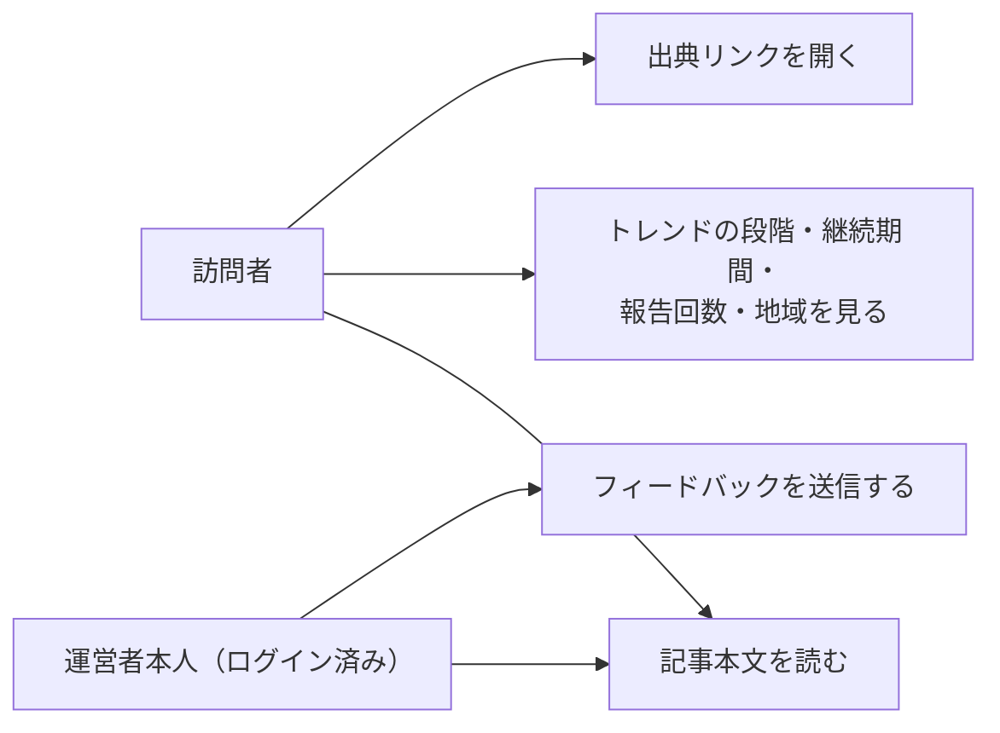

# 要件定義: 記事詳細ページ

> ステータス: 仕様確認中(中長期トレンド対応は未実装)

## サマリ
その回のトレンド記事本文を、ジャンル見出しごとに区切ってトピック(最大2件)・要約・出典リンクを表示する。各トピックには、その話題が中長期トレンドとしてどの段階にあるか(ステータス)・どれだけ続いているか・何回目の報告か・どの地域で流行しているかをあわせて表示する。掲載対象にならなかったジャンルは表示しない。あわせて、運営者本人がその場でフィードバックを残せるようにする。

## 概要
- 機能名: 記事詳細ページ
- 目的: その回のトレンド記事本文を、ジャンルごとの見出し・要約・出典リンク・中長期トレンドとしての段階とともに表示する。あわせて、運営者が採用基準を振り返るためのフィードバックをその場で残せるようにする
- 優先度: 高

## ユーザーストーリー
- 訪問者として、その回の注目トピックを、ジャンルごとに整理された形でまとめて読みたい
- 訪問者として、興味を持ったトピックの元情報源に出典リンクからアクセスしたい
- 訪問者として、その話題が「出てきたばかり」なのか「伸びている最中」なのか「定着した」のか、どれくらい続いているのかを一目で知りたい
- 訪問者として、同じ話題の続報を読むときに、それが何回目の報告なのかが分かるようにしてほしい
- 訪問者として、その話題がどこで生まれ、いま主にどの地域で流行しているのかを知りたい
- 運営者本人として、ログインした状態で記事を読みながら「この選定はもう不要」等のフィードバックをその場で残し、後から採用基準の見直しに活かしたい

## ユースケース図

上記は俯瞰用の図。正となる文章は下記「機能要件」「ビジネスルール・制約」。

## 機能要件

### 記事本文表示
- [1] その回の記事タイトル・公開日を表示する
- [2] その回の対象ジャンル(エンタメ編9ジャンル・カルチャー編10ジャンル)のうち、掲載対象となったジャンルだけを見出しとして表示する(掲載対象の候補がなかったジャンルは見出し自体を表示しない。[content-selection/requirements.md#機能要件-4](../content-selection/requirements.md))
- [3] 各ジャンル見出しの下に、そのジャンルで採用されたトピック(最大2件、[content-selection/requirements.md#機能要件-5](../content-selection/requirements.md))を、それぞれ見出し・本文・出典情報(情報源名・元URLへのリンク)とセットで表示する
- [4] 全ジャンル合計で最大10件のトピックを表示する([content-selection/requirements.md#機能要件-6](../content-selection/requirements.md))

### 運営者向けフィードバック
- [5] 各トピックの下に、フィードバック入力欄(自由記述のテキスト)を表示する
- [6] フィードバック入力欄は、運営者本人がGoogle OIDCでログインしている場合のみ表示される。未ログインの訪問者には表示されない
- [7] 送信すると、対象のトピック(記事のID・トピック識別子)と入力内容が自動的に紐づいた状態でデータベースに保存される
- [8] 送信後、内容が保存されたことが分かる表示にする
- [9] フィードバック入力欄が空文字、または空白文字のみの場合は送信できない(送信ボタンを無効化する、または送信時にエラーを示す)

### 中長期トレンドの表示
- [10] 各トピックに、[trend-history/requirements.md#ステータス判定基準](../trend-history/requirements.md)が判定した中長期ステータス(GROWING/ESTABLISHED/STABLEのいずれか)を、段階が一目で分かるバッジとして表示する。記事に掲載されるのは掲載可能なステータスの話題だけのため、NEW・SHORT_TERM・EMERGING・DECLININGが表示されることはない
- [11] ステータスのバッジには、その段階が何を意味するかが日本語で分かる表記を添える(英語の識別子だけを出さない。訪問者は運営者と違ってステータスの定義を知らないため)
- [12] 各トピックに、その話題が続いている期間(初回検知日からの継続日数)を表示する
- [13] 同じ話題が過去にも掲載されている場合、今回が通算何回目の報告かを表示する([content-selection/requirements.md#掲載済み話題の再掲抑制-4](../content-selection/requirements.md))。初めて掲載する話題には表示しない
- [14] 各トピックに、判定できている場合のみ発祥地域・現在の主な流行地域を表示する。判定できていない(不明の)項目は表示しない(「不明」という表示自体を出さない。情報がないことを強調しても読者の役に立たないため)
- [15] 中長期トレンドの情報(ステータス・継続日数・報告回数・地域)を持たないトピックは、その部分を表示しない(この機能より前に公開した記事が該当する)

## ビジネスルール・制約

### 表示分量・著作権配慮
- [1] 各トピックの本文は200〜400字程度とし、原文の全文転記は行わない(根拠: [content-generation/requirements.md#著作権への配慮根拠](../content-generation/requirements.md))
- [2] 出典(情報源名・元URLへのリンク)を必ず表示する(根拠: 同上、著作権配慮としての最低限の措置)

### フィードバックの保存・権限
- [3] フィードバックの保存は、INSERT専用の最小権限パターン([docs/adr/0001-user-input-database.md](../../../docs/adr/0001-user-input-database.md))を踏襲する。この入力欄はログイン中のみ表示されるため、INSERTは`authenticated`ロールへ許可する(ai-dev-digestと同じ方針)。保存されるのは自由記述コメントのみで、`trend_digest_feedback`テーブル自体へのadmin_emails等を用いた追加のRLS設計は導入しない
- [4] 入力欄の表示・非表示は、運営者本人かどうかの判定による画面側の出し分けで行う(フィードバック保存先テーブル自体のアクセス制御ではなく表示制御である点に注意する)。運営者判定は既存の`admin_emails`許可リスト([ADR-0006](../../../docs/adr/0006-admin-screen-oidc-rls.md)、`app/lib/adminAuth.ts`のisAuthorizedAdmin())を再利用する
- [5] 保存されたフィードバックは、公開画面のどこにも表示・一覧化しない

### 中長期トレンド表示の扱い
- [6] 表示するステータス・継続日数・報告回数・地域は、記事データに保存された値をそのまま表示する。画面側で再計算・再判定は行わない(記事が公開された時点の判定を後から変えないため)
- [7] ステータスのバッジは、段階ごとに色で見分けが付くようにする。ただし色だけに意味を持たせず、必ず文字のラベルも併記する(色の識別が難しい利用者にも伝わるようにするため)

## 依存関係
- 表示するトピックの選定結果は[content-selection/requirements.md](../content-selection/requirements.md)の採用基準に従って決まる
- 表示するステータス・継続日数・報告回数・地域は[trend-history/requirements.md](../trend-history/requirements.md)が判定した結果を、content-selectionを経て受け取る
- 要約の生成ルールは[content-generation/requirements.md](../content-generation/requirements.md)に従う
- ログイン状態・運営者判定は既存の管理画面と同じGoogle OIDC + `admin_emails`許可リスト([docs/adr/0006-admin-screen-oidc-rls.md](../../../docs/adr/0006-admin-screen-oidc-rls.md)、`app/lib/adminAuth.ts`のisAuthorizedAdmin())を利用する。`admin_emails`テーブル・そのRLSポリシーは複数アプリ共有の既存資産であり、本specのための新しいテーブル・マイグレーションは不要
- 蓄積されたフィードバックは[source-review/requirements.md](../source-review/requirements.md)の月次見直しで参照される

## スコープ外
- フィードバックへの返信・公開表示
- フィードバック以外の一般コメント欄(訪問者向けの感想投稿など)
- フィードバックの一覧・検索画面(運営者はデータベースを直接確認する運用とする)
- 読者による付箋・ブックマーク機能(ai-dev-digestのbookmark相当。必要になれば/fixで後から追加する)
