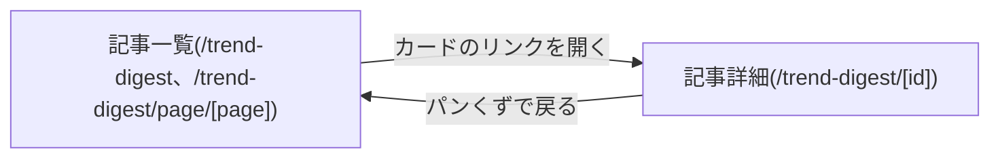

# 設計: 記事一覧ページ

## サマリ
エンタメ編・カルチャー編を区別せず、公開日時の新しい順に1本のフィードとしてカード表示する。各カードにはグループバッジ(エンタメ/カルチャー)・記事タイトル・公開日・トピック見出しを数件・詳細ページへのリンクを表示し、新しい順に20件ずつページ分割する(ai-dev-digestのarticle-listと同じページネーション設計)。UI方針は「画面設計」参照(Step0は簡易実施)。

## 処理フロー

### 記事一覧をページ分割する処理
- 対象: [article-detail](../article-detail/design.md)の`getAllArticles()`が返す全記事(新しい順)
- 手順:
  1. 全記事を`date`の新しい順に並べる(`getAllArticles()`が既に新しい順を保証する)
  2. 20件ごとに区切り、指定されたページ番号に該当する範囲を取り出す(requirements.md#ビジネスルール・制約-2)
  3. 総ページ数(総記事数を20で割って切り上げ)を算出する
  4. 記事が1件も存在しない場合は、空の一覧と「まだ記事がありません」の表示に必要な情報を返す(requirements.md#一覧表示-3)
- 関連するビジネスルール: requirements.md#ビジネスルール・制約-2

### カードに表示するトピック見出しを選ぶ処理
- 対象: 1記事分の`topics`配列
- 手順:
  1. 配列の先頭(GENRE_ORDER順)から最大3件を`heading`のみでカードに表示する(要件は「数件」とのみ定めており、詳細ページと同じ見出し文字列をそのまま使う。requirements.md#ビジネスルール・制約-1)【推測】
  2. 記事が保持するトピックが3件を超える場合、カードに「他N件」の表示を添える
- 関連するビジネスルール: requirements.md#一覧表示-2、requirements.md#ビジネスルール・制約-1

## 関連するファイル(抜粋)

```
app/trend-digest/lib/articles.ts (article-detailで新規作成するgetAllArticles/getArticleByIdを利用)
app/trend-digest/lib/pagination.ts (新規: paginate(articles, page, pageSize=20))
app/trend-digest/lib/articleTitle.ts (content-generationで新規作成するbuildArticleTitleを利用)
app/trend-digest/components/ArticleCard.tsx (新規: edition・date・トピック見出し・詳細ページへのリンクを表示)
app/trend-digest/components/EditionBadge.tsx (新規: 「エンタメ」/「カルチャー」バッジ表示)
app/trend-digest/components/Pagination.tsx (新規)
app/trend-digest/page.tsx (新規: 一覧ページ1ページ目)
app/trend-digest/page/[page]/page.tsx (新規: 2ページ目以降。generateStaticParamsで総ページ数分を列挙)
app/trend-digest/layout.tsx (新規: title/description。page.tsxが'use client'のため親のlayoutで持つ)
```

## エラーハンドリング

- 存在しないページ番号(総ページ数を超える、0以下)が指定された場合は404相当の扱いにする(静的エクスポートのためビルド時の`generateStaticParams`が生成しない未知パスとして扱い、実際には該当パス自体が生成されないため、Cloudflare Workers側の404ページに委ねる)
- `getAllArticles()`が記事データのスキーマ違反で例外を投げた場合、一覧ページのビルドも失敗する(article-detail/design.md#エラーハンドリングと同じ方針。壊れた記事データのまま一覧だけ正常に見える状態を作らない)

## 画面設計

Step0: 簡易実施(既存ai-dev-digestの`app/ai-dev-digest/page.tsx`の配色・レイアウトパターンを踏襲し、最終的な見た目の確定はautopilotの画面レビュー(実装後のlocalhost確認)で行う)。時系列1本のフィード+バッジのレイアウトはrequirements.mdで確定済み。既存画面からの見分けが付くよう、アクセントカラーのみトレンド系トピックらしい配色(暖色系。例: アンバー/オレンジ系のアクセント。article-detailと共通のトークンにする)に変更する【推測】。

- 見出し「週刊トレンド」+簡単な説明文(requirements.md#メタ情報-1のdescriptionと同趣旨の短い紹介文)
- カード一覧(新しい順、1ページ20件): グループバッジ(「エンタメ」/「カルチャー」、エンタメ編はentertainment、カルチャー編はculture-lifestyle。requirements.md#一覧表示-2)・記事タイトル(`buildArticleTitle(edition, date)`)・公開日・トピック見出し(最大3件、超過時は「他N件」)・詳細ページへのリンク
- 記事が0件の場合: 「まだ記事がありません。しばらくお待ちください。」という案内文のみを表示する【推測】
- ページ下部にページネーション(前へ/次へ、および現在ページ/総ページ数の表示)。1ページのみの場合はページネーションを表示しない

### 画面遷移図

上記は俯瞰用の図。正となる文章は上記の「画面設計」箇条書き。

## コンポーネント設計

| コンポーネント | Props | 役割 |
|---|---|---|
| ArticleCard | `id: string`, `edition: Edition`, `date: string`, `topicHeadings: string[]`, `totalTopicCount: number` | 1記事分のカード表示(グループバッジ+タイトル+日付+トピック見出し+リンク) |
| EditionBadge | `edition: Edition` | 「エンタメ」/「カルチャー」バッジ表示 |
| Pagination | `currentPage: number`, `totalPages: number` | 前へ/次へ・現在ページ表示。`totalPages <= 1`なら何も描画しない |

## セキュリティ

`article-detail/design.md#セキュリティ`と同じ前提(記事データは開発者・エージェントが作成するコンテンツで訪問者入力ではない)。本specはフィードバック機能を持たず、追加のリスクはない。

## ログ

一覧ページの表示・ページ分割は静的生成された結果を返すだけの処理であり、実行時に出力すべきログはない(ビルド時のエラーはarticle-detail/design.md#エラーハンドリングのビルド失敗としてCIログに現れる)。
