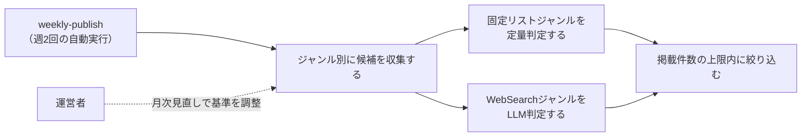

# 要件定義: ジャンル別情報源と採用基準

## サマリ
18ジャンルの「最近の流行」を「エンタメ編」(火曜配信)と「カルチャー・ライフスタイル編」(金曜配信)の2グループに分け、ジャンルごとの情報源から候補を収集し、その回に実際に動きがあったジャンルのトピックだけを選び出す。実際の消費・行動を集計した客観データ(売上・視聴率・興行収入・チャート順位・検索ボリューム等)が存在するジャンルは定量的なコード判定、存在しないジャンルはWebSearchによるLLM判定(独立した言及の広がりを基準にする)を行う(架空の話題は作らず、動きがなければそのジャンルは掲載しない)。詳細は「[ユースケース図](#ユースケース図)」参照。

## 概要
- 機能名: ジャンル別情報源と採用基準
- 目的: 18ジャンルの「流行」を、ジャンルの性質に応じた方法(定量判定・LLM判定)で収集し、実在する動きがあったトピックだけを週2回選び出す
- 優先度: 高

## ユーザーストーリー
- 運営者として、ジャンルごとに信頼できる情報源(公式ランキング・チャート、または話題を報じる複数の情報源)から、実際にその週動きがあった話題だけを選び出してほしい
- 運営者として、動きがなかったジャンルは無理に埋めず、架空の話題や無理に絞り出したような薄い話題を掲載しないでほしい
- 運営者として、1回の配信量が多くなりすぎないよう、掲載件数に上限を設けてほしい

## ユースケース図

上記は俯瞰用の図。正となる文章は下記「機能要件」「ビジネスルール・制約」。

## 機能要件
- [1] 対象ジャンルを2グループ・18ジャンルに固定する(下記「グループとジャンル」)。固定リスト運用とし、記載以外のジャンルをエージェントが自律的に追加することはしない
- [2] エンタメ編は毎週火曜、カルチャー・ライフスタイル編は毎週金曜に、それぞれ独立して候補収集・選定を実行する(実行タイミングは[weekly-publish/requirements.md](../weekly-publish/requirements.md)に従う)
- [3] ジャンルごとに、下記「採用基準」に従って候補を収集し、採用基準を満たす候補があるジャンルだけを当該回の掲載対象にする。採用基準を満たす候補が1件もないジャンルは、その回は掲載しない(架空の話題を作らない)
- [4] 1ジャンルにつき掲載するトピックは最大2件とする。候補が3件以上ある場合は、下記「ジャンル内の絞り込み」に従い上位2件に絞る
- [5] 1回の配信につき掲載する合計トピック数は最大10件とする。全ジャンルの候補を合算して10件を超える場合は、下記「配信全体の絞り込み」に従い絞る

## ビジネスルール・制約

### グループとジャンル
- [1] エンタメ編(火曜配信・9ジャンル): 音楽、日本映画、海外映画、日本ドラマ、海外ドラマ、アニメ、バラエティ、サブスク動画、書籍・漫画
- [2] カルチャー・ライフスタイル編(金曜配信・9ジャンル): SNSバズり、流行りの言葉、グルメ、流行りの趣味、ファッション、ガジェット・家電、ゲーム、旅行・観光、経済・お金

### 選定方式
- [1] ジャンルは「固定リストジャンル」(実際の消費・行動を集計した客観データ――売上・視聴率・興行収入・チャート順位・検索ボリューム等――を公式または業界団体が構造化データとして公開しており、コードで機械的に定量判定できる)と「WebSearchジャンル」(そうした客観集計データが存在せず、Claude Code CLIのWebSearchによる探索的収集とLLM判定で「独立した言及が広がっているか」を判定する)の2方式に分かれる(根拠: [consult](../../../.claude/skills/consult/SKILL.md)での壁打ちで、18ジャンル全てに同一の定量基準を事前設計するコストが過大と判断したため)
- [2] 固定リストジャンル: 音楽、日本映画、海外映画、日本ドラマ、海外ドラマ、アニメ、バラエティ、サブスク動画、書籍・漫画、流行りの言葉、ゲーム、旅行・観光
- [3] WebSearchジャンル: SNSバズり、グルメ、流行りの趣味、ファッション、ガジェット・家電、経済・お金
- [4] 単一メディアの特集・紹介記事(編集部のキュレーション)は、それ自体を客観データの代用として固定リスト化しない。実際の売上・視聴・検索行動の集計値を伴わないジャンルは、WebSearchジャンルとして下記「ジャンルごとの情報源・採用基準(WebSearchジャンル)」の独立言及基準に従う(ファッション・ガジェット家電が固定リストでなくWebSearchジャンルである理由)
- [5] SNSバズり(X・Instagram・Threads・TikTok)は各社公式APIが有料のため直接利用せず、バズりを報じるメディア記事・口コミの広がりをWebSearchで収集する(根拠: [content-selection/requirements.md#データ取得方法](#データ取得方法))
- [6] グルメは食べログ・Rettyの店舗ランキングAPIが有料プラン前提のため直接利用せず、飲食店・食トレンドについての独立した言及の広がりをWebSearchで収集する

### ジャンルごとの情報源・採用基準(固定リストジャンル)
- [1] 音楽: Billboard JAPAN Hot 100の公開ページ(実売上・ストリーミング数集計)を情報源とし、新規にランクインした、または前週から順位が大きく上昇した作品を候補にする(Oricon週間チャートは順位データがページ内に構造化されておらず機械判定できないため情報源から除外する)
- [2] 日本映画・海外映画: 興行通信社「CINEMAランキング通信」(業界公式の興行収入集計機関)を主たる情報源とし、映画.com国内/全米ランキング・Filmarks上映中ランキングを補助情報源として、直近の週末興行収入上位5位以内の作品を候補にする
- [3] 日本ドラマ・バラエティ: ビデオリサーチの視聴率データ速報(日本唯一の全国視聴率調査会社の公式データ)を情報源とし、当該週の視聴率上位番組、または前週から視聴率が大きく上昇した番組を候補にする
- [4] 海外ドラマ・サブスク動画・アニメ: Netflix公式の構造化データ(`netflix.com/tudum/top10/data/all-weeks-countries.tsv`、週次更新の実視聴データ)の該当カテゴリ(シリーズ/映画/日本のTOP10)を情報源とし、新規にランクインした、または順位が上昇した作品を候補にする
- [5] 書籍・漫画: トーハン・日販(出版取次2強)それぞれの週間ベストセラー公式ページを情報源とし、いずれかで上位5位以内にランクインした作品を候補にする(2社の値が食い違う場合は両社の順位を候補のnoteに残し、より上位の順位を採用する)
- [6] 流行りの言葉: Google公式のトレンドRSSフィード(`trends.google.com/trending/rss?geo=JP`、実検索ボリュームの集計データ)を情報源とし、掲載された語のうち一過性の話題性がある語(固有名詞・時事性のある語)を候補にする
- [7] ゲーム: Steam公式Web API(`ISteamChartsService/GetMostPlayedGames`、実プレイヤー数集計)・ファミ通.com売上ランキングを情報源とし、上位ランクインの新作・話題作を候補にする
- [8] 旅行・観光: じゃらんnet人気ランキング(実際の予約・閲覧データに基づく集計)を情報源とし、上位ランクインのスポットを候補にする

### ジャンルごとの情報源・採用基準(WebSearchジャンル)
- [1] 各ジャンルについてClaude Code CLIがWebSearchで話題を検索し、性質の異なる複数の独立した言及元(ニュースメディアの記事、SNS上での言及、口コミ・レビューサイトでの評判増加等)で同じ話題が独立に言及されている場合にのみ「動きがあった」と判定する。単一の情報源のみが報じている話題、広告・PR記事1本のみが取り上げている話題、または噂・未確認情報の域を出ない話題は候補にしない(根拠: 特定の編集部の紹介記事1本を「流行」と誤認しないため。1メディアの特集記事は「独立した言及」の1件としてのみ数え、それだけで採用しない)
- [2] 独立した言及とみなす最低件数(`minIndependentSources`)は、ニュース性の高い話題(単発の事故・不祥事・統計発表等)を誤って採用しないよう、既定で3件以上とする(criteria.jsonでジャンルごとに調整可能。詳細は[design.md](design.md)参照)
- [3] 検索の切り口(searchHints)は、単発ニュースではなく自然発生的な広がり(SNSでの言及・口コミの増加・複数の一般ユーザーの発信)を捉える表現にする。「◯◯を紹介する記事を検索する」のような編集記事狙いの表現は使わない
- [4] SNSバズり: X・Instagram・Threads・TikTokでの投稿・反響が複数のニュースメディア・まとめメディアで独立に言及されている話題を検索する(上記「選定方式」[5]参照)
- [5] グルメ: SNS・口コミで自然発生的に言及が増えている飲食店・食トレンドを検索する。特集記事・PR記事のみが取り上げている店は候補にしない(上記「選定方式」[6]参照)
- [6] 流行りの趣味: 新しく話題になっているホビー・レジャーについて、複数の独立した言及を検索する
- [7] ファッション: SNS・口コミで言及が増えているアイテム・トレンドを検索する(WWD JAPAN・ZOZOTOWN等の特定サイトの特集記事のみに依拠しない)
- [8] ガジェット・家電: SNS・口コミで言及が増えている製品・トレンドを検索する(特定メディアの紹介記事のみに依拠しない)
- [9] 経済・お金: 家計・投資に関する単発ニュース(統計発表・制度改正等)ではなく、流行っている節約術・クーポン・サービス等、複数の独立した言及があるものを検索する

### ジャンル内の絞り込み(1ジャンル最大2件)
- [1] 固定リストジャンルは、採用基準を満たす候補のうち順位が高い(またはランキング上昇幅が大きい)上位2件を採用する
- [2] WebSearchジャンルは、言及している情報源の数が多い上位2件を採用する

### 配信全体の絞り込み(1回最大10件)
- [1] 各ジャンルの候補を合算して10件を超える場合、まず全ジャンルの1件目(最有力候補)を優先して残し、次に2件目を情報源の信頼性が高い順(固定リストジャンル→WebSearchジャンル)に残りの枠へ追加する

### 掲載済み話題の再掲抑制
- [1] 過去に掲載済みのトピック(同一作品名・同一話題)は、採用基準を満たしていても候補から除外する(根拠: ai-dev-digestの[content-selection/requirements.md#掲載済み記事の再掲抑制](../../ai-dev-digest/content-selection/requirements.md#掲載済み記事の再掲抑制)と同じ考え方。ロングラン作品がランキングに残り続けても、新鮮な話題を優先するため)。判定方法の詳細は設計で詰める

### データ取得方法
- [1] 各情報源の取得は、公式サイト・公開ページの閲覧、公式が提供する構造化データ・Web API(Netflix公式データ、Google公式トレンドRSS、Steam公式Web API等)の利用、およびWebSearchの範囲にとどめ、非公式API・認証回避・利用規約の想定を超えた高頻度アクセスは行わない(ai-dev-digestと同じ方針)
- [2] 公開ページを取得する際は、一般的なブラウザのUser-Agentを付与してよい(Bot判定回避目的の偽装ではなく、User-Agent未設定を理由に一律ブロックするサイトへの通常アクセスのため)。文字コードはページのContent-Type/meta指定に従って正しく変換する

### 情報源の健全性監視
- [1] 週次実行のログに、ジャンルごとに「収集した候補件数(取得失敗はその旨)」を出力する(ai-dev-digestと同じ方針)。候補件数が0件の状態が慢性的に続くジャンルは、[source-review/requirements.md](../source-review/requirements.md)の月次見直しで情報源・基準の妥当性を確認する

## 依存関係
- 選定されたトピックは[article-detail/requirements.md](../article-detail/requirements.md)で表示される
- 選定候補の翻訳・要約は[content-generation/requirements.md](../content-generation/requirements.md)のルールに従って行われる
- 情報源・採用基準の変更は[source-review/requirements.md](../source-review/requirements.md)の月次見直しでのみ行う
- 収集・選定の実行タイミングは[weekly-publish/requirements.md](../weekly-publish/requirements.md)に従う

## スコープ外
- プラットフォームを横断した統合スコアによるランキング化
- ジャンルへの新規情報源の自動発掘(固定リスト運用)
- X(Twitter)・Instagram・Threads・TikTokの公式APIを使った直接取得
- 食べログ・Rettyの有料API連携
- ジャンルをまたぐ話題の関連性フィルタ(ai-dev-digestの[12]相当。各ジャンルの情報源自体がジャンルに特化しているため、今回は不要と判断)
