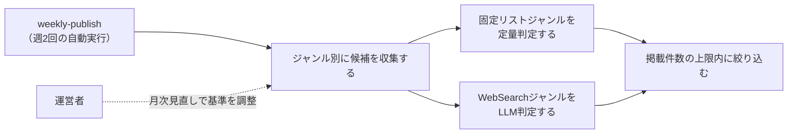

# 要件定義: ジャンル別情報源と採用基準

## サマリ
18ジャンルの「最近の流行」を「エンタメ編」(火曜配信)と「カルチャー・ライフスタイル編」(金曜配信)の2グループに分け、ジャンルごとの情報源から候補を収集し、その回に実際に動きがあったジャンルのトピックだけを選び出す。公式ランキング・チャートを持つジャンルは定量的なコード判定、決まった集計元がないジャンルはWebSearchによるLLM判定を行う(架空の話題は作らず、動きがなければそのジャンルは掲載しない)。詳細は「[ユースケース図](#ユースケース図)」参照。

## 概要
- 機能名: ジャンル別情報源と採用基準
- 目的: 18ジャンルの「流行」を、ジャンルの性質に応じた方法(定量判定・LLM判定)で収集し、実在する動きがあったトピックだけを週2回選び出す
- 優先度: 高

## ユーザーストーリー
- 運営者として、ジャンルごとに信頼できる情報源(公式ランキング・チャート、または話題を報じる複数の情報源)から、実際にその週動きがあった話題だけを選び出してほしい
- 運営者として、動きがなかったジャンルは無理に埋めず、架空の話題や無理に絞り出したような薄い話題を掲載しないでほしい
- 運営者として、1回の配信量が多くなりすぎないよう、掲載件数に上限を設けてほしい

## ユースケース図

上記は俯瞰用の図。正となる文章は下記「機能要件」「ビジネスルール・制約」。

## 機能要件
- [1] 対象ジャンルを2グループ・18ジャンルに固定する(下記「グループとジャンル」)。固定リスト運用とし、記載以外のジャンルをエージェントが自律的に追加することはしない
- [2] エンタメ編は毎週火曜、カルチャー・ライフスタイル編は毎週金曜に、それぞれ独立して候補収集・選定を実行する(実行タイミングは[weekly-publish/requirements.md](../weekly-publish/requirements.md)に従う)
- [3] ジャンルごとに、下記「採用基準」に従って候補を収集し、採用基準を満たす候補があるジャンルだけを当該回の掲載対象にする。採用基準を満たす候補が1件もないジャンルは、その回は掲載しない(架空の話題を作らない)
- [4] 1ジャンルにつき掲載するトピックは最大2件とする。候補が3件以上ある場合は、下記「ジャンル内の絞り込み」に従い上位2件に絞る
- [5] 1回の配信につき掲載する合計トピック数は最大10件とする。全ジャンルの候補を合算して10件を超える場合は、下記「配信全体の絞り込み」に従い絞る

## ビジネスルール・制約

### グループとジャンル
- [1] エンタメ編(火曜配信・9ジャンル): 音楽、日本映画、海外映画、日本ドラマ、海外ドラマ、アニメ、バラエティ、サブスク動画、書籍・漫画
- [2] カルチャー・ライフスタイル編(金曜配信・9ジャンル): SNSバズり、流行りの言葉、グルメ、流行りの趣味、ファッション、ガジェット・家電、ゲーム、旅行・観光、経済・お金

### 選定方式
- [1] ジャンルは「固定リストジャンル」(公式ランキング・チャート等の決まった情報源を持ち、定量的なコード判定で採用可否を決める)と「WebSearchジャンル」(決まった集計元がなく、Claude Code CLIのWebSearchによる探索的収集とLLM判定で「動きがあったか」を決める)の2方式に分かれる(根拠: [consult](../../../.claude/skills/consult/SKILL.md)での壁打ちで、18ジャンル全てに同一の定量基準を事前設計するコストが過大と判断したため)
- [2] 固定リストジャンル: 音楽、日本映画、海外映画、海外ドラマ、アニメ、サブスク動画、書籍・漫画、流行りの言葉、ファッション、ガジェット・家電、ゲーム、旅行・観光
- [3] WebSearchジャンル: 日本ドラマ、バラエティ、SNSバズり、グルメ、流行りの趣味、経済・お金
- [4] SNSバズり(X・Instagram・Threads・TikTok)は各社公式APIが有料のため直接利用せず、バズりを報じるニュースメディアの記事(二次情報源)をWebSearchで収集する(根拠: [content-selection/requirements.md#データ取得方法](#データ取得方法))
- [5] グルメは食べログ・Rettyの店舗ランキングAPIが有料プラン前提のため直接利用せず、話題の店を紹介するニュースメディアの記事をWebSearchで収集する

### ジャンルごとの情報源・採用基準(固定リストジャンル)
- [1] 音楽: Oricon週間チャート(無料公開範囲)・Billboard JAPAN Hot 100の公開ページを情報源とし、新規にランクインした、または前週から順位が大きく上昇した作品を候補にする
- [2] 日本映画・海外映画: 直近の週末興行収入ランキング記事・Filmarksの劇場公開作品ランキングを情報源とし、上位5位以内の作品を候補にする
- [3] 海外ドラマ・サブスク動画・アニメ: Netflix公式サイト「top10.netflix.com」の該当カテゴリ(シリーズ/映画/日本のTOP10)を情報源とし、新規にランクインした、または順位が上昇した作品を候補にする
- [4] 書籍・漫画: トーハン週間ベストセラー公式サイトのジャンル別ランキングを情報源とし、上位5位以内で新規にランクインした作品を候補にする
- [5] 流行りの言葉: Googleトレンド急上昇ワードページ・Yahoo!検索急上昇ワードランキングを情報源とし、上位に入った語のうち一過性の話題性がある語(固有名詞・時事性のある語)を候補にする
- [6] ファッション: WWD JAPANの新着記事・ZOZOTOWN人気ランキングを情報源とし、上位アイテム・新着のトレンド企画記事を候補にする
- [7] ガジェット・家電: 価格.com売れ筋ランキング・Engadget日本版の新着記事を情報源とし、上位ランクイン製品・新着記事で紹介された注目製品を候補にする
- [8] ゲーム: Steam売上ランキング公式ページ・ファミ通.com売上ランキングを情報源とし、上位ランクインの新作・話題作を候補にする
- [9] 旅行・観光: じゃらんnet・るるぶ&more!の人気ランキングページを情報源とし、上位ランクインのスポット・特集を候補にする

### ジャンルごとの情報源・採用基準(WebSearchジャンル)
- [1] 各ジャンルについてClaude Code CLIがWebSearchで話題を検索し、複数の独立した情報源(ニュースメディア・公式発表等)で同じ話題が言及されている場合に「動きがあった」と判定する。単一の情報源のみが報じている話題、または噂・未確認情報の域を出ない話題は候補にしない
- [2] 日本ドラマ・バラエティ: 放送・配信中の番組についての話題性のある報道(視聴率好調・SNSでの反響を報じる記事等)を検索する
- [3] SNSバズり: X・Instagram・Threads・TikTokでのバズりを報じるニュースメディアの記事を検索する(上記「選定方式」[4]参照)
- [4] グルメ: 話題の飲食店・食トレンドを紹介するニュースメディアの記事を検索する(上記「選定方式」[5]参照)
- [5] 流行りの趣味: 新しく話題になっているホビー・レジャーを紹介する記事を検索する
- [6] 経済・お金: 家計・投資(NISA等)に関する話題性のあるニュースを検索する

### ジャンル内の絞り込み(1ジャンル最大2件)
- [1] 固定リストジャンルは、採用基準を満たす候補のうち順位が高い(またはランキング上昇幅が大きい)上位2件を採用する
- [2] WebSearchジャンルは、言及している情報源の数が多い上位2件を採用する

### 配信全体の絞り込み(1回最大10件)
- [1] 各ジャンルの候補を合算して10件を超える場合、まず全ジャンルの1件目(最有力候補)を優先して残し、次に2件目を情報源の信頼性が高い順(固定リストジャンル→WebSearchジャンル)に残りの枠へ追加する

### 掲載済み話題の再掲抑制
- [1] 過去に掲載済みのトピック(同一作品名・同一話題)は、採用基準を満たしていても候補から除外する(根拠: ai-dev-digestの[content-selection/requirements.md#掲載済み記事の再掲抑制](../../ai-dev-digest/content-selection/requirements.md#掲載済み記事の再掲抑制)と同じ考え方。ロングラン作品がランキングに残り続けても、新鮮な話題を優先するため)。判定方法の詳細は設計で詰める

### データ取得方法
- [1] 各情報源の取得は、公式サイト・公開ページの閲覧・WebSearchの範囲にとどめ、非公式API・認証回避・利用規約の想定を超えた高頻度アクセスは行わない(ai-dev-digestと同じ方針)

### 情報源の健全性監視
- [1] 週次実行のログに、ジャンルごとに「収集した候補件数(取得失敗はその旨)」を出力する(ai-dev-digestと同じ方針)。候補件数が0件の状態が慢性的に続くジャンルは、[source-review/requirements.md](../source-review/requirements.md)の月次見直しで情報源・基準の妥当性を確認する

## 依存関係
- 選定されたトピックは[article-detail/requirements.md](../article-detail/requirements.md)で表示される
- 選定候補の翻訳・要約は[content-generation/requirements.md](../content-generation/requirements.md)のルールに従って行われる
- 情報源・採用基準の変更は[source-review/requirements.md](../source-review/requirements.md)の月次見直しでのみ行う
- 収集・選定の実行タイミングは[weekly-publish/requirements.md](../weekly-publish/requirements.md)に従う

## スコープ外
- プラットフォームを横断した統合スコアによるランキング化
- ジャンルへの新規情報源の自動発掘(固定リスト運用)
- X(Twitter)・Instagram・Threads・TikTokの公式APIを使った直接取得
- 食べログ・Rettyの有料API連携
- ジャンルをまたぐ話題の関連性フィルタ(ai-dev-digestの[12]相当。各ジャンルの情報源自体がジャンルに特化しているため、今回は不要と判断)
