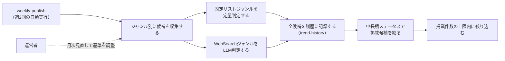

# 要件定義: ジャンル別情報源と採用基準

> ステータス: 仕様確認中(中長期トレンド対応は未実装)

## サマリ
19ジャンルの流行を「エンタメ編」(火曜配信)と「カルチャー・ライフスタイル編」(金曜配信)の2グループに分け、ジャンルごとの情報源から候補を収集する。公式ランキング・チャートを持つジャンルは定量的なコード判定、決まった集計元がないジャンルはWebSearchによるLLM判定で候補を集める(架空の話題は作らない)。集めた候補はすべて[trend-history](../trend-history/requirements.md)の履歴へ記録し、そこで判定された中長期ステータスがEMERGING/GROWING/ESTABLISHED/STABLEの候補だけを掲載対象にする。その回だけ動きがあった一過性の話題は掲載しない。詳細は「[ユースケース図](#ユースケース図)」参照。

## 概要
- 機能名: ジャンル別情報源と採用基準
- 目的: 19ジャンルの流行を、ジャンルの性質に応じた方法(定量判定・LLM判定)で収集し、継続履歴にもとづいて中長期トレンドと判定された話題だけを週2回選び出す
- 優先度: 高

## ユーザーストーリー
- 運営者として、ジャンルごとに信頼できる情報源(公式ランキング・チャート、または話題を報じる複数の情報源)から、実在する話題だけを収集してほしい
- 運営者として、その回だけ動きがあった一過性の話題ではなく、半月〜1ヶ月以上にわたって継続している中長期トレンドだけを掲載してほしい
- 運営者として、同じ話題を何度も同じ内容で載せるのは避けつつ、段階が進んだ(EMERGING→GROWINGなど)ときには続報として伝えたい
- 運営者として、動きがなかったジャンルは無理に埋めず、架空の話題や無理に絞り出したような薄い話題を掲載しないでほしい
- 運営者として、1回の配信量が多くなりすぎないよう、掲載件数に上限を設けてほしい

## ユースケース図

上記は俯瞰用の図。正となる文章は下記「機能要件」「ビジネスルール・制約」。

## 機能要件
- [1] 対象ジャンルを2グループ・19ジャンルに固定する(下記「グループとジャンル」)。固定リスト運用とし、記載以外のジャンルをエージェントが自律的に追加することはしない
- [2] エンタメ編は毎週火曜、カルチャー・ライフスタイル編は毎週金曜に、それぞれ独立して候補収集・選定を実行する(実行タイミングは[weekly-publish/requirements.md](../weekly-publish/requirements.md)に従う)
- [3] ジャンルごとに、下記「採用基準」に従って候補を収集する。収集した候補は採用・不採用を問わず全件を[trend-history/requirements.md](../trend-history/requirements.md)の履歴へ引き渡す(継続性の判定に不採用の候補も必要なため)
- [4] 収集した候補のうち、下記「中長期トレンドの絞り込み」を通過した候補があるジャンルだけを当該回の掲載対象にする。通過した候補が1件もないジャンルは、その回は掲載しない(架空の話題を作らない)
- [5] 1ジャンルにつき掲載するトピックは最大2件とする。候補が3件以上ある場合は、下記「ジャンル内の絞り込み」に従い上位2件に絞る
- [6] 1回の配信につき掲載する合計トピック数は最大10件とする。全ジャンルの候補を合算して10件を超える場合は、下記「配信全体の絞り込み」に従い絞る
- [7] 掲載する各トピックには、trend-historyが判定した中長期ステータス・継続日数・初回検知日・報告回数・地域情報を添えて[content-generation](../content-generation/requirements.md)へ引き渡す(記事に表示するため。[article-detail/requirements.md](../article-detail/requirements.md)参照)

## ビジネスルール・制約

### グループとジャンル
- [1] エンタメ編(火曜配信・9ジャンル): 音楽、日本映画、海外映画、日本ドラマ、海外ドラマ、アニメ、バラエティ、サブスク動画、書籍・漫画
- [2] カルチャー・ライフスタイル編(金曜配信・10ジャンル): SNSバズり、流行りの言葉、グルメ、流行りの趣味、ファッション、ガジェット・家電、ゲーム、旅行・観光、経済・お金、開発手法・開発サービス

### 選定方式
- [1] ジャンルは「固定リストジャンル」(公式ランキング・チャート等の決まった情報源を持ち、定量的なコード判定で採用可否を決める)と「WebSearchジャンル」(決まった集計元がなく、Claude Code CLIのWebSearchによる探索的収集とLLM判定で「動きがあったか」を決める)の2方式に分かれる(根拠: [consult](../../../.claude/skills/consult/SKILL.md)での壁打ちで、全ジャンルに同一の定量基準を事前設計するコストが過大と判断したため)
- [2] 固定リストジャンル: 音楽、日本映画、海外映画、海外ドラマ、アニメ、サブスク動画、書籍・漫画、流行りの言葉、ファッション、ガジェット・家電、ゲーム、旅行・観光
- [3] WebSearchジャンル: 日本ドラマ、バラエティ、SNSバズり、グルメ、流行りの趣味、経済・お金、開発手法・開発サービス
- [4] SNSバズり(X・Instagram・Threads・TikTok)は各社公式APIが有料のため直接利用せず、バズりを報じるニュースメディアの記事(二次情報源)をWebSearchで収集する(根拠: [content-selection/requirements.md#データ取得方法](#データ取得方法))
- [5] グルメは食べログ・Rettyの店舗ランキングAPIが有料プラン前提のため直接利用せず、話題の店を紹介するニュースメディアの記事をWebSearchで収集する

### ジャンルごとの情報源・採用基準(固定リストジャンル)
- [1] 音楽: Oricon週間チャート(無料公開範囲)・Billboard JAPAN Hot 100の公開ページを情報源とし、新規にランクインした、または前週から順位が大きく上昇した作品を候補にする
- [2] 日本映画・海外映画: 直近の週末興行収入ランキング記事・Filmarksの劇場公開作品ランキングを情報源とし、上位5位以内の作品を候補にする
- [3] 海外ドラマ・サブスク動画・アニメ: Netflix公式サイト「top10.netflix.com」の該当カテゴリ(シリーズ/映画/日本のTOP10)を情報源とし、新規にランクインした、または順位が上昇した作品を候補にする
- [4] 書籍・漫画: トーハン週間ベストセラー公式サイトのジャンル別ランキングを情報源とし、上位5位以内で新規にランクインした作品を候補にする
- [5] 流行りの言葉: Googleトレンド急上昇ワードページ・Yahoo!検索急上昇ワードランキングを情報源とし、上位に入った語のうち一過性の話題性がある語(固有名詞・時事性のある語)を候補にする
- [6] ファッション: WWD JAPANの新着記事・ZOZOTOWN人気ランキングを情報源とし、上位アイテム・新着のトレンド企画記事を候補にする
- [7] ガジェット・家電: 価格.com売れ筋ランキング・Engadget日本版の新着記事を情報源とし、上位ランクイン製品・新着記事で紹介された注目製品を候補にする
- [8] ゲーム: Steam売上ランキング公式ページ・ファミ通.com売上ランキングを情報源とし、上位ランクインの新作・話題作を候補にする
- [9] 旅行・観光: じゃらんnet・るるぶ&more!の人気ランキングページを情報源とし、上位ランクインのスポット・特集を候補にする

### ジャンルごとの情報源・採用基準(WebSearchジャンル)
- [1] 各ジャンルについてClaude Code CLIがWebSearchで話題を検索し、複数の独立した情報源(ニュースメディア・公式発表等)で同じ話題が言及されている場合に「動きがあった」と判定する。単一の情報源のみが報じている話題、または噂・未確認情報の域を出ない話題は候補にしない
- [2] 日本ドラマ・バラエティ: 放送・配信中の番組についての話題性のある報道(視聴率好調・SNSでの反響を報じる記事等)を検索する
- [3] SNSバズり: X・Instagram・Threads・TikTokでのバズりを報じるニュースメディアの記事を検索する(上記「選定方式」[4]参照)
- [4] グルメ: 話題の飲食店・食トレンドを紹介するニュースメディアの記事を検索する(上記「選定方式」[5]参照)
- [5] 流行りの趣味: 新しく話題になっているホビー・レジャーを紹介する記事を検索する
- [6] 経済・お金: 家計・投資(NISA等)に関する話題性のあるニュースを検索する
- [7] 開発手法・開発サービス: ソフトウェア開発の進め方(開発手法・チーム運営・設計の潮流)と、開発者が使うサービス・ツールについて、話題性のある記事を検索する。日次で配信している[ai-dev-digest](../../ai-dev-digest/content-selection/requirements.md)と扱う領域が重なるため、このジャンルでは個々のリリース・アップデートのニュースは候補にせず、複数の情報源が「開発の進め方・道具立てが変わりつつある」と論じている潮流だけを候補にする(同じ話題を日次と週次の両方で同じ粒度で伝えないため)

### 情報源の地域区分
- [1] 固定リストジャンルの各情報源に、日本の情報源か海外の情報源かの区分を持たせる([trend-history/requirements.md#地域情報](../trend-history/requirements.md)の日本での強度・海外での強度の判定に使う)
- [2] WebSearchジャンルは、候補を報じていた独立情報源のうち日本のメディアの数・海外のメディアの数をあわせて収集する(同上)

### 中長期トレンドの絞り込み
- [1] 収集した候補のうち、[trend-history/requirements.md#ステータス判定基準](../trend-history/requirements.md)が判定したステータスがEMERGING/GROWING/ESTABLISHED/STABLEのいずれかである候補だけを掲載対象にする。NEW・SHORT_TERM・DECLININGの候補は掲載しない(履歴には記録する)
- [2] この絞り込みは、下記「掲載済み話題の再掲抑制」「ジャンル内の絞り込み」「配信全体の絞り込み」より前に適用する(掲載できない候補が枠を占めないようにするため)
- [3] 運用開始直後は履歴が蓄積されておらず、すべての候補がNEWと判定されて掲載可能な候補が0件になる。この状態は異常ではなく、履歴が半月分ほど蓄積されるまでは記事が生成されない回が続くことを許容する(根拠: 一過性の話題を載せないことを優先するため。[weekly-publish/requirements.md](../weekly-publish/requirements.md)のスキップ扱いに従う)

### 掲載済み話題の再掲抑制
- [1] 過去に掲載済みのトピック(同一作品名・同一話題)は、前回掲載したときのステータスと今回のステータスが同じ場合は候補から除外する(同じ段階のまま同じ話題を繰り返し載せないため)
- [2] 前回掲載したときからステータスが変わっている場合(例: EMERGING→GROWING、GROWING→ESTABLISHED)は、続報として再掲してよい。再掲する場合の本文は、前回掲載時から何が変わったか(段階の進行・強度の推移)を含む内容にし、前回と同じ内容を繰り返さない(具体的な執筆ルールは[content-generation/requirements.md](../content-generation/requirements.md)に従う)
- [3] 再掲する場合は、その話題が通算で何回目の掲載かを[trend-history/requirements.md#掲載実績の追跡](../trend-history/requirements.md)から取得し、トピックに添える(読者が同じ話題の段階の進行を追えるようにするため。表示は[article-detail/requirements.md](../article-detail/requirements.md))
- [4] 同一話題かどうかの判定は、trend-historyが履歴の同一性判定に使うものと同じ正規化ルール(前後の空白除去・全角/半角の統一・英字の大文字小文字統一)で行う

### ジャンル内の絞り込み(1ジャンル最大2件)
- [1] 固定リストジャンルは、採用基準を満たす候補のうち順位が高い(またはランキング上昇幅が大きい)上位2件を採用する
- [2] WebSearchジャンルは、言及している情報源の数が多い上位2件を採用する

### 配信全体の絞り込み(1回最大10件)
- [1] 各ジャンルの候補を合算して10件を超える場合、まず全ジャンルの1件目(最有力候補)を優先して残し、次に2件目を情報源の信頼性が高い順(固定リストジャンル→WebSearchジャンル)に残りの枠へ追加する

### データ取得方法
- [1] 各情報源の取得は、公式サイト・公開ページの閲覧・WebSearchの範囲にとどめ、非公式API・認証回避・利用規約の想定を超えた高頻度アクセスは行わない(ai-dev-digestと同じ方針)

### 情報源の健全性監視
- [1] 週次実行のログに、ジャンルごとに「収集した候補件数(取得失敗はその旨)」を出力する(ai-dev-digestと同じ方針)。候補件数が0件の状態が慢性的に続くジャンルは、[source-review/requirements.md](../source-review/requirements.md)の月次見直しで情報源・基準の妥当性を確認する
- [2] あわせて、収集はできたが中長期トレンドの絞り込みを通過しなかった候補の件数も出力する。候補は取れているのに掲載可能な候補が慢性的に0件のジャンルは、月次見直しでステータス判定の閾値([trend-history/requirements.md](../trend-history/requirements.md))の妥当性を確認する

## 依存関係
- 収集した全候補は[trend-history/requirements.md](../trend-history/requirements.md)の履歴へ記録され、掲載可否・再掲可否・報告回数の判定はそのステータス・掲載実績に従う
- 選定されたトピックは[article-detail/requirements.md](../article-detail/requirements.md)で表示される
- 選定候補の翻訳・要約は[content-generation/requirements.md](../content-generation/requirements.md)のルールに従って行われる
- 情報源・採用基準・ステータス判定の閾値の変更は[source-review/requirements.md](../source-review/requirements.md)の月次見直しでのみ行う
- 収集・選定の実行タイミングは[weekly-publish/requirements.md](../weekly-publish/requirements.md)に従う

## スコープ外
- プラットフォームを横断した統合スコアによるランキング化
- ジャンルへの新規情報源の自動発掘(固定リスト運用)
- X(Twitter)・Instagram・Threads・TikTokの公式APIを使った直接取得
- 食べログ・Rettyの有料API連携
- ジャンルをまたぐ話題の関連性フィルタ(ai-dev-digestの[12]相当。各ジャンルの情報源自体がジャンルに特化しているため、今回は不要と判断)
- 候補の収集頻度を週1回/ジャンルより細かくすること(継続日数は日数で測るため、週1回の観測でも判定が成立する。実行コストを増やさない判断)
- ステータスごとの掲載件数の割り当て(例: ESTABLISHEDを必ず何件載せる)。絞り込みは従来どおり強度順とする
