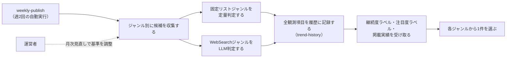

# 要件定義: ジャンル別情報源と採用基準

> ステータス: 仕様確認中(情報源の見直しと継続度・注目度対応は未実装)

## サマリ
19ジャンルの流行を「エンタメ編」(火曜配信)と「カルチャー・ライフスタイル編」(金曜配信)の2グループに分け、ジャンルごとの情報源から項目を収集する。実際の消費・行動を集計した客観データ(売上・視聴率・興行収入・チャート順位・検索ボリューム等)が存在するジャンルは定量的なコード判定、存在しないジャンルはWebSearchによるLLM判定(独立した言及の広がりを基準にする)を行う(架空の話題は作らない)。取得した項目は採用基準の判定前の全件を[trend-history](../trend-history/requirements.md)の履歴へ記録し、そこで判定された継続度ラベル・注目度ラベル・掲載実績を使って、各ジャンルから1件ずつを選んで掲載する。継続が半月に満たない話題しかないジャンルもその旨を添えて掲載し、ジャンルが回によって記事から消えないようにする。詳細は「[ユースケース図](#ユースケース図)」参照。

## 概要
- 機能名: ジャンル別情報源と採用基準
- 目的: 19ジャンルの流行を、ジャンルの性質に応じた方法(定量判定・LLM判定)で収集し、継続履歴にもとづく継続度・注目度を添えて、各ジャンルから1件ずつを週2回選び出す
- 優先度: 高

## ユーザーストーリー
- 運営者として、ジャンルごとに信頼できる情報源(公式ランキング・チャート、または話題を報じる複数の情報源)から、実在する話題だけを収集してほしい
- 運営者として、どのジャンルも毎回必ず1件は掲載し、そのうえで半月以上続いている話題かどうかが一目で分かるようにしてほしい
- 運営者として、同じ話題を何度も繰り返し載せるのは避け、なるべく目新しい話題を紹介してほしい
- 運営者として、情報源から何も取得できなかったジャンルに架空の話題を作らせず、取得できなかったことを明示してほしい

## ユースケース図

上記は俯瞰用の図。正となる文章は下記「機能要件」「ビジネスルール・制約」。

## 機能要件

> 用語: 情報源から取得した項目のうち、下記「採用基準」を満たしたものを「**候補**」と呼ぶ。採用基準の判定前の全件は「**観測項目**」と呼び、区別する。
- [1] 対象ジャンルを2グループ・19ジャンルに固定する(下記「グループとジャンル」)。固定リスト運用とし、記載以外のジャンルをエージェントが自律的に追加することはしない
- [2] エンタメ編は毎週火曜、カルチャー・ライフスタイル編は毎週金曜に、それぞれ独立して候補収集・選定を実行する(実行タイミングは[weekly-publish/requirements.md](../weekly-publish/requirements.md)に従う)
- [3] ジャンルごとに、情報源から項目を取得する。取得した項目は、下記「採用基準」を満たすかどうかを**判定する前の全件**(情報源ごとに上位30件まで)を[trend-history/requirements.md#機能要件](../trend-history/requirements.md)の履歴へ引き渡す。採用基準を満たしたかどうかも添えて引き渡す
- [4] 下記「採用基準」は、取得した項目のうち**その回の掲載候補にするもの**を選ぶために使う。履歴に記録するかどうかの判断には使わない(採用基準を記録の条件にすると、上位に居続けている作品は動きがあった週しか記録されず、人気が定着している作品ほど「言及が途絶えた」と判定されてしまうため。[trend-history/requirements.md#機能要件](../trend-history/requirements.md)-4)
- [5] 各ジャンルから1件ずつを掲載する(下記「掲載件数」「掲載する話題の選び方」)。候補が複数あるジャンルは並べ替えて最上位の1件を選び、情報源から項目が取得できなかったジャンルは取得できなかった旨を掲載する
- [6] 掲載する各トピックには、trend-historyが判定した継続度ラベル・注目度ラベル・継続日数・報告回数・地域情報を添えて[content-generation](../content-generation/requirements.md)へ引き渡す(記事に表示するため。[article-detail/requirements.md](../article-detail/requirements.md)参照)

## ビジネスルール・制約

### グループとジャンル
- [1] エンタメ編(火曜配信・9ジャンル): 音楽、日本映画、海外映画、日本ドラマ、海外ドラマ、アニメ、バラエティ、サブスク動画、書籍・漫画
- [2] カルチャー・ライフスタイル編(金曜配信・10ジャンル): SNSバズり、流行りの言葉、グルメ、流行りの趣味、ファッション、ガジェット・家電、ゲーム、旅行・観光、経済・お金、開発手法・開発サービス

### 選定方式
- [1] ジャンルは「固定リストジャンル」(実際の消費・行動を集計した客観データ――売上・視聴率・興行収入・チャート順位・検索ボリューム等――を公式または業界団体が構造化データとして公開しており、コードで機械的に定量判定できる)と「WebSearchジャンル」(そうした客観集計データが存在せず、Claude Code CLIのWebSearchによる探索的収集とLLM判定で「独立した言及が広がっているか」を判定する)の2方式に分かれる(根拠: [consult](../../../.claude/skills/consult/SKILL.md)での壁打ちで、18ジャンル全てに同一の定量基準を事前設計するコストが過大と判断したため)
- [2] 固定リストジャンル: 音楽、日本映画、海外映画、日本ドラマ、海外ドラマ、アニメ、バラエティ、サブスク動画、書籍・漫画、流行りの言葉、ゲーム、旅行・観光
- [3] WebSearchジャンル: SNSバズり、グルメ、流行りの趣味、ファッション、ガジェット・家電、経済・お金、開発手法・開発サービス
- [4] 単一メディアの特集・紹介記事(編集部のキュレーション)は、それ自体を客観データの代用として固定リスト化しない。実際の売上・視聴・検索行動の集計値を伴わないジャンルは、WebSearchジャンルとして下記「ジャンルごとの情報源・採用基準(WebSearchジャンル)」の独立言及基準に従う(ファッション・ガジェット家電が固定リストでなくWebSearchジャンルである理由)
- [5] SNSバズり(X・Instagram・Threads・TikTok)は各社公式APIが有料のため直接利用せず、バズりを報じるメディア記事・口コミの広がりをWebSearchで収集する(根拠: [content-selection/requirements.md#データ取得方法](#データ取得方法))
- [6] グルメは食べログ・Rettyの店舗ランキングAPIが有料プラン前提のため直接利用せず、飲食店・食トレンドについての独立した言及の広がりをWebSearchで収集する

### ジャンルごとの情報源・採用基準(固定リストジャンル)
- [1] 音楽: Billboard JAPAN Hot 100の公開ページ(実売上・ストリーミング数集計)を情報源とし、新規にランクインした、または前週から順位が大きく上昇した作品を候補にする(Oricon週間チャートは順位データがページ内に構造化されておらず機械判定できないため情報源から除外する)
- [2] 日本映画・海外映画: 興行通信社「CINEMAランキング通信」(業界公式の興行収入集計機関)を主たる情報源とし、映画.com国内/全米ランキング・Filmarks上映中ランキングを補助情報源として、直近の週末興行収入上位5位以内の作品を候補にする
- [3] 日本ドラマ・バラエティ: ビデオリサーチの視聴率データ速報(日本唯一の全国視聴率調査会社の公式データ)を情報源とし、当該週の視聴率上位番組、または前週から視聴率が大きく上昇した番組を候補にする
- [4] 海外ドラマ・サブスク動画・アニメ: Netflix公式の構造化データ(`netflix.com/tudum/top10/data/all-weeks-countries.tsv`、週次更新の実視聴データ)の該当カテゴリ(シリーズ/映画/日本のTOP10)を情報源とし、新規にランクインした、または順位が上昇した作品を候補にする
- [5] 書籍・漫画: トーハン・日販(出版取次2強)それぞれの週間ベストセラー公式ページを情報源とし、いずれかで上位5位以内にランクインした作品を候補にする(2社の値が食い違う場合は両社の順位を候補のnoteに残し、より上位の順位を採用する)
- [6] 流行りの言葉: Google公式のトレンドRSSフィード(`trends.google.com/trending/rss?geo=JP`、実検索ボリュームの集計データ)を情報源とし、掲載された語のうち一過性の話題性がある語(固有名詞・時事性のある語)を候補にする
- [7] ゲーム: Steam公式Web API(`ISteamChartsService/GetMostPlayedGames`、実プレイヤー数集計)・ファミ通.com売上ランキングを情報源とし、上位ランクインの新作・話題作を候補にする
- [8] 旅行・観光: じゃらんnet人気ランキング(実際の予約・閲覧データに基づく集計)を情報源とし、上位ランクインのスポットを候補にする

### ジャンルごとの情報源・採用基準(WebSearchジャンル)
- [1] 各ジャンルについてClaude Code CLIがWebSearchで話題を検索し、性質の異なる複数の独立した言及元(ニュースメディアの記事、SNS上での言及、口コミ・レビューサイトでの評判増加等)で同じ話題が独立に言及されている場合にのみ「動きがあった」と判定する。単一の情報源のみが報じている話題、広告・PR記事1本のみが取り上げている話題、または噂・未確認情報の域を出ない話題は候補にしない(根拠: 特定の編集部の紹介記事1本を「流行」と誤認しないため。1メディアの特集記事は「独立した言及」の1件としてのみ数え、それだけで採用しない)
- [2] 独立した言及とみなす最低件数(`minIndependentSources`)は、ニュース性の高い話題(単発の事故・不祥事・統計発表等)を誤って採用しないよう、既定で3件以上とする(criteria.jsonでジャンルごとに調整可能。詳細は[design.md](design.md)参照)
- [3] 検索の切り口(searchHints)は、単発ニュースではなく自然発生的な広がり(SNSでの言及・口コミの増加・複数の一般ユーザーの発信)を捉える表現にする。「◯◯を紹介する記事を検索する」のような編集記事狙いの表現は使わない
- [4] SNSバズり: X・Instagram・Threads・TikTokでの投稿・反響が複数のニュースメディア・まとめメディアで独立に言及されている話題を検索する(上記「選定方式」[5]参照)
- [5] グルメ: SNS・口コミで自然発生的に言及が増えている飲食店・食トレンドを検索する。特集記事・PR記事のみが取り上げている店は候補にしない(上記「選定方式」[6]参照)
- [6] 流行りの趣味: 新しく話題になっているホビー・レジャーについて、複数の独立した言及を検索する
- [7] ファッション: SNS・口コミで言及が増えているアイテム・トレンドを検索する(WWD JAPAN・ZOZOTOWN等の特定サイトの特集記事のみに依拠しない)
- [8] ガジェット・家電: SNS・口コミで言及が増えている製品・トレンドを検索する(特定メディアの紹介記事のみに依拠しない)
- [9] 経済・お金: 家計・投資に関する単発ニュース(統計発表・制度改正等)ではなく、流行っている節約術・クーポン・サービス等、複数の独立した言及があるものを検索する
- [10] 開発手法・開発サービス: ソフトウェア開発の進め方(開発手法・チーム運営・設計の潮流)と、開発者が使うサービス・ツールについて、複数の独立した言及を検索する。日次で配信している[ai-dev-digest](../../ai-dev-digest/content-selection/requirements.md)と扱う領域が重なるため、このジャンルでは個々のリリース・アップデートのニュースは候補にせず、複数の情報源が「開発の進め方・道具立てが変わりつつある」と論じている潮流だけを候補にする(同じ話題を日次と週次の両方で同じ粒度で伝えないため)

### 情報源の地域区分
- [1] 固定リストジャンルの各情報源に、日本の情報源か海外の情報源かの区分を持たせる([trend-history/requirements.md#地域情報](../trend-history/requirements.md)の日本での強度・海外での強度の判定に使う)
- [2] WebSearchジャンルは、候補を報じていた独立情報源のうち日本のメディアの数・海外のメディアの数をあわせて収集する(同上)

### 掲載件数
- [1] 各ジャンルから必ず1件を掲載する。継続度ラベルが「流行前」(継続が半月に満たない)の話題しかないジャンルでも掲載する([trend-history/requirements.md#継続度ラベル](../trend-history/requirements.md))。ジャンルが回によって記事から消えると、読者がそのジャンルの動向を追えなくなるため
- [2] 1回の配信で掲載する件数は、その編のジャンル数と同じになる(エンタメ編9件・カルチャー・ライフスタイル編10件)。1回あたりの合計件数の上限は設けない
- [3] 情報源から項目が1件も取得できなかったジャンルは、ジャンルの見出しは出したうえで「今回は情報源から話題を取得できませんでした」と明示する。架空の話題を作らないという方針を守りつつ、ジャンルが黙って消えないようにするため

### 掲載する話題の選び方
候補が複数あるジャンルでは、次の順に見て最も上位の1件を掲載する。

- [4] まず、過去に一度も掲載したことがない話題を、掲載したことがある話題より優先する(なるべく目新しい話題を紹介するため)
- [5] 過去に掲載したことがない話題どうしでは、継続度ラベルが高い順に選ぶ。同じ継続度なら注目度ラベルが高い順、それも同じならその回の強さが上位の順とする
- [6] 過去に掲載したことがある話題どうしでは、注目度ラベルが高い順に選ぶ。同じ注目度なら継続度ラベルが高い順、それも同じなら掲載回数が少ない順とする。掲載済みの話題で注目度を先に見るのは、何度も紹介した話題は今あらためて強くなっているときだけ再び載せたいため
- [7] 同じ話題が過去にも掲載されている場合は、通算で何回目の掲載かを記事に添える([trend-history/requirements.md#掲載実績の追跡](../trend-history/requirements.md))。本文は前回掲載時から何が変わったかを含む内容にし、前回と同じ内容を繰り返さない(執筆ルールは[content-generation/requirements.md](../content-generation/requirements.md)に従う)
- [8] 同一の話題かどうかの判定は、trend-historyが履歴の同一性判定に使うものと同じ正規化ルールで行う。「同じ作品・シリーズの別の話題」は同一とみなさない(作品名の部分一致などで判定すると、別作品を同一視する誤判定が起きるため)

### データ取得方法
- [1] 各情報源の取得は、公式サイト・公開ページの閲覧、公式が提供する構造化データ・Web API(Netflix公式データ、Google公式トレンドRSS、Steam公式Web API等)の利用、およびWebSearchの範囲にとどめ、非公式API・認証回避・利用規約の想定を超えた高頻度アクセスは行わない(ai-dev-digestと同じ方針)
- [2] 公開ページを取得する際は、一般的なブラウザのUser-Agentを付与してよい(Bot判定回避目的の偽装ではなく、User-Agent未設定を理由に一律ブロックするサイトへの通常アクセスのため)。文字コードはページのContent-Type/meta指定に従って正しく変換する

### 情報源の健全性監視
- [1] 週次実行のログに、ジャンルごとに「収集した候補件数(取得失敗はその旨)」を出力する(ai-dev-digestと同じ方針)。候補件数が0件の状態が慢性的に続くジャンルは、[source-review/requirements.md](../source-review/requirements.md)の月次見直しで情報源・基準の妥当性を確認する
- [2] あわせて、ジャンルごとに「掲載する話題を採用基準を満たした候補から選んだか、採用基準に届かなかった観測項目から選んだか」を出力する。観測項目から選ぶ状態が慢性的に続くジャンルは、情報源か採用基準のどちらかが実態に合っていないため、月次見直しで妥当性を確認する

## 依存関係
- 収集した全観測項目は[trend-history/requirements.md](../trend-history/requirements.md)の履歴へ記録され、掲載する話題の並べ替えと報告回数はそこで判定された継続度ラベル・注目度ラベル・掲載実績に従う
- 選定されたトピックは[article-detail/requirements.md](../article-detail/requirements.md)で表示される
- 選定候補の翻訳・要約は[content-generation/requirements.md](../content-generation/requirements.md)のルールに従って行われる
- 情報源・採用基準・継続度/注目度の判定に使う値の変更は[source-review/requirements.md](../source-review/requirements.md)の月次見直しでのみ行う
- 収集・選定の実行タイミングは[weekly-publish/requirements.md](../weekly-publish/requirements.md)に従う

## スコープ外
- プラットフォームを横断した統合スコアによるランキング化
- ジャンルへの新規情報源の自動発掘(固定リスト運用)
- X(Twitter)・Instagram・Threads・TikTokの公式APIを使った直接取得
- 食べログ・Rettyの有料API連携
- ジャンルをまたぐ話題の関連性フィルタ(ai-dev-digestの[12]相当。各ジャンルの情報源自体がジャンルに特化しているため、今回は不要と判断)
- 候補の収集頻度を週1回/ジャンルより細かくすること(継続日数は日数で測るため、週1回の観測でも判定が成立する。実行コストを増やさない判断)
- 継続度ラベルごとの掲載件数の割り当て(例: 「非常に話題」を必ず何件載せる)
- 強度が増えているか減っているかの傾向による絞り込み([trend-history/requirements.md](../trend-history/requirements.md)のスコープ外に従い、今回は行わない)
