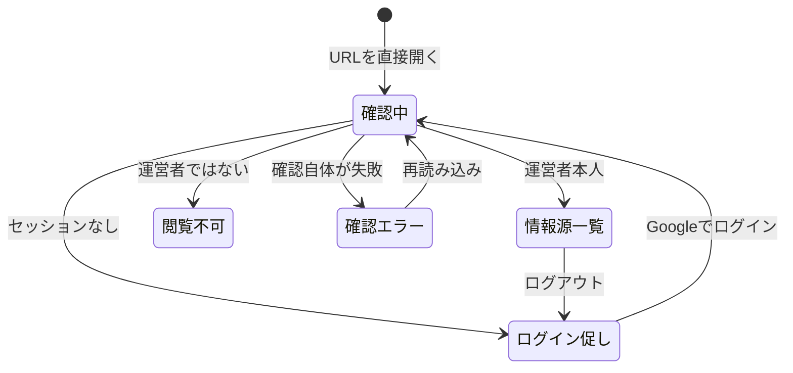

# 設計: 情報源一覧(運営者専用)

## サマリ
`/trend-digest/admin/sources`に、ジャンルごとの情報源・採用基準を1枚の表で表示する運営者専用ページを追加する。表示する内容は選定が実際に読み込んでいる`content/trend-digest/watchlist.json`・`content/trend-digest/criteria.json`([content-selection/design.md](../content-selection/design.md)「データ設計」)をビルド時に読み込んで組み立て、このページ用のデータを別に持たない(requirements.md#機能要件-5)。ログイン判定は既存の管理画面(`app/ikukyu/admin`・`app/life-money-sim/admin`)と同じGoogle OIDC + `admin_emails`許可リストのパターンをそのまま流用し、運営者本人と判定できた場合のみ表を表示する。表示専用で、このページからの編集・保存は一切行わない(requirements.md#表示する内容の範囲-5)。主要な設計判断は「[採用基準を日本語にする処理](#採用基準を日本語にする処理)」(基準の値から表示文を導出し二重管理しない)と「[セキュリティ](#セキュリティ)」(静的配信での表示制御の範囲)。画面の状態は「[画面遷移図](#画面遷移図)」参照。

## 処理フロー

### 表示する行を組み立てる処理
- 対象: `content/trend-digest/watchlist.json`・`content/trend-digest/criteria.json`
- 手順:
  1. ウォッチリストの全ジャンルを読み込む。ジャンルごとに、編・日本語のジャンル名・選定方式・情報源の一覧(名前・URL・地域区分)または検索の手がかりを取り出す
  2. 採用基準は、同じジャンルの採用基準の定義から下記「採用基準を日本語にする処理」で表示用の文言を組み立てる
  3. 行を、エンタメ編が先・カルチャー・ライフスタイル編が後になるように並べ、編の中では記事の見出し表示順(`GENRE_ORDER`。[article-detail/design.md](../article-detail/design.md)「前提: 記事データの形式」)と同じ順に並べる(requirements.md#表示の順序-6)
  4. 組み立てた行の一覧を、ビルド時に決まる静的な値として画面へ渡す。実行時にファイルを読み直したり、APIへ問い合わせたりはしない(サーバーを持たない静的配信の構成のため)
- 関連するビジネスルール: requirements.md#機能要件-1、requirements.md#機能要件-2、requirements.md#機能要件-3、requirements.md#機能要件-5、requirements.md#表示の順序-6

### 採用基準を日本語にする処理
- 対象: ジャンル1件分の採用基準の定義
- 手順:
  1. 固定リストジャンルで「上位何位以内か」だけが定められている場合は「上位◯位以内」と表す
  2. 固定リストジャンルで「新規ランクインまたは順位上昇」だけが定められている場合は「新規ランクイン、または順位上昇」と表す。あわせて「大きく上昇」とみなす順位の改善幅が定められている場合は、その幅も添えて「新規ランクイン、または順位が◯位以上上昇」と表す
  3. 固定リストジャンルで両方が定められている場合は、両方を満たす必要があることが分かるように「上位◯位以内、かつ新規ランクインまたは順位上昇」と表す
  4. WebSearchジャンルは「独立した言及元が◯件以上」と表す
  5. 文言はいずれも採用基準の定義から導出し、ジャンルごとの表示文をこのページに直接書き込まない(基準を変えたときにこのページだけ古くなることを防ぐため。requirements.md#機能要件-5)
- 関連するビジネスルール: requirements.md#機能要件-4、requirements.md#機能要件-5

### ログイン状態に応じて表示を切り替える処理
- 対象: Supabase Authのログインセッション
- 手順:
  1. ページ表示時に現在のログインセッションを取得する(`app/lib/adminAuth.ts`の`getSession`)
  2. セッションがない場合はログインを促す画面を表示し、表は表示しない(requirements.md#閲覧できる人-1)
  3. セッションがある場合は、運営者本人かどうかを`isAuthorizedAdmin()`(`admin_emails`テーブルのSELECT。RLSにより自分の行のみ返る)で確認する。許可対象と判定された場合のみ表を表示する
  4. 確認中は表を表示しない(確認が終わるまで「未許可」として扱う)。確認自体が失敗した場合は、表を表示せずエラーである旨を画面に示す(記事ページのフィードバック欄と違い、このページは表の閲覧そのものが目的であり、黙って何も出さないと運営者が原因を判断できないため)
  5. ログイン状態の変化(ログイン完了・ログアウト)を購読し(`onAuthChange`)、変化のたびに1〜4を再実行する
- **DBの読み取り(SELECT)は`admin_emails`に対してのみ行う**。このページは他のテーブルを読まない
- 関連するビジネスルール: requirements.md#閲覧できる人-1、requirements.md#閲覧できる人-3

## エラーハンドリング

- ウォッチリスト・採用基準のJSONが読み込めない、または形式を満たさない場合は、**ビルド時(`next build`)に例外として検知させ、ビルドを失敗させる**([content-selection/design.md](../content-selection/design.md)のデータ設計が定める形式の検証を、記事データと同じくビルド時に行う)。壊れた設定のまま週次実行と画面の両方が動き続ける状態を作らないため
- ログイン確認(`isAuthorizedAdmin()`)が通信エラー等で失敗した場合は、表を表示せず「確認できませんでした」と分かる表示にとどめ、再読み込みで再試行できるようにする。失敗の詳細はブラウザのコンソールにのみ出す(処理フロー手順4)
- 情報源のURLが実際に生きているかどうかはこのページでは確認しない(死活監視はrequirements.md#スコープ外。取得失敗の検知は[content-selection](../content-selection/requirements.md)の実行ログが担う)

## 関連するファイル(抜粋)

```
app/trend-digest/admin/sources/page.tsx (新規: ログイン判定と表の表示)
app/trend-digest/admin/sources/components/SourceTable.tsx (新規: 1枚の表の描画)
app/trend-digest/lib/buildSourceDirectory.ts (新規: watchlist.json・criteria.jsonから表示行を組み立てる純粋関数)
app/trend-digest/lib/watchlistTypes.ts (既存: WatchlistEntry・Criteriaの型を利用。本specでは再定義しない)
app/trend-digest/lib/types.ts (既存: Edition/Genre/GENRE_ORDER/GENRE_LABELSを利用)
content/trend-digest/watchlist.json (既存: 表示元データ。本specは読み取りのみ)
content/trend-digest/criteria.json (既存: 表示元データ。本specは読み取りのみ)
app/lib/adminAuth.ts (既存の共通処理を利用: getSession / signInWithGoogle / signOut / isAuthorizedAdmin / onAuthChange)
app/ikukyu/admin/components/LoginScreen.tsx (既存: ログイン画面の表示パターンを参考にする。共通化はしない)
app/sitemap.ts (既存: `/**/admin/**`を除外する既存ルールがそのまま適用されるため変更不要)
```

`buildSourceDirectory.ts`は入出力が純粋なデータ(ウォッチリスト・採用基準→表示行)のみのため、通常のvitestで完全にテストできる。`SourceTable.tsx`はpropsから表を描くだけの表示コンポーネントとして、Testing Libraryで描画結果を検証する。`page.tsx`のログイン判定は既存の管理画面と同じ`adminAuth.ts`を使うため、本specでは判定ロジック自体のテストを重複して持たない。

## 画面設計

新しい画面だが、既存の運営者専用画面(`app/ikukyu/admin`・`app/life-money-sim/admin`)と同じ「ログイン画面 → 1枚の表」の構成をそのまま踏襲し、配色・余白はtrend-digestの既存トークン(`app/trend-digest/styleguide`)の範囲に収める。新しいビジュアルの体系は起こさないため、UIデザインの確定(Step0)は行わない。

- ページ見出し(「情報源一覧」)と、表示専用である旨の短い説明(このページからは編集できず、変更は月次見直しのPRで行うこと)
- 1枚の表。列は「ジャンル」「編」「選定方式」「採用基準」「情報源」(requirements.md#機能要件-1)
  - ジャンル: 日本語のジャンル名(`GENRE_LABELS`)
  - 編: 「エンタメ編」または「カルチャー・ライフスタイル編」
  - 選定方式: 「固定リスト」または「WebSearch」
  - 採用基準: 上記「採用基準を日本語にする処理」で組み立てた文言
  - 情報源: 固定リストジャンルは情報源ごとに、名前(元URLへのリンク、新規タブで開く)と地域区分(日本/海外)を並べる。複数ある場合はすべて表示する(requirements.md#機能要件-2)。WebSearchジャンルは固定の情報源を持たないため、検索の手がかりとして登録されている語を並べる(requirements.md#機能要件-3)
- 行はエンタメ編9ジャンルが先、カルチャー・ライフスタイル編10ジャンルが後(requirements.md#表示の順序-6)
- 画面下部: ログイン中のメールアドレスとログアウトボタン(既存の管理画面と同じ表示パターン)
- 他の画面からこのページへのリンクは置かない(requirements.md#閲覧できる人-2)。パンくず・ナビゲーションからも辿れない状態を保つ
- 横幅の狭い画面では、表を横スクロールできるようにする(列を落とすと情報源と基準の対応が読めなくなるため)

### 画面遷移図
俯瞰用の図。正となる文章は上記の箇条書きと「[ログイン状態に応じて表示を切り替える処理](#ログイン状態に応じて表示を切り替える処理)」の手順。



## コンポーネント設計

| コンポーネント | Props | 役割 |
|---|---|---|
| SourceTable | `rows: SourceDirectoryRow[]` | ジャンルごとの1行を並べた表の描画(表示のみ。データの組み立ては行わない) |

`SourceDirectoryRow`(`buildSourceDirectory.ts`が返す型)は、ジャンルの日本語名・編の日本語名・選定方式の日本語名・採用基準の表示文・情報源の一覧(名前・URL・地域区分の日本語名)または検索の手がかりの一覧を持つ。画面側で値の加工をしないよう、表示に使う文言はすべてこの型の時点で確定させる。

## 状態管理

- 画面の状態(確認中 / ログイン促し / 閲覧不可 / 情報源一覧 / 確認エラー)は、ページのトップレベルコンポーネントで`useState`保持する(既存の`app/ikukyu/admin/page.tsx`の`Phase`と同じ持ち方)
- 表示する行はビルド時に確定する静的な値のため、状態として持たない

## セキュリティ

- 表示するのは`watchlist.json`・`criteria.json`の内容であり、個人情報・機微情報・資格情報は含まない。このページはDBのうち`admin_emails`のSELECTのみを行い、他のテーブルを読まない
- **静的配信の構成では、ログイン判定は画面の表示制御であってデータの秘匿ではない**。このページの表は静的エクスポートの成果物に含まれるため、ログインしていない訪問者がページのソースを直接読めば内容自体は取得できる。それでも要件(requirements.md#閲覧できる人-1)を満たすとみなすのは、表示元の`watchlist.json`・`criteria.json`が公開リポジトリにコミットされた既に公開済みのデータであり、このページが新たに秘密を配信するわけではないため。要件の意図は「読者向けの導線を作らず、運営者だけが使う画面にする」ことであり、それは表示制御と導線を置かないこと(requirements.md#閲覧できる人-2)で満たせる。秘匿が必要な情報をこのページに足さないこと自体を制約として守る
- このページからの書き込み(編集・保存)は一切実装しない(requirements.md#表示する内容の範囲-5)。設定の変更は[source-review](../source-review/requirements.md)の月次見直しPRのレビューを経てのみ行う
- 情報源のURLはウォッチリストに登録された値をそのままリンクにするため、`http`/`https`以外のスキームを弾く(`javascript:`等のリンクが生成されないようにする。[article-detail/design.md](../article-detail/design.md)の`sourceUrl`と同じ扱い)。外部サイトへのリンクは新規タブで開き、`rel`に`noopener`を付ける
- サイトマップは既存の`/**/admin/**`除外ルール([hub-site/requirements.md](../../hub-site/requirements.md))によりこのページを含まない。検索結果からの流入導線ができないようにするため

## ログ

- このページは読み取り専用の表示であり、運営者の操作を記録する必要がないため、画面からのログ出力は行わない(静的配信でサーバーを持たず、ブラウザのログを運営者が収集できないのは他のtrend-digestの画面と同じ)
- ログイン確認(`isAuthorizedAdmin()`)が失敗した場合のみ、原因究明用にブラウザのコンソールへエラー内容を出す(画面には「確認できませんでした」とだけ伝える)
- ウォッチリスト・採用基準のスキーマ違反はビルド時に例外としてCIのログに出力される(`next build`の標準エラー出力)
