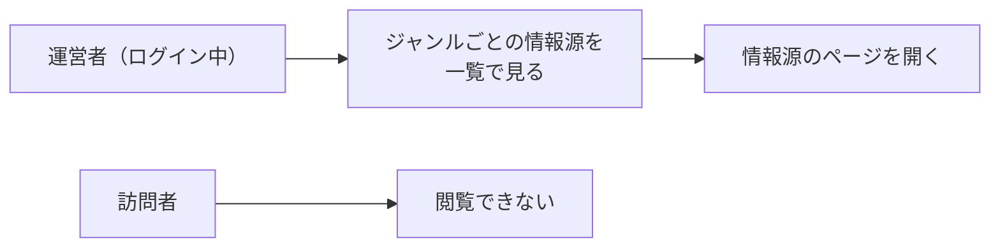

# 要件定義: 情報源一覧(運営者専用)

> ステータス: 仕様確認中(未実装)

## サマリ
trend-digestがジャンルごとにどこから話題を集めているかを、運営者本人だけが1枚の表で確認できるページ。ジャンル・編・選定方式・採用基準・情報源(名前・リンク・地域区分)を並べ、情報源の見直し([source-review](../source-review/requirements.md))のときに「今どうなっているか」を仕様書を開かずに把握できるようにする。表示専用で、このページから情報源を編集することはしない。詳細は「[ユースケース図](#ユースケース図)」参照。

## 概要
- 機能名: 情報源一覧(運営者専用)
- 目的: ジャンルごとの情報源・採用基準の現状を、運営者が1画面で確認できるようにする
- 優先度: 中

## ユーザーストーリー
- 運営者として、どのジャンルがどこを情報源にしているかを一覧で確認したい(月次の見直しで、どの情報源を変えるか判断するため)
- 運営者として、ジャンルごとの採用基準(上位何位以内か、言及元が何件以上か)も一緒に見たい(情報源と基準はセットで妥当性を判断するため)
- 運営者として、情報源のリンクからその場で実際のページを開いて、まだ生きているか確認したい

## ユースケース図

上記は俯瞰用の図。正となる文章は下記「機能要件」「ビジネスルール・制約」。

## 機能要件
- [1] 対象ジャンルの全件を1つの表として表示する。表の列は「ジャンル」「編」「選定方式」「採用基準」「情報源」とする
- [2] 情報源の列には、その情報源の名前と、実際のページへのリンク、地域区分(日本/海外)を表示する。1つのジャンルに情報源が複数ある場合はすべて表示する
- [3] WebSearchで話題を集めるジャンルは固定の情報源を持たないため、情報源の列には検索の手がかりとして登録されている語を表示する
- [4] 採用基準の列には、そのジャンルが候補を採用する条件を日本語で表示する(「上位5位以内」「新規ランクインまたは順位上昇」「独立した言及元が3件以上」など)
- [5] 表示する内容は、選定が実際に使っている設定([content-selection/requirements.md](../content-selection/requirements.md)が定めるジャンル別の情報源・採用基準の定義)から組み立てる。このページ用に内容を別途持たない

## ビジネスルール・制約

### 閲覧できる人
- [1] このページは運営者本人がログインしているときのみ表示する。ログインしていない訪問者には内容を表示しない(情報源の構成は選定ロジックの内部情報であり、読者に向けて公開する目的の機能ではないため)
- [2] 他の画面からこのページへのリンクは置かず、運営者がURLを直接開いて利用する(読者の目に触れる導線を作らないため)
- [3] ログインの判定は、trend-digestの他の運営者専用機能(記事詳細ページのフィードバック入力欄)と同じ仕組みに従う

### 表示する内容の範囲
- [4] 表示するのは情報源と採用基準の構成のみとする。各回の掲載結果・継続度・注目度はこのページには表示しない(記事ページと実行ログで確認できるため、同じ情報を複数の場所で持たない)
- [5] このページから情報源・採用基準を編集することはできない。変更は[source-review](../source-review/requirements.md)の月次見直しで、PRのレビューを経て行う(設定の変更は以後の全記事の方向性を左右するため、画面から直接変えられないようにする)

### 表示の順序
- [6] 表の行はエンタメ編を先に、カルチャー・ライフスタイル編を後に並べ、編の中では記事に掲載するときと同じジャンルの順序で並べる(記事と見比べたときに対応が取りやすいため)

## 依存関係
- 表示するジャンル・選定方式・情報源・採用基準の定義は[content-selection/requirements.md](../content-selection/requirements.md)に従う。このspecは表示のみを担い、定義は持たない
- ログイン状態の判定は[article-detail/requirements.md](../article-detail/requirements.md)の運営者向けフィードバック機能と同じ仕組みを使う

## スコープ外
- 情報源・採用基準の編集機能(変更は[source-review](../source-review/requirements.md)の月次見直しで行う)
- 情報源の死活監視・自動チェック(取得失敗の検知は[content-selection/requirements.md](../content-selection/requirements.md)の実行ログが担う)
- 各回の掲載結果・継続度・注目度の表示(記事ページと実行ログで確認する)
- 読者向けの公開(運営者専用とする)
