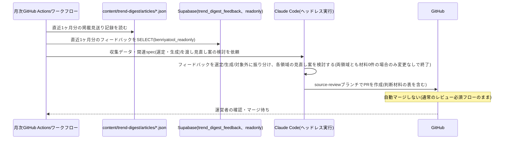

# 設計: 月次見直し(情報源・採用基準・生成ルール)

## サマリ
月1回、GitHub Actionsが直近1ヶ月分の運営者フィードバックと収集ログ・掲載実績(候補件数0件・掲載見送りの記録)を集め、Claude Code CLIのヘッドレス実行で選定領域([content-selection](../content-selection/requirements.md))・生成領域([content-generation](../content-generation/requirements.md))の見直し案を検討し、判断材料の表を含むPRとして提案する。ai-dev-digestのwatchlist-reviewと同じ運用パターンを踏襲し、このPRは自動マージしない。

## 実行環境の前提

実行主体はGitHub Actionsとする。DB接続情報(`SUPABASE_READONLY_DB_URL`)は、`benriyatool_readonly`ロール(SELECT専用・BYPASSRLSなし・RLSスコープ限定という低い権限のロール)に限りGitHub Actions Secretsへの保持を許容する(根拠は[ADR-0004](../../../docs/adr/0004-agent-readonly-db-access.md)参照。ai-dev-digest/watchlist-reviewと同じ既存の許容範囲を利用する)。Claude Code CLIの認証は運営者個人のClaude Code Pro/Maxサブスクリプション認証(`CLAUDE_CODE_OAUTH_TOKEN`)を用いる。この認証情報はai-dev-digest・[weekly-publish](../weekly-publish/design.md)と共用する。

- ワークフロー本体は`.github/workflows/trend-digest-monthly.yml`として月1回起動する
- 「見直し案を作成する処理」(下記)はエージェントの推論を要するため、GitHub Actionsのワークフロー内でClaude Code CLIをヘッドレス(非対話)モードで起動し、リポジトリのチェックアウト・ファイル編集・テスト実行・コミットまでを行わせる(ai-dev-digest/watchlist-reviewと同じ理由: 選定領域(requirements.md・watchlist.json・criteria.json、必要なら選定ロジックの実装・テスト)・生成領域(content-generation/requirements.md・design.md)を横断して整合の取れた編集を行うタスクのため)
- GitHubへの書き込み(ブランチ作成・コミット・push・PR作成)には、[weekly-publish](../weekly-publish/design.md)と同じfine-grained PAT(`TREND_DIGEST_GH_PAT`)を再利用する(本specは自動マージしないため、weekly-publishで懸念した「同一PATによる自動マージ範囲の混同」は生じない)
- Claude Code CLIの実行には`CLAUDE_CODE_OAUTH_TOKEN`(ai-dev-digest・weekly-publishと共用)を、DB読み取りには`SUPABASE_READONLY_DB_URL`(ai-dev-digestが既に保存済みのものをそのまま再利用。`trend_digest_feedback`テーブルへのSELECT権限は同ロールに追加するだけで、接続情報自体は新規発行不要)を、それぞれこのリポジトリのActions Secretsから参照する
- ワークフローへの実行指示は、この`source-review`のrequirements.md/design.mdと、参照先の`content-selection`・`content-generation`のrequirements.md/design.mdをそのまま参照する形にする(専用のプロンプトファイルを別途複製しない)
- 運用開始前に、上記のPAT・OAuthトークン・DB接続情報が実際にリポジトリのActions Secretsに設定されていることを確認する

## 処理フロー

### 見直しの材料を集める処理
- 対象: 直近1ヶ月分のデータ
- 手順:
  1. `content/trend-digest/articles/*.json`のうち、実行日から過去1ヶ月分のファイルを読み込み、[content-selection](../content-selection/design.md)のログが記録した「候補0件のジャンル・情報源」の傾向を把握する材料として、各回の`topics`に含まれなかったジャンル(そのジャンルの掲載が見送られた回)を集計する(content-selection/requirements.md#情報源の健全性監視-1)
  2. `trend_digest_feedback`テーブルから、直近1ヶ月分・`is_test = false`のレコードを`benriyatool_readonly`ロールで読み取る(ADR-0004の接続方式。`is_test`除外はADR-0001の集計時の共通ルール)。フィードバックは領域で絞り込まず全件取得する(領域の振り分けは次の「見直し案を作成する処理」でエージェントが内容から判断する。requirements.md#見直しの実行-3)
  3. 上記2種類のデータをまとめ、見直し案の根拠として使えるようにする
- 関連するビジネスルール: requirements.md#見直しの実行-1、requirements.md#見直しの実行-3

### 見直し案を作成する処理(エージェントの推論)
- 対象: 収集した掲載見送り記録・フィードバック
- 手順:
  1. 各運営者フィードバックを内容から「選定領域」「生成領域」「いずれにも該当しない」に振り分ける(requirements.md#見直しの実行-3)。判断の目安:
     - 選定領域: 「どのジャンル・話題を載せるか」への指摘(偏り・不要な情報源・ニッチさ・話題としての不適切さなど)
     - 生成領域: 「載せた話題をどう書くか」への指摘(分かりやすさ、本文の分量、独自性の弱さなど)
     - いずれにも該当しない: 画面表示の不具合、他機能への要望
  2. 選定領域(掲載見送り記録 + 選定領域に振り分けたフィードバック)の見直し案を検討する:
     - 特定のジャンルで候補0件・掲載見送りが直近1ヶ月継続している場合、そのジャンルの情報源の除外・追加、または採用基準(閾値)の緩和を検討する(requirements.md#選定領域の見直し案の粒度・提示方法-8)
     - フィードバックの内容を踏まえ、ウォッチリストからの除外や基準の見直しを検討する
     - フィードバックが既存の採用基準(情報源単位の可否・数値閾値)では表現できない観点を指摘している場合、新しい採用基準・フィルター観点の追加を具体的な変更案として検討する(requirements.md#選定領域の見直し案の粒度・提示方法-6)
  3. 生成領域(生成領域に振り分けたフィードバック)の見直し案を検討する:
     - フィードバックが指摘する分かりやすさ・分量の問題に対し、`content-generation/requirements.md`の機能要件・ビジネスルール(要約の分量[2]、記事の構成[5]など)と`content-generation/design.md`の該当処理の文言を、具体的な変更案(実際のファイル差分)として検討する(requirements.md#生成領域の見直し案の粒度・提示方法-9)
     - 変更は既存ルールの調整にとどめ、著作権リスク低減の前提(独自の再構成・数値結論の網羅転記回避・出典明記。content-generation/requirements.md#著作権への配慮(根拠))を弱める変更は提案しない(requirements.md#ビジネスルール・制約-3)
     - 著作権ガードに抵触するため採用できない要望は、見直し案に反映せず、却下した旨と理由をPR本文の判断材料の表の行として残す(requirements.md#生成領域の見直し案の粒度・提示方法-9)
  4. 見直し案には、どのフィードバック・どの実績データに基づく変更かを明記する(requirements.md#ビジネスルール・制約-2)
  5. 選定領域・生成領域それぞれについて、振り分けた材料が1件でもある場合は、必ず具体的な変更案(実際のファイル差分)を作成してPRとして提示する。両領域とも材料が0件の月のみ、実在する材料がないためPRを作成しない(requirements.md#選定領域の見直し案の粒度・提示方法-7、requirements.md#生成領域の見直し案の粒度・提示方法-9)
  6. 選定領域で、`specs/trend-digest/content-selection/requirements.md`に既存の選定ロジック(`app/trend-digest/lib/selection.ts`・`fetchFixedListCandidates.ts`等)ではまだ判定できない新しい種類の採用基準・フィルター観点を追加する場合、その判定ロジックの実装(TDDのテストを含む)も同じPRに含める。実装後は`npm test`・`npm run lint`・`npm run build`・`npm run check:spec-coverage`を実行し、いずれも成功することを確認してからコミットする(requirements.md#選定領域の見直し案の粒度・提示方法-8)
  7. 手順6の実装がどうしても完了できない場合のみ、`npm run check:spec-coverage`が失敗しないよう`scripts/spec-coverage-skip.json`に理由を添えて登録した上で、PR本文の判断材料の表に実装が未完了である旨を明記する(例外的な扱い)
  8. 生成領域では、`content-generation/requirements.md`・`design.md`の変更は`scripts/trend-digest/generate-content.ts`が実行時に両ファイルを読み込むため次回の週次生成に自動で反映される。ただし変更が同CLI内に転記されているルール文(ガードレール文言・出力JSONスキーマ例に埋め込まれた字数指定など)に及ぶ場合は、その転記箇所の更新も同じPRに含める。生成領域の変更でも`npm test`・`npm run lint`・`npm run build`・`npm run check:spec-coverage`を実行し成功を確認してからコミットする
- 変更対象ファイル(1つのPRでまとめて更新する。仕様と機械可読データ・転記箇所の片方だけの更新はしない):
  - 選定領域: `specs/trend-digest/content-selection/requirements.md`(ウォッチリストの表・採用基準の記述)と`content/trend-digest/watchlist.json`・`content/trend-digest/criteria.json`(機械可読データ)。新しい判定ロジックが必要な場合は`app/trend-digest/lib/`配下の関連ファイル・`__tests__/trend-digest/lib/`配下の対応テスト
  - 生成領域: `specs/trend-digest/content-generation/requirements.md`・`specs/trend-digest/content-generation/design.md`。変更が転記箇所に及ぶ場合は`scripts/trend-digest/generate-content.ts`
  - `scripts/spec-coverage-skip.json`(選定領域の実装まで完了できなかった場合のみ)
- 関連するビジネスルール: requirements.md#見直しの実行-1〜4、requirements.md#ビジネスルール・制約-2〜3、requirements.md#選定領域の見直し案の粒度・提示方法-6〜8、requirements.md#生成領域の見直し案の粒度・提示方法-9

### 見直し案をPRとして提案する処理
- 対象: 上記で作成した変更内容
- 手順:
  1. 作業用ブランチ`trend-digest/source-review/<year-month>`(例: `trend-digest/source-review/2026-10`)を作成する
  2. 変更内容をコミットし、`main`向けにPRを作成する。PR本文には判断材料として「対象フィードバック・実績」「提案内容」「適用した場合の懸念」の3列からなる表を含める(requirements.md#ビジネスルール・制約-2)。振り分けの結果いずれの領域にも該当しなかったフィードバックも、内容と「対象外」である旨を表の行として残す(requirements.md#見直しの実行-4)。著作権ガードに抵触するため却下した要望も、却下理由とともに表の行として残す。Claude Code CLIには、この表をMarkdown形式で`/tmp/source-review-pr-body.md`に書き出すよう指示し、PR作成時に`gh pr create --body-file`でこれを読み込む
  3. **このPRは自動マージしない。** [weekly-publish](../weekly-publish/design.md)の自動マージ対象は`trend-digest/articles/**`ブランチのみであり、`trend-digest/source-review/**`は対象外(ブランチ命名で明確に区別する)。通常のリポジトリのブランチ保護がそのまま適用され、運営者が内容を確認してマージする
- シーケンス図(俯瞰用。正は上記の手順の文章):


- 関連するビジネスルール: requirements.md#承認フロー-5

## エラーハンドリング

- `trend_digest_feedback`への接続に失敗した場合、フィードバックなしの状態(掲載見送り記録のみ)で見直し案を検討する。DB接続の可否によって月次実行自体を失敗させない(接続失敗はGitHub Actionsのワークフロー実行ログに記録する)
- 選定領域の見直し案がrequirements.mdとJSONデータ(watchlist.json・criteria.json)の片方しか更新できていない状態でPRを作らない。生成領域の見直し案は、requirements.md・design.mdの更新と、転記箇所に及ぶ場合の`generate-content.ts`の更新を同様に揃えてからコミットする
- Claude Codeが判断材料の表(`/tmp/source-review-pr-body.md`)を書き出せなかった場合、PR作成自体は妨げず、その旨を明記した簡潔な代替本文でPRを作成する(表の書き出し漏れでPRが作られないより、判断材料が不足していることが分かる形でPRが作られる方が運営者にとって有用なため)

## 関連するファイル(抜粋)

```
.github/workflows/trend-digest-monthly.yml (月1回起動するワークフロー本体。collectReviewData.tsの実行→Claude Code CLIのヘッドレス起動→変更があればコミット・push・PR作成までを行う)
scripts/trend-digest/collect-review-data/ (独立したpackage.json。pg/dotenvを使いbenriyatool_readonlyで接続する。ai-dev-digestのcollect-review-dataと同じ依存隔離パターン)
scripts/trend-digest/collect-review-data/collectReviewData.ts (掲載見送り記録の集計+フィードバックのSELECT。フィードバックは領域で絞らず全件返す)
content/trend-digest/articles/*.json (既存: 掲載見送り記録の参照元)
supabase/migrations/<timestamp>_create_trend_digest_feedback.sql (既存: article-detailで作成するbenriyatool_readonly向けSELECTポリシーを利用)
specs/trend-digest/content-selection/requirements.md、content/trend-digest/watchlist.json・criteria.json (既存: 選定領域の見直し案の変更対象)
specs/trend-digest/content-generation/requirements.md・design.md (既存: 生成領域の見直し案の変更対象)
scripts/trend-digest/generate-content.ts (既存: content-generationのrequirements.md・design.mdを実行時に読み込みプロンプトへ渡す。転記されたルール文に及ぶ変更のときだけ更新対象)
```

## データベース設計

新規テーブルはない。[article-detail/design.md](../article-detail/design.md)で作成する`trend_digest_feedback`テーブルの`benriyatool_readonly`向けSELECTポリシー(ADR-0004)をそのまま利用する。

## セキュリティ

- `SUPABASE_READONLY_DB_URL`はai-dev-digestが既にこのリポジトリのActions Secretsとして保存済みのものを再利用する(ADR-0004が`benriyatool_readonly`ロールに限り許容した例外)。`service_role`キー等の強い権限は引き続きこのリポジトリ・CI Secretsに含めない
- `CLAUDE_CODE_OAUTH_TOKEN`は運営者個人のClaude Code Pro/Maxサブスクリプションに紐づく認証情報であり、ai-dev-digest・weekly-publishと共用する
- フィードバックのSELECTは集計・見直し検討の目的に限定し、特定の投稿者を特定・追跡する用途には使わない(ADR-0004の既存方針を踏襲。なお本アプリのフィードバックには投稿者を特定する情報自体が含まれない)
- 見直し案のPRは通常のレビュー必須フローに乗るため、内容の妥当性は運営者のレビューで最終確認される(自動マージしないこと自体が主要な安全策)

## ログ

- 月次実行ごとに、集計対象期間・掲載見送り件数・フィードバック件数・PR作成の有無(変更なしの場合はその旨)をGitHub Actionsのワークフロー実行ログに記録する
