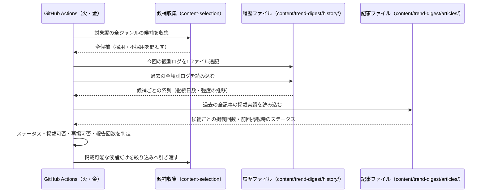
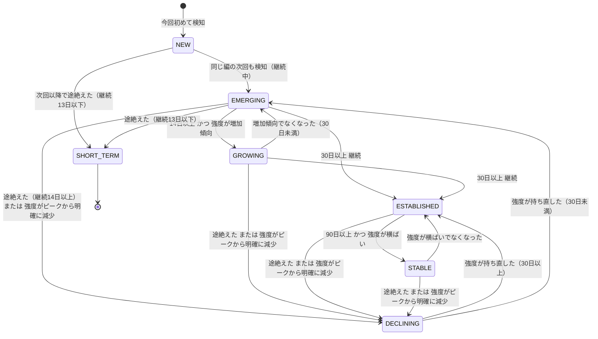

# 設計: トレンド継続履歴と中長期ステータス判定

## サマリ
[content-selection](../content-selection/design.md)が各回に収集した全候補(採用・不採用を問わず)を、実行1回=1ファイルの観測ログ`content/trend-digest/history/<date>-<edition>.json`として追記していく。観測ログは後から書き換えない追記専用のデータとし、ステータスは毎回すべての観測ログを読み直して再計算する(判定基準を見直したときに過去分も一貫した基準で評価し直せるようにするため)。候補の同一性は正規化タイトルのみで判定し、ジャンルをまたいで1本の系列にまとめる(requirements.md#機能要件-1「ジャンルをまたいで横断的に」)。ただし強度のものさしは選定方式ごとに異なるため、系列は1本のまま、強度の推移だけは選定方式を添えて保持し、増減の判定は同じ方式の観測どうしで行う(requirements.md#ステータス判定基準-9)。継続日数・強度の推移からNEW/SHORT_TERM/EMERGING/GROWING/ESTABLISHED/STABLE/DECLININGを決定的なコードで判定し、継続日数・掲載実績(報告回数・前回掲載時のステータス)とあわせてcontent-selectionへ渡す(掲載可否・再掲可否の判断はcontent-selection側が行う)。主要な設計判断は「[履歴データの形式](#履歴データの形式)」(DBではなくcontent/配下のJSON)・「[ステータスを判定する処理](#継続日数と強度の推移からステータスを判定する処理)」(判定順序と閾値の外出し)・「[セキュリティ](#セキュリティ)」。処理の俯瞰は「[週次実行の中での位置づけ](#週次実行の中での位置づけシーケンス図)」参照。

## 履歴データの形式

履歴は記事データ(`content/trend-digest/articles/`)と同じく、DBではなくビルド時・実行時に読み込む静的なコンテンツファイルとして`content/trend-digest/history/`配下に持つ(architecture.md#3-設計方針の「記事本文はDBに保存せずJSONとして管理する」と同じ扱い)。エージェントが生成しリポジトリにコミットされるデータであり、[ADR-0001](../../../docs/adr/0001-user-input-database.md)がSupabaseの対象とする「利用者がブラウザから入力するデータ」には当たらないため、Supabaseのテーブルは新設しない。あわせて、履歴の変化が週次記事PRの差分としてそのまま読めること・外部サービスの資格情報を週次実行に増やさずに済むこと・純粋なファイル入出力のためvitestで完全にテストできることを利点として採る。

- 格納場所: `content/trend-digest/history/<date>-<edition>.json`(`<date>`は実行日`YYYY-MM-DD`、`<edition>`は実行対象の編。記事ファイルと同じ命名規則)
- 1ファイル=1回の実行で観測した全候補。**一度書いたファイルは後から書き換えない**(追記専用)。過去の観測結果を後から補正すると、同じ履歴から毎回同じステータスが再現できなくなるため
- 記事が生成されなかった回(全ジャンル候補0件でスキップした回)も、観測ログ自体は残す(「その回に何も検知されなかった」ことがDECLINING・SHORT_TERMの判定に必要なため。requirements.md#機能要件-3)
- 削除・自動アーカイブは行わない(requirements.md#履歴データの保持期間-1)

```ts
// app/trend-digest/lib/historyTypes.ts
import type { Edition, Genre } from './types' // article-detail/design.mdが定義する型を再利用(重複定義しない)
import type { SelectionMethod } from './watchlistTypes'

// 中長期ステータス(requirements.md#ステータス判定基準-1〜7)
export type TrendStatus = 'NEW' | 'SHORT_TERM' | 'EMERGING' | 'GROWING' | 'ESTABLISHED' | 'STABLE' | 'DECLINING'

// その回に観測した候補1件分。採用・不採用を問わず収集した全候補を記録する(requirements.md#機能要件-1)
export type Observation = {
  genre: Genre
  title: string // 原題(content-selectionのCandidate.titleをそのまま引き継ぐ)
  strength: number // その回のcontent-selectionが算出したstrength(requirements.md#ステータス判定基準の前文)
  method: SelectionMethod
  originRegion: string | null // 発祥地域。判定できない場合はnull(=不明。requirements.md#地域情報-1)
  currentRegions: string[] // 現在の主な流行地域。判定できない場合は空配列(=不明)
  strengthJapan: number | null // 日本の情報源での言及数。判定できない場合はnull
  strengthOverseas: number | null // 海外の情報源での言及数。判定できない場合はnull
}

// 1回の実行分の観測ログ(1ファイルの中身)
export type ObservationLog = {
  date: string // YYYY-MM-DD。実行日
  edition: Edition
  observations: Observation[] // その回の全候補。0件(全ジャンルで何も取れなかった回)もありうる
}

// 全観測ログを候補単位に集約した系列(ファイルには保存せず、実行のたびに再計算する)
export type CandidateHistory = {
  normalizedTitle: string // 同一性判定のキー。ジャンルは含めない(requirements.md#機能要件-1「ジャンルをまたいで横断的に」)
  latestTitle: string // 表示・突合用の原題(直近の観測のもの)
  latestGenre: Genre // 直近に観測されたジャンル
  firstDetectedDate: string // 初回検知日
  lastDetectedDate: string // 直近検知日
  detectionCount: number // 検知した実行回数
  strengthSeries: Array<{ date: string; strength: number; method: SelectionMethod }> // 日付昇順の強度の推移。強度のものさしは選定方式ごとに異なるため、増減・ピークとの比較は同じmethodの要素どうしでのみ行う(requirements.md#ステータス判定基準-9)
  originRegion: string | null
  currentRegions: string[]
  strengthJapan: number | null
  strengthOverseas: number | null
}

// 判定結果。content-selectionへ渡す単位
// 掲載可否そのものは持たせない。履歴側は事実(ステータス・継続日数)の提供にとどめ、
// 掲載できるステータスかどうかの判断はcontent-selectionが行う(requirements.md#ステータス判定基準-8)
export type StatusJudgement = {
  status: TrendStatus
  continuationDays: number // 初回検知日から直近検知日までの日数(requirements.md#ステータス判定基準の前文)
  firstDetectedDate: string
  detectionCount: number // 検知した実行回数(選定方式をまたいだ通算。requirements.md#ステータス判定基準-9)
}

// 「中長期トレンドとみなせるステータス」の集合(requirements.md#ステータス判定基準-8)。
// content-selectionはこの集合を参照して掲載可否を判定する(判定の閾値を二重に持たないため)
export const LONG_TERM_TREND_STATUSES: readonly TrendStatus[] = ['GROWING', 'ESTABLISHED', 'STABLE']
```

判定に使う閾値は`content/trend-digest/criteria.json`に`history`として持ち、[source-review](../source-review/requirements.md)の月次見直しで調整できるようにする(requirements.md#スコープ外「閾値の動的な自動チューニングは行わず、運用実績を見て人間が見直す」に対応するため、コードに直書きしない)。

```ts
// app/trend-digest/lib/historyTypes.ts(watchlistTypes.tsのCriteriaがこの型を読み込んで持つ。
// 閾値の意味は本specが所有するため、型も本specのファイルに置く)
export type HistoryCriteria = {
  shortTermMaxDays: number // SHORT_TERMとみなす継続日数の上限(requirements.md#ステータス判定基準-2 = 13。半月=14日の1日手前)
  growingMinDays: number // GROWING判定の継続日数の下限(同-4 = 14。半月)
  establishedMinDays: number // ESTABLISHED判定の継続日数の下限(同-5 = 30。1ヶ月)
  stableMinDays: number // STABLE判定の継続日数の下限(同-6 = 90。3ヶ月)
  minSamplesForTrend: number // 増加傾向・横ばいを判定するために最低限必要な観測回数
  risingRatio: number // 「明確に増加傾向」とみなす倍率(後半平均÷前半平均がこの値以上)
  decliningRatio: number // 「明確に減少」とみなす倍率(直近強度÷ピーク強度がこの値以下)
  stableBandRatio: number // 「大きく増減せず一定」とみなす、平均からのぶれ幅の割合
}
```

`criteria.json`に追加する初期値(妥当性は運用実績を見て[source-review](../source-review/requirements.md)で見直す):
```json
{
  "history": {
    "shortTermMaxDays": 13,
    "establishedMinDays": 30,
    "growingMinDays": 14,
    "stableMinDays": 90,
    "minSamplesForTrend": 3,
    "risingRatio": 1.2,
    "decliningRatio": 0.6,
    "stableBandRatio": 0.2
  }
}
```

日数の閾値(13/14/30/90)の根拠はrequirements.md#ステータス判定基準の前文のとおり半月・1ヶ月・3ヶ月の暦の区切り。倍率・観測回数の4つ(`minSamplesForTrend`・`risingRatio`・`decliningRatio`・`stableBandRatio`)は運用実績がまだないため、下記の考え方で置いた初期値であり、[source-review](../source-review/requirements.md)の月次見直しで実績に合わせて調整する:

- `minSamplesForTrend: 3` — 増加・減少・横ばいはいずれも「向き」の判断であり、2点では直線しか引けずぶれと傾向を区別できない。3点を最小とする
- `risingRatio: 1.2` — 前半から後半で2割増を「明確に増加」とみなす。固定リストジャンルの強度(おおむね80〜99)では20位前後の順位上昇、WebSearchジャンル(2〜5)では言及元が1つ増える動きに相当し、どちらの方式でも「偶然のぶれ」とは言いにくい水準
- `decliningRatio: 0.6` — ピークの4割減を「明確に減少」とみなす。増加側(2割)より大きく取るのは、掲載を止める判断(DECLINING)を掲載を始める判断(GROWING)より慎重にするため
- `stableBandRatio: 0.2` — 平均の上下2割に収まっていれば横ばいとみなす。`risingRatio`の2割と同じ幅にし、「増加とみなす動きがない」ことと「横ばい」が重ならないようにする

倍率(比)で判定し、強度の差の絶対値では判定しない。強度の尺度が選定方式によって桁違い(固定リストジャンルは`100 - 順位`でおおむね80〜99、WebSearchジャンルは独立情報源数で2〜5)であり、絶対値の閾値を1つに決めると一方の方式でしか機能しないため。ただし比は**同じものさしで測った値どうし**でしか意味を持たない。1本の推移に両方式の値が混ざると、方式が入れ替わっただけで比が桁で変わり(例: 99→3で0.03)、実態と無関係に急減・急増と判定されてしまう。そのため強度の推移は選定方式を添えて保持し、増減・ピークとの比較は同じ方式の観測どうしでのみ行う(requirements.md#ステータス判定基準-9)。

### 週次実行の中での位置づけ(シーケンス図)
俯瞰用の図。正となる文章は下記「[処理フロー](#処理フロー)」の各手順。



## 処理フロー

### その回の観測を履歴に記録する処理
- 対象: content-selectionがその回に収集した全候補(ジャンル内絞り込み・編全体の絞り込みを適用する前の、採用・不採用を問わない全件)
- 手順:
  1. 候補ごとに、ジャンル・原題・強度・選定方式・地域情報(下記「地域情報を判定する処理」で求めたもの)を1件の観測として組み立てる
  2. 同じ正規化タイトルの候補が同じ回に複数のジャンル・情報源から取れた場合は、**選定方式ごとに**強度が最も大きい1件だけを残す(同じ方式の中で二重に数えると検知回数と強度の推移が実態より大きくなるため)。固定リストジャンルとWebSearchジャンルの双方で取れた場合は方式ごとに1件ずつ、計2件を残す。強度のものさしが方式で異なり、単純に最大値を採ると常に固定リスト側(おおむね80〜99)が勝ってWebSearch側の観測(2〜5)が失われるため(requirements.md#ステータス判定基準-9)
  3. 実行日・対象の編・組み立てた観測の一覧を1つのファイルとして`content/trend-digest/history/<実行日>-<編>.json`へ書き出す。同じ名前のファイルが既にある場合は上書きせず、処理を失敗させる(追記専用の前提を壊さないため)
  4. 候補が1件も取れなかった回も、観測の一覧が空のファイルとして書き出す(requirements.md#機能要件-3)
- 関連するビジネスルール: requirements.md#機能要件-1、requirements.md#機能要件-3

### 地域情報を判定する処理
- 対象: その回に収集した候補すべて
- 手順:
  1. 固定リストジャンルの候補は、その候補を検出した情報源に登録された地域区分(日本の情報源か、海外の情報源か)から判定する。日本の情報源だけで検出されたなら「日本での強度」に検出件数を数え、海外の情報源だけなら「海外での強度」に数える。両方で検出された場合はそれぞれに数える
  2. WebSearchジャンルの候補は、言及していた独立情報源のうち日本のメディアの数・海外のメディアの数を、収集を担うエージェントに数えさせて受け取る
  3. 発祥地域・現在の主な流行地域は、情報源の記述から判定できた場合のみ記録する。判定できない場合は発祥地域を「不明」(値なし)、主な流行地域を「不明」(空)として扱い、推測で埋めない(requirements.md#地域情報-1)
  4. 日本での強度・海外での強度も、判定できない場合は「不明」(値なし)として扱う。0件だったことと、判定できなかったことを区別する(慢性的に判定できていない状態を月次見直しで拾えるようにするため)
  5. 比率を目安の配分(日本8割・海外2割)へ寄せる調整は行わない(requirements.md#地域情報-3)
- 関連するビジネスルール: requirements.md#機能要件-5、requirements.md#地域情報-1〜3

### 履歴を候補ごとの系列に集約する処理
- 対象: `content/trend-digest/history/`配下の全観測ログ
- 手順:
  1. すべての観測ログを読み込み、実行日の昇順に並べる。JSONとして読めないファイル・形式を満たさないファイルがあった場合は例外を投げる(下記エラーハンドリング参照)
  2. 観測を正規化タイトル(既存の[掲載済み話題の再掲抑制](../content-selection/requirements.md#掲載済み話題の再掲抑制)と同じ正規化ルール。前後の空白除去・全角/半角の統一・英字の大文字小文字統一)ごとにまとめる。**ジャンルはキーに含めない**ため、同じ話題が複数ジャンルで検知された場合も1本の系列に集約される(requirements.md#機能要件-1)
  3. 系列ごとに、初回検知日(最も古い観測の実行日)・直近検知日(最も新しい観測の実行日)・検知した実行回数(観測が存在する実行の数)・強度の推移(実行日昇順に、強度と選定方式を組にした並び)を求める。検知した実行回数は選定方式をまたいで通算する(同じ回に両方式で観測された場合は1回と数える)
  4. 地域情報・ジャンル・原題は、直近の観測のものを採る(最新の状況を表すため)。ただし発祥地域は最も古い観測で判定できたものを優先して残す(「最初に流行が確認された地域」という定義上、後の回で不明になっても失いたくないため。requirements.md#地域情報-1)
  5. その候補が属する編の直近の実行(同じ編の観測ログのうち最も実行日が新しいもの)に候補が含まれていない場合は「言及が途絶えた」状態として扱う(requirements.md#機能要件-3)。編の判定は候補が観測されたジャンルが属する編で行い、全観測ログ横断の最新ログでは判定しない。編は火曜(エンタメ9ジャンル)・金曜(カルチャー10ジャンル)で対象ジャンルが完全に分かれており、横断の最新ログを基準にすると金曜の実行のたびにエンタメ編の全候補が「途絶えた」と判定されてしまうため(requirements.md#ステータス判定基準の前文)
  6. 同じ候補が両方の編のジャンルで観測されている場合は、いずれかの編の直近の実行で検知されていれば「継続中」として扱う(片方の編で扱いが終わっただけで途絶えたとみなさないため)
- 関連するビジネスルール: requirements.md#機能要件-1〜3、requirements.md#機能要件-5

### 継続日数と強度の推移からステータスを判定する処理
- 対象: 集約した候補ごとの系列1本
- 増減の判定に使う推移の選び方(requirements.md#ステータス判定基準-9): 系列の強度の推移を選定方式ごとに分け、観測件数が最も多い方式の推移を増減・横ばい・ピークの判定に使う。件数が同じ場合は直近の観測が属する方式を使う。方式をまたいで値を混ぜて比べることはしない
- 手順:
  1. 継続日数を「初回検知日から直近検知日までの日数」として求める(requirements.md#ステータス判定基準の前文)
  2. 下記の順に条件を当てはめ、最初に当てはまったものをその候補のステータスとする。上から順に当てはめるのは、要件の各条件が重なる範囲を持つため(例: 継続日数が20日で増加傾向のある候補はEMERGINGの条件とGROWINGの条件を同時に満たす)。**途絶えの判定を継続日数より先に置く**のは、1回だけ検知されて消えた候補が継続日数0のままNEWに留まり、一過性の話題を除外するSHORT_TERMがその最頻ケースを拾えなくなるのを避けるため(requirements.md#ステータス判定基準-1〜2)
     1. 同じ編の直近の実行で検知されなかった(言及が途絶えた)場合で、継続日数が`shortTermMaxDays`以下ならSHORT_TERM(同-2)。1回だけ検知されて途絶えた候補(継続日数0)もここに入る
     2. 同じ編の直近の実行で検知されなかった場合で、継続日数が`shortTermMaxDays`を超えているならDECLINING(同-7(b))
     3. その候補を初めて検知した実行が同じ編の直近の実行である場合はNEW(同-1)。ここに到達する時点で直近の実行では検知されているため、観測が1回だけなら必ずNEWになる
     4. 直近の強度がピーク強度から明確に減少している場合はDECLINING(同-7(a))。「明確に減少」は、直近の強度をこの系列のピーク強度で割った値が`decliningRatio`以下で、かつピークが直近の観測ではないこと(直近がピーク自身であれば減少していないため)。観測が`minSamplesForTrend`回未満の系列では判定しない(数回の観測ではぶれと減少を区別できないため)。**ピーク強度が0の場合は判定しない**(0で割れず、比では減少を測れないため。下記「境界値・特殊ケースの扱い」参照)
     5. 継続日数が`stableMinDays`以上で、強度が大きく増減せず一定を保っている場合はSTABLE(同-6)。「一定を保っている」は、直近`minSamplesForTrend`回分の強度がいずれもその平均の上下`stableBandRatio`の幅に収まっていること
     6. 継続日数が`establishedMinDays`以上の場合はESTABLISHED(同-5)
     7. 継続日数が`growingMinDays`以上で、強度が明確に増加傾向にある場合はGROWING(同-4)。「明確に増加傾向」は、強度の推移を前半と後半に二分し、後半の平均を前半の平均で割った値が`risingRatio`以上であること。観測が`minSamplesForTrend`回未満の系列では判定しない
     8. 上記のいずれにも当てはまらず、同じ編の直近の実行でも検知されている場合はEMERGING(同-3)
  3. 判定したステータス・継続日数・初回検知日・検知した実行回数を、content-selectionへ渡す。掲載できるステータスかどうかの判断は持たない(履歴側は事実の提供にとどめる。requirements.md#ステータス判定基準-8)
- 境界値・特殊ケースの扱い(いずれも「判定できないものは判定しない」=その条件には当てはまらないものとして次の条件へ進む):

| ケース | 扱い | 理由 |
|---|---|---|
| ピーク強度が0 | 減少(手順2-4)の判定をしない | 0で割れない。比では0からの減少を表せない |
| 前半の平均が0 | 増加傾向(手順2-7)の判定をしない | 0で割れない。0からの増加は倍率で表せない |
| 直近`minSamplesForTrend`回分の平均が0 | すべての観測が0なら横ばい(手順2-5)とみなす。1件でも0でない値があれば横ばいとみなさない | 全て0は「増減していない」という事実そのもの。混在は平均比で測れない |
| 観測回数が奇数のときの前半・後半の二分 | 先頭から`floor(件数÷2)`件を前半、残りを後半とする(中央の1件は後半に入る) | 直近側の変化を拾うため。件数が奇数でも両方が必ず1件以上になる |
| 強度が負の値 | バリデーションで弾く(下記「バリデーション」) | 順位由来の値も言及元数も負にならず、負値は書き出し側の不具合 |

- 状態遷移図(俯瞰用。正は上記の手順の文章。判定は毎回すべての観測ログから再計算するため、この図は「前の状態から遷移する」のではなく「継続日数と強度の推移が変わった結果どのステータスに移りうるか」を表す。継続日数は減ることがないため、日数を戻す向きの遷移は起こらない):



- 関連するビジネスルール: requirements.md#機能要件-4、requirements.md#ステータス判定基準-1〜9

### 掲載実績(報告回数・前回掲載時のステータス)を求める処理
- 対象: `content/trend-digest/articles/`配下の全記事の全トピック
- 手順:
  1. 全記事のトピックを、対象作品・話題の原題を正規化したものごとにまとめ、発行日の昇順に並べる
  2. 候補ごとに、過去に掲載された回数を数える。今回掲載する場合の「何回目の報告か」は、この回数に1を足した値とする(requirements.md#掲載実績の追跡-1)
  3. 直近で掲載されたときのステータスを、最も新しい掲載トピックが持つステータスから取る。ステータスを持たない過去の記事(この機能の導入より前に生成された記事)しかない場合は「前回掲載時のステータスは不明」として扱う(requirements.md#掲載実績の追跡-2)
  4. 求めた報告回数・前回掲載時のステータスを、ステータス判定結果とあわせてcontent-selectionへ渡す。これらを使った再掲可否の判定自体は[content-selection](../content-selection/design.md)が行う(履歴側は事実の提供にとどめ、選定の判断を持たないため)
- 関連するビジネスルール: requirements.md#機能要件-6、requirements.md#掲載実績の追跡-1〜2

## バリデーション

観測ログ(JSONファイル)のスキーマ検証:
- `date`: `YYYY-MM-DD`形式であること
- `edition`: `entertainment`または`culture-lifestyle`であること
- `observations`: 配列であること(0件を許容する)
- 各`observation`: `genre`が定義済みジャンルのいずれかであること、`title`が空文字でなく200文字以内であること、`strength`が0以上の有限の数値であること、`method`が`fixed-list`または`websearch`であること、`strengthJapan`・`strengthOverseas`が0以上の数値またはnullであること
- 地域情報は収集エージェント(Claude Code CLIのWebSearch)が生成した自由文字列であり、**外部入力として検証する**(想定外の長さ・制御文字がそのまま記事データに転記され、画面表示や`check:spec-coverage`・`next build`の想定外の失敗につながることを防ぐため):
  - `originRegion`: 文字列またはnullであること。文字列の場合は空文字でなく**50文字以内**であること
  - `currentRegions`: 文字列の配列であること。各要素は空文字でなく**50文字以内**であること。要素数は10件以内であること
  - `originRegion`・`currentRegions`の各要素に制御文字(改行・タブを含む)を含まないこと
  - 50文字という上限は、記録するのが国名・地域名(「日本」「北米」「東アジア」など)であり、正当な値がこの長さを超えないため
- 同じファイル内に同じ正規化タイトルの観測が2件以上ないこと(処理フロー「その回の観測を履歴に記録する処理」手順2で1件に寄せているため、2件以上あれば書き出し側の不具合)
- ファイル名(`<date>-<edition>.json`)と中身の`date`・`edition`が一致すること

## エラーハンドリング

- 観測ログのスキーマ違反・ファイル名との不一致は例外として扱い、週次実行を失敗させる。履歴は以後すべてのステータス判定の土台になるデータであり、壊れたまま先に進むと誤った掲載判断が続くため、記事のスキーマ違反([article-detail/design.md](../article-detail/design.md)のエラーハンドリング)と同じく検知した時点で止める
- 観測ログを書き出す前の段階(候補収集)で個々の情報源の取得が失敗した場合は、[content-selection](../content-selection/design.md)のエラーハンドリングのとおりその情報源だけを除外して処理を続ける。その回の観測ログには、取得できた範囲の候補だけが記録される(その結果、一時的に検知が途絶えた候補がSHORT_TERM・DECLININGと判定されうる。情報源の慢性的な取得失敗は[source-review](../source-review/requirements.md)の月次見直しで拾う)
- 観測ログの書き出しに失敗した場合は、その回の記事を生成せず週次実行を失敗させる。記事だけが増えて履歴が欠けると、以後の継続日数・報告回数が実態とずれるため
- `content/trend-digest/history/`が存在しない、または観測ログが1件もない運用開始直後は、すべての候補が継続日数0のNEWとして扱われる(例外にはしない)
- **週次実行そのものが失敗し、その回の観測ログが1件も書き出されなかった場合**(欠測)は、その週を「存在しなかった実行」として扱い、判定上は何も補わない。具体的には、欠測週は検知した実行回数にも強度の推移にも現れず、「同じ編の直近の実行」は欠測週ではなく**実際に観測ログが残っている最も新しい実行**を指す。欠測を「検知されなかった回」として数えると、実行基盤の障害が候補の途絶えと区別できず、継続中の候補が一斉にSHORT_TERM・DECLININGへ落ちるため。継続日数は日付の差で測るため、欠測があっても値は変わらない
- 欠測が続くと`minSamplesForTrend`(増減判定に必要な観測回数)に達するまでの期間が延びるが、判定を甘くする補正は行わない(観測していない期間の傾向を推測しないため)。欠測の頻度は[source-review](../source-review/requirements.md)の月次見直しで確認する

## 関連するファイル(抜粋)

```
content/trend-digest/history/<date>-<edition>.json (新規: 1実行1ファイルの観測ログ。追記専用)
content/trend-digest/criteria.json (既存: historyの閾値を追加)
app/trend-digest/lib/types.ts (既存: Edition/Genreを利用。本specでは再定義しない)
app/trend-digest/lib/watchlistTypes.ts (既存: CriteriaがhistoryTypes.tsのHistoryCriteriaを読み込んで持つ)
app/trend-digest/lib/historyTypes.ts (新規: TrendStatus/Observation/ObservationLog/CandidateHistory/StatusJudgement/HistoryCriteriaの型定義とLONG_TERM_TREND_STATUSES)
app/trend-digest/lib/historySchema.ts (新規: 観測ログJSONのバリデーション・パース)
app/trend-digest/lib/writeObservationLog.ts (新規: その回の観測を1ファイルとして書き出す処理)
app/trend-digest/lib/aggregateHistory.ts (新規: 全観測ログを候補ごとの系列に集約する純粋関数)
app/trend-digest/lib/judgeStatus.ts (新規: 系列からステータス・継続日数を判定する純粋関数)
app/trend-digest/lib/publishRecords.ts (新規: 過去記事から報告回数・前回掲載時のステータスを求める処理)
app/trend-digest/lib/selection.ts (既存: normalizeTitleを再利用。正規化ルールを二重に持たない)
scripts/trend-digest/collect-and-select.ts (既存: 観測ログの書き出しと、履歴にもとづく絞り込みの呼び出しを追加)
```

`aggregateHistory.ts`・`judgeStatus.ts`は入出力が純粋なデータのみのため、通常のvitestで完全にテストできる。`historySchema.ts`・`publishRecords.ts`はファイル入出力を伴うが、読み込み対象のディレクトリを引数で受け取る形にして一時ディレクトリでテストする(既存の`reviewRecords.ts`と同じ書き方)。

## セキュリティ

- 履歴データに含まれるのは、公開されているランキング・ニュース記事から得た作品名・話題名と、その出現回数・強度・地域だけであり、個人情報・機微情報は扱わない。利用者がブラウザから入力したデータも含まない
- 履歴ファイルはリポジトリにコミットされ、静的サイトのビルド対象ディレクトリに置かれる。**記事ページからは参照しない値(生の強度・情報源ごとの内訳)を画面に埋め込まない**ようにし、配信物に載るのは[article-detail](../article-detail/design.md)が表示に使う値(ステータス・継続日数・報告回数・地域)に限る
- 履歴の書き込みは週次実行のGitHub Actionsだけが行い、その変更は記事PRの差分として残る。追記専用(既存ファイルを上書きしない)としているため、過去の判定根拠が後から書き換わることがない
- 地域情報は情報源から判定できた範囲のみを記録し、推測で埋めない(requirements.md#地域情報-1)。判定できない項目を「不明」として保持することで、誤った地域情報が記事に表示されることを防ぐ

## パフォーマンス

- ステータス判定のたびに全観測ログを読み直す。週2回の実行で1回あたり1ファイル増えるため、年間で約104ファイル・1ファイルあたり数十件の観測になる。数年分でも数千件規模であり、週次実行の中で全件をメモリ上に読み込んで集約する方式で支障はない(パフォーマンスのための分割・インデックス化は行わない)
- 履歴ファイルは記事ページのビルドでは読み込まない(表示に必要な値は記事JSONのトピックに持たせる。[article-detail/design.md](../article-detail/design.md)参照)。履歴の蓄積が`next build`の時間に影響しないようにするため

## ログ

- 観測ログを書き出した際に、実行日・編・記録した観測件数を標準エラー出力へ記録する
- ステータス判定の結果を、ステータスごとの件数(NEWが何件・EMERGINGが何件…)として標準エラー出力へ記録する(掲載可能な候補が慢性的に枯渇していないかを月次見直しで拾えるようにするため)
- 掲載可能ステータスでなかったために候補から外した件数と、前回掲載時からステータスが変わらないために再掲を見送った件数を、それぞれ標準エラー出力へ記録する(絞り込みの過程が追えるようにするため)
- 掲載可能な候補が0件になった編は、警告(`WARN`)と分かる形で出力する
- 地域情報が「不明」のまま記録された候補の件数を記録する(慢性的に判定できていない状態を[source-review](../source-review/requirements.md)の月次見直しで拾えるようにするため)
