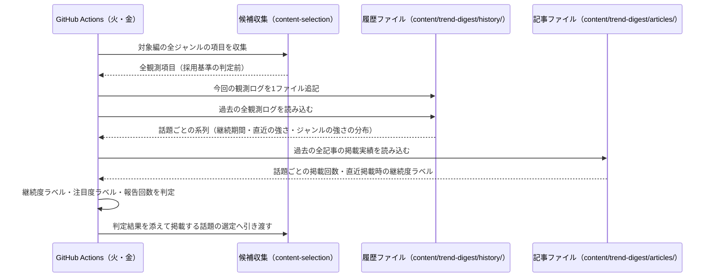

# 設計: トレンド継続履歴と継続度・注目度の判定

## サマリ
[content-selection](../content-selection/design.md)が各回に情報源から取得した全項目(採用基準の判定前の全件)を、実行1回=1ファイルの観測ログ`content/trend-digest/history/<date>-<edition>.json`として追記していく。観測ログは後から書き換えない追記専用のデータとし、ラベルは毎回すべての観測ログを読み直して再計算する(判定基準を見直したときに過去分も一貫した基準で評価し直せるようにするため)。話題の同一性は正規化タイトルのみで判定し、ジャンルをまたいで1本の系列にまとめる(requirements.md#機能要件-4)。系列から、**途切れずに検知され続けている期間**にもとづく継続度ラベル(流行前/注目され始め/話題/非常に話題)と、**その回の強さ**にもとづく注目度ラベル(高い/普通/低い)を決定的なコードで判定し、掲載実績(掲載回数・直近掲載時の継続度ラベル)とあわせてcontent-selectionへ渡す。どちらのラベルも掲載可否を決めず、記事への表示と、ジャンル内に複数候補があるときの並べ替えに使う。主要な設計判断は「[履歴データの形式](#履歴データの形式)」(DBではなく`content/`配下のJSON)・「[途切れずに続いている期間を求める処理](#途切れずに続いている期間を求める処理)」(一度途切れたら数え直す)・「[注目度ラベルを判定する処理](#注目度ラベルを判定する処理)」(分布と情報源での位置の切り替え)・「[セキュリティ](#セキュリティ)」。処理の俯瞰は「[週次実行の中での位置づけ](#週次実行の中での位置づけシーケンス図)」参照。

## 履歴データの形式

履歴は記事データ(`content/trend-digest/articles/`)と同じく、DBではなくビルド時・実行時に読み込む静的なコンテンツファイルとして`content/trend-digest/history/`配下に持つ(architecture.md#3-設計方針の「記事本文はDBに保存せずJSONとして管理する」と同じ扱い)。エージェントが生成しリポジトリにコミットされるデータであり、[ADR-0001](../../../docs/adr/0001-user-input-database.md)がSupabaseの対象とする「利用者がブラウザから入力するデータ」には当たらないため、Supabaseのテーブルは新設しない。あわせて、履歴の変化が週次記事PRの差分としてそのまま読めること・外部サービスの資格情報を週次実行に増やさずに済むこと・純粋なファイル入出力のためvitestで完全にテストできることを利点として採る。

- 格納場所: `content/trend-digest/history/<date>-<edition>.json`(`<date>`は実行日`YYYY-MM-DD`、`<edition>`は実行対象の編。記事ファイルと同じ命名規則)
- 1ファイル=1回の実行で観測した全項目。**一度書いたファイルは後から書き換えない**(追記専用)。過去の観測結果を後から補正すると、同じ履歴から毎回同じラベルが再現できなくなるため
- 記事が生成されなかった回(全ジャンルで項目を1件も取得できずスキップした回)も、観測ログ自体は残す(「その回にその話題が検知されなかった」ことが継続の途切れの判定に必要なため。requirements.md#継続度ラベル-1)
- 削除・自動アーカイブは行わない(requirements.md#履歴データの保持期間-17)

```ts
// app/trend-digest/lib/historyTypes.ts
import type { Edition, Genre } from './types' // article-detail/design.mdが定義する型を再利用(重複定義しない)
import type { SelectionMethod } from './watchlistTypes'

// 継続度ラベル(requirements.md#継続度ラベル-1〜4)。「どれだけ続いているか」を表す
export type DurationLabel = 'pre-trend' | 'emerging' | 'talked' | 'highly-talked'

// 注目度ラベル(requirements.md#注目度ラベル-8〜9)。「今どれくらい強いか」を表す
export type HeatLabel = 'high' | 'normal' | 'low'

// 継続度ラベルの強さの順(並べ替えの比較に使う。大きいほど長く続いている)。
// 画面表示用の日本語ラベルはarticle-detail/design.mdが持つ(表示の責務がそちらにあるため)
export const DURATION_LABEL_ORDER: Record<DurationLabel, number> = {
  'pre-trend': 0,
  emerging: 1,
  talked: 2,
  'highly-talked': 3,
}

// 注目度ラベルの強さの順(同上。大きいほど今強い)
export const HEAT_LABEL_ORDER: Record<HeatLabel, number> = { low: 0, normal: 1, high: 2 }

// その回に観測した項目1件分。採用基準を満たすかどうかの判定前の全項目を記録する(requirements.md#機能要件-1〜3)
export type Observation = {
  genre: Genre
  title: string // 原題(content-selectionのCandidate.titleをそのまま引き継ぐ)
  strength: number // その回の強さを表す値。固定リストは`(記録上限 + 1) - 順位`(上位ほど大きい。上限30なら1位=30・30位=1)、
                   // WebSearchは独立した言及元の数。**content-selectionが並べ替えに使う`strength`(固定リストは`100 - 順位`)とは別の値**で、
                   // 記録上限の中で必ず1以上になるよう張り直したもの(`100 - 順位`をそのまま使うと101位以降で負になりバリデーションを通らないため)
  meetsCriteria: boolean // その回にcontent-selectionの採用基準を満たしたか(requirements.md#機能要件-2)。
                         // 満たさなかった項目も記録するため、候補の有無をcontent-selection・source-reviewが見分けられるように残す
  rank: number | null // 固定リストジャンルの項目のその回の順位(1が最上位。記録上限以内)。WebSearchジャンルはnull。
                      // strengthから逆算せず順位そのものを持つ(musicのような上昇幅加点があるジャンルでは`100 - strength`が実際の順位と一致しないため)
  method: SelectionMethod
  originRegion: string | null // 発祥地域。判定できない場合はnull(=不明。requirements.md#地域情報-15)
  currentRegions: string[] // 現在の主な流行地域。判定できない場合は空配列(=不明)
  strengthJapan: number | null // 日本の情報源での言及数。判定できない場合はnull
  strengthOverseas: number | null // 海外の情報源での言及数。判定できない場合はnull
}

// 1回の実行分の観測ログ(1ファイルの中身)
export type ObservationLog = {
  date: string // YYYY-MM-DD。実行日
  edition: Edition
  observations: Observation[] // その回の全観測項目。0件(全ジャンルで何も取れなかった回)もありうる
}

// 全観測ログを話題単位に集約した系列(ファイルには保存せず、実行のたびに再計算する)
export type CandidateHistory = {
  normalizedTitle: string // 同一性判定のキー。ジャンルは含めない(requirements.md#機能要件-4)
  latestTitle: string // 表示・突合用の原題(直近の観測のもの)
  latestGenre: Genre // 直近に観測されたジャンル
  latestMethod: SelectionMethod // 直近の観測の選定方式(注目度ラベルの判定に使う)
  latestStrength: number // 直近の観測の強さ(注目度ラベルの判定に使う)
  latestRank: number | null // 直近の観測の順位(固定リストジャンルのみ。注目度ラベルの判定に使う)
  firstDetectedDate: string // 初回検知日(途切れを挟んだ通算の最古。表示には使わず、運用状況の確認用に残す)
  lastDetectedDate: string // 直近検知日
  continuationStartDate: string // 途切れずに検知され続けている期間の開始日(下記「途切れずに続いている期間を求める処理」)
  continuationDays: number // continuationStartDateからlastDetectedDateまでの日数。初検知のみなら0
  detectionCount: number // 検知した実行回数(途切れを挟んだ通算。選定方式・編をまたいで1回と数える)
  observedEditions: Edition[] // この話題が観測された編(両編のジャンルで観測される話題は2件になる)
  originRegion: string | null
  currentRegions: string[]
  strengthJapan: number | null
  strengthOverseas: number | null
}

// 話題1件分の判定結果。content-selectionへ渡す単位。
// 掲載可否そのものは持たせない。履歴側は事実(ラベル・継続日数・掲載実績)の提供にとどめ、
// どれを載せるかの判断はcontent-selectionが行う(requirements.md#継続度ラベル-7、同#注目度ラベル-12)
export type HistoryJudgement = {
  durationLabel: DurationLabel
  heatLabel: HeatLabel
  heatBasis: 'distribution' | 'source-position' // 注目度をどちらの方法で決めたか(ログ・月次見直し用)
  continuationDays: number
  continuationStartDate: string
  detectionCount: number
  publishedCount: number // 過去に記事へ掲載された回数(未掲載は0。requirements.md#掲載実績の追跡-13)
  reportCount: number // 今回掲載する場合に通算何回目の報告になるか(= publishedCount + 1)
  lastPublishedDurationLabel: DurationLabel | null // 直近掲載時の継続度ラベル。未掲載・判定不能はnull(requirements.md#掲載実績の追跡-14)
}
```

判定に使う日数・件数は`content/trend-digest/criteria.json`に`history`として持ち、[source-review](../source-review/requirements.md)の月次見直しで調整できるようにする(requirements.md#スコープ外「日数の区切り・観測の上限の動的な自動チューニングは行わず、運用実績を見て人間が見直す」に対応するため、コードに直書きしない)。

```ts
// app/trend-digest/lib/historyTypes.ts(watchlistTypes.tsのCriteriaがこの型を読み込んで持つ。
// 値の意味は本specが所有するため、型も本specのファイルに置く)
export type HistoryCriteria = {
  emergingMinDays: number // 「注目され始め」とみなす継続日数の下限(requirements.md#継続度ラベル-2 = 14。半月)
  talkedMinDays: number // 「話題」とみなす継続日数の下限(同-3 = 30。1ヶ月)
  highlyTalkedMinDays: number // 「非常に話題」とみなす継続日数の下限(同-4 = 90。3ヶ月)
  maxObservationsPerSource: number // 1つの情報源から観測ログに記録する項目数の上限(requirements.md#機能要件-3)
  heatMinObservationRuns: number // 注目度を過去の分布で決めるのに必要な、そのジャンルの実行回数(requirements.md#注目度ラベル-8、同-10)
  heatRankHigh: number // 固定リストジャンル用。この順位以内なら注目度「高い」(同-9)
  heatRankNormal: number // 固定リストジャンル用。この順位以内なら注目度「普通」(同-9)
  heatSourcesHigh: number // WebSearchジャンル用。独立言及元がこの件数以上なら注目度「高い」(同-9)
  heatSourcesNormal: number // WebSearchジャンル用。独立言及元がこの件数以上なら注目度「普通」(同-9)
}
```

`criteria.json`に追加する初期値(妥当性は運用実績を見て[source-review](../source-review/requirements.md)で見直す):
```json
{
  "history": {
    "emergingMinDays": 14,
    "talkedMinDays": 30,
    "highlyTalkedMinDays": 90,
    "maxObservationsPerSource": 30,
    "heatMinObservationRuns": 12,
    "heatRankHigh": 3,
    "heatRankNormal": 10,
    "heatSourcesHigh": 5,
    "heatSourcesNormal": 3
  }
}
```

日数の区切り(14/30/90)と実行回数(12)の根拠はrequirements.md#継続度ラベル-5・#注目度ラベル-10のとおり半月・1ヶ月・3ヶ月の暦の区切りと、3ヶ月=週1回の観測で約12回という対応。件数の初期値は次の考え方で置いた:

- `maxObservationsPerSource: 30` — 1つの情報源から記録する項目数の上限。掲載候補になる条件(上位5位・10位以内)より十分広く取り、上位圏に上がってくる前の動きも追えるようにする一方、ランキング下位まで際限なく記録しても継続の判断には使えないため、3倍程度の30位で止める(requirements.md#機能要件-3)
- `heatRankHigh: 3` / `heatRankNormal: 10` — 順位そのものの体感に合わせ、表彰台にあたる3位以内を「高い」、ランキング上位の一般的な区切りである10位以内を「普通」、それ以下を「低い」とする
- `heatSourcesHigh: 5` / `heatSourcesNormal: 3` — 採用基準の`minIndependentSources`(既定3件)をそのまま「普通」の下限に据え、その倍近い5件を「高い」とする。採用基準に届かない2件以下は「低い」になる

**注目度の測り方が切り替わるときの見え方**(requirements.md#注目度ラベル-8〜9)。そのジャンルの実行が`heatMinObservationRuns`回に達すると、注目度の根拠が「情報源での位置」から「そのジャンルの過去の観測の分布」へ切り替わる。固定リストジャンルは毎回ほぼ`maxObservationsPerSource`件を記録するため、強さの分布は1〜30にほぼ一様に広がり、上位3分の1の境目はおおむね順位10位付近になる。つまり切り替え後は「高い」の範囲が**1〜3位からおおむね1〜10位へ広がる**。これは「過去の実績と比べる」という要件の意図どおりの挙動だが、読者から見ると同じ順位の話題のラベルが切り替わり時点で変わって見える。実際にどちらが実態に合うかは運用実績がないと判断できないため、**切り替え後にジャンルごとの注目度の分布が偏っていないかを最初の月次見直しで確認する**(requirements.md#注目度ラベル-11の「分布との比較は同じジャンルの中だけで行う」に従い、ジャンルをまたいだ比較はしない)。

### 週次実行の中での位置づけ(シーケンス図)
俯瞰用の図。正となる文章は下記「[処理フロー](#処理フロー)」の各手順。



## 処理フロー

### その回の観測を履歴に記録する処理
- 対象: content-selectionがその回に情報源から取得した全項目(**採用基準の判定を行う前**の全件。`rankThreshold`・`newEntryOrRisingRank`・`minIndependentSources`のいずれも適用しない。requirements.md#機能要件-1〜3)
- 手順:
  1. 項目ごとに、ジャンル・原題・強さ(履歴側の尺度。上記「履歴データの形式」参照)・順位・選定方式・採用基準を満たしたかどうか・地域情報(下記「地域情報を判定する処理」で求めたもの)を1件の観測として組み立てる
  2. 情報源ごとに、記録する項目を上位`maxObservationsPerSource`件までに絞る(requirements.md#機能要件-3)
  3. 同じ正規化タイトルの項目が同じ回に複数のジャンル・情報源から取れた場合は、**選定方式ごとに1件だけ**残す。残す1件は次の順で選ぶ: (a) 順位を持つ観測を優先する、(b) それでも複数あれば順位が最も上位(順位の数値が小さい)の1件、(c) 順位を持つ観測がなければ強さが最も大きい1件。固定リストジャンルとWebSearchジャンルの双方で取れた場合は方式ごとに1件ずつ、計2件を残す。方式をまたいで最大値を採らないのは、強さのものさしが方式で異なり、単純に比べると一方の観測が必ず失われるため
  4. 実行日・対象の編・組み立てた観測の一覧を1つのファイルとして`content/trend-digest/history/<実行日>-<編>.json`へ書き出す。同じ名前のファイルが既にある場合は上書きせず、処理を失敗させる(追記専用の前提を壊さないため)
  5. 項目が1件も取れなかった回も、観測の一覧が空のファイルとして書き出す(その回に検知されなかったことを継続の途切れの判定に使うため)
- 関連するビジネスルール: requirements.md#機能要件-1、requirements.md#機能要件-2、requirements.md#機能要件-3

### 地域情報を判定する処理
- 対象: その回に観測ログへ記録する全項目(採用基準を満たさなかった項目も含む)
- 手順:
  1. 固定リストジャンルの項目は、それを検出した情報源に登録された地域区分(日本の情報源か、海外の情報源か)から判定する。日本の情報源だけで検出されたなら「日本での強度」に検出件数を数え、海外の情報源だけなら「海外での強度」に数える。両方で検出された場合はそれぞれに数える
  2. WebSearchジャンルの項目は、言及していた独立情報源のうち日本のメディアの数・海外のメディアの数を、収集を担うエージェントに数えさせて受け取る
  3. 発祥地域・現在の主な流行地域は、情報源の記述から判定できた場合のみ記録する。判定できない場合は発祥地域を「不明」(値なし)、主な流行地域を「不明」(空)として扱い、推測で埋めない(requirements.md#地域情報-15)
  4. 日本での強度・海外での強度も、判定できない場合は「不明」(値なし)として扱う。0件だったことと、判定できなかったことを区別する(慢性的に判定できていない状態を月次見直しで拾えるようにするため)
- 関連するビジネスルール: requirements.md#機能要件-8、requirements.md#地域情報-15、requirements.md#地域情報-16

### 履歴を話題ごとの系列に集約する処理
- 対象: `content/trend-digest/history/`配下の全観測ログ
- 手順:
  1. すべての観測ログを読み込み、実行日の昇順に並べる。JSONとして読めないファイル・形式を満たさないファイルがあった場合は例外を投げる(下記エラーハンドリング参照)
  2. 観測を正規化タイトル(既存の`selection.ts`の正規化ルール。前後の空白除去・全角/半角の統一・英字の大文字小文字統一)ごとにまとめる。**ジャンルはキーに含めない**ため、同じ話題が複数ジャンルで検知された場合も1本の系列に集約される(requirements.md#機能要件-4)
  3. 系列ごとに、初回検知日(最も古い観測の実行日)・直近検知日(最も新しい観測の実行日)・検知した実行回数を求める。検知した実行回数は選定方式・編をまたいで通算する(同じ回に両方式で観測された場合は1回と数える)
  4. 系列ごとに、直近の観測のジャンル・選定方式・強さ・順位を取り出す(注目度ラベルの判定に使う)。同じ回に両方式で観測されている場合は、順位を持つ固定リストジャンルの観測を採る(順位という具体的な位置が分かる方を優先するため)
  5. 系列ごとに、下記「途切れずに続いている期間を求める処理」で継続の開始日と継続日数を求める
  6. 地域情報・原題は、直近の観測のものを採る(最新の状況を表すため)。ただし発祥地域は最も古い観測で判定できたものを優先して残す(「最初に流行が確認された地域」という定義上、後の回で不明になっても失いたくないため。requirements.md#地域情報-15)
  7. 系列ごとに、その話題が観測された編の一覧(`observedEditions`)を求める。編は話題が観測されたジャンルから決まり、両方の編のジャンルで観測された話題は2件になる
- 関連するビジネスルール: requirements.md#機能要件-1、requirements.md#機能要件-4、requirements.md#機能要件-8

### 途切れずに続いている期間を求める処理
- 対象: 集約した系列1本
- 手順:
  1. その話題が観測された編(`observedEditions`)ごとに、その編の観測ログの実行日を昇順に並べた「実行の並び」を作る。**その編の観測ログが存在しない週は、実行の並びに現れない**(週次実行そのものが失敗した欠測週を「検知されなかった回」と数えないため。下記エラーハンドリング参照)
  2. 編ごとに、直近検知日にあたる実行から実行の並びを1つずつ古い方へたどる。その実行にこの話題の観測があれば続け、観測がない実行に当たったらそこで止める。止まる直前までにたどった実行のうち最も古い実行日を、その編での「継続の開始日」とする。直近検知日を含む実行より古い実行が1つもない場合(その編の初回実行で初検知された場合)は、直近検知日自体を継続の開始日とする
  3. 両方の編で観測されている話題は、編ごとに求めた継続の開始日のうち**最も古いもの**を採る(片方の編で扱いが終わっただけで継続が切れたとみなさないため。requirements.md#継続度ラベルの前文が言う「一度途切れたらそこで区切る」は、その話題を扱っている編での途切れを指す)
  4. 継続日数は「直近検知日 − 継続の開始日」の日数とする。同じ回に初めて検知された話題は継続日数0になる
  5. 直近検知日が直近の実行より古い(=今回の実行では検知されなかった)話題も、この手順で求めた過去の継続期間をそのまま持つ。今回検知されなかった話題は掲載候補にならないため、現在の状態へ引き伸ばす補正はしない
- 初回検知日から直近検知日までの通算日数で測らないのは、3ヶ月前に1回だけ検知された話題が今週また1件検知されただけで「3ヶ月続いている」と判定されてしまい、「継続的に注目されている話題」という言葉の意味と正反対になるため(requirements.md#継続度ラベルの前文)
- 関連するビジネスルール: requirements.md#継続度ラベル-1

### 継続度ラベルを判定する処理
- 対象: 集約した系列1本と、その継続日数
- 手順:
  1. 継続日数が`highlyTalkedMinDays`以上なら「非常に話題」とする
  2. そうでなく`talkedMinDays`以上なら「話題」とする
  3. そうでなく`emergingMinDays`以上なら「注目され始め」とする
  4. いずれにも当たらない(継続日数が`emergingMinDays`未満の)場合は「流行前」とする。その回に初めて検知された話題(継続日数0)もここに入る
  5. 判定したラベルは、掲載するかどうかの条件には使わない。各ジャンルから必ず1件を掲載するため、「流行前」の話題も掲載されうる(requirements.md#継続度ラベル-7、[content-selection/design.md](../content-selection/design.md)「掲載する話題を選ぶ処理」)
- 関連するビジネスルール: requirements.md#機能要件-5、requirements.md#継続度ラベル-2、requirements.md#継続度ラベル-3、requirements.md#継続度ラベル-4、requirements.md#継続度ラベル-5、requirements.md#継続度ラベル-6、requirements.md#継続度ラベル-7

### 注目度ラベルを判定する処理
- 対象: 集約した系列1本(直近の観測のジャンル・選定方式・強さ・順位)と、全観測ログ
- 手順:
  1. その話題の直近の観測のジャンルについて、**そのジャンルの観測が1件以上ある実行ログの数**を数える。これがそのジャンルの実行回数にあたる
  2. 実行回数が`heatMinObservationRuns`以上の場合は、そのジャンルの全観測(今回の観測を含む)の強さを昇順に並べ、三分位で段階を決める。件数をNとしたとき、下側の境目を昇順の並びの`floor(N ÷ 3)`番目(0始まり)の値、上側の境目を`floor(N × 2 ÷ 3)`番目の値とし、今回の強さが上側の境目以上なら「高い」、下側の境目未満なら「低い」、その間なら「普通」とする。ただし上側と下側の境目が同じ値になる(分布に幅がない)場合は「普通」とする。並べる対象を同じジャンルに限るのは、ジャンルが違えば強さの測り方も情報源も違い、そのまま比べても意味を持たないため(requirements.md#注目度ラベル-11)
  3. 実行回数が`heatMinObservationRuns`未満の場合は、情報源での位置から決める。固定リストジャンルは直近の観測の順位が`heatRankHigh`以内なら「高い」、`heatRankNormal`以内なら「普通」、それ以下なら「低い」とする。WebSearchジャンルは直近の観測の強さ(独立した言及元の数)が`heatSourcesHigh`以上なら「高い」、`heatSourcesNormal`以上なら「普通」、それ未満なら「低い」とする
  4. どちらの方法で決めたかを判定結果に残す(ログと月次見直しで、切り替わり前後の分布を確認できるようにするため)
  5. 判定したラベルは、掲載するかどうかの条件には使わない(requirements.md#注目度ラベル-12)
- 関連するビジネスルール: requirements.md#機能要件-6、requirements.md#注目度ラベル-8、requirements.md#注目度ラベル-9、requirements.md#注目度ラベル-10、requirements.md#注目度ラベル-11、requirements.md#注目度ラベル-12

### 掲載実績(掲載回数・直近掲載時の継続度ラベル)を求める処理
- 対象: `content/trend-digest/articles/`配下の全記事の全トピック
- 手順:
  1. 全記事のトピックを、対象作品・話題の原題を正規化したものごとにまとめ、発行日の昇順に並べる
  2. 話題ごとに、過去に掲載された回数を数える。今回掲載する場合の「何回目の報告か」は、この回数に1を足した値とする(requirements.md#掲載実績の追跡-13)
  3. 直近で掲載されたときの継続度ラベルを、最も新しい掲載トピックが持つ値から取る。継続度ラベルを持たない過去の記事(この機能の導入より前に生成された記事)しかない場合は「不明」として扱う(requirements.md#掲載実績の追跡-14)
  4. 求めた掲載回数・報告回数・直近掲載時の継続度ラベルを、ラベルの判定結果とあわせてcontent-selectionへ渡す。掲載回数は[掲載する話題の選び方](../content-selection/requirements.md)の並べ替えに、直近掲載時の継続度ラベルは[content-generation](../content-generation/design.md)が続報の本文で「前回から何が変わったか」を書くために使う。使い方の判断自体は各specが行い、履歴側は事実の提供にとどめる
- 関連するビジネスルール: requirements.md#機能要件-7、requirements.md#掲載実績の追跡-13、requirements.md#掲載実績の追跡-14

## バリデーション

観測ログ(JSONファイル)のスキーマ検証:
- `date`: `YYYY-MM-DD`形式であること
- `edition`: `entertainment`または`culture-lifestyle`であること
- `observations`: 配列であること(0件を許容する)
- 各`observation`: `genre`が定義済みジャンルのいずれかであること、`title`が空文字でなく200文字以内で、制御文字(改行・タブを含む)を含まないこと(情報源のページやLLMの出力に由来する文字列であり、記録件数が1回あたり数百件に増えるため外部入力として検証する)、`strength`が0以上の有限の数値であること、`rank`が1以上`maxObservationsPerSource`以下の整数またはnullであること、`meetsCriteria`が真偽値であること、`method`が`fixed-list`または`websearch`であること、`strengthJapan`・`strengthOverseas`が0以上の数値またはnullであること
- 地域情報は収集エージェント(Claude Code CLIのWebSearch)が生成した自由文字列であり、**外部入力として検証する**(想定外の長さ・制御文字がそのまま記事データに転記され、画面表示や`check:spec-coverage`・`next build`の想定外の失敗につながることを防ぐため。requirements.md#地域情報-16):
  - `originRegion`: 文字列またはnullであること。文字列の場合は空文字でなく**50文字以内**であること
  - `currentRegions`: 文字列の配列であること。各要素は空文字でなく**50文字以内**であること。要素数は10件以内であること
  - `originRegion`・`currentRegions`の各要素に制御文字(改行・タブを含む)を含まないこと
  - 50文字という上限は、記録するのが国名・地域名(「日本」「北米」「東アジア」など)であり、正当な値がこの長さを超えないため
- 同じファイル内に、同じ正規化タイトル**かつ同じ選定方式**の観測が2件以上ないこと(処理フロー「その回の観測を履歴に記録する処理」手順3が方式ごとに1件へ寄せているため、同じ方式で2件以上あれば書き出し側の不具合)。**正規化タイトルが同じでも選定方式が違う観測は2件まで許容する**(固定リストとWebSearchの双方で同じ話題が取れた場合)
- ファイル名(`<date>-<edition>.json`)と中身の`date`・`edition`が一致すること

## エラーハンドリング

- 観測ログのスキーマ違反・ファイル名との不一致は例外として扱い、週次実行を失敗させる。履歴は以後すべてのラベル判定の土台になるデータであり、壊れたまま先に進むと誤った表示が続くため、記事のスキーマ違反([article-detail/design.md](../article-detail/design.md)のエラーハンドリング)と同じく検知した時点で止める
- 観測ログを書き出す前の段階(項目収集)で個々の情報源の取得が失敗した場合は、[content-selection](../content-selection/design.md)のエラーハンドリングのとおりその情報源だけを除外して処理を続ける。その回の観測ログには、取得できた範囲の項目だけが記録される(その結果、継続中の話題の継続が一時的に途切れたと判定されうる。情報源の慢性的な取得失敗は[source-review](../source-review/requirements.md)の月次見直しで拾う)
- 観測ログの書き出しに失敗した場合は、その回の記事を生成せず週次実行を失敗させる。記事だけが増えて履歴が欠けると、以後の継続日数・報告回数が実態とずれるため
- `content/trend-digest/history/`が存在しない、または観測ログが1件もない運用開始直後は、すべての話題が継続日数0の「流行前」として扱われる(例外にはしない)。注目度は実行回数が`heatMinObservationRuns`に満たないため、情報源での位置から決まる
- **週次実行そのものが失敗し、その回の観測ログが1件も書き出されなかった場合**(欠測)は、その週を「存在しなかった実行」として扱い、判定上は何も補わない。具体的には、欠測週は検知した実行回数にも実行の並びにも現れず、継続をさかのぼる際にも飛ばされる。欠測を「検知されなかった回」として数えると、実行基盤の障害が話題の途切れと区別できず、継続中の話題の継続度ラベルが一斉に「流行前」へ落ちるため。継続日数は日付の差で測るため、欠測があっても値は変わらない
- 欠測が続くと注目度を分布で決められるようになるまでの期間が延びるが、判定を甘くする補正は行わない(観測していない期間を推測しないため)。欠測の頻度は[source-review](../source-review/requirements.md)の月次見直しで確認する

## 関連するファイル(抜粋)

```
content/trend-digest/history/<date>-<edition>.json (新規: 1実行1ファイルの観測ログ。追記専用)
content/trend-digest/criteria.json (既存: historyの値を追加)
app/trend-digest/lib/types.ts (既存: Edition/Genreを利用。本specでは再定義しない)
app/trend-digest/lib/watchlistTypes.ts (既存: CriteriaがhistoryTypes.tsのHistoryCriteriaを読み込んで持つ)
app/trend-digest/lib/historyTypes.ts (新規: DurationLabel/HeatLabel/Observation/ObservationLog/CandidateHistory/HistoryJudgement/HistoryCriteriaの型定義と並び順の定数)
  ※ historyTypes.ts と types.ts・watchlistTypes.ts は型を相互に参照する(historyTypes→Edition/Genre・SelectionMethod、types→DurationLabel/HeatLabel、watchlistTypes→HistoryCriteria)。
    すべて`import type`のため実行時には循環が残らず、このリポジトリのeslint設定にも`import/no-cycle`はないため許容する。値(並び順の定数)は
    historyTypes.tsからの一方向参照にとどめ、循環に値を持ち込まない
app/trend-digest/lib/historySchema.ts (新規: 観測ログJSONのバリデーション・パース)
app/trend-digest/lib/writeObservationLog.ts (新規: その回の観測を1ファイルとして書き出す処理)
app/trend-digest/lib/aggregateHistory.ts (新規: 全観測ログを話題ごとの系列に集約し、継続期間を求める純粋関数)
app/trend-digest/lib/judgeDurationLabel.ts (新規: 継続日数から継続度ラベルを判定する純粋関数)
app/trend-digest/lib/judgeHeatLabel.ts (新規: ジャンルの分布・情報源での位置から注目度ラベルを判定する純粋関数)
app/trend-digest/lib/publishRecords.ts (新規: 過去記事から掲載回数・直近掲載時の継続度ラベルを求める処理)
app/trend-digest/lib/selection.ts (既存: normalizeTitleを再利用。正規化ルールを二重に持たない)
scripts/trend-digest/collect-and-select.ts (既存: 観測ログの書き出しと、ラベル判定の呼び出しを追加)
```

`aggregateHistory.ts`・`judgeDurationLabel.ts`・`judgeHeatLabel.ts`は入出力が純粋なデータのみのため、通常のvitestで完全にテストできる。`historySchema.ts`・`publishRecords.ts`はファイル入出力を伴うが、読み込み対象のディレクトリを引数で受け取る形にして一時ディレクトリでテストする(既存の`reviewRecords.ts`と同じ書き方)。

## セキュリティ

- 履歴データに含まれるのは、公開されているランキング・ニュース記事から得た作品名・話題名と、その出現回数・強さ・順位・地域だけであり、個人情報・機微情報は扱わない。利用者がブラウザから入力したデータも含まない
- 履歴ファイルはリポジトリにコミットされ、静的サイトのビルド対象ディレクトリに置かれる。**記事ページからは参照しない値(生の強さ・情報源ごとの内訳)を画面に埋め込まない**ようにし、配信物に載るのは[article-detail](../article-detail/design.md)が表示に使う値(継続度ラベル・注目度ラベル・継続日数・報告回数・地域)に限る
- 履歴の書き込みは週次実行のGitHub Actionsだけが行い、その変更は記事PRの差分として残る。追記専用(既存ファイルを上書きしない)としているため、過去の判定根拠が後から書き換わることがない
- 地域情報は情報源から判定できた範囲のみを記録し、推測で埋めない(requirements.md#地域情報-15)。判定できない項目を「不明」として保持することで、誤った地域情報が記事に表示されることを防ぐ。取り込み時に長さ・制御文字を検証する(requirements.md#地域情報-16、上記バリデーション)

## パフォーマンス

- ラベル判定のたびに全観測ログを読み直す。週2回の実行で1回あたり1ファイル増えるため、年間で約104ファイルになる。採用基準の判定前の全項目を記録する(requirements.md#機能要件-1)ため1ファイルあたりの観測件数は数百件規模(各ジャンルの情報源が返すランキングの項目数の合計)で、年間で数万件・数年分で十数万件になる。1件あたり数百バイトのJSONであり、週次実行の中で全件をメモリ上に読み込んで集約しても支障はない(パフォーマンスのための分割・インデックス化は行わない)。件数が想定を大きく超えた場合は[source-review](../source-review/requirements.md)の月次見直しで、情報源ごとに記録する上位件数の上限を下げることを検討する
- 注目度の判定に使うジャンルごとの強さの分布は、全観測ログの読み込み時にジャンル単位で1度だけ組み立てて使い回す(話題ごとに全ログを走査し直さないため)
- 履歴ファイルは記事ページのビルドでは読み込まない(表示に必要な値は記事JSONのトピックに持たせる。[article-detail/design.md](../article-detail/design.md)参照)。履歴の蓄積が`next build`の時間に影響しないようにするため

## ログ

- 観測ログを書き出した際に、実行日・編・記録した観測件数を標準エラー出力へ記録する
- 判定結果を、全話題の継続度ラベルごとの件数(流行前が何件・注目され始めが何件…)と注目度ラベルごとの件数として標準エラー出力へ記録する(ラベルの分布が偏っていないかを月次見直しで拾えるようにするため)
- 注目度をどちらの方法(過去の分布/情報源での位置)で決めたかを、ジャンルごとに記録する(切り替わりの前後でラベルの出方が変わるため、月次見直しで切り替え済みのジャンルを見分けられるようにする)
- 地域情報が「不明」のまま記録された話題の件数を記録する(慢性的に判定できていない状態を[source-review](../source-review/requirements.md)の月次見直しで拾えるようにするため)
