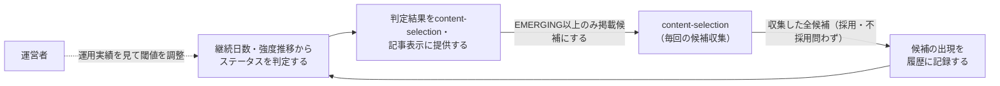

# 要件定義: トレンド継続履歴と中長期ステータス判定

> ステータス: 仕様確認中(未実装)

## サマリ
trend-digestの各回([content-selection](../content-selection/requirements.md))が収集した候補(採用・不採用を問わず全件)を、ジャンルをまたいで横断的に履歴として蓄積し、候補ごとの「初めて検知した日」「その後何回・どの程度の強さで言及され続けているか」を追跡する。この履歴から継続日数と強度の推移を機械的に計算し、NEW/SHORT_TERM/EMERGING/GROWING/ESTABLISHED/STABLE/DECLININGのステータスを判定する。目的は、1日〜1週間程度で消える一過性の話題(SHORT_TERM)を記事化対象から外し、半月〜1ヶ月以上にわたって伸び続けている・定着している中長期トレンドだけをcontent-selectionが選べるようにすること。詳細は「[ユースケース図](#ユースケース図)」参照。

## 概要
- 機能名: トレンド継続履歴と中長期ステータス判定
- 目的: 候補の出現履歴を横断的に記録し、継続日数・強度の推移から中長期トレンドかどうかを機械的に判定できるようにする
- 優先度: 高

## ユーザーストーリー
- 運営者として、その回だけ動きがあった一過性の話題ではなく、半月〜1ヶ月以上にわたって継続的に注目されている中長期トレンドだけを記事にしたい
- 運営者として、あるトピックが「出てきたばかり(NEW)」「伸びている最中(EMERGING/GROWING)」「定着した(ESTABLISHED/STABLE)」「勢いを落としている(DECLINING)」のどの段階にあるかを、記事を見る読者にも分かるようにしたい
- 運営者として、ステータスの判定は人間の主観やAIの雑感ではなく、実際の出現履歴の日数・強度という事実に基づいて機械的に行ってほしい

## ユースケース図

上記は俯瞰用の図。正となる文章は下記「機能要件」「ビジネスルール・制約」。

## 機能要件
- [1] content-selectionの各回の実行(edition×実行日)で収集された全候補(採用・不採用を問わず、ジャンル・正規化タイトル・強度)を、実行のたびに履歴として記録する(不採用だった候補も継続性判定に必要なため記録する)
- [2] 候補ごとに、正規化タイトル(既存の[掲載済み話題の再掲抑制](../content-selection/requirements.md#掲載済み話題の再掲抑制)と同じ正規化ルールで同一候補とみなす)をキーに、初回検知日・直近検知日・検知した実行回数・強度の推移(実行ごとの強度の時系列)を管理する
- [3] 直近の実行で候補として検出されなかった(言及が途絶えた)場合も、その旨を履歴に記録する(SHORT_TERM・DECLININGの判定に使う)
- [4] 履歴データから、下記「ステータス判定基準」に従って各候補のステータスを機械的に算出し、content-selectionが選定に使える形で提供する
- [5] 候補ごとに、可能な範囲で発祥地域・現在の主な流行地域・日本での強度・海外での強度を記録する(下記「地域情報」参照)
- [6] 候補ごとに、過去に記事へ掲載された回数と、直近で掲載されたときのステータスを履歴から算出し、content-selectionの再掲可否判定・記事表示の「何回目の報告か」に使える形で提供する(下記「掲載実績の追跡」参照)

## ビジネスルール・制約

### ステータス判定基準
継続日数は「初回検知日から直近検知日までの日数」とする(継続日数の起点・終点の定義)。強度は各実行時点でcontent-selectionが算出する`strength`(固定リストジャンル: 順位由来の値、WebSearchジャンル: 独立言及元数)をそのまま使う。

- [1] NEW: 継続日数が0(今回の実行で初めて検知された)
- [2] SHORT_TERM: 継続日数が1〜13日で、直近の実行で検知されなくなった(言及が途絶えた)。記事の掲載対象から除外する(参考データとして履歴には残すが、content-selectionの候補には含めない)
- [3] EMERGING: 継続日数が1〜29日で、直近の実行でも継続して検知されている(まだ途絶えていない)
- [4] GROWING: 継続日数が14〜29日で、かつ強度の推移が直近に向かって明確に増加傾向にある(EMERGINGとの違いは強度の増加傾向の有無)
- [5] ESTABLISHED: 継続日数が30日以上で、直近の実行でも検知されている
- [6] STABLE: 継続日数が90日以上で、強度の推移が大きく増減せず一定を保っている
- [7] DECLINING: 継続日数・他の判定条件に関わらず、直近の強度が過去のピーク強度から明確に減少している場合、他のステータスより優先してDECLININGと判定する
- [8] content-selectionが記事に掲載できるのは、EMERGING/GROWING/ESTABLISHED/STABLEのいずれかのステータスを持つ候補のみとする(NEW・SHORT_TERM・DECLININGは掲載しない。DECLININGは「以前は伸びていたが今は減少中」であり中長期トレンドの主目的にそぐわないため掲載対象から外す)

### 地域情報
- [9] 候補ごとに、発祥地域(最初に流行が確認された国・地域)・現在の主な流行地域・日本での強度・海外での強度を、情報源から判定できる範囲で記録する。判定できない場合は「不明」を許容し、無理に推測しない(架空の情報を作らないため)
- [10] 日本での強度・海外での強度は、該当する地域の情報源・言及元でその候補がどれだけ言及されているかの相対的な度合いとして記録する(具体的な尺度は設計で定める)
- [11] 日本80%・海外20%というおおよその配分は目安であり、比率を強制的に調整する仕組みは設けない(候補の実在する分布をそのまま使う)

### 掲載実績の追跡
- [12] 同一候補(正規化タイトルが一致するもの)が過去に記事へ掲載された回数を通算で数え、今回掲載する場合はその通算回数を「何回目の報告か」として記事に持たせる(読者が同じ話題の段階の進行を追えるようにするため)
- [13] 直近で掲載されたときのステータスを履歴から取得できるようにする(同じステータスのまま同じ話題を繰り返し掲載しないための判定に使う。判定そのものは[content-selection/requirements.md#掲載済み話題の再掲抑制](../content-selection/requirements.md#掲載済み話題の再掲抑制)で行う)

### 履歴データの保持期間
- [14] 履歴データは削除・自動アーカイブせず、蓄積し続ける(STABLE判定(90日以上)や将来的な傾向分析に過去データが必要なため)

## 依存関係
- 候補の収集元は[content-selection/requirements.md](../content-selection/requirements.md)の各回の実行結果
- 正規化タイトルの同一性判定は[content-selection/requirements.md#掲載済み話題の再掲抑制](../content-selection/requirements.md#掲載済み話題の再掲抑制)と同じルールを使う
- 判定したステータス・地域情報・掲載実績は、content-selectionの掲載可否判定・再掲可否判定と、[article-detail](../article-detail/requirements.md)でのステータスバッジ・継続期間・報告回数・地域表示に使われる

## スコープ外
- SNSの全投稿を取得して自前解析すること(既存content-selectionの方針を踏襲)
- 日本80%・海外20%比率の強制的な調整(目安として記録するのみ)
- ステータス閾値(14日・30日・90日)の動的な自動チューニング(運用実績を見て[source-review](../source-review/requirements.md)で人間が見直す)
- 過去のステータス変化の通知・アラート機能
