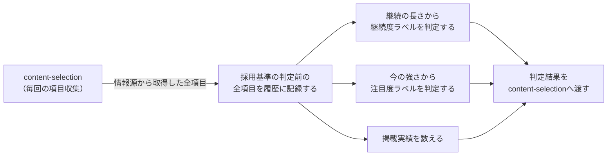

# 要件定義: トレンド継続履歴と継続度・注目度の判定

> ステータス: 仕様確認中(未実装)

## サマリ
trend-digestの各回([content-selection](../content-selection/requirements.md))が情報源から取得した項目を、採用基準を満たすかどうかを判定する前の全件、ジャンルをまたいで横断的に履歴として蓄積する。この履歴から、話題ごとに「どれだけ続いているか」を表す**継続度ラベル**と、「今どれくらい強いか」を表す**注目度ラベル**を機械的に判定し、記事に添える値としてcontent-selectionへ渡す。どちらも掲載するかどうかを決める条件には使わず、読者に段階を伝える表示と、同じジャンル内で複数候補があるときの並べ替えに使う。詳細は「[ユースケース図](#ユースケース図)」参照。

## 概要
- 機能名: トレンド継続履歴と継続度・注目度の判定
- 目的: 話題の出現履歴を横断的に記録し、継続の長さと今の強さを機械的に判定できるようにする
- 優先度: 高

## ユーザーストーリー
- 読者として、記事に載っている話題が「もう長く続いている流れ」なのか「出てきたばかり」なのかを知りたい
- 読者として、同じ「続いている話題」でも、今どれくらい盛り上がっているのかの違いを知りたい
- 運営者として、段階の判定は主観ではなく、実際の出現履歴という事実に基づいて機械的に行ってほしい
- 運営者として、一度紹介した話題ばかりが繰り返し載るのを避け、なるべく目新しい話題を紹介したい

## ユースケース図

上記は俯瞰用の図。正となる文章は下記「機能要件」「ビジネスルール・制約」。

## 機能要件
- [1] content-selectionの各回の実行(編×実行日)で情報源から取得した項目を、**採用基準を満たすかどうかを判定する前の全件**、実行のたびに履歴として記録する(ジャンル・話題の名前・その回の強さ・情報源での順位・採用基準を満たしたかどうか)
- [2] 採用基準は記事に載せる話題を選ぶためにのみ使い、履歴に記録するかどうかには使わない。「新規ランクイン・順位上昇したときだけ候補にする」ジャンル(音楽・海外ドラマ・アニメ・サブスク動画・書籍/漫画)では、上位に居続けている作品は動きがあった回しか採用基準を満たさない。これを記録の条件にすると、**人気が定着している作品ほど履歴から消えてしまう**ため
- [3] 1つの情報源から記録する項目数には上限を設ける(初期値30件)。継続を追うのに必要なのは上位帯であり、ランキングの下位まで際限なく記録しても判断の役に立たないため。上限は掲載候補の条件(上位5位・10位以内)より十分広く取る
- [4] 話題の同一性は、名前を正規化したもの(前後の空白除去・全角/半角の統一・英字の大文字小文字統一)で判定し、ジャンルをまたいで1つの話題として扱う
- [5] 話題ごとに、下記「継続度ラベル」に従って継続の長さを判定する
- [6] 話題ごとに、下記「注目度ラベル」に従って今の強さを判定する
- [7] 話題ごとに、過去に記事へ掲載された回数と、直近で掲載されたときの継続度ラベルを履歴から数える(下記「掲載実績の追跡」参照)
- [8] 話題ごとに、可能な範囲で発祥地域・現在の主な流行地域を記録する(下記「地域情報」参照)

## ビジネスルール・制約

### 継続度ラベル
継続の長さは「**途切れずに検知され続けている期間**」で測る。具体的には、直近の検知日から数えて、同じ編の実行で検知されなかった回が現れる直前までさかのぼった日から、直近の検知日までの日数とする。一度途切れたらそこで区切り、再び検知されたらその時点から数え直す。

初回検知日から直近検知日までの通算日数で測らないのは、3ヶ月前に1回だけ検知された話題が今週また1回検知されただけで「3ヶ月続いている」と判定されてしまい、「継続的に注目されている話題」という言葉の意味と正反対になるため。

- [1] 流行前: 継続が14日未満(その回に初めて検知された話題もここに入る)
- [2] 注目され始め: 継続が14日以上30日未満
- [3] 話題: 継続が30日以上90日未満
- [4] 非常に話題: 継続が90日以上
- [5] 日数の区切りに14日・30日・90日を使うのは、それぞれ半月・1ヶ月・3ヶ月という暦の区切りにあたるため。「半月〜1ヶ月以上にわたって続いている話題」を中長期トレンドとみなす、という運営方針をそのまま日数にしたもの
- [6] 継続度ラベルは記事に表示する。特に「流行前」は「半月以上続いている話題」という目安にまだ達していないことを表し、読者にも一目で分かるようにする([article-detail/requirements.md](../article-detail/requirements.md))。継続度ラベルは継続日数のみから決まり、採用基準を満たしたかどうかとは独立の値のため、「流行前」であることと採用基準を満たしていないことは同じ意味ではない(採用基準に届かなかった話題が必ず「流行前」になるわけではない。下記[7]参照)
- [7] 継続度ラベルは掲載するかどうかを決める条件には使わない。各ジャンル必ず1件を掲載するため([content-selection/requirements.md#掲載件数](../content-selection/requirements.md))、「流行前」の話題も掲載されうる

### 注目度ラベル
その回どれくらい強かったかを「高い・普通・低い」の3段階で表す。継続度ラベルが時間軸を担うのに対し、注目度ラベルは今の高さを担う。

- [8] そのジャンルで過去に十分な観測が貯まっている場合(そのジャンルの実行が12回以上記録されている場合)は、**そのジャンルの過去の観測に現れた強さの分布**と今回の強さを比べて段階を決める。上位3分の1なら「高い」、真ん中3分の1なら「普通」、下3分の1なら「低い」とする
- [9] 観測がまだ貯まっていない場合は、情報源での位置から決める。固定リストのジャンルはランキング順位(1〜3位なら「高い」、4〜10位なら「普通」、11位以下なら「低い」)、WebSearchのジャンルは独立した言及元の数(5件以上なら「高い」、3〜4件なら「普通」、2件以下なら「低い」)とする
- [10] 十分な観測を12回以上とするのは、3段階に分けるのに各段階へ複数の観測が要ることと、継続度ラベルの最長の区切り(3ヶ月=週1回の観測で約12回)に揃えるため
- [11] 分布との比較は同じジャンルの中だけで行う。ジャンルが違えば強さの測り方(順位か言及元数か)も情報源も違い、そのまま比べても意味を持たないため
- [12] 注目度ラベルは記事に表示する。掲載するかどうかを決める条件には使わない

### 掲載実績の追跡
- [13] 同じ話題が過去に記事へ掲載された回数を通算で数え、今回掲載する場合はその通算回数を「何回目の報告か」として記事に持たせる(読者が同じ話題の段階の進行を追えるようにするため)
- [14] 直近で掲載されたときの継続度ラベルを履歴から取得できるようにする(続報の本文を「前回から何が変わったか」を軸に書くために使う。本文の書き方は[content-generation/requirements.md#続報の執筆](../content-generation/requirements.md)が定める)

### 地域情報
- [15] 話題ごとに、発祥地域(最初に流行が確認された国・地域)と現在の主な流行地域を、情報源から判定できる範囲で記録する。判定できない場合は「不明」を許容し、無理に推測しない(架空の情報を作らないため)
- [16] 地域情報は情報源やエージェントの出力に由来する外部からの入力として扱い、想定外に長い文字列や制御文字を含むものは受け付けない(記事データに転記され画面に表示されるため)

### 履歴データの保持期間
- [17] 履歴データは削除・自動アーカイブせず、蓄積し続ける(継続度ラベルの最長区切り(3ヶ月)の判定や、注目度ラベルの分布の作成に過去データが必要なため)

## 依存関係
- 記録する項目の収集元は[content-selection/requirements.md](../content-selection/requirements.md)の各回の実行結果
- 判定した継続度ラベル・注目度ラベル・掲載実績・地域情報は、content-selectionの並べ替えと、[article-detail](../article-detail/requirements.md)での表示に使われる
- 判定に使う日数の区切り・観測の上限は[source-review](../source-review/requirements.md)の月次見直しで調整する

## スコープ外
- 強度が増えているか減っているかの傾向判定(今回は行わない。記録は続けるため、運用実績が貯まってから改めて検討する)
- 掲載するかどうかを継続度・注目度で決めること(各ジャンル必ず1件を掲載する方針のため)
- SNSの全投稿を取得して自前解析すること(既存content-selectionの方針を踏襲)
- 日数の区切り・観測の上限の動的な自動チューニング(運用実績を見て[source-review](../source-review/requirements.md)で人間が見直す)
- 過去の段階変化の通知・アラート機能
